> 链接：https://pan.baidu.com/s/1I2zEwWggIs2k116AB-eZrg 
> 提取码：v4ev 

### 前景需要

小王急匆匆地找到小张，小王说"李哥，我dev服务器被黑了",快救救我！！


### 挑战内容

黑客的IP地址

遗留下的三个flag


注意：

该靶机有很多非预期解，做靶机是给自己做，请大家合理按照预期解进行探索。

相关账户密码：

defend/defend

root/defend


### 开始挑战

登录进去后，发现可以直接提权

提权命令：`sudo /bin/bash`


#### 查看登录成功日志

首先查看当前主机最近的用户登录情况，如何黑客成功登录，那么可以查到成功登录的记录

```bash
登录成功的IP有哪些： 	
grep "Accepted " /var/log/secure | awk '{print $11}' | sort | uniq -c | sort -nr | more

登录成功的日期、用户名、IP：
grep "Accepted " /var/log/secure | awk '{print $1,$2,$3,$9,$11}' 
```

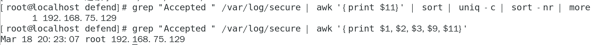

发现IP：`192.168.75.129`

#### 查看有无增加特殊用户

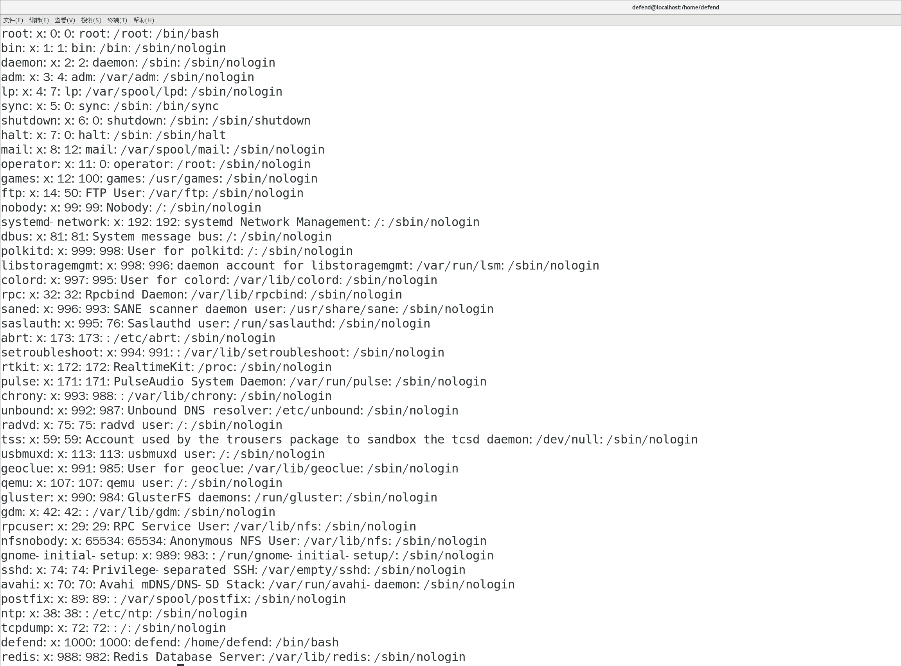

没发现可疑用户

#### 查看历史命令字

看看登录成功之后都执行过什么命令

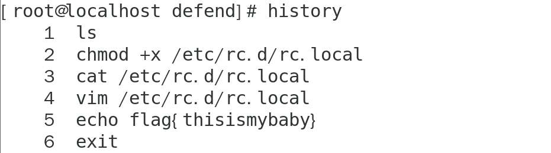

发现一个flag：`flag{thisismybaby}`

根据历史命令查看`cat /etc/rc.d/rc.local`

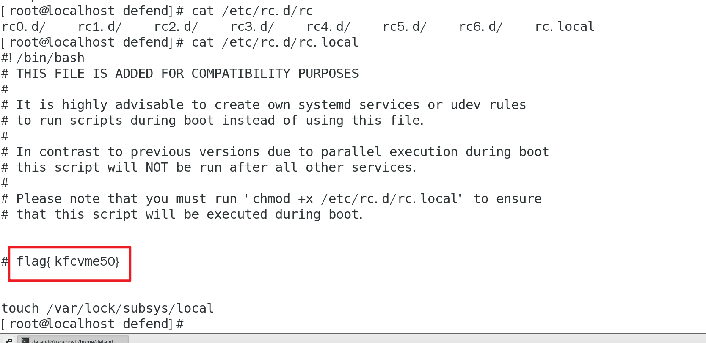

找到第二个flag：`flag{kfcvme50}`

#### redis服务排查

查看`passwd`文件时，最后一个用户是`redis`用户，说明该机器上存在`redis`服务，于是查看网络连接，看看`6379`端口是否开放。

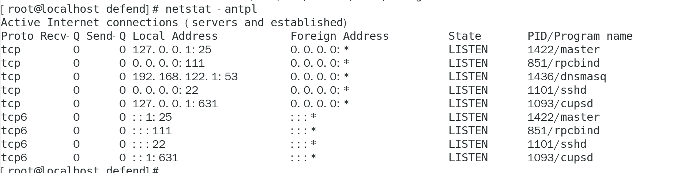

没有发现`6379`端口，那么先运行该服务。

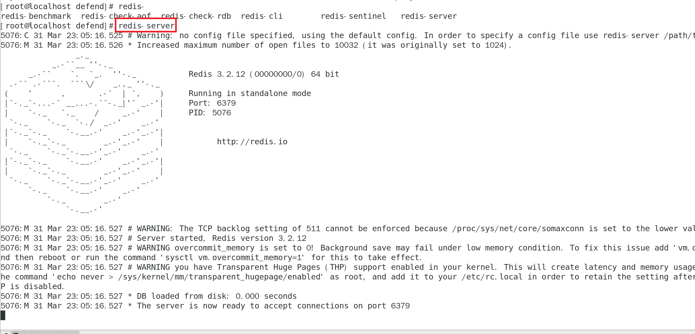

尝试连接，发现未授权无认证

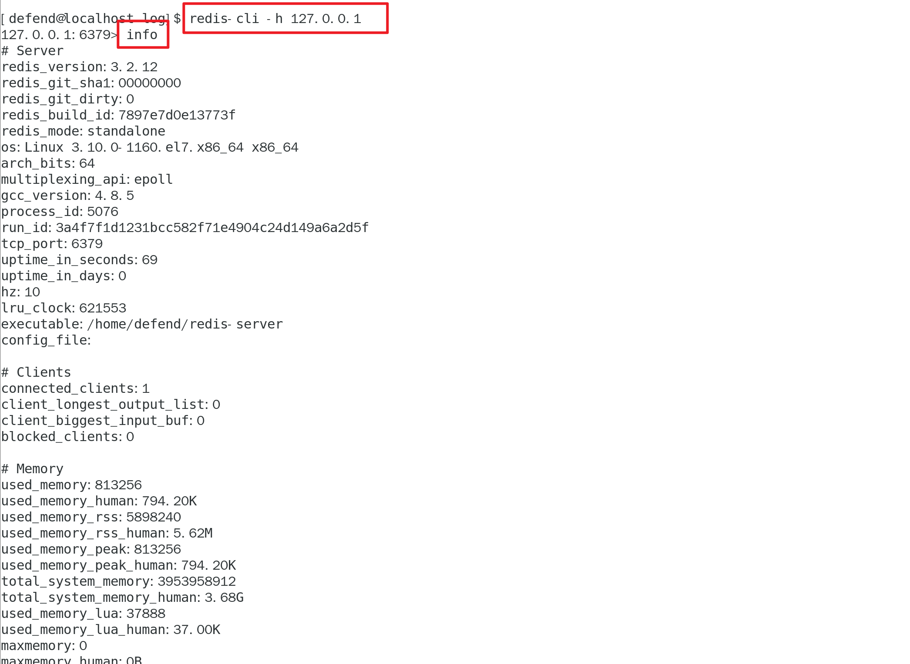

到此可以判断黑客是通过`Redis未授权`打进来的，那么可以看看是不是通过写ＳＳＨ公钥免密登录进来的

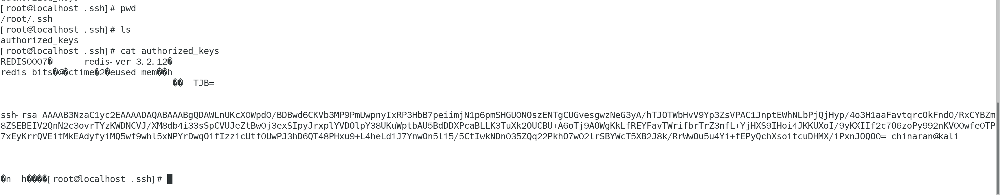


#### 检查命令文件是否被替换

> rpm -Vf /usr/bin/*
> rpm -Vf /usr/sbin/*
> \#rpm -Vf /usr/bin/xxx
> \#S 关键字代表文件大小发生了变化
> \#5 关键字代表文件的 md5 值发生了变化
> \#T 代表文件时间发生了变化

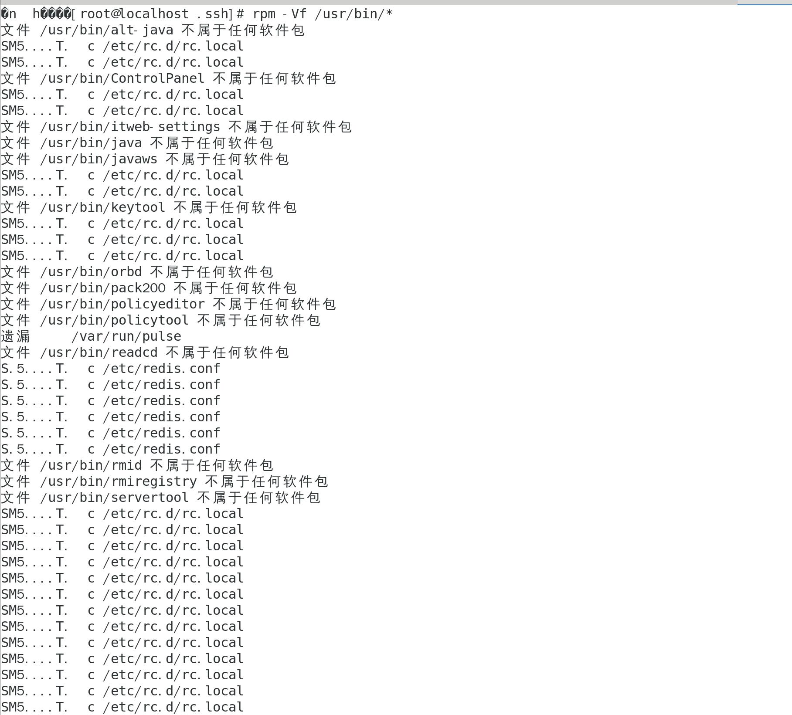

看到除了`rc.local`文件被动过，而且`redis`的配置文件`/etc/redis.conf`被修改过，打开看看


#### redis配置文件

在配置文件中发现`flag{P@ssW0rd_redis}`

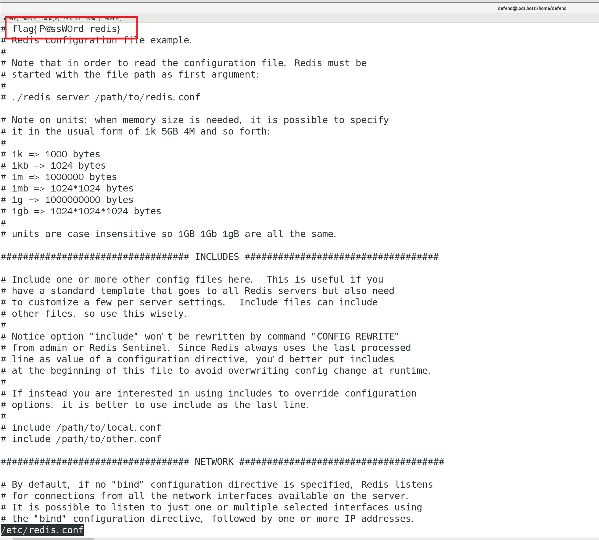


查看redis日志等级

```bash
cat  /etc/redis.conf | grep loglevel
```


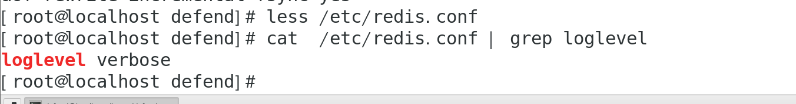

指定日志记录级别，Redis总共支持四个级别：debug、verbose、notice、warning，默认为verbose

> \# debug  记录很多信息，用于开发和测试
>
> \# varbose 有用的信息，不像 debug会记录那么多
>
> \# notice  普通的 verbose，常用于生产环境
>
> \# warning 只有非常重要或者严重的信息会记录到日志

直接去找redis日志文件

```bash
cat /var/log/redis/redis.log | grep Accept
```

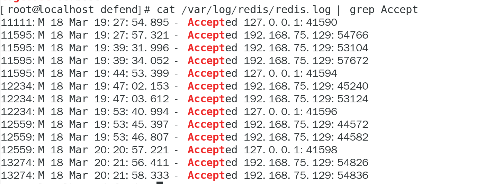

发现IP地址192.168.75.129

### 提交

提交题解系统

```bash
cd /home/defend/桌面/题解 && ./题解Script.sh
```

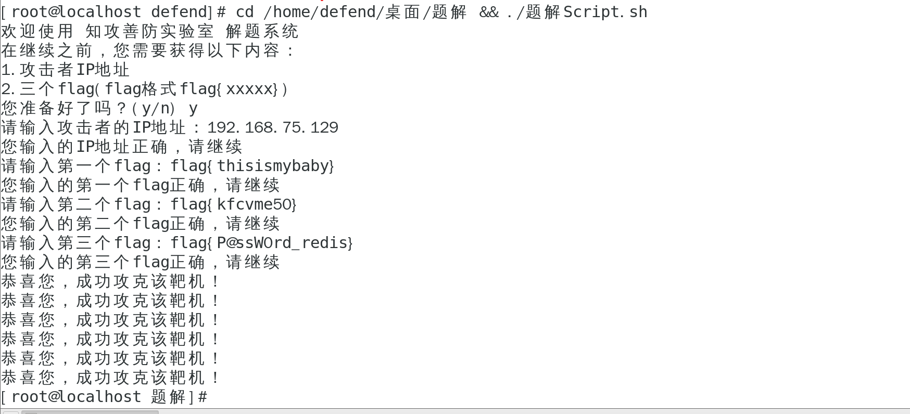