> 关注公众号“知攻善防实验室”，后台回复“靶机web2”
>
> ---
>
> 或者通过以下链接下载
>
> 链接：https://pan.baidu.com/s/1HmDWZkPhq4-M5ZgEqpnIFQ 
> 提取码：quvm 

## 挑战内容

前景需要：

小李在某单位驻场值守，深夜12点，甲方已经回家了，小李刚偷偷摸鱼后，发现安全设备有告警，于是立刻停掉了机器开始排查。

这是他的服务器系统，请你找出以下内容，并作为通关条件：

1.攻击者的IP地址（两个）？

2.攻击者的webshell文件名？

3.攻击者的webshell密码？

4.攻击者的伪QQ号？

5.攻击者的伪服务器IP地址？

6.攻击者的服务器端口？

7.攻击者是如何入侵的（选择题）？

8.攻击者的隐藏用户名？

相关账户密码

用户:administrator

密码:Zgsf@qq.com

## 开始挑战

启动phpstudy，打开所有服务

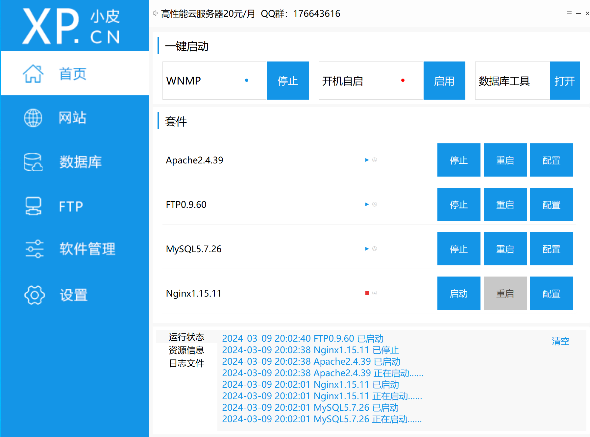

分析apache日志，发现被目录爆破的痕迹，IP为`192.168.126.135`

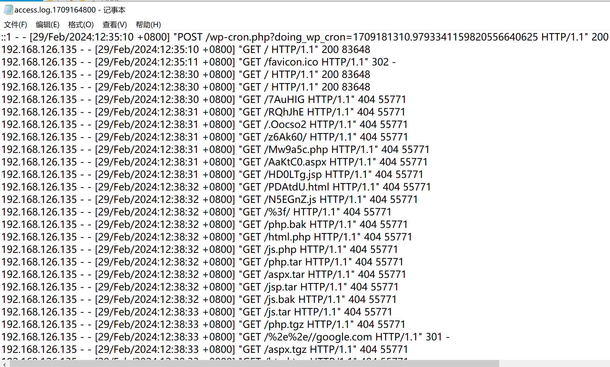

在FTP日志中，发现webshell痕迹

`C:\phpstudy_pro\Extensions\FTP0.9.60\Logs`

下载了`readme.html`

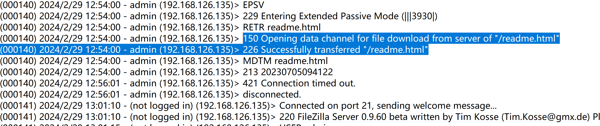

上传了`system.php`

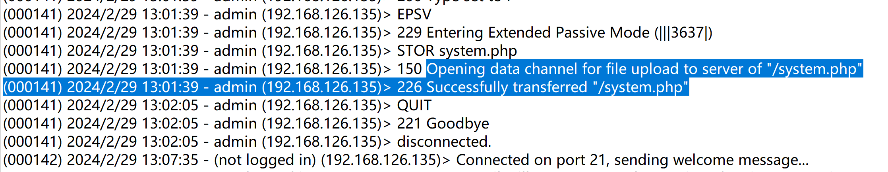

IP地址还是`192.168.126.135`

接下来就去找上传的文件

在网站根目录下发现了`system.php`

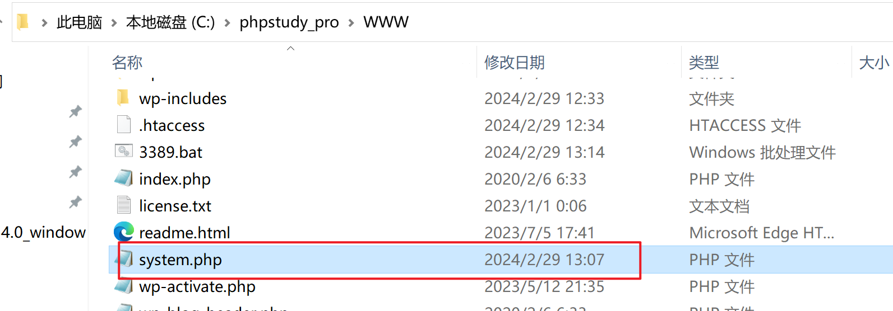

查看代码，发现了webshell的连接密码：`hack6618`

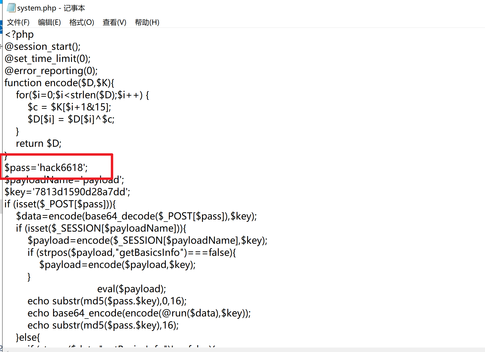

通过日志快速分析工具，查看是否增加隐藏用户

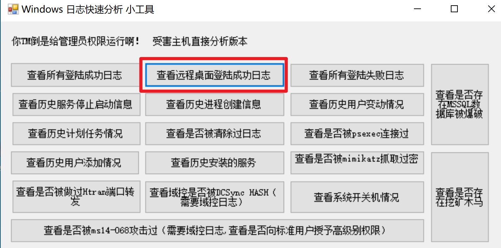

发现隐藏用户`hack887$`，还有另外一个IP：`192.168.126.129`

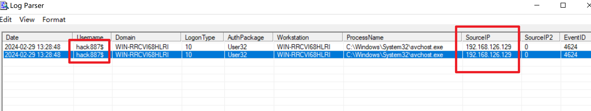

在`C:\Users\Administrator\Documents\Tencent Files` 中发现登录过的QQ

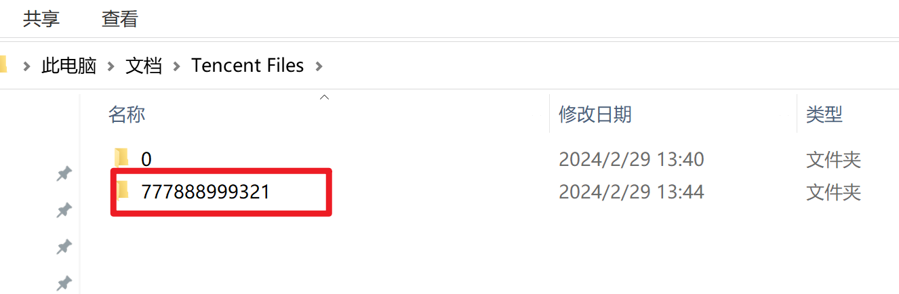

再看看这个QQ都接受过哪些数据  `FileRecv`，看到有内网穿透工具`frp`

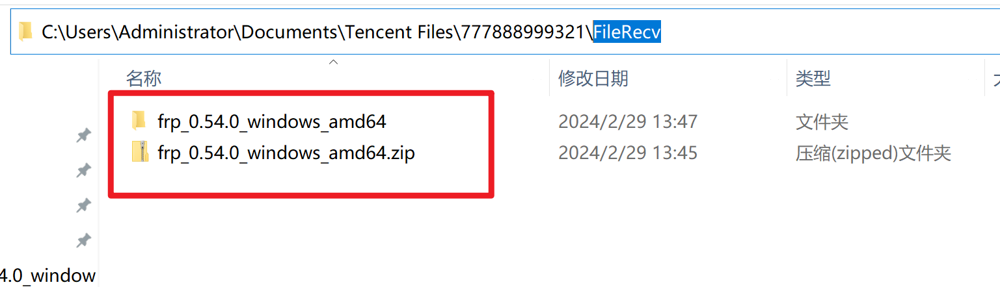

查看frpc的配置文件

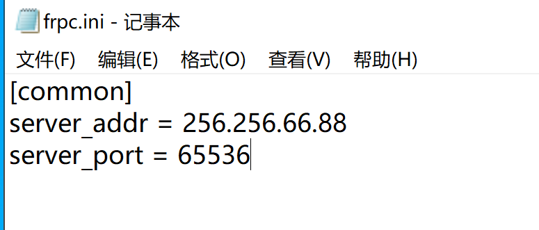

服务器地址：server_addr = 256.256.66.88
服务器端口：server_port = 65536

## 答题

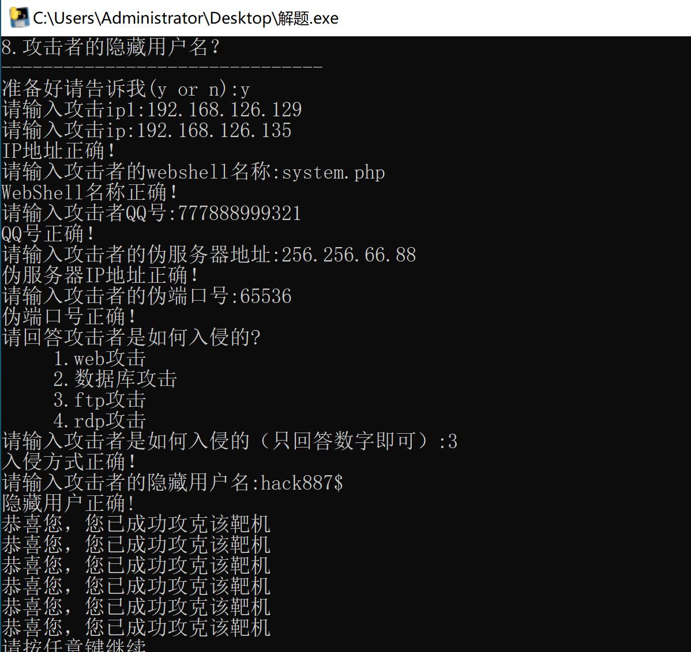

攻击者是通过ftp入侵，上传webshell，进行后面的一系列操作。

