> 关注公众号“知攻善防实验室”，后台回复“靶机”
>
> 或者通过以下链接下载
>
> 链接：https://pan.baidu.com/s/1qzAdcNyKqDx1ufaWfc04YQ 
>提取码：3td0 

## 挑战内容

前景需要：小苕在省护值守中，在灵机一动情况下把设备停掉了，甲方问：为什么要停设备？小苕说：我第六感告诉我，这机器可能被黑了。

这是他的服务器，请你找出以下内容作为通关条件：

1. 攻击者的两个IP地址
2. 隐藏用户名称
3. 黑客遗留下的flag【3个】

本虚拟机的考点不在隐藏用户以及ip地址，仔细找找把。

相关账户密码：administrator/xj@123456

直接启动即可。

## 开始挑战

分析apache日志，发现了`192.168.75.129`这个IP地址

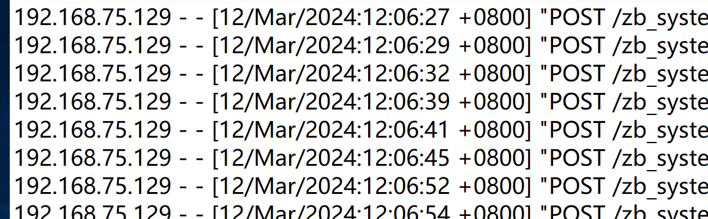

通过日志快速分析工具发现另一个IP：`192.168.75.130`

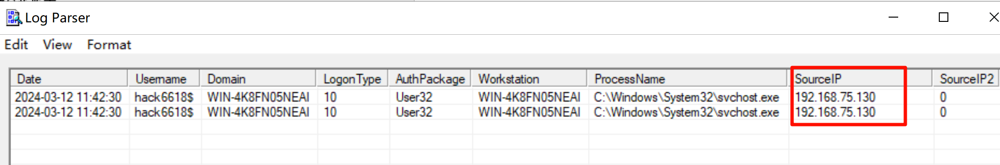

运行`eventvwr.msc`，通过事件查看器，分析安全登录问题，过滤登录失败的事件ID：`4625`

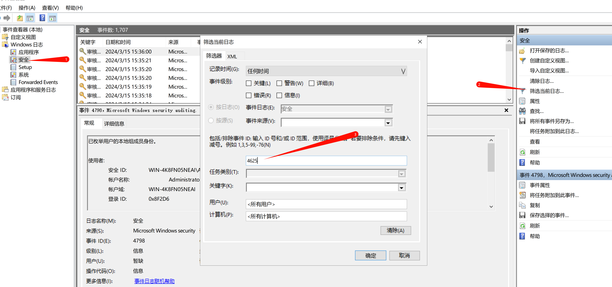

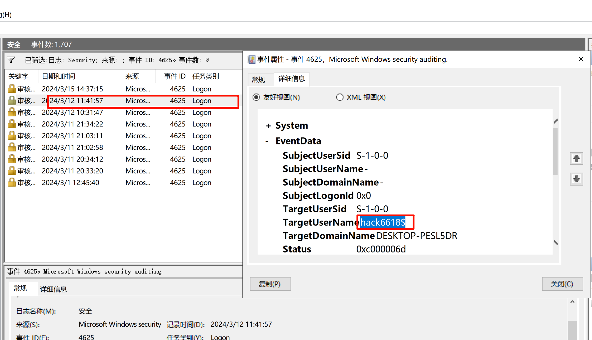

在家目录下也发现隐藏用户`hack6618$`

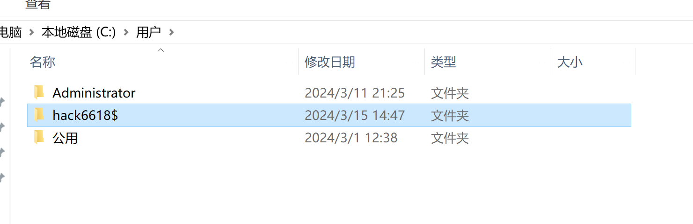

`C:\Users\hack6618$\Downloads`发现一个批处理文件

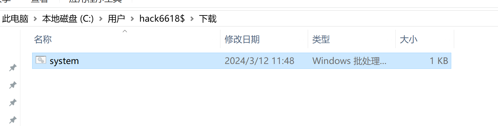

发现一句话木马，以及找到第一个flag：` flag{888666abc}`

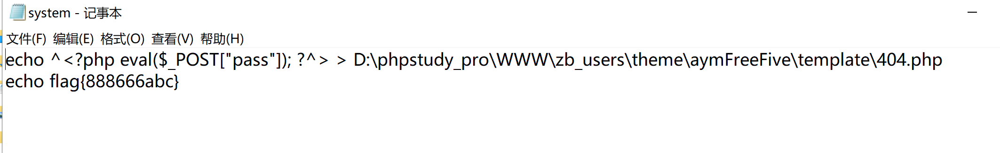

再次对比apache日志

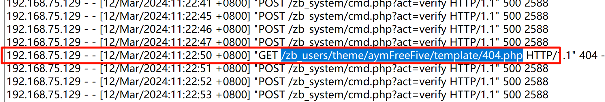

这里其实一直看就可以用D盾查看web目录

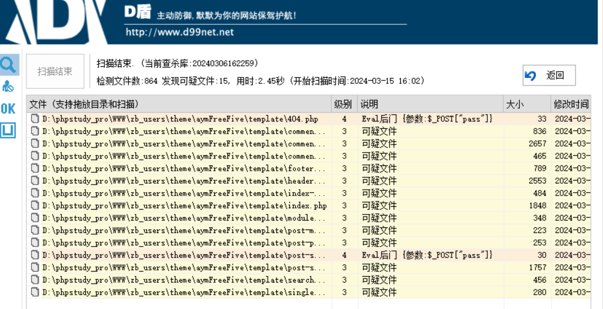

查看系统计划任务，发现第二个flag{zgsfsys@sec}

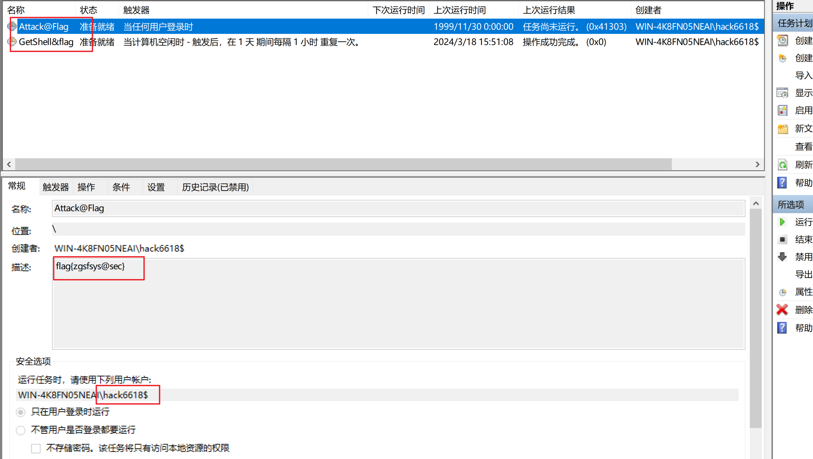

看看这个计划任务干了什么，就是前面发现的那个一句话木马的批处理

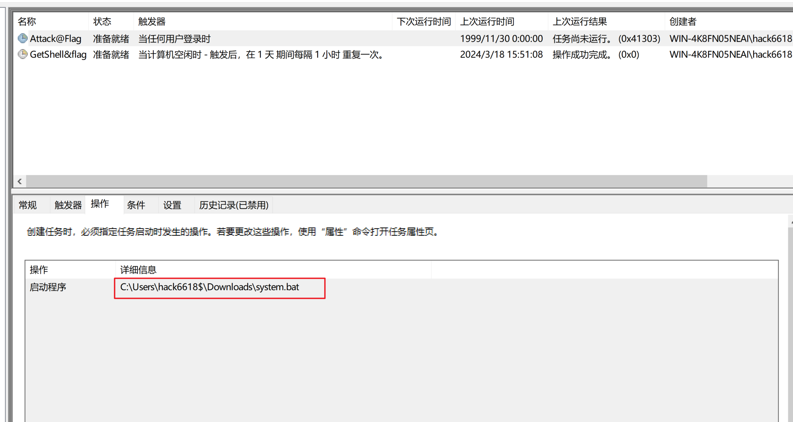

通过搜索引擎找到后台地址`/zb_system/login.php`Web页面现在是没有登录密码的，

意外发现了可以重置密码：`https://www.boke8.net/z-blog-php-nologin-tool.html`

下载官方提供的Z-Blog密码重置工具：https://update.zblogcn.com/tools/nologin.zip

上传到Z-Blog网站的根目录

发现有个`Hacker`用户

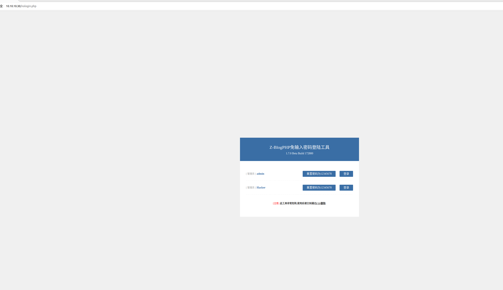

重置`admin`用户的密码，来到后台，用户管理

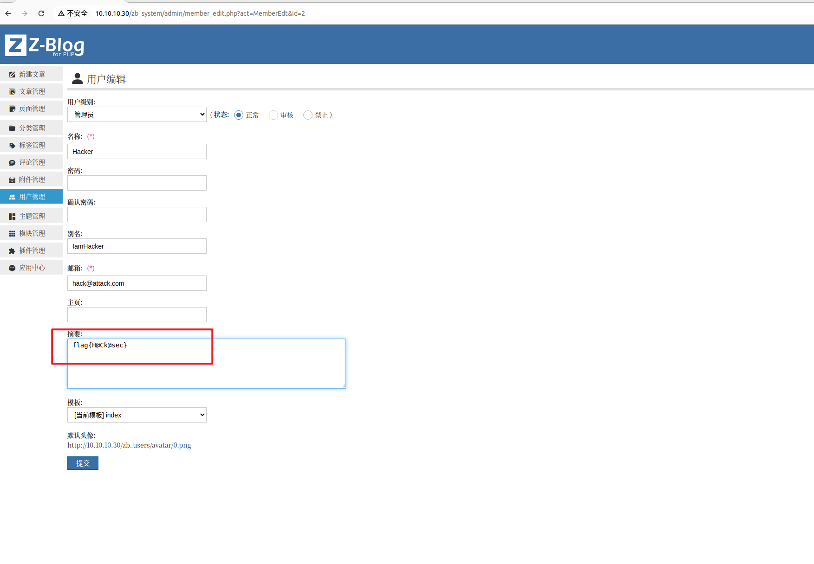

在生产环境中，如果忘记密码使用了nologin.php，再修改完密码后要记得删除`nologin.php`

