## 挑战内容

前景需要：机房运维小陈，下班后发现还有工作没完成，然后上机器越用越卡，请你帮他看看原因。

## 挑战题解：

攻击者的IP地址

攻击者开始攻击的时间

攻击者攻击的端口

挖矿程序的md5

后门脚本的md5

矿池地址

钱包地址

攻击者是如何攻击进入的

解题：运行桌面上的解题工具即可

## 相关账户密码：

Administrator/zgsf@123

## 环境下载

通过网盘分享的文件：Windows挖矿事件
链接: https://pan.baidu.com/s/1ZZ8eD4ISJHxmsBhb3ee5RQ 提取码: igbq 

## 开始挑战

查看任务管理器，发现cpu占用率100%

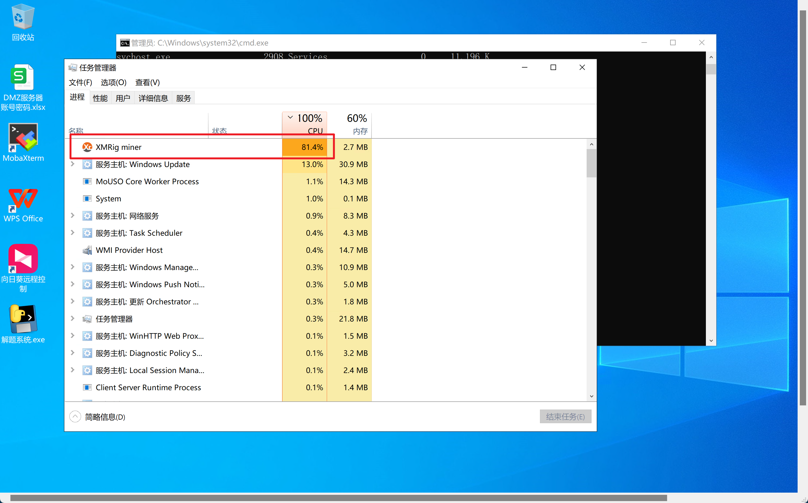

右键打开文件位置，计算挖矿程序的hash值

MD5: E44F1F797DECE766D8670657905EF68B
SHA1: 65C28EB87175B074B2C1A70CBE1659318AB8BD07
CRC32: 4B87F302

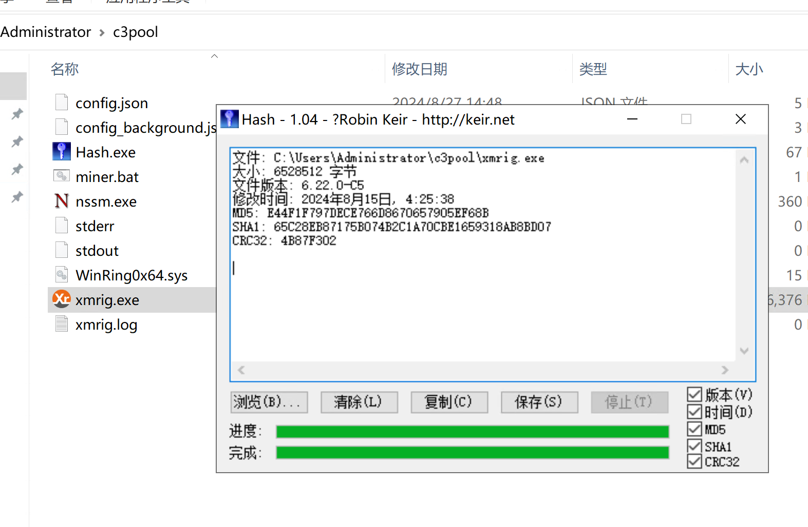

紧接着上传火绒剑，上传火绒剑后，找相关异常

异常脚本：

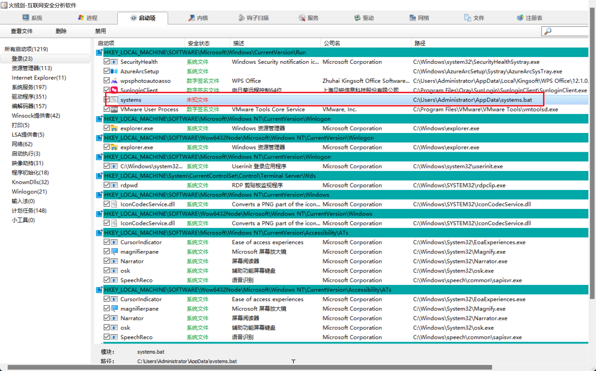

打开文件位置，进行查看，发现是挖矿脚本

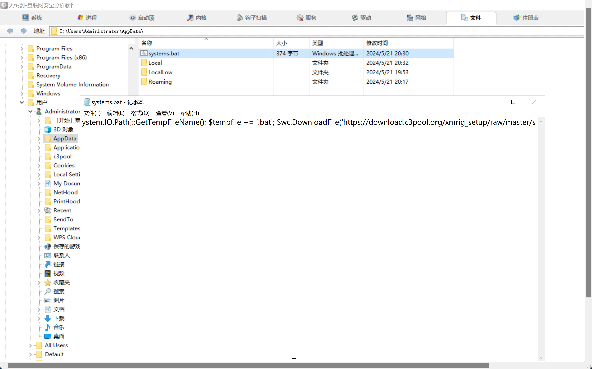

查看器hash

MD5: 8414900F4C896964497C2CF6552EC4B9
SHA1: 9079597BBD3E7E95F488B127169D977848A1753A
CRC32: 54E727DB

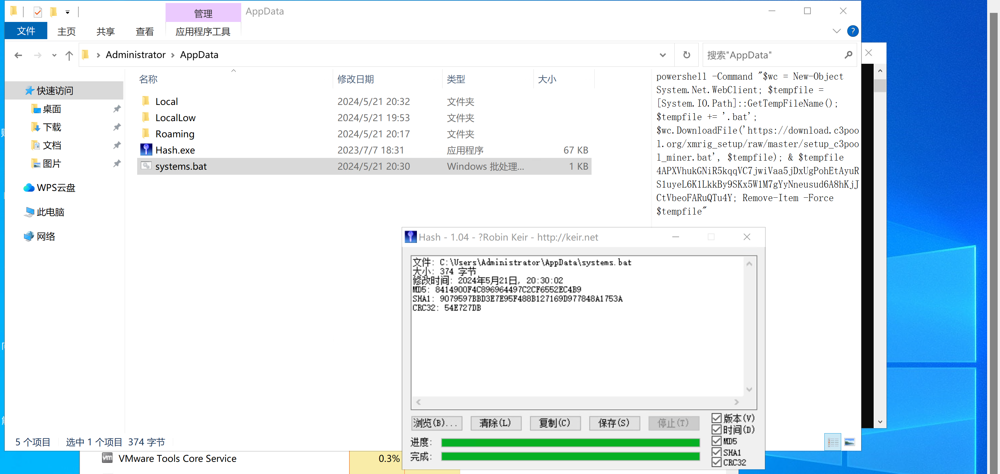

矿池地址c3pool.org

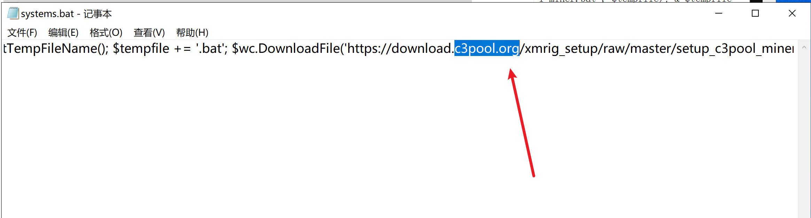

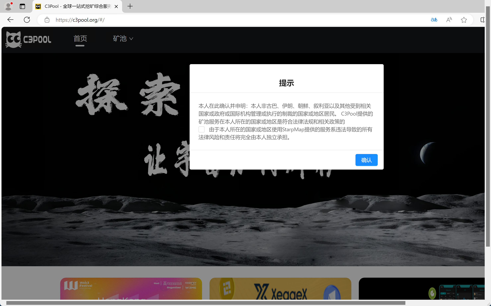

确定是挖矿矿池，记录域名

钱包地址： 4APXVhukGNiR5kqqVC7jwiVaa5jDxUgPohEtAyuRS1uyeL6K1LkkBy9SKx5W1M7gYyNneusud6A8hKjJCtVbeoFARuQTu4Y

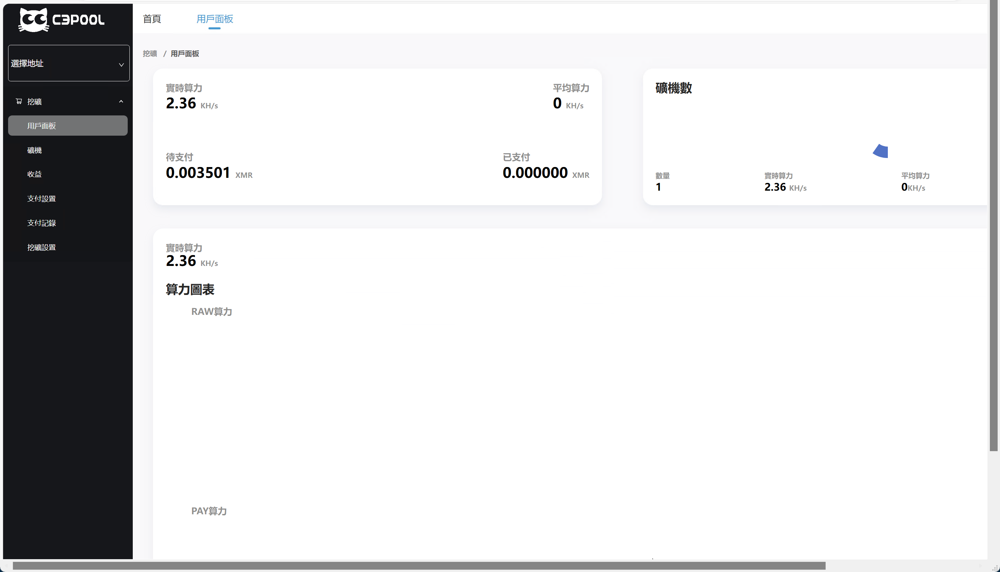

火绒剑找到挖矿进程，kill掉

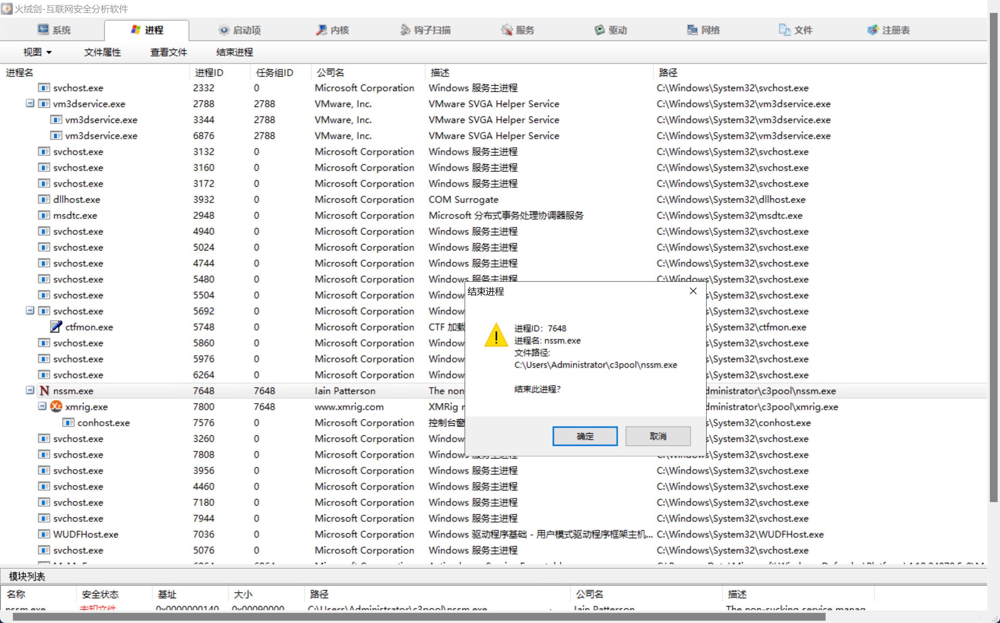

已知条件，是一台运维的电脑，那么说明，不可能去跑任何业务，打开桌面上的表格看看

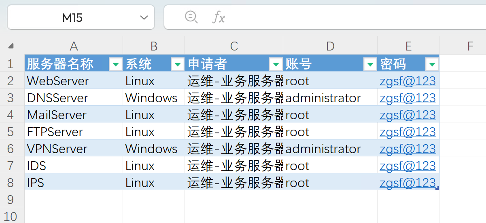

密码都是统一的，说明可能是攻击者在拿到一台的密码后进行的**密码喷洒**

右键双击Windows日志一键分析，上传至服务器

发现确实存在暴力破解痕迹，并记录时间2024-05-21 20:25:22，攻击者IP地址192.168.115.131

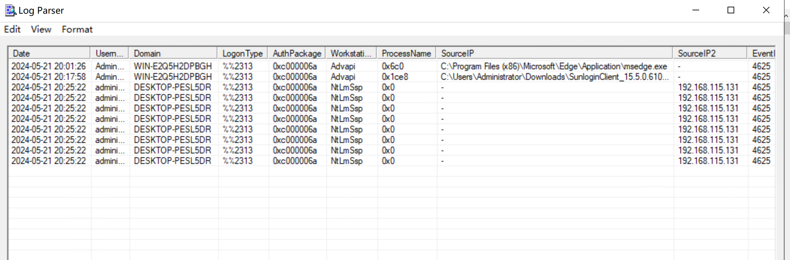
