## 前言

>  环境来源：[州弟学安全|学习干货|实战学习应急响应之Windows日志分析(附镜像)](https://mp.weixin.qq.com/s/eJpsOeaEczcPE-uipP7vCQ)

  本次环境将从大赛内与实战环境相结合去了解在应急响应中Windows日志分析的几个关键点，符合大赛及真实环境案例，本次环境将从WEB层面的日志分析到主机内的几种关键日志分析和重点功能进行排查

**题目描述：某台Windows服务器遭到攻击者入侵，管理员查看发现存在大量rdp爆破的请求，攻击者使用了不同位置的IP(此处模拟)，进行爆破并成功，并成功进入了系统，进入系统后又做了其它危害性操作，请根据各题目完成填写**

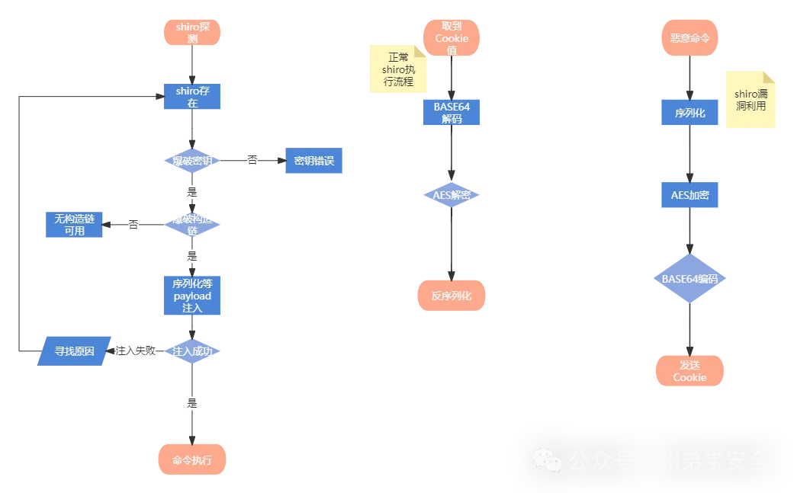

## 环境下载

通过网盘分享的文件：Windows日志分析
链接: https://pan.baidu.com/s/1_WB7gKwF5ZjIsXbpSAZrZA 提取码: 8aha 

```
系统: Windows 7
CPU: 2颗
内存: 2G
空间: 保证不低于5G
其它傀儡机: 段内
账号/密码: winlog/winlog123
```

```
注意: 
	远控软件内IP为虚拟IP，如在进行进程中没有找到相关外连，应该是由于连接超时造成的断开了，重启环境服务器或软件即可继续对外发起请求，请见谅

注意: 
	按照题目提示可以根据系统功能分析，或桌面工具进行辅助分析注意: winlog用户在操作关于系统权限功能时，一定要使用管理员权限打开工具再去执行
	如: cmd直接打开则可能无法进行操作系统权限性操作，需右击cmd-使用管理员权限打开，才可以，其它工具也如此

注意: 
	题目中shell如需在本地分析，提前关闭杀毒软件，会被杀掉，非免杀
```

## 题目

1. 审计桌面的logs日志，定位所有扫描IP，并提交扫描次数  
2.  审计相关日志，提交rdp被爆破失败次数  
3.  审计相关日志，提交成功登录rdp的远程IP地址，多个以&连接,以从小到大顺序排序提交  
4.  提交黑客创建的隐藏账号  
5.  提交黑客创建的影子账号  
6.  黑客植入了一个远程shell，审计相关进程和自启动项提交该程序名字  
7.  提交远程shell程序的连接IP+端口，以IP:port方式提交  
8.  黑客使用了计划任务来定时执行某shell程序，提交此程序名字

## 开始挑战

#### 1 审计桌面的logs日志，定位所有扫描IP，并提交扫描次数  

  在桌面下有logs目录，目录中有access.log和error.log文件，这是nginx的日志，我们注意分析access.log，error是在服务出问题，比如出现500/502/504之类的故障才写入。


对access.log进行分析观察，192.168.150.33这个IP，通过url看到不正常的编码和后面的user-agent为nmap，判断这是傀儡机对web端口进行的web探测

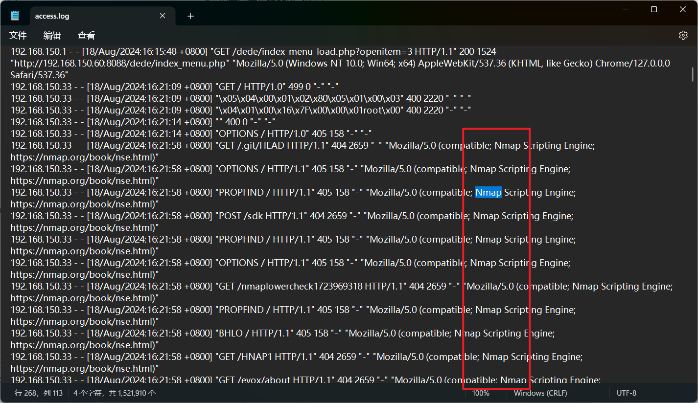

将access.log拖出来使用cmder进行查看，当然各位师傅也可以使用其它工具，比如脚本或者Linux命令进行排查，这里使用命令

```bash
 awk '{print $1}'  access.log |sort|uniq -c|sort
```

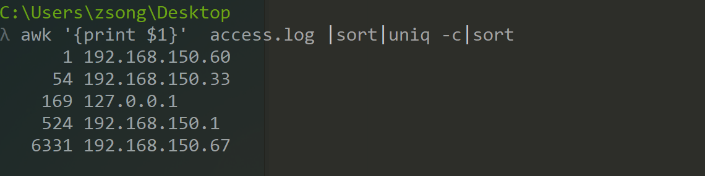

以IP的为基准进行排序，看到192.168.150.67扫描最多，我们将它和192.168.150.33进行相加得出共扫描次数为**6385**次

#### 2 审计相关日志，提交rdp被爆破失败次数

 通过事件日志进行查看，快捷键WIN+R输入 '**eventvwr.msc**' 进入事件查看，点击安全，可以看到账户类操作日志

 然后根据要求进行筛选，事件ID为4625，可以看到登录失败次数为2594次

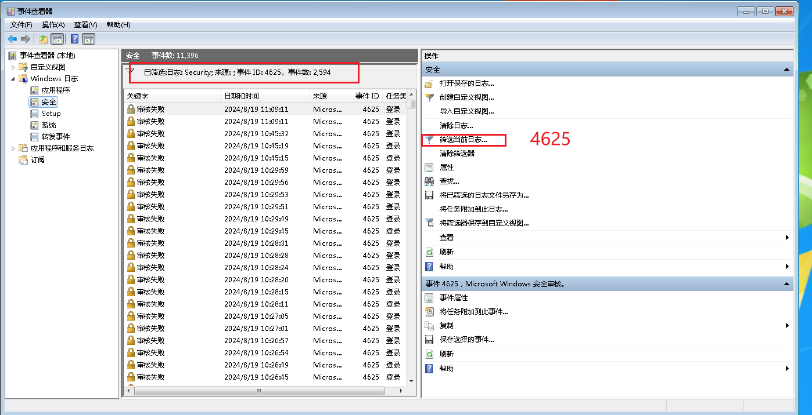

通过日志分析工具来查看，将当前筛选日志进行导出

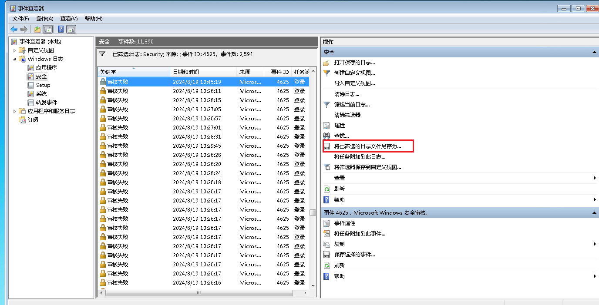

根据桌面准备的辅助工具 **FullEventLogView** 导入分析，导入后可以快速分析到对方爆破的IP地址

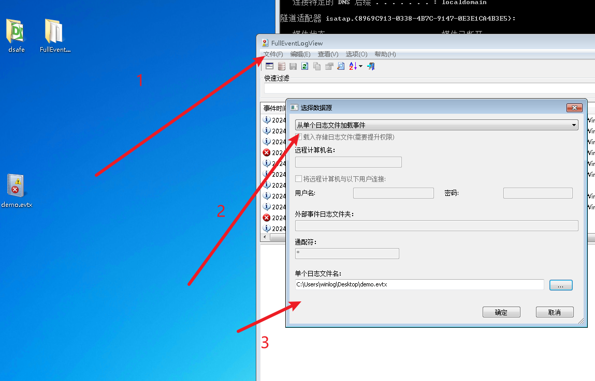

#### 3 审计相关日志，提交成功登录rdp的远程IP地址，多个以&连接,以从小到大顺序排序提交  

继续审核日志，登录失败日志ID为4625，而成功日志ID为4624，我们继续筛选，这里建议使用刚刚工具分析

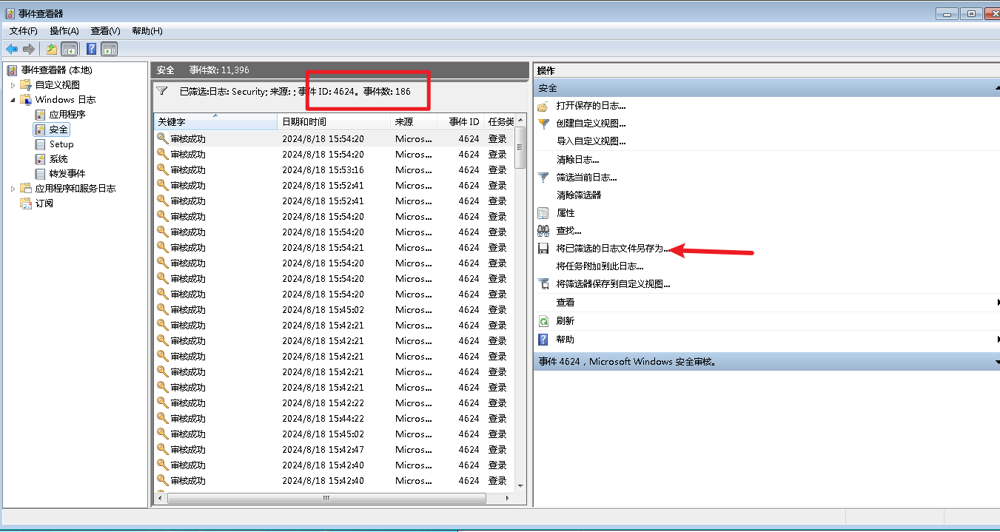

已知为186个事件，使用工具导入此日志文件，根据爆破时间，这里进行降序查看

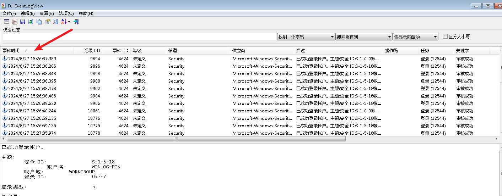

然后根据分析，查看网络IP地址，排除本机IP，已知登录成功IP地址为

192.168.150.1&192.168.150.128&192.168.150.178

#### 4 提交黑客创建的隐藏账号 

黑客攻击者在登录winlog用户成功后，创建了隐藏账号，该账号在命令行是查询不到的

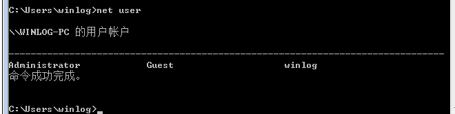

快捷键WIN+R输入 '**lusrmgr.msc**'，看到用户中hacker$以及属性及所属的组

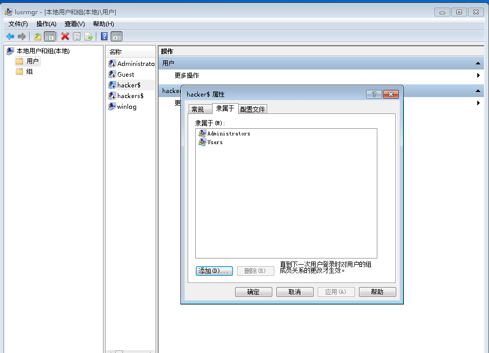


#### 5 提交黑客创建的影子账号  

  影子账号真实环境中是无法在用户组/netuser/用户面板中看到，但是可以在注册表中看到并删除，快捷键WIN+R '**regedit**'

注册表地址：HKEY_LOCAL_MACHINE\SAM\SAM\Domains\Account\Users\Names

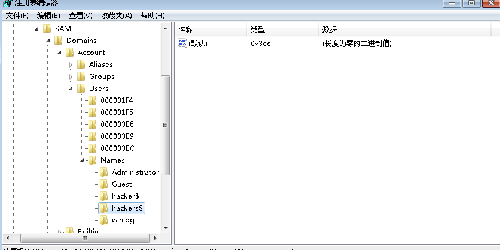

下图为hackers$对应的权限值/组信息/映射关系及用户相关目录，操作删除后将不存在此用户信息

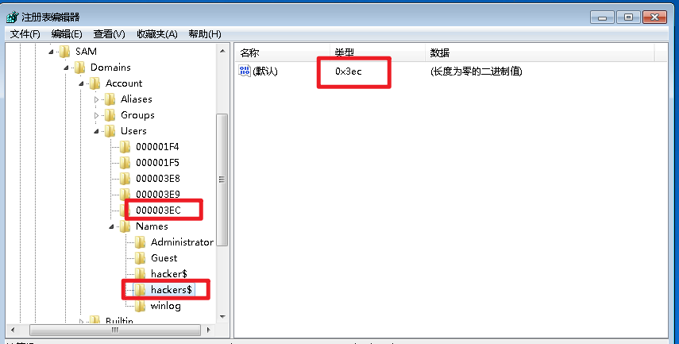

 对这两个目录进行删除，再去刚刚的用户/组 查看将没有了

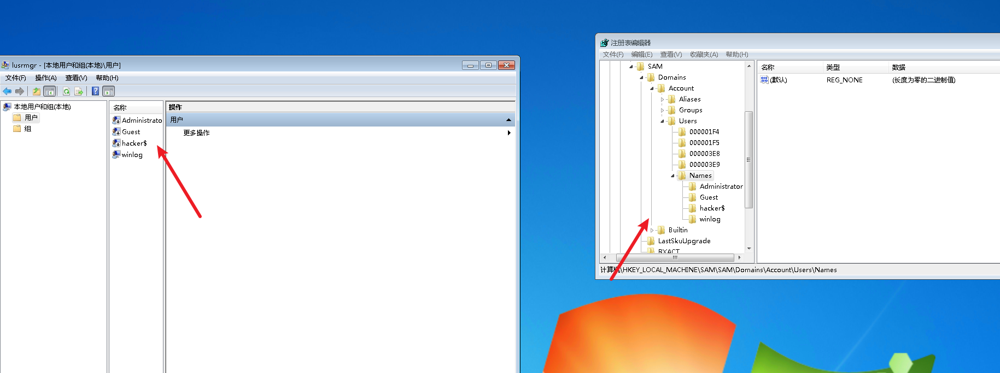

#### 6 黑客植入了一个远程shell，审计相关进程和自启动项提交该程序名字  

```
1. C:\Users\winlog\AppData\Roaming\Microsoft\Windows\Start Menu\Programs\Startup  快捷命令：WIN+R shell:startup 将预自启动程序放入目录，会自启

```

```
2. HKEY_CURRENT_USER\Software\Microsoft\Windows\CurrentVersion\Run  注册表自启动：快捷键：WIN+R regedit 将绝对路径下程序进行字符串值保存会开机自启
```

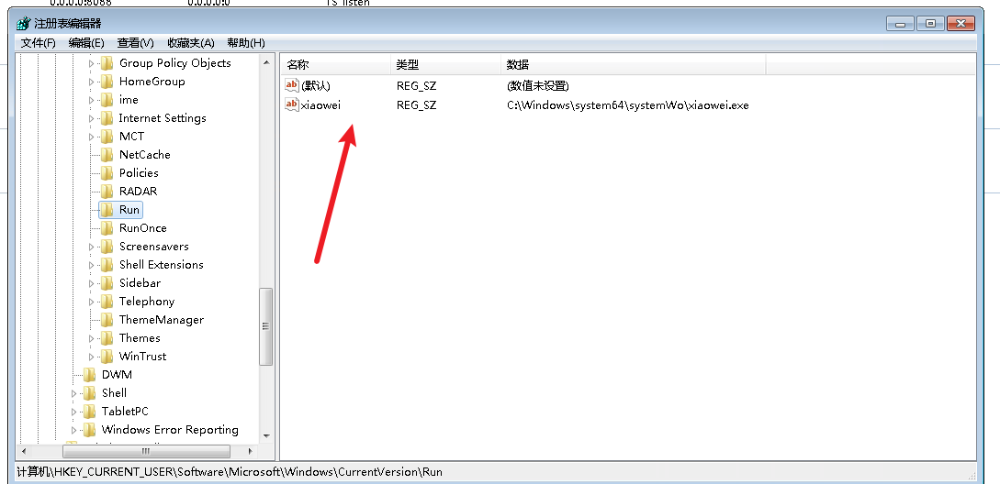

搜索计划任务，进入任务计划程序，查看相关启动程序

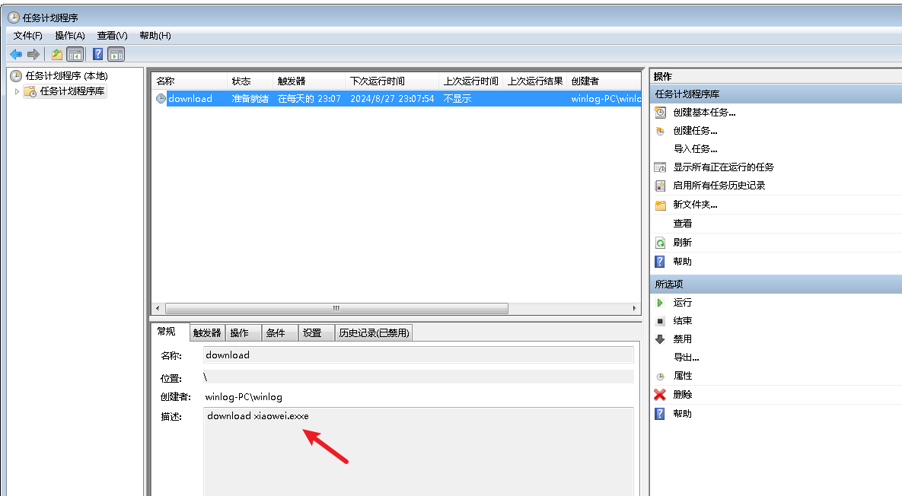


```bash
netstat -ano  #通过查看开放端口，查看外联地址，
tasklist | findstr "2964"#根据pid定位进程程序
wmic process get name,executablepath,processid | findstr 2964#可获取PID的执行文件绝对路径
```


#### 7 提交远程shell程序的连接IP+端口，以IP:port方式提交  

185.117.118.21:4444

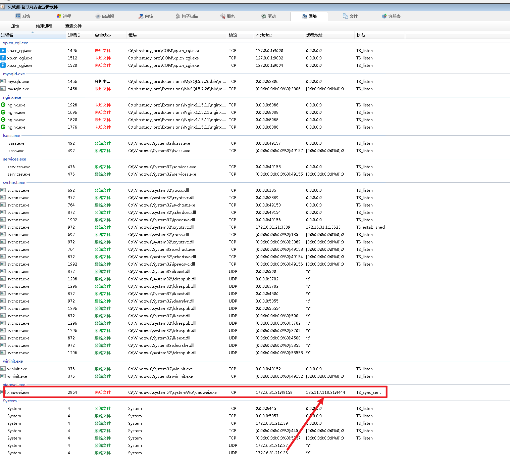

#### 8 黑客使用了计划任务来定时执行某shell程序，提交此程序名字

按照实战中，攻击队或黑客为了权限维持，不会只放一个远控工具，一般会埋雷进行启动计划任务

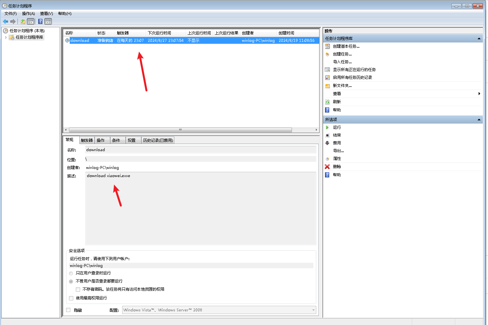

在每天的晚上23点07会进行下载xiaowei.exe文件，点进去查看执行的程序，可看到执行绝对路径

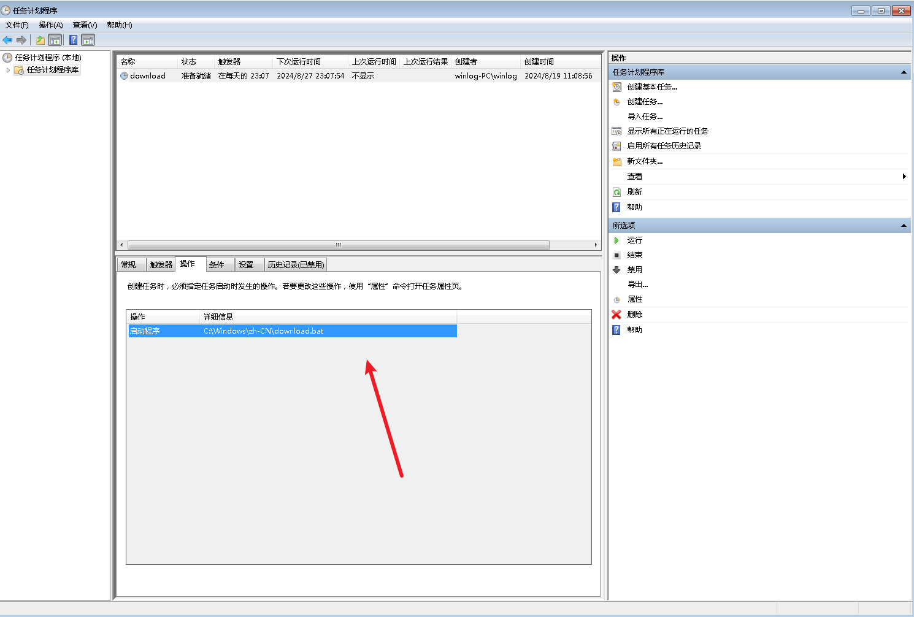

查看这个bat脚本，最后得到执行全过程，确认下载了xiaowei.exe文件到相关目录，最后每次开机自启xiaowei.exe文件上线

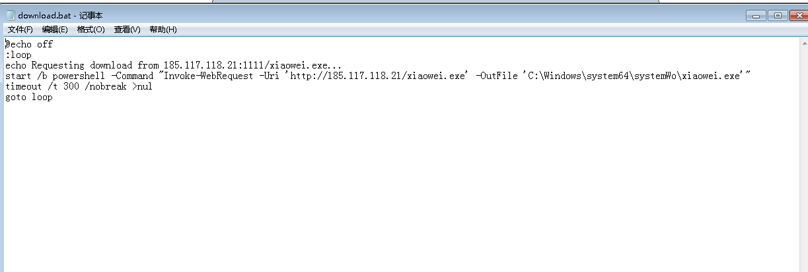

## 结语

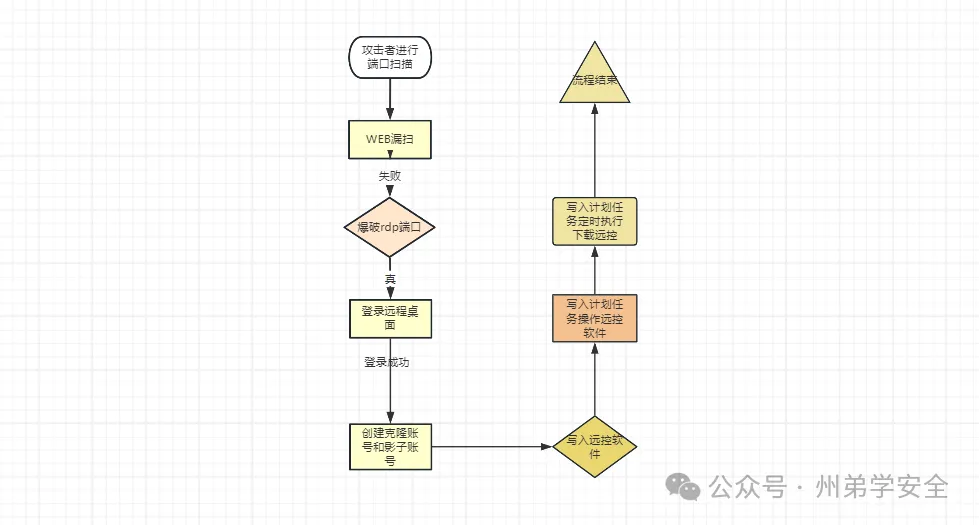
