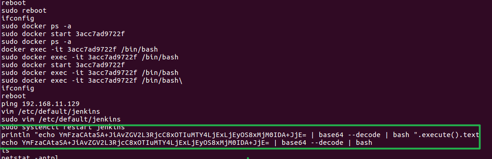
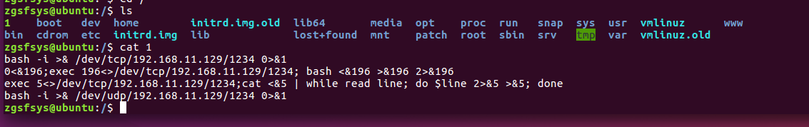

> 来源：[【护网训练-Linux】应急响应靶场-Easy溯源](https://mp.weixin.qq.com/s/qLkLOsvHWKaHiGf1Z1h4DQ)
>
> 通过百度网盘分享的文件：应急响应靶场 - easy溯源.7z
> 链接：https://pan.baidu.com/s/1Ql8Eb9m9jkULgc3r1eOawg 
> 提取码：b9n6 

## 前言

小张是个刚入门的程序猿，在公司开发产品的时候突然被叫去应急，小张心想"早知道简历上不写会应急了"，于是call了运维小王的电话，小王说"你面试的时候不是说会应急吗？伪造简历吗？真该死。"

1. 攻击者内网跳板机IP地址
2. 攻击者服务器地址
3. 存在漏洞的服务(提示:7个字符)
4. 攻击者留下的flag(格式zgsf{})
5. 攻击者邮箱地址
6. 攻击者的ID名称

相关账号密码 ==》Ubuntu：zgsfsys/zgsfsys

## 开始挑战

### 攻击者内网跳板机IP地址

> 192.168.11.129

history历史命令




在zgsysys根路径下也发现了反弹shell脚本



### 攻击者服务器地址

> 156.66.33.66

在root里发现内网穿透


### 存在漏洞的服务(提示:7个字符)

> jenkins

jenkins版本 1.6.21


访问ip/manage就可以实现未授权访问后台页面


利用未授权访问写入webshell


网站路径：/var/www/html （需要具备一定的权限，路径也一定要存在） 利用“脚本命令行”写webshell，点击运行没有报错,写入成功

```cobol
new File ("/var/www/html/shell.php").write('<?php phpinfo(); ?>');
```


### 攻击者留下的flag(格式zgsf{})

>  zgsf{gongzhonghaozhigongshanfangshiyanshi}

查看开放端口，

8080未授权


### 攻击者邮箱地址

github[溯源小技巧](../../../BlueTeam/溯源反制/溯源小技巧.md)

156.66.33.66

本来的预期解应该是GitHub搜索这个IP，找到对应仓库，然后.patch溯源出邮箱，然后去另一个仓库找一个Hack by xxxxx的ID信息

结果。。。账号不知道为什么搜不到了，（已经提交给GitHub反馈）

（估计是GitHub的小号检测，但是我刚发布的时候确实是可以预期解的。。。。估计是长时间不登陆被检测了）

### 攻击者的ID名称

github溯源
