> 关注公众号“知攻善防实验室”，后台回复“靶机web1”
>
> ---
>
> 或者通过以下链接下载
>
> 链接：https://pan.baidu.com/s/1ZHlrpQ6VciS31lgRME6sPQ 
> 提取码：m0ow 

## 挑战内容

前景需要：
	小李在值守的过程中，发现有CPU占用飙升，出于胆子小，就立刻将服务器关机，这是他的服务器系统，请你找出以下内容，并作为通关条件：

​	1.攻击者的shell密码
​	2.攻击者的IP地址
​	3.攻击者的隐藏账户名称
​	4.攻击者挖矿程序的矿池域名

​	用户：
​	administrator
​	密码
​	Zgsf@admin.com

### 题解

如何查看自己的题解是否正确？

`administrator`用户的桌面上解题程序

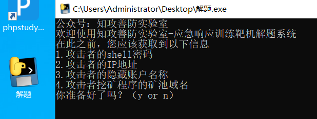

输入正确答案即可解题。

## 开始挑战

### D盾检测

由于windows系统，可以上传D盾检测web目录是否留有后门文件

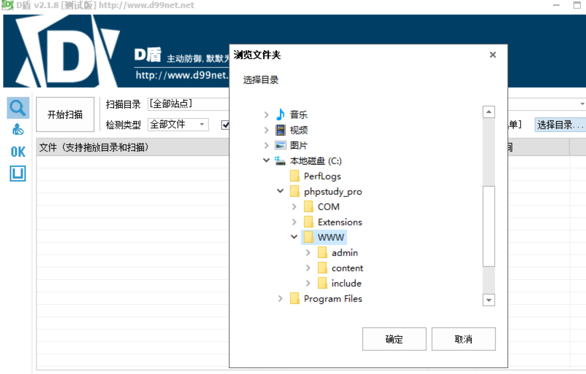

### apache日志分析

查看apache日志文件，发现了攻击者IP：`192.168.126.1`

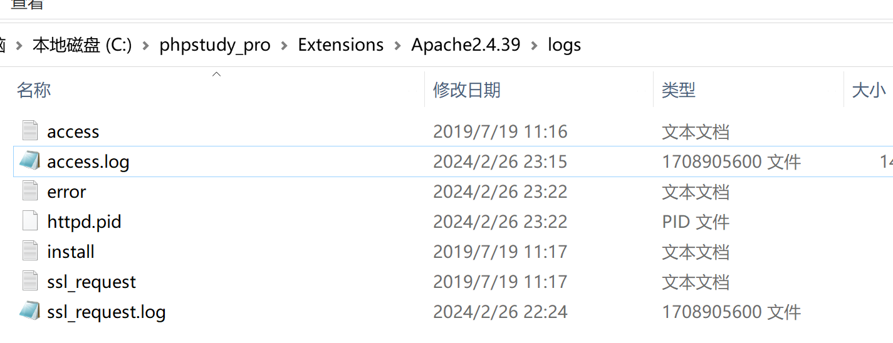

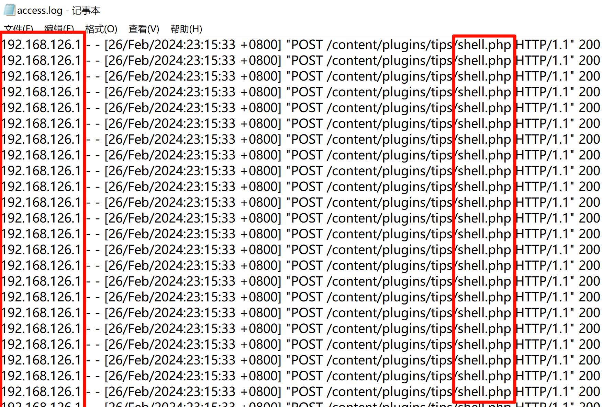

### 系统日志分析

查看是否添加过用户

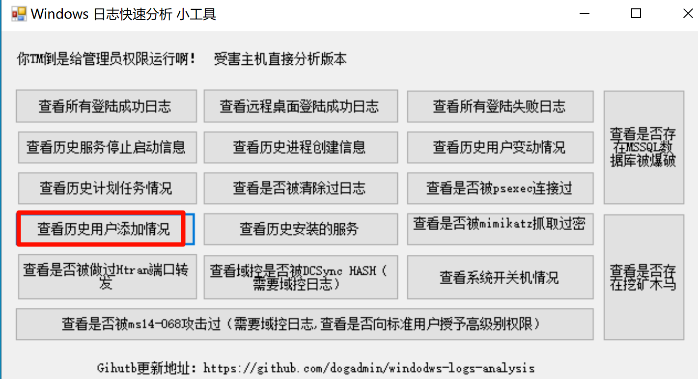

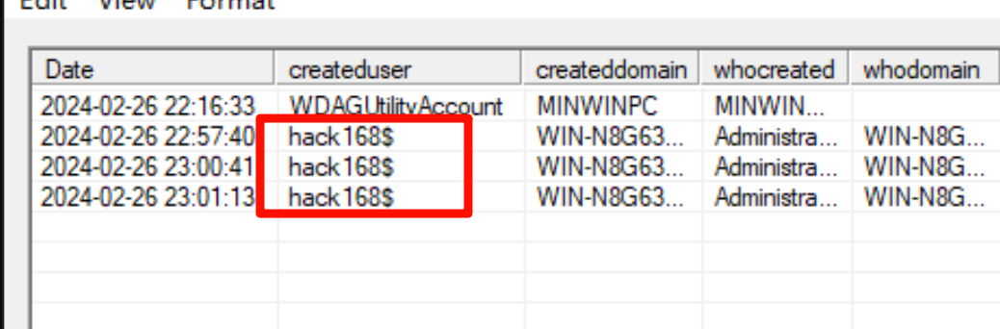

发现隐藏用户`hack168$`

### 挖矿分析

在创建的隐藏用户家目录中发现`Kuang`可执行程序

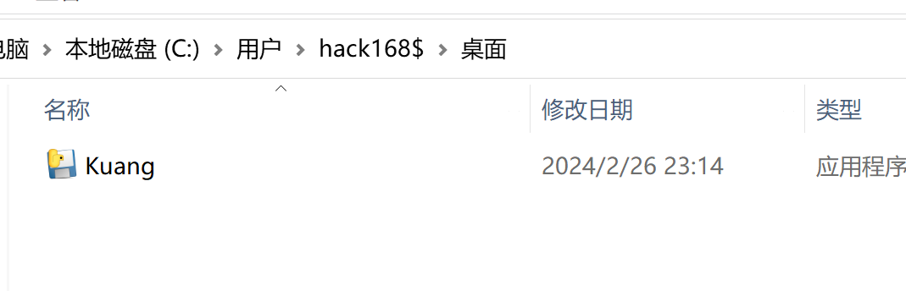

运行`Kuang`文件后cpu飙升，确定其为挖矿程序

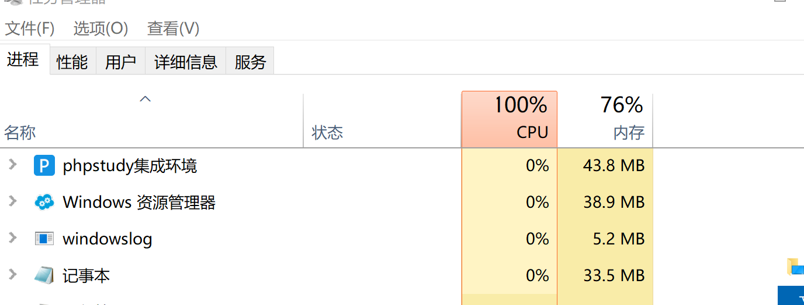

该图标为`pyinstaller`打包，使用`pyinstxtractor`进行反编译

> 下载地址：https://github.com/extremecoders-re/pyinstxtractor

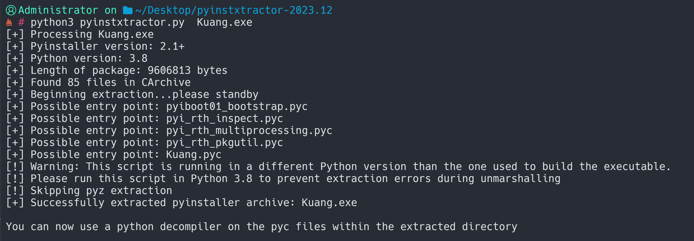

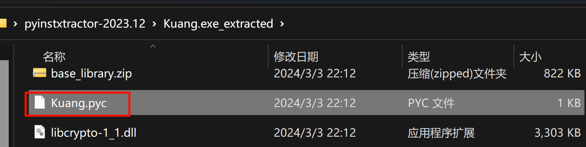

使用在线`pyc反编译`工具，得到源码

> https://toolkk.com/tools/pyc-decomplie

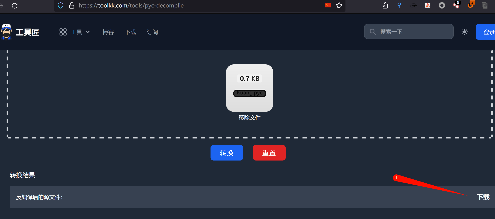

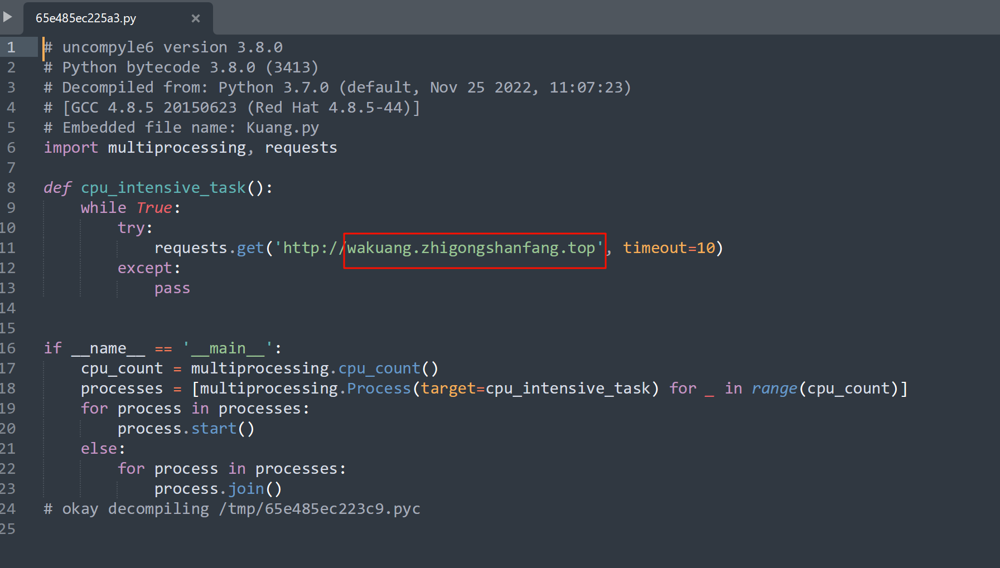

得到矿池域名wakuang.zhigongshanfang.top

## 漏洞修复

漏洞名称：emlog v2.2.0后台插件上传漏洞
