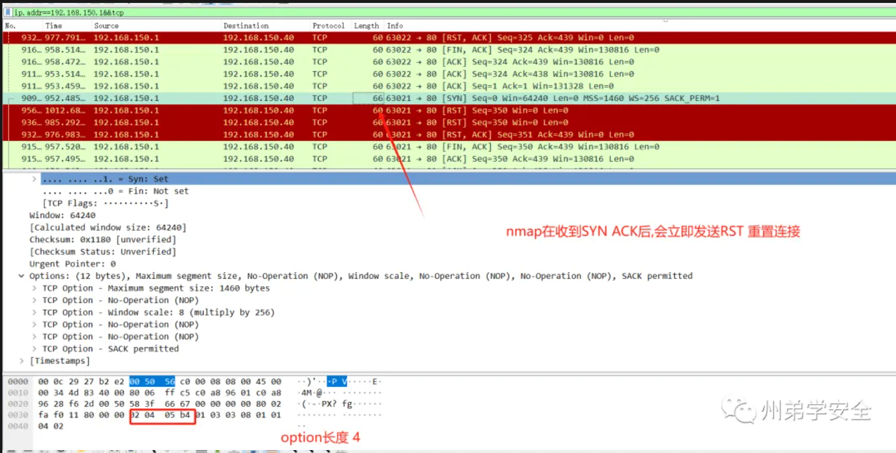

### 前言

> 环境来源：[州弟学安全|学习干货|网安应急响应基础模拟靶机-2(附镜像)](https://mp.weixin.qq.com/s?__biz=MzkzMDE5OTQyNQ==&mid=2247484314&idx=1&sn=accc4f1fbfaae525ec4e3f347afa117b&chksm=c27ca174f50b28621552469df6933d44c30d16a051b9a69e065429063edcdb80f673867150e8&cur_album_id=3203819529227649027&scene=189#wechat_redirect)

```
在前段时间杰克找到了自己的真爱及工作后，稳定了一段时间
这天，杰克接到了一个任务，要求他做一个工控官网
好巧不巧，这次杰克经过了以前的教训后，在lot上线后，又被攻击者盯上了
好在，杰克在系统中抓取了全程流量包，请你帮忙分析一下攻击者做了哪些操作
PS:本题目有CTF成分
```

### 环境信息

```
系统信息: Debian 4.19.146-1
Linux账号密码:root/root123
镜像扩展名：.ova
PS:镜像文件可能较大，保证内存空间足够
如遇到在VMware输入命令时有些符号乱码，可使用远程工具或使用其它虚拟机工具
```


下载地址：

- https://cloud.189.cn/web/share?code=eqeUbqVrae22（访问码：l38h）
- https://pan.baidu.com/s/1XT6xtHaqXY6b1MXJIIqkEQ 提取码: ywqv 

### 题目

```
PS:杰克创建的流量包(result.pcap)在root目录下，请根据已有信息进行分析
1、首个攻击者扫描端口使用的工具是
2、后个攻击者使用的漏洞扫描工具是
3、攻击者上传webshell的绝对路径及User-agent
4、攻击者反弹shell的IP及端口是什么
5、在系统中存在另一个服务漏洞，根据攻击者扫描特征及自身检测写出
6、攻击者提权的方式是什么
7、攻击者留下了WEB后门脚本，找到绝对路径攻击者留下了持续化监控和后门脚本，找到绝对路径(具有SUID权限)
```

### 挑战开始

### 1、首个攻击者扫描端口使用的工具是

> flag{fscan}

```bash
awk '{print $1}'  access.log.1 | sort|uniq -c|sort -nr
```

```
根据对apache日志的源IP进行查看
192.168.150.2为首次大量扫描的IP
192.168.150.1为后扫描的IP
其余IP只进行了80端口的WEB访问流量
```


192.168.150.1 初始流量 SSH为正常，因为是物理主机，连接的靶机


### 2、后个攻击者使用的漏洞扫描工具是

> flag{GOBY}




### 3、攻击者上传webshell的绝对路径及User-agent

> falg{/var/www/html/lot/admin/assets/uploads/maps/1701324180_Shell123.php      my_is_user_agent}


### 4、攻击者反弹shell的IP及端口是什么

> flag{192.168.150.110:5678}


### 5、在系统中存在另一个服务漏洞，根据攻击者扫描特征及自身检测写出

> flag{nacos未授权访问漏洞}

查看开放的nacos端口


### 6、攻击者提权的方式是什么

> flag{sudo提权或sudo写入新用户}

查看`/etc/sudoers`文件，发现任意用户执行添加用户操作


查看用户创建时间


### 7、攻击者留下了WEB后门脚本，找到绝对路径(具有SUID权限)

> flag{/var/www/html/lot/admin/assets/vendor/.shell/.decodeshell.php}


### 8、攻击者留下了持续化监控和后门脚本，找到绝对路径

> flag{/opt/.script/.script.sh}


或者可用通过grep命令查找内容字段进行枚举

```bash
grep -rnw '/' -e "decodeshell"  2>/dev/null

# -e<范本样式> --regexp=<范本样式>   # 指定字符串作为查找文件内容的范本样式。
# -w --word-regexp  # 只显示全字符合的列。
# 
```

