```
链接：https://pan.baidu.com/s/1-qemfxTKITQZs5NI1EZ2_w 
提取码：hm84 
--来自百度网盘超级会员V3的分享
```

### 挑战内容
前景需要：小王从某安全大厂被优化掉后，来到了某私立小学当起了计算机老师。某一天上课的时候，发现鼠标在自己动弹，又发现除了某台电脑，其他电脑连不上网络。感觉肯定有学生捣乱，于是开启了应急。

1.攻击者的外网IP地址

2.攻击者的内网跳板IP地址

3.攻击者使用的限速软件的md5大写

4.攻击者的后门md5大写

5.攻击者留下的flag

解题：

运行桌面上"解题工具.exe"即可

注意：该靶机存在许多非预期解，请合理练习应急响应技能(如果你是为了解题而解题，当然很好解)。


相关账户密码

Administrator

zgsf@2024

这个靶机，做的有点仓促，题解程序写错了，有一个让填md5的，其实是填大写md5

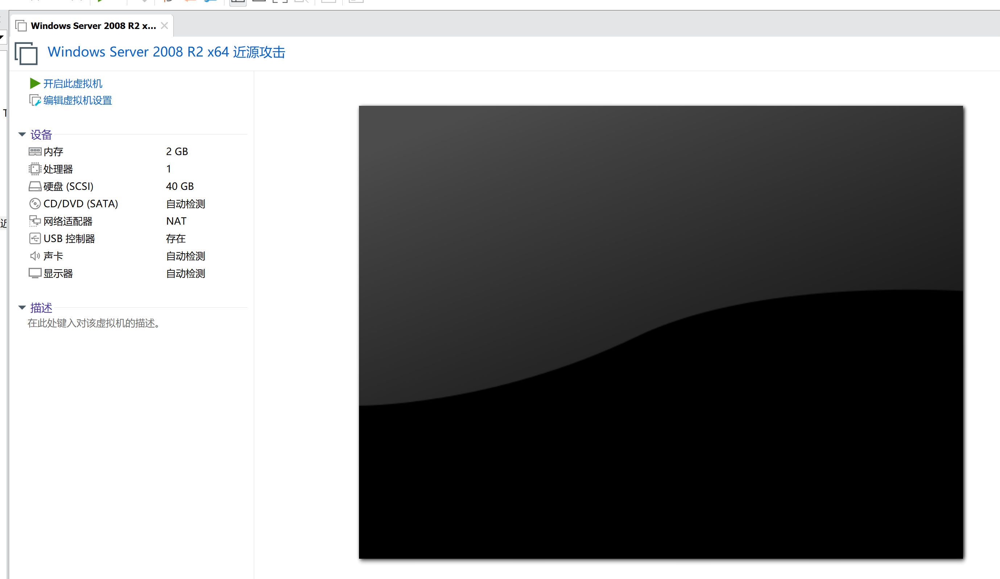

### 开始挑战

先登录环境，然后rdp连接

把桌面上的word文档放进另一台虚拟机，进行沙箱分析，刚一放进去，windows自带的杀毒软件就提示了

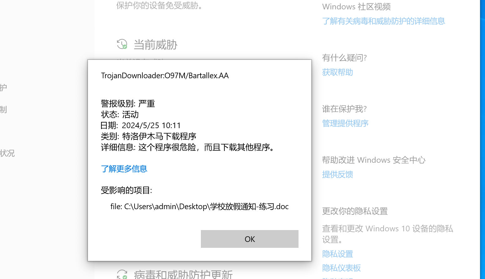

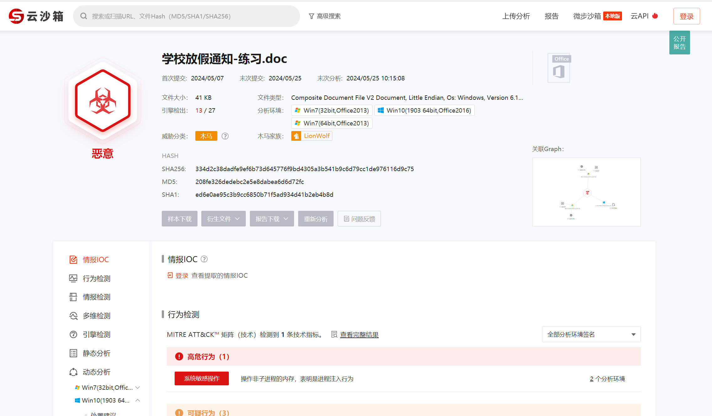


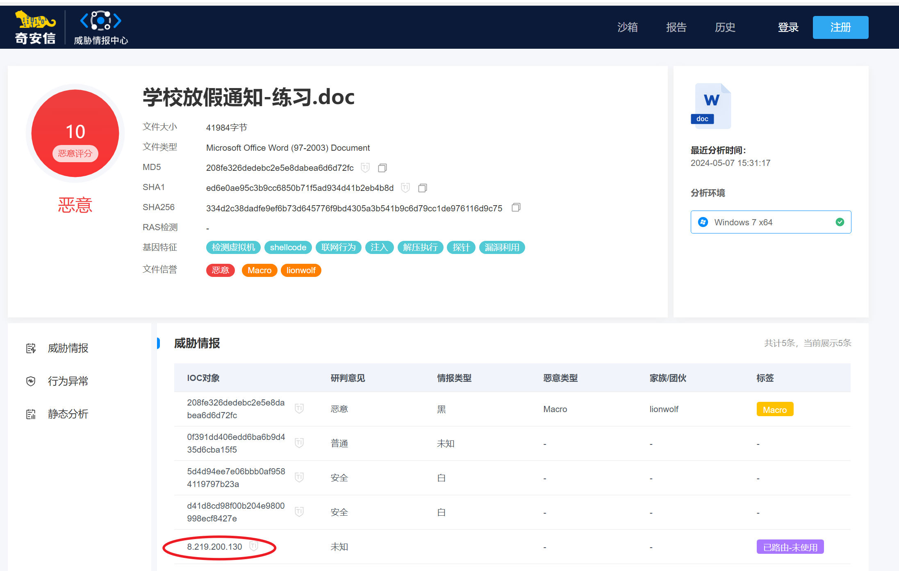

发现攻击者外网IP：8.219.200.130


test.bat被隐藏掉了

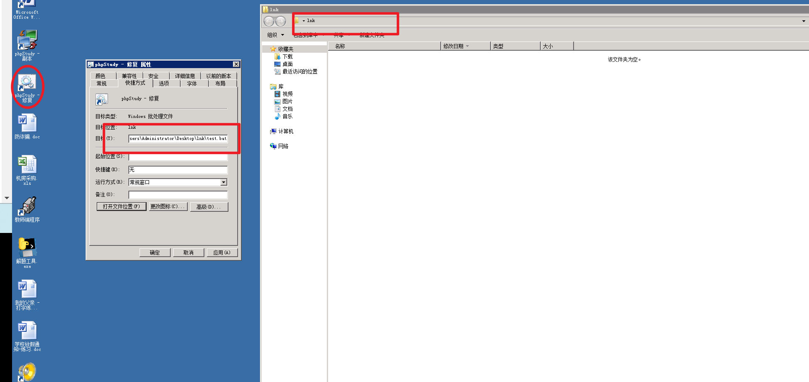

通过文件夹选项显示被隐藏的文件

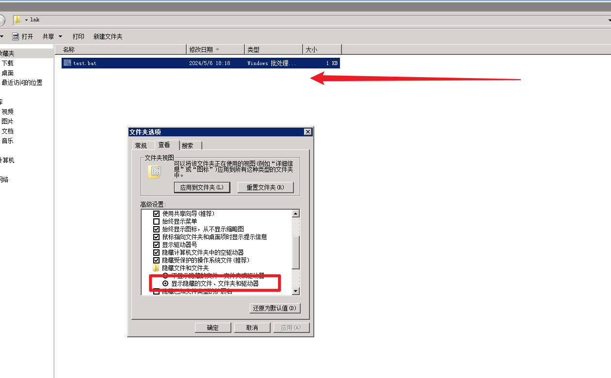


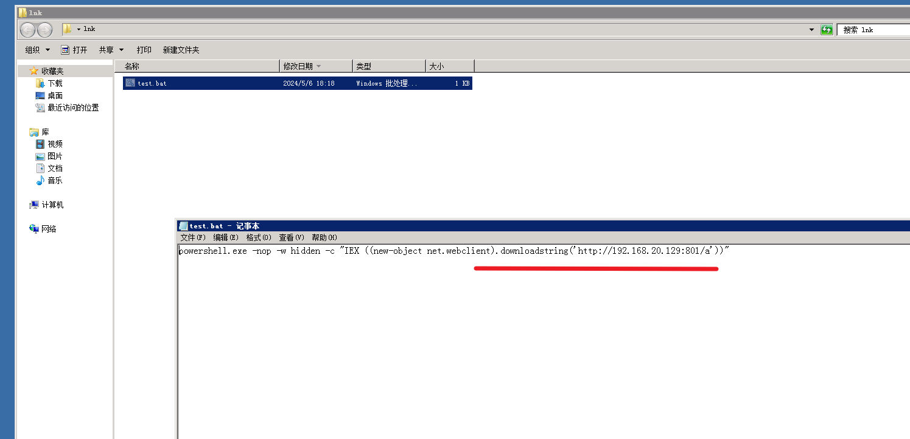

发现内网跳板的地址

然后是限速软件，靶场取自真实环境，真实环境中，一个普通用户怎么去劫持整个局域网网速呢？？

答案：ARP劫持

用啥劫持的呢？

翻一翻C盘文件就知道了  

地址

```
  
C:\PerfLogs\666\666\777\666\666\666\666\666\666\666\666\666\666\666
```

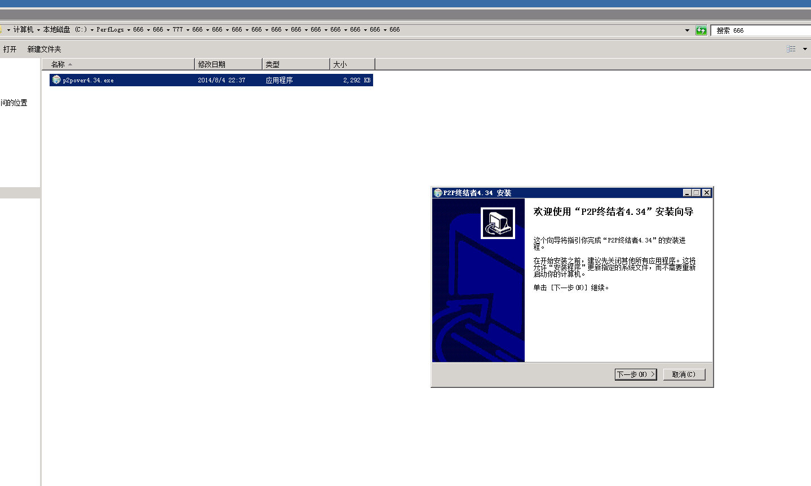

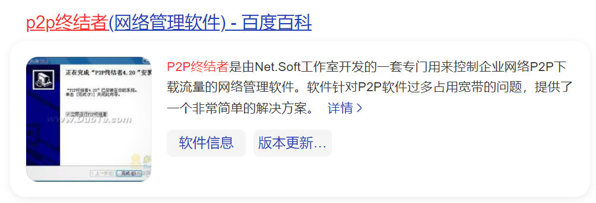


使用工具计算Hash值

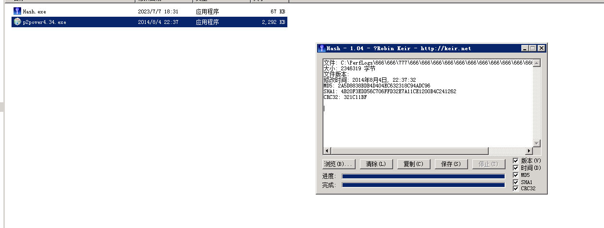

`2A5D8838BDB4D404EC632318C94ADC96`


然后就是另一个最后一个后门，

发现shift后门

连按5次shift系统会运行粘滞键

位置在

```
C:\Windows\System32\sethc.exe
```

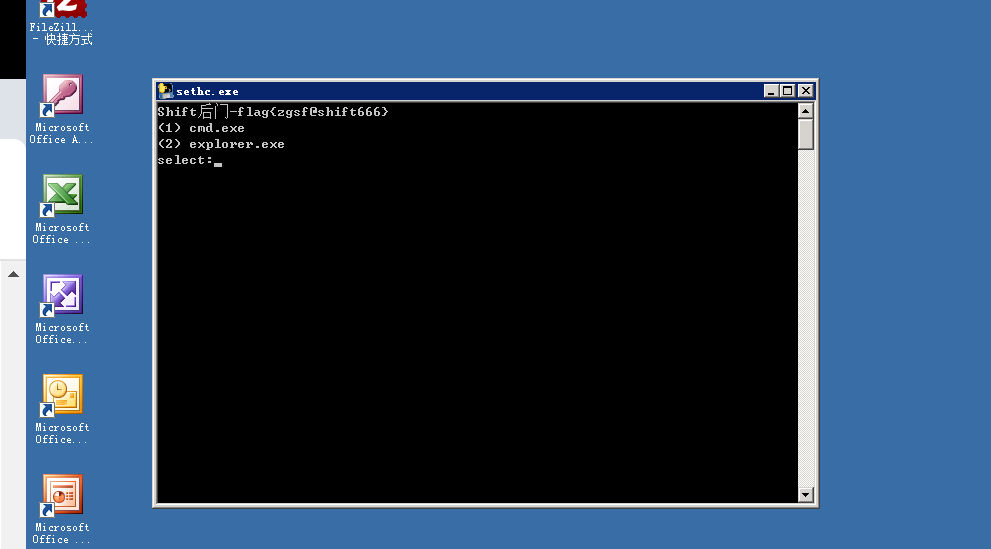

flag:flag{zgsf@shift666}


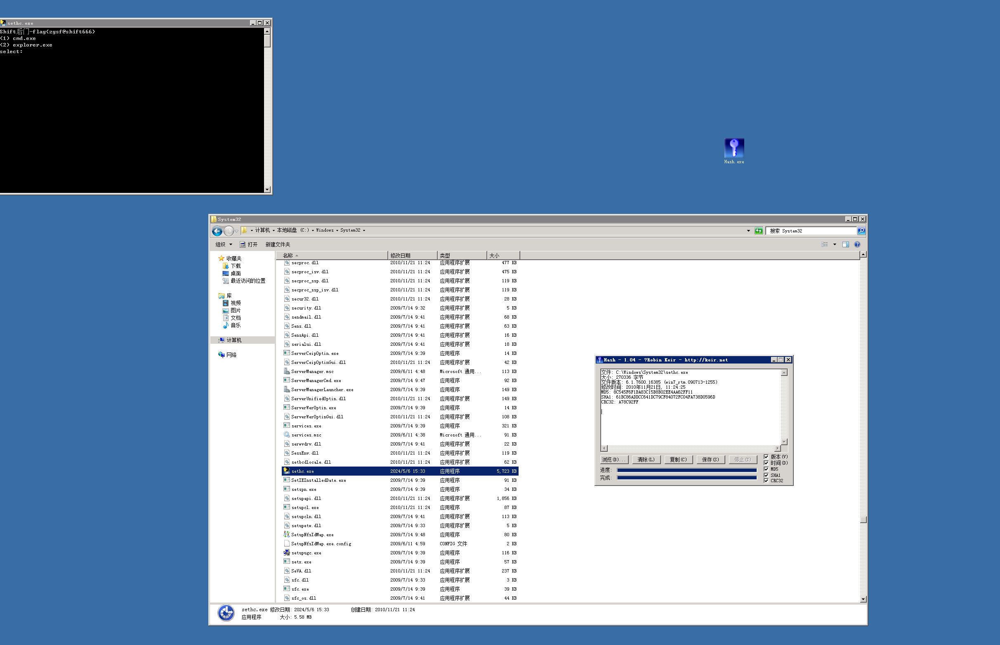