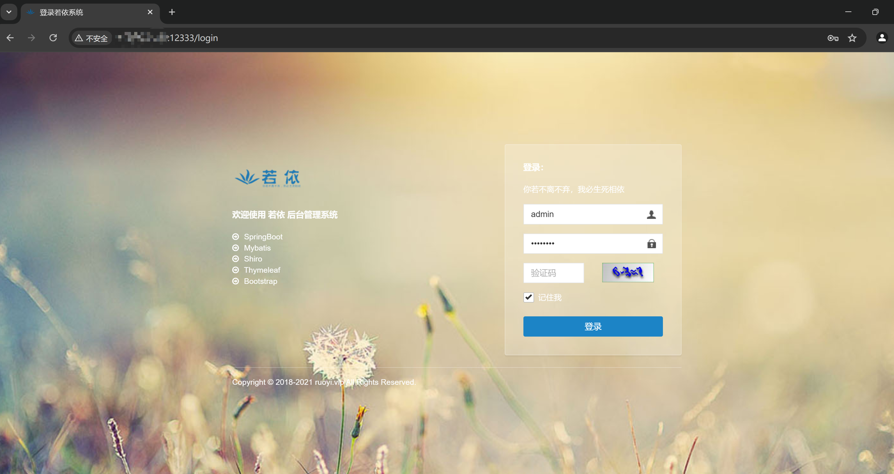
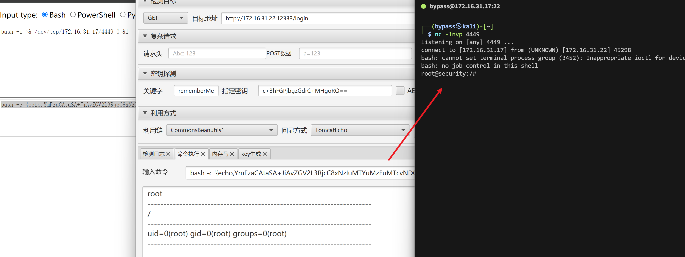

## 环境下载

通过网盘分享的文件：行业攻防应急响应环境
链接: https://pan.baidu.com/s/14O8bIKh9CvRyg6cazahqgw 提取码: bnvm 

## 端口指纹识别

Yakit端口指纹扫描


发现shiro、若依


## spring actuator信息泄露


尝试下载heapdump，查看敏感信息


```bash
java -jar JDumpSpider-1.1-SNAPSHOT-full.jar  heapdump
```


尝试登录若依后台  admin:admin123


成功登录后，发现版本是4.7.1

该本版可能存在其他漏洞，这里不做复现

## shiro反序列化

访问12333端口，登录框随机输入信息，登录，观察数据包



确认   存在shiro特征


直接上工具，一把梭哈

先爆破密钥


再爆破利用链及回显


命令执行


反弹shell

