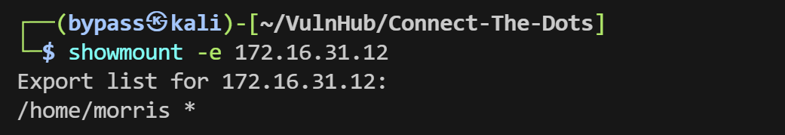
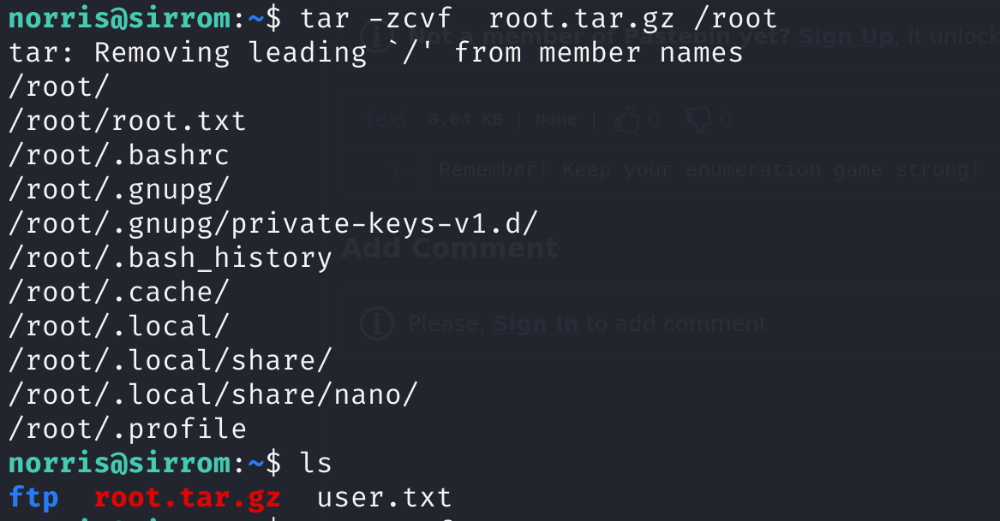
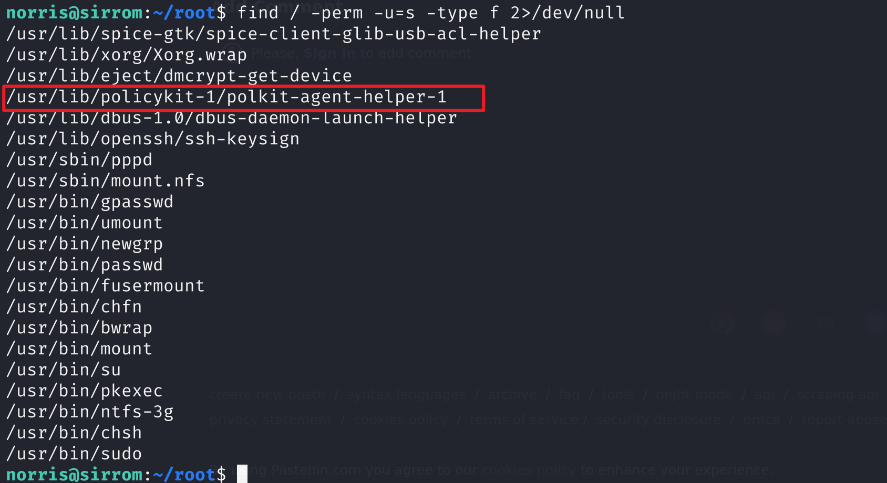

下载地址：[Connect The Dots: 1 ~ VulnHub](https://www.vulnhub.com/entry/connect-the-dots-1,384/)

---

本靶机的打靶过程还挺长的（下载就花费了挺长时间），也可能是因为有好多知识点我不够了解，同时最后采用了两种方式进行提权。靶机很有解密的性质，同时也涉及到了有关意外断点产生的swp交换文件读取知识点，与实际情况的渗透相似。靶机的难度不高，但涉及到的知识点较为密集，包括nfs挂载、jsfuck混淆、ftp多文件读取、文件图片隐写、莫尔斯电码解码、断电swp文件读取、polkit权限提升等，完整打靶思路详见：

[「红队笔记」靶机精讲：CONNECT THE DOTS - 不懂jsfuck，polkit，图片隐写，莫尔斯码和断电隐患，你可能玩不转这台靶机。_哔哩哔哩_bilibili](https://www.bilibili.com/video/BV1vP411d7Lk/)

---

## 信息收集


```bash
sudo nmap -sT --top-ports 20 172.16.31.12 -oA nmapscan/udp
```


```bash
cat nmapscan/ports.nmap|grep open|awk -F'/' '{print $1}'| tr '\n\r' ','                         
```


详细信息扫描

```bash
└─$ sudo nmap -sT -sC -sV -O -p21,80,111,2049,7822,34483,34645,39155,5829 172.16.31.12 -oA nmapscan/detail

┌──(bypass㉿kali)-[~/VulnHub/Connect-The-Dots]
└─$ sudo nmap -sT -sC -sV -O -p21,80,111,2049,7822,34483,34645,39155,5829 172.16.31.12 -oA nmapscan/detail
Starting Nmap 7.94SVN ( https://nmap.org ) at 2024-08-18 17:49 CST
Nmap scan report for 172.16.31.12
Host is up (0.00023s latency).

PORT      STATE  SERVICE  VERSION
21/tcp    open   ftp      vsftpd 2.0.8 or later
80/tcp    open   http     Apache httpd 2.4.38 ((Debian))
|_http-title: Landing Page
|_http-server-header: Apache/2.4.38 (Debian)
111/tcp   open   rpcbind  2-4 (RPC #100000)
| rpcinfo: 
|   program version    port/proto  service
|   100000  2,3,4        111/tcp   rpcbind
|   100000  2,3,4        111/udp   rpcbind
|   100000  3,4          111/tcp6  rpcbind
|   100000  3,4          111/udp6  rpcbind
|   100003  3           2049/udp   nfs
|   100003  3           2049/udp6  nfs
|   100003  3,4         2049/tcp   nfs
|   100003  3,4         2049/tcp6  nfs
|   100005  1,2,3      38559/udp6  mountd
|   100005  1,2,3      39155/tcp   mountd
|   100005  1,2,3      45613/udp   mountd
|   100005  1,2,3      55153/tcp6  mountd
|   100021  1,3,4      34645/tcp   nlockmgr
|   100021  1,3,4      42359/tcp6  nlockmgr
|   100021  1,3,4      50256/udp   nlockmgr
|   100021  1,3,4      51848/udp6  nlockmgr
|   100227  3           2049/tcp   nfs_acl
|   100227  3           2049/tcp6  nfs_acl
|   100227  3           2049/udp   nfs_acl
|_  100227  3           2049/udp6  nfs_acl
2049/tcp  open   nfs      3-4 (RPC #100003)
5829/tcp  closed unknown
7822/tcp  open   ssh      OpenSSH 7.9p1 Debian 10+deb10u1 (protocol 2.0)
| ssh-hostkey: 
|   2048 38:4f:e8:76:b4:b7:04:65:09:76:dd:23:4e:b5:69:ed (RSA)
|   256 ac:d2:a6:0f:4b:41:77:df:06:f0:11:d5:92:39:9f:eb (ECDSA)
|_  256 93:f7:78:6f:cc:e8:d4:8d:75:4b:c2:bc:13:4b:f0:dd (ED25519)
34483/tcp open   mountd   1-3 (RPC #100005)
34645/tcp open   nlockmgr 1-4 (RPC #100021)
39155/tcp open   mountd   1-3 (RPC #100005)
MAC Address: 00:0C:29:9E:88:41 (VMware)
Device type: general purpose
Running: Linux 3.X|4.X
OS CPE: cpe:/o:linux:linux_kernel:3 cpe:/o:linux:linux_kernel:4
OS details: Linux 3.2 - 4.9
Network Distance: 1 hop
Service Info: OS: Linux; CPE: cpe:/o:linux:linux_kernel

OS and Service detection performed. Please report any incorrect results at https://nmap.org/submit/ .
Nmap done: 1 IP address (1 host up) scanned in 16.17 seconds
                                                          
```

 信息量很大，重点看的是111和2049端口都涉及到nfs网络文件系统的挂载。同时ssh端口修改到了7822。后面的端口是动态端口，没什么有用信息。这里再用默认的漏洞扫描脚本进行尝试：

```bash
┌──(bypass㉿kali)-[~/VulnHub/Connect-The-Dots]
└─$ sudo nmap --script=vuln -p21,80,111,2049,7822,34483,34645,39155,5829 172.16.31.12 -oA nmapscan/vulns 
Starting Nmap 7.94SVN ( https://nmap.org ) at 2024-08-18 17:50 CST
Pre-scan script results:
| broadcast-avahi-dos: 
|   Discovered hosts:
|     224.0.0.251
|   After NULL UDP avahi packet DoS (CVE-2011-1002).
|_  Hosts are all up (not vulnerable).
Stats: 0:00:59 elapsed; 0 hosts completed (1 up), 1 undergoing Script Scan
NSE Timing: About 97.15% done; ETC: 17:51 (0:00:00 remaining)
Stats: 0:00:59 elapsed; 0 hosts completed (1 up), 1 undergoing Script Scan
NSE Timing: About 97.15% done; ETC: 17:51 (0:00:00 remaining)
Stats: 0:01:00 elapsed; 0 hosts completed (1 up), 1 undergoing Script Scan
NSE Timing: About 97.29% done; ETC: 17:51 (0:00:00 remaining)
Stats: 0:01:00 elapsed; 0 hosts completed (1 up), 1 undergoing Script Scan
NSE Timing: About 98.10% done; ETC: 17:51 (0:00:00 remaining)
Nmap scan report for 172.16.31.12
Host is up (0.00019s latency).

PORT      STATE  SERVICE
21/tcp    open   ftp
80/tcp    open   http
| http-fileupload-exploiter: 
|   
|     Couldn't find a file-type field.
|   
|     Couldn't find a file-type field.
|   
|_    Couldn't find a file-type field.
| http-sql-injection: 
|   Possible sqli for queries:
|     http://172.16.31.12:80/mysite/?C=D%3BO%3DA%27%20OR%20sqlspider
|     http://172.16.31.12:80/mysite/?C=N%3BO%3DD%27%20OR%20sqlspider
|     http://172.16.31.12:80/mysite/?C=S%3BO%3DA%27%20OR%20sqlspider
|     http://172.16.31.12:80/mysite/?C=M%3BO%3DA%27%20OR%20sqlspider
|     http://172.16.31.12:80/mysite/?C=D%3BO%3DD%27%20OR%20sqlspider
|     http://172.16.31.12:80/mysite/?C=M%3BO%3DA%27%20OR%20sqlspider
|     http://172.16.31.12:80/mysite/?C=N%3BO%3DA%27%20OR%20sqlspider
|     http://172.16.31.12:80/mysite/?C=S%3BO%3DA%27%20OR%20sqlspider
|     http://172.16.31.12:80/mysite/?C=M%3BO%3DA%27%20OR%20sqlspider
|     http://172.16.31.12:80/mysite/?C=N%3BO%3DA%27%20OR%20sqlspider
|     http://172.16.31.12:80/mysite/?C=D%3BO%3DA%27%20OR%20sqlspider
|     http://172.16.31.12:80/mysite/?C=S%3BO%3DA%27%20OR%20sqlspider
|     http://172.16.31.12:80/mysite/?C=D%3BO%3DA%27%20OR%20sqlspider
|     http://172.16.31.12:80/mysite/?C=N%3BO%3DA%27%20OR%20sqlspider
|     http://172.16.31.12:80/mysite/?C=S%3BO%3DD%27%20OR%20sqlspider
|     http://172.16.31.12:80/mysite/?C=M%3BO%3DA%27%20OR%20sqlspider
|     http://172.16.31.12:80/mysite/?C=M%3BO%3DD%27%20OR%20sqlspider
|     http://172.16.31.12:80/mysite/?C=D%3BO%3DA%27%20OR%20sqlspider
|     http://172.16.31.12:80/mysite/?C=S%3BO%3DA%27%20OR%20sqlspider
|     http://172.16.31.12:80/mysite/?C=N%3BO%3DA%27%20OR%20sqlspider
|     http://172.16.31.12:80/mysite/?C=M%3BO%3DA%27%20OR%20sqlspider
|     http://172.16.31.12:80/mysite/?C=N%3BO%3DA%27%20OR%20sqlspider
|     http://172.16.31.12:80/mysite/?C=D%3BO%3DA%27%20OR%20sqlspider
|     http://172.16.31.12:80/mysite/?C=S%3BO%3DA%27%20OR%20sqlspider
|     http://172.16.31.12:80/mysite/?C=D%3BO%3DA%27%20OR%20sqlspider
|     http://172.16.31.12:80/mysite/?C=N%3BO%3DD%27%20OR%20sqlspider
|     http://172.16.31.12:80/mysite/?C=S%3BO%3DA%27%20OR%20sqlspider
|     http://172.16.31.12:80/mysite/?C=M%3BO%3DA%27%20OR%20sqlspider
|     http://172.16.31.12:80/mysite/?C=N%3BO%3DA%27%20OR%20sqlspider
|     http://172.16.31.12:80/mysite/?C=M%3BO%3DA%27%20OR%20sqlspider
|     http://172.16.31.12:80/mysite/?C=D%3BO%3DA%27%20OR%20sqlspider
|     http://172.16.31.12:80/mysite/?C=S%3BO%3DA%27%20OR%20sqlspider
|     http://172.16.31.12:80/mysite/?C=M%3BO%3DA%27%20OR%20sqlspider
|     http://172.16.31.12:80/mysite/?C=N%3BO%3DA%27%20OR%20sqlspider
|     http://172.16.31.12:80/mysite/?C=S%3BO%3DA%27%20OR%20sqlspider
|_    http://172.16.31.12:80/mysite/?C=D%3BO%3DA%27%20OR%20sqlspider
|_http-dombased-xss: Couldn't find any DOM based XSS.
|_http-csrf: Couldn't find any CSRF vulnerabilities.
|_http-stored-xss: Couldn't find any stored XSS vulnerabilities.
| http-enum: 
|   /images/: Potentially interesting directory w/ listing on 'apache/2.4.38 (debian)'
|_  /manual/: Potentially interesting folder
111/tcp   open   rpcbind
2049/tcp  open   nfs
5829/tcp  closed unknown
7822/tcp  open   unknown
34483/tcp open   unknown
34645/tcp open   unknown
39155/tcp open   unknown
MAC Address: 00:0C:29:9E:88:41 (VMware)

Nmap done: 1 IP address (1 host up) scanned in 67.56 seconds
```

 漏洞脚本扫描其实没有太多的信息，发现了一个sql注入，还有一些目录枚举的内容

## FTP和NFS渗透（失败）

分析渗透思路。由于FTP可以算是低摘的果子，我们干脆从21端口入手，先对ftp进行匿名登陆尝试，再查看有没有nfs挂载的目录，接着再对web进行渗透，实在不行再考虑ssh。 先尝试登录ftp：


可惜无法匿名登录，看来ftp这条路走不通，我们再用showmount尝试查看有没有挂载目录（-e参数用于导出挂载目录）：

```bash
showmount -e 172.16.31.12
```



 确实存在挂载目录/home/morris，这也说明这个靶机有一个用户名是morris，说不定以后我们能拿到这个账号的权限。此时我们新建一个目录mor，尝试能不能把靶机的开放目录挂载连接到mor（-t指定类型nfs）

```bash
sudo mount -t nfs 172.16.31.12:/home/morris mor
```


找到了ssh私钥，可以试着去连接一下，看能否成功


指定私钥，指定端口，发现还是需要使用密码登录


## WEB渗透

打开浏览器访问靶机ip，可以看到如下的界面，这个页面的加载略显卡顿：


其实这个界面就是一些文字和图片。查看源代码也没什么收获。不过初看下面这段文字可能会有一些线索：

You know how our family have named us, right? Them naming me M and you N. Well, our names are entirely the same except the initials. Life is too short to save names in your memory when you're old, so why not! But do you know who did that? Our mother who was fond of the James Bond movies. She named me after her as M. Perhaps, she thinks that the director of the movie was too lazy to think of one. 

首先尽然有拼错的单词，可能是开发者打字太快了。然后这句话暗示了我们的名字只有首字母的不一样的，而我是“M”你是“N”。结合之前发现的一个账号morris，可以猜测存在另外一个用户名norris。当然此处仅仅是猜测，后面会证实。 这也看不出来啥，进行一个目录爆破吧：
```bash
└─$ gobugobuster dir -u http://172.16.31.12 -w /usr/share/dirbuster/wordlists/directory-list-2.3-medium.txt 
```


还是有一些收获的，发现几个目录images,manual,javascript,mysite等，还有一个路径backups，先看一下这个backups：

打开后啥也不是

然后发现images就是初始页面的图片目录，manual是apache的配置界面。javascript没有什么值得关注的内容。进入mysite目录：


这个目录中有一个文件bootstrap.min.cs，这个文件名的后缀我还真不知道是啥，点开发现有一大串字符，感觉像是一种程序语言，分析这个文件，结合末尾的setInterval( function() {console.log(a)}, 3000);判断，可能与javascript相关：


## jsfuck解码


这里感觉类似CTF其实需要经验，就是我们看到的由一大堆`[]()!+`组成编码的字符其实是jsfuck，这是一种针对javascript程序的混淆方法。 和我们上一期打靶[Narak](Narak.md)中的brainfuck类似。


那么我们当然就要对这个jsfuck进行解码了。进行解码之前，应该先把完整的jsfuck内容复制下来。可以直接复制，并依次删除非jsfuck的字符，也可以像下面这样，在mysite目录下发现了register.html页面： 查看源代码发现这个页面会调用含有jsfuck语句的bootstrap.min.cs：


而 bootstrap.min.cs文件中的jsfuck语句正是由变量b1,b2,...b10拼接而成，因此直接在这个页面的console控制台用console.log将所有的字符串变量拼接即可：

```js
console.log(b1+b2+b3+b4+b5+b6+b7+b8+b9+b10)
```


然后我们搜索一个在线解码器，把拼接而成的超长jsfuck字符串进行解码：

[JSFuck - Write any JavaScript with 6 Characters: []()!+](https://jsfuck.com/) 


解码成功了！出现了alert的提示信息：

> You're smart enough to understand me. Here's your secret, TryToGuessThisNorris@2k19

`TryToGuessThisNorris@2k19`应该就是一个凭据，那账号是啥呢，根据推理应该是norris，这既源于开头web页面的提示，也源于密码本身就含有norris，总之我们尝试能否使用这个凭据登录ssh。（可能的用户就只有root/morris/norris三个，注意ssh端口修改为7822）经过尝试发现norris登录成功：

```bash
ssh norris@172.16.31.12 -p 7822
```


成功拿到了user.txt：


## 再次FTP渗透与莫尔斯电码解码

同时在当前目录下看到了ftp文件夹，为了方便我们将ftp内的文件下载到kali本地进行分析，因此我们在kali中再次通过`norris`账号密码`TryToGuessThisNorris@2k19`登录ftp成功： 


发现ftp中有文件夹files，进入目录，把里面的内容全都下载到本地：

这里需要注意的是，如果目录下的文件不是文本.txt文件的话，需要先运行`binary`指令（即输入binary然后回车）转换为二进制格式，以保证通过FTP下载的文件不会损坏。此处又运行了`prompt`指令关闭了交互模式，就不用对每个下载都逐一确认了。


接下来我们使用`file`工具逐一查看，发现backups.bak是一个iso媒体文件，没找到什么有用信息，game.jpg.bak文件好像备注信息comment中有类似`莫尔斯电码`的东西：


用`exiftools`详细查看：


将这段摩尔斯密码复制下来，找个在线网页尝试解密：

[Morse Code Translator - Morse Decoder](https://morsedecoder.com/)


成功解密


解密内容：

> HEY#NORRIS,#YOU'VE#MADE#THIS#FAR.#FAR#FAR#FROM#HEAVEN#WANNA#SEE#HELL#NOW?#HAHA#YOU#SURELY#MISSED#ME,#DIDN'T#YOU?#OH#DAMN#MY#BATTERY#IS#ABOUT#TO#DIE#AND#I#AM#UNABLE#TO#FIND#MY#CHARGER#SO#QUICKLY#LEAVING#A#HINT#IN#HERE#BEFORE#THIS#SYSTEM#SHUTS#DOWN#AUTOMATICALLY.#I#AM#SAVING#THE#GATEWAY#TO#MY#DUNGEON#IN#A#'SECRETFILE'#WHICH#IS#PUBLICLY#ACCESSIBLE.

说实话这么看可读性有点差，干脆存成一个文件morse_decode，然后把所有的#替换成空格再查看：

```bash
cat morse_decode | tr '#' ' '
```


> HEY NORRIS, YOU'VE MADE THIS FAR. FAR FAR FROM HEAVEN WANNA SEE HELL NOW? HAHA YOU SURELY MISSED ME, DIDN'T YOU? OH DAMN MY BATTERY IS ABOUT TO DIE AND I AM UNABLE TO FIND MY CHARGER SO QUICKLY LEAVING A HINT IN HERE BEFORE THIS SYSTEM SHUTS DOWN AUTOMATICALLY. I AM SAVING THE GATEWAY TO MY DUNGEON IN A 'SECRETFILE' WHICH IS PUBLICLY ACCESSIBLE. 
>

这段话意思说他的电池很快就没电了，他就要ger~了，于是火速给我们留下一个信息，他**把关键的信息secretfile放在了公共的区域**。那啥是公共的区域呢？最容易想到的就是web的目录/var/www/html。不过在此之前，我们还要查看其它文件：


给了我们一句提示：

> Remember! Keep your enumeration game strong!
>
> 记住！枚举一定要尽全力！

说白了就是再次强调不要遗漏信息。

## vim读取断电swp文件

进入web目录/var/www/gtml查找线索：


意思是：我知道你来到这里是找密码的。电池就要没电啦！下面的信息有些参考。

下面的信息在哪里？我们看到最后还有一个.secretfile.swp文件，直接cat是没有权限的：


不过这个页面在web端，我们可以把它wget下来：


感觉cat还是有点乱，我们尝试用strings看一下其中的字符串信息：


由于swp文件是一种临时的交换文件，通常在特殊异常退出的情况时会产生。结合strings中看到的字符串中存在vim，再考虑到先前我们看到的好多提示都与快没电了！电池耗尽相关。因此我们大胆猜测这个文件就是vim编辑时断点异常退出产生的，我们可以使用vim -r参数读取损坏的swp文件：

```bash
vim -r .secretfile.swp
```


这样子我们又得到了一串字符串`blehguessme090`，这很可能是又一个凭据，有可能是root或morris的凭据，通过尝试我们发现，这就是morris账户的凭据：


## tar文件能力读取root.txt

下一步就是进行提权了。两个用户用哪个提权都没有倾向性，因此根据用户组的信息，我们还是选用norris进行提权（起码norris所在用户组有sudo）：


 经过一番sudo -l，定时任务查找之后无果。决定**使用getcap工具读取有没有文件具有特殊的文件能力**。

```bash
/sbin/getcap -r / 2>/dev/null
```


发现有打包工具tar，具有能力cap_dac_read_search+ep：

> cap_dac_read_search+ep：这是指定文件的扩展文件权限标志。它包含两个部分：
>
> - cap_dac_read_search：这是一种扩展文件权限标志，表示该文件具有读取和搜索（read/search）访问权限，通常用于文件系统的访问。具体来说，这个标志允许 tar 命令读取文件和搜索目录，而不需要使用者拥有完全的文件访问权限。
>
> - +ep：这部分表示该文件是一个具有执行权限（execute permission）的可执行文件。这意味着用户可以运行 /usr/bin/tar 命令，并且它将以正常的用户身份执行，而不需要特权（root权限）。+ep 的意思是执行和提升权限（effective privilege），这允许 tar 在不需要完全的 root 权限的情况下执行一些特定高权限的操作。

 说白了，就是tar具有特殊高权限，我们使用tar时哪怕没有拥有文件的访问权限也可以正常读取和搜索。  那我们直接用tar把/root目录打包，然后再解压就可以看到flag即root.txt：


```bash
tar -zcvf  root.tar.gz /root
```



然后我们再解压即可读取root.txt：

```bash
tar -zxvf root.tar.gz
```


至此就完成了靶机的要求，但我们其实并没有提权。因此作为后续操作，我们还是实现提权。

## 提权

### suid之polkit利用提权

首先寻找有s位的文件：

```bash
find / -perm -u=s -type f 2>/dev/null
```



重点关注这个/usr/lib/policykit-1/polkit-agent-helper-1，该文件的属主和数组都是root，且具有s位权限，可以以属主的身份运行，应该可以提权：


 polkit是linux系统中针对文件权限管理的一套机制，而helper相当于是充当一个介于操作者与被操作文件的一个中介，会通过这个helper去调用执行文件。因此如果我们能够借助helper的高权限，以root的身份调用bash，即可实现提权。可以通过如下的命令实现触发polkit-agent-helper-1，并借用polkit-agent-helper-1的root高权限启动bash进行提权。

可以使用`systemd-run -t`启动伪终端，此时会通过polkit-agent-helper-1启动，而polkit-agent-helper-1具有高权限，因此就有可能实现提权。完整命令如下：

```bash
systemd-run -t /bin/bash
```

 如图所示，输入`norris`的凭据`TryToGuessThisNorris@2k19`后提权成功：


其中的红色字符正是polkit-agent-helper-1的作用。至此打靶完成。这里引用chatgpt的解释以下polkit和helper的机制：

> polkit-agent-helper 是一个用于帮助执行基于 PolicyKit（即 Polkit）的授权请求的工具，它通常用于 Linux 操作系统中。
>
> 在 Linux 系统中，PolicyKit 是一个用于管理系统范围的特权访问的工具。当需要执行需要特权的操作时，通常会向 PolicyKit 发送授权请求。PolicyKit 会检查请求者的身份，并基于定义的授权策略（即 polkit 规则）来决定是否授权该请求。
>
> polkit-agent-helper 就是作为一个代理工具，协助应用程序向 PolicyKit 发送授权请求，并处理来自 PolicyKit 的响应。当一个应用程序需要执行特权操作时，它会调用 polkit-agent-helper，该工具会弹出一个对话框，提示用户输入其凭证（如密码），然后将这些凭证发送给 PolicyKit 进行验证。如果用户提供的凭证被验证成功，PolicyKit 就会授权该请求。
>
> 因此，polkit-agent-helper 的提权原理可以简单概括为：通过代理向 PolicyKit 发送授权请求，并通过用户提供的凭证验证来获得特权访问。因为polkit-agent-helper所属用户是root且有s权限，那么启用更高级的bash时，就会利用特权提权。

### Linux Polkit 权限提升漏洞利用提权

此处存在一个漏洞，即Linux Polkit 权限提升漏洞，这个漏洞通杀很多老版本的linux靶机，可以直接在github上搜索CVE-2021-4034。

选择python编写的exp。你问我明明有C语言，也有go语言写的exp，为啥选python?因为我尝试了很多，发现靶机上没有gcc，也没有go语言的编译器，没法编译，但又python3，因此可以运行python的exp。总之我们应该想方设法把这个exp放到靶机上，

[joeammond/CVE-2021-4034: Python exploit code for CVE-2021-4034 (pwnkit) (github.com)](https://github.com/joeammond/CVE-2021-4034)

靶机没有git，不能直接clone，所以先clone到kali上，然后kali开启web服务，

回到靶机norris，把这个CVE-2021-4034.py用wget下载下来：

然后给这个脚本添加执行权限：

```
chmod +x CVE-2021-4034.py
```


