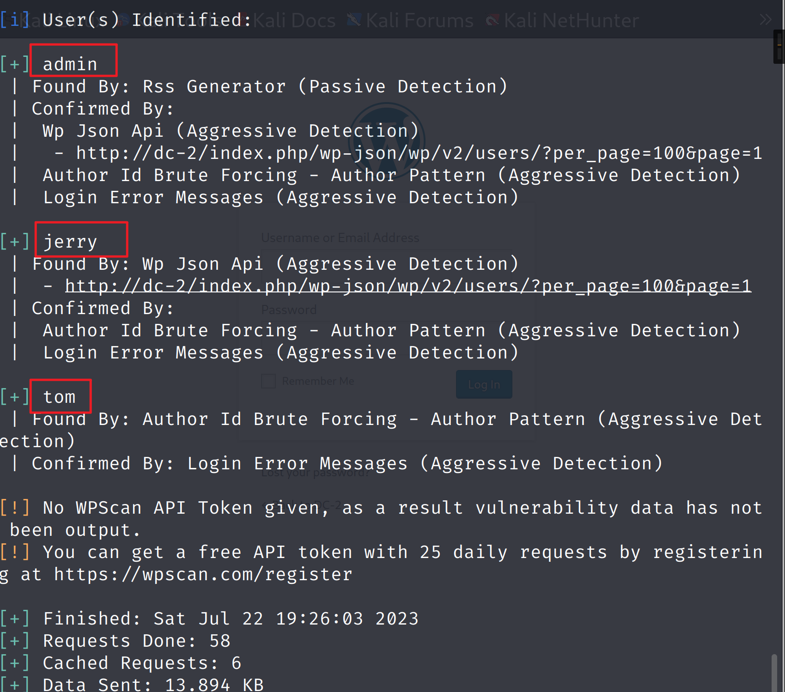
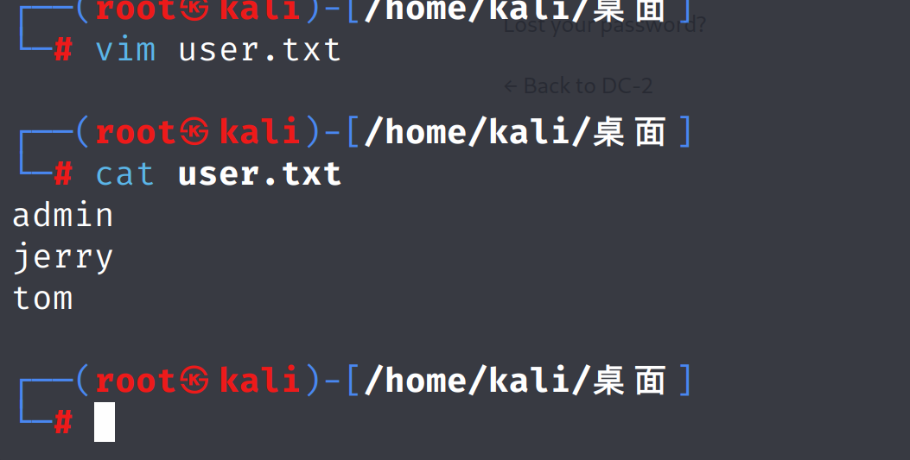

[DC-2介绍](https://www.vulnhub.com/entry/dc-2,311/)


> 请注意，您需要将渗透测试设备上的 hosts 文件设置为：
>  192.168.0.145 dc-2
>  显然，将 192.168.0.145 替换为 DC-2 的实际 IP 地址。
>  它将使生活变得更加简单（如果没有它，某些 CMS 可能无法工作）。

#### 信息收集

```
靶机MAC地址：00:0C:29:40:DF:ED
攻击机和靶机的网卡，设置为 NAT 模式
```

```shell
nmap -sS -O 192.168.80.0/24  # 扫描网段，找寻靶机的 IP
```


修改hosts配置 文件


对靶机进行全面扫描,发现靶机开了80端口

```shell
nmap -A -T4 -p- 192.168.80.135
```


由于在kali的hosts文件里配置了映射关系，所以只能在kali里访问到，

在windows真实机器里访问不到。

```Python
# hosts文件路径
Windows：C:\Windows\System32\drivers\etc\hosts
Linux：/etc/hosts
```


靶机的 http 站点的 CMS 为 **WordPress** ，使用 `http://192.168.80.135` 尝试进行访问。


成功访问到靶机的 http 站点，根据首页内容，再次确认这是一个 **WordPress** 站点。

#### 漏洞发现

1、尝试点击首页的 `Flag` 选项，成功找到了第一个 flag。


2、根据 flag1 的内容，使用 `cewl http://dc-2/ -w password.txt` 制作密码字典。


3、因为 flag1 中提到需要登录，但是网页中找不到相关的登录界面入口，所以使用 `dirsearch -u http://dc-2/` 爆破网站目录，寻找登录界面。


4、使用 `http://dc-2/wp-login.php` 进行访问。


5、访问成功后，由于目前只有密码字典，所以还需要使用 `wpscan --url http://dc-2/ -e u` 枚举 **WordPress** 站点中注册过的用户名，来制作用户名字典。




6、成功枚举出三个用户名，将这三个用户名写入到一个文件中，作为用户名字典。



7、使用 `wpscan --url http://dc-2/ -U user.txt -P password.txt` 调用相关的字典文件对网站进行爆破。


8、成功爆破出两个用户，尝试使用 jerry的账号密码 进行登录。


9、登录成功后，把每个选项都点击一遍试试效果，在 `Pages -> All Pages` 下发现了 flag2。


10、也可以使用`nikto`来进行扫描


#### 漏洞利用

==getshell==

1、在信息收集阶段中发现还 开启了 ssh 服务，并且当前我们知道两对用户名和密码，所以分别使用 `ssh jerry/tom@192.168.237.162 -p 7744` 尝试登录。


2、使用tom用户成功登录


3、使用`whoami`查看权限，发现当前为 rbash，被限制的 Shell，所以可以考虑进行==rbash 绕过==。


4、使用 `ls -al` 浏览一下当前目录，发现了 `flag3.txt`


5、使用 `cat flag3.txt` 进行查看，发现无法使用该命令，所以尝试使用 `vim` 或 `vi` 进行查看。  使用`vi`查看成功


6、观察 flag3 中的内容，发现文本中包含 `Jerry` 和 `su` ，所以猜测需要使用 `su jerry` 登录到 jerry 用户下，尝试后发现 `su` 命令无法使用，所以下一步尝试进行 rbash 绕过。


7、使用 `export -p` 发现可以使用 `export` 命令，所以使用以下命令进行 rbash 绕过：

```
BASH_CMDS[a]=/bin/sh;a       #注：把 /bin/sh 给a变量并调用
export PATH=$PATH:/bin/      #注：将 /bin 作为PATH环境变量导出
export PATH=$PATH:/usr/bin   #注：将 /usr/bin 作为PATH环境变量导出
```


8、绕过成功，使用 `su jerry` 和之前爆破出的密码尝试进行登录


9、登录成功，使用 `cd /home/jerry/` 访问家目录，发现了 `flag4.txt` 。


10、根据 flag4 的内容，可以推断下一步需要进行==提权==，来获取 root 权限，访问 /root 目录。

11、寻找root用户拥有的文件，并将错误写入/dev/nul


11、看到拥有`root`权限，所以使用 `sudo -l` 查看当前用户可以以 root 身份执行哪些命令


12、发现可以以 root 身份执行 `git` 命令，所以下一步使用 `git` 进行提权，使用 `sudo git help config ` 使 `git` 被动调用 `more` 进行显示。

```
查看提权命令网站：https://gtfobins.github.io

Git相关：https://gtfobins.github.io/gtfobins/git/
```


13、输入 `!/bin/bash` 即可提权成功。变成`root`用户


14、使用 `cd /root/` 访问 /root 目录，找到了 `final-flag.txt` 。


**总结**

```
修改 hosts 文件来访问网站
使用 nmap 找寻并扫描靶机。
使用 cewl 制作密码字典。
使用 dirsearch 爆破网站目录。
使用 wpscan 对 WordPress 站点进行扫描和爆破。
rbash 绕过
sudo 提权
git 提权

```

