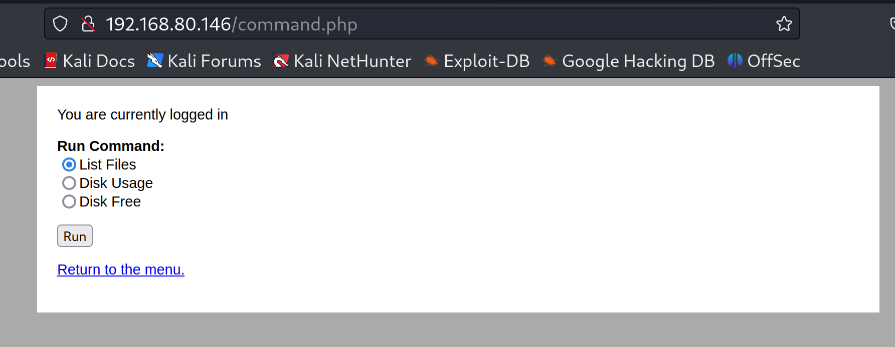

### 信息收集

先查看靶机的MAC地址


```
arp-scan -l 
```


找到目标靶机的IP地址，对其进行扫描


发现开放了80端口和ssh，浏览器访问靶机的80端口，看看有没有可以利用的东西


目录爆破发现也没有什么东西

```
dirsearch -u http://192.168.80.146  
```


### 漏洞利用

**利用bp进行密码爆破**


1、发送到intruder，给密码打上标记


2、倒入密码字典，然后Start attack


也可以用hydra破解密码

```shell
hydra -l admin -P top1000.txt 192.168.80.146 http-post-form "/login.php:username=^USER^&password=^PASS^:S=logout" -F

这是一个 Hydra 的命令行指令，用于暴力破解 Web 应用程序的登录。解释如下：

hydra：命令名，表示使用 Hydra 工具。

-l admin：指定用户名为 admin。

-P top1000.txt：指定密码字典为当前目录下的 top1000.txt。

192.168.80.146：指定要攻击的服务器 IP 地址。

http-post-form：指定使用 HTTP POST 请求方式。

"/login.php:username=^USER^&password=^PASS^:S=logout"：指定登录页面地址 /login.php，并使用 username 和 password 作为参数名来传递用户名和密码。其中 ^USER^ 和 ^PASS^ 含义为在暴力破解过程之中将要用到的用户名和密码，而 :S=logout 则是指当程序返回值为 logout 时，认为破解成功并退出程序。

-F：如果成功的话，停止猜测其他密码。

综上所述，上述命令的作用就是对目标服务器 192.168.149.134 的 /login.php 页面进行暴力破解登录，用户名为 admin，密码字典为 top1000.txt
```


3、账号admin,密码happy登录成功


4、点击Comand，看看有什么东西



5、发现点了Run之后，就会运行linux命令


6、可以试着再次用bp抓包


7、右键发送到Repeater


8、然后试着修改一下radio后面的值，发现可以执行命令


9、输入`cat /etc/passwd`查看有没有用户


10、继续查看每个用户的家目录，发现只有jim用户家目录有数据


11、访问jim目录下backups，发现有一个旧的密码本


12、可是试着复制一下这个密码本里的东西，保存到一个文件里，尝试密码爆破，因为这个密码本是在jim的家目录找到的，还开了ssh远程服务，可以用hydra九头蛇破解一下


13、用爆破出来的密码进行ssh连接    ，显示有已邮件


14、前面对backups文件进行了查看，现在查看mbox


15、`cd /var/mail`， 查看这封邮件信息


16、通过邮件内容，可以知道Charles 的密码，

可以切换到charles用户


### 提权提权

```shell
#查看可以运行的命令：   
sudo -l
```


```shell
发现可以使用teehee，

可以使用命令：
echo 'charles ALL=(ALL:ALL) NOPASSWD:ALL' | sudo teehee -a /etc/sudoers

这句话的意思是将charles用户赋予执行sudo的权限添加到/etc/sudoers里。
| 是管道符 将前面的输出作为后面的输入
sudo teehee -a 是用管理员权限使用teehee -a命令
teehee -a 是添加一条语句到 /etc/sudoers里
/etc/sudoers 里存着的用户都有执行sudo的权限。

```


