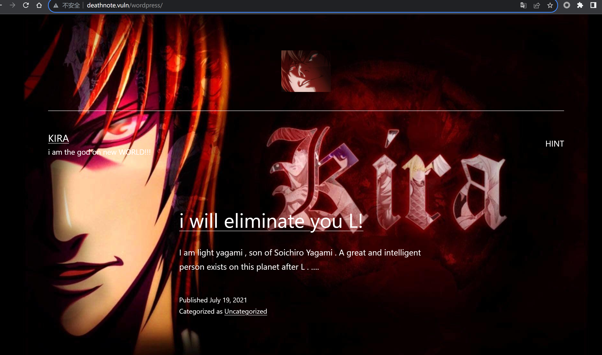
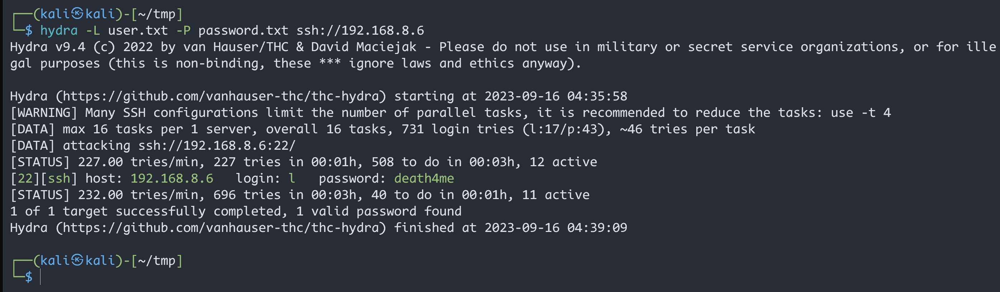

# Deathnote

> 靶机文档：[Deathnote: 1](https://www.vulnhub.com/entry/deathnote-1,739/)
>
> 下载地址：[**Download (Mirror)**](https://download.vulnhub.com/deathnote/Deathnote.ova)
>
> 难易程度：**Easy**

### 信息收集

#### 主机发现


#### 端口扫描


访问靶机的`80`端口，报错，如下图显示：

地址栏输入地址后，自动跳转到一个域名


说明我们需要做`域名映射`


映射做好后，就可以看到页面正常显示 了，发现路径是`/wordpress/`，那肯定 就是`wordpress`CMS 了




#### 目录扫描

##### dirsearch

```bash
 dirsearch -u 192.168.8.6 -i 200
```


##### gobuster

```bash
gobuster dir -u http://192.168.8.6 -w /usr/share/wordlists/dirbuster/directory-list-2.3-medium.txt -x php,txt,html
```


##### dirb扫描

```bash
dirb http://192.168.8.6/wordpress/
```


`robots.txt`


查看这个图片地址的源代码：


`/wordpress/wp-login.php`


`wordpress/wp-content/uploads/`


`wordpress/wp-content/uploads/2021/07/user.txt`


`wordpress/wp-content/uploads/2021/07/notes.txt`


### 漏洞利用

将`user.txt`和`notes.txt`里的内容分别复制到到两个文件里

#### wpscan扫描

枚举用户

```bash
wpscan --url http://192.168.8.6/wordpress -e u
```


使用 `cewl http://192.168.8.6/ -w password.txt` 制作密码字典。

```bash
 cewl http://192.168.8.6/ -w password.txt
```

得到的密码啥也不是

#### Hydra爆破



用户:`l`

密码：`death4me`

---

ssh连接


查看`user.txt`


发现编码为`brins`，也可以叫做`ook`，解码

解码地址：https://ctf.bugku.com/tool/brainfuck


在`/opt/`下发现一个`L `的目录

发现一串十六进制字符，然后转码


[CyberChef](https://gchq.github.io/CyberChef/)


得到一个密码：`kiraisevil`

在前面使用`wpscan`扫描的时候扫出来一个`kira`用户，而且在`/home`目录下，也有这么个用户

所以可以尝试切换用户

切换成功第一步先看有没有能以`root身份运行的命令字`


发现`kira`用户有任意的权限


---

[DC-4](https://blog.csdn.net/ZhaoSong_/article/details/132110397)最后也是靠`sudo su`提的权


### 总结

-  多使用几个目录扫描工具，会有不一样的结果，
- 从扫出来的目录中仔细找
- wpscan就是专门扫这个CMS的工具，
- 九头蛇爆破