**靶机地址**：https://www.vulnhub.com/entry/fourandsix-201,266/

**Download (Mirror)**: https://download.vulnhub.com/fourandsix/FourAndSix2.ova

## 信息收集

主机发现，目标靶机172.16.31.8

端口扫描

```bash
┌──(kali㉿kali)-[~/Desktop]
└─$ nmap --min-rate 10000 -p-   -r  172.16.31.8 
Starting Nmap 7.94SVN ( https://nmap.org ) at 2024-06-23 01:20 EDT
Warning: 172.16.31.8 giving up on port because retransmission cap hit (10).
Nmap scan report for 172.16.31.8
Host is up (0.00030s latency).
Not shown: 61920 filtered tcp ports (no-response), 3611 closed tcp ports (conn-refused)
PORT     STATE SERVICE
22/tcp   open  ssh
111/tcp  open  rpcbind
688/tcp  open  realm-rusd
2049/tcp open  nfs

Nmap done: 1 IP address (1 host up) scanned in 73.47 seconds                                                 
```

详细信息扫描

```bash
┌──(kali㉿kali)-[~/Desktop]
└─$ sudo nmap -sT -sC -sV -O -p22,111,688,2049    172.16.31.8 
Starting Nmap 7.94SVN ( https://nmap.org ) at 2024-06-23 01:23 EDT
Nmap scan report for 172.16.31.8
Host is up (0.00032s latency).

PORT     STATE SERVICE VERSION
22/tcp   open  ssh     OpenSSH 7.9 (protocol 2.0)
| ssh-hostkey: 
|   2048 ef:3b:2e:cf:40:19:9e:bb:23:1e:aa:24:a1:09:4e:d1 (RSA)
|   256 c8:5c:8b:0b:e1:64:0c:75:c3:63:d7:b3:80:c9:2f:d2 (ECDSA)
|_  256 61:bc:45:9a:ba:a5:47:20:60:13:25:19:b0:47:cb:ad (ED25519)
111/tcp  open  rpcbind 2 (RPC #100000)
| rpcinfo: 
|   program version    port/proto  service
|   100000  2            111/tcp   rpcbind
|   100000  2            111/udp   rpcbind
|   100003  2,3         2049/tcp   nfs
|   100003  2,3         2049/udp   nfs
|   100005  1,3          688/tcp   mountd
|_  100005  1,3          835/udp   mountd
688/tcp  open  mountd  1-3 (RPC #100005)
2049/tcp open  nfs     2-3 (RPC #100003)
MAC Address: 00:0C:29:01:6A:84 (VMware)
Warning: OSScan results may be unreliable because we could not find at least 1 open and 1 closed port
Device type: general purpose
Running: OpenBSD 6.X
OS CPE: cpe:/o:openbsd:openbsd:6
OS details: OpenBSD 6.0 - 6.4
Network Distance: 1 hop
```

udp扫描

```bash
┌──(kali㉿kali)-[~/Desktop]
└─$ sudo nmap -sU -p22,111,688,2049    172.16.31.8 
Starting Nmap 7.94SVN ( https://nmap.org ) at 2024-06-23 01:25 EDT
Nmap scan report for 172.16.31.8
Host is up (0.00025s latency).

PORT     STATE  SERVICE
22/udp   closed ssh
111/udp  open   rpcbind
688/udp  closed realm-rusd
2049/udp open   nfs
MAC Address: 00:0C:29:01:6A:84 (VMware)

Nmap done: 1 IP address (1 host up) scanned in 2.58 seconds
```

指定默认漏洞脚本扫描

```bash
┌──(kali㉿kali)-[~/Desktop]
└─$ sudo nmap --script=vuln -p22,111,688,2049    172.16.31.8 
Starting Nmap 7.94SVN ( https://nmap.org ) at 2024-06-23 01:26 EDT
Nmap scan report for 172.16.31.8
Host is up (0.00031s latency).

PORT     STATE SERVICE
22/tcp   open  ssh
111/tcp  open  rpcbind
688/tcp  open  realm-rusd
2049/tcp open  nfs
MAC Address: 00:0C:29:01:6A:84 (VMware)

Nmap done: 1 IP address (1 host up) scanned in 30.83 seconds
```


发现操作系统是OpenBSD，这并不是很常见的linux操作系统，主要用于网络和防火墙设备中。其他漏洞扫描没发现有用信息，同时UDP扫描显示2049的UDP端口也开放。


## NFS渗透

 nfs全称为Network File Share网络共享文件模式，开启这个服务的系统可以指定某个目录作为nfs的服务地址，作为共享文件夹。我们可以首先使用showmount工具查看靶机是否有共享文件夹：

```bash
┌──(kali㉿kali)-[~/Desktop]
└─$ showmount -e 172.16.31.8
Export list for 172.16.31.8:
/home/user/storage (everyone)
```

 -e表示exports，即靶机向外共享的到处列表，可以看到共享目录是/home/user/storage（这样也表明靶机很可能有一个名为user的用户），同时(everyone)表明任何人都可使用此共享目录。因此我们可以创建一个目录tmp，尝试能否将这个共享的目录/home/user/storage映射到我们创建的目录：
```bash
┌──(kali㉿kali)-[~/Desktop]
└─$ mkdir tmp

┌──(kali㉿kali)-[~/Desktop]
└─$ sudo mount -t nfs 172.16.31.8:/home/user/storage tmp     
[sudo] password for kali: 
Created symlink /run/systemd/system/remote-fs.target.wants/rpc-statd.service → /usr/lib/systemd/system/rpc-statd.service.

```

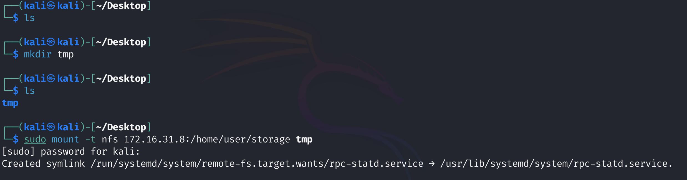

> mount用于挂载目录，-t是type的意思，指定为nfs共享文件模式，由上图可见该映射成功了，我们只要进入tmp目录应该就能看到靶机/home/user/storage目录的内容，如下：

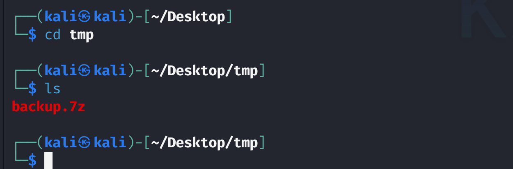

我们看到了`/home/user/storage`目录下的文件`backup.7z`，拿到backup.7z后，把这个文件复制到上级目录（避免在挂载目录处理留下痕迹），看起来是个7z的压缩包，我们先用file查看具体的文件类型，并用binwalk看看有啥捆绑：

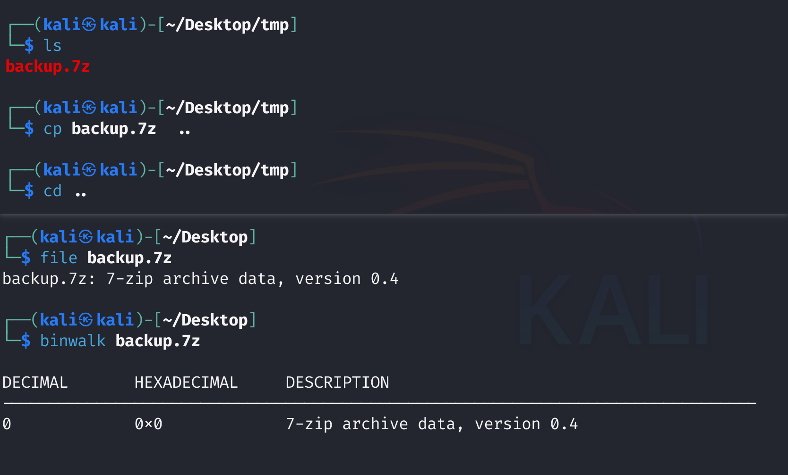

## 7z爆破

可知，就是个单纯的7z压缩文件，也没有捆绑文件，因此尝试直接用7z工具解压，-x参数表示解压缩：

```bash
7z -x backup.7z
```

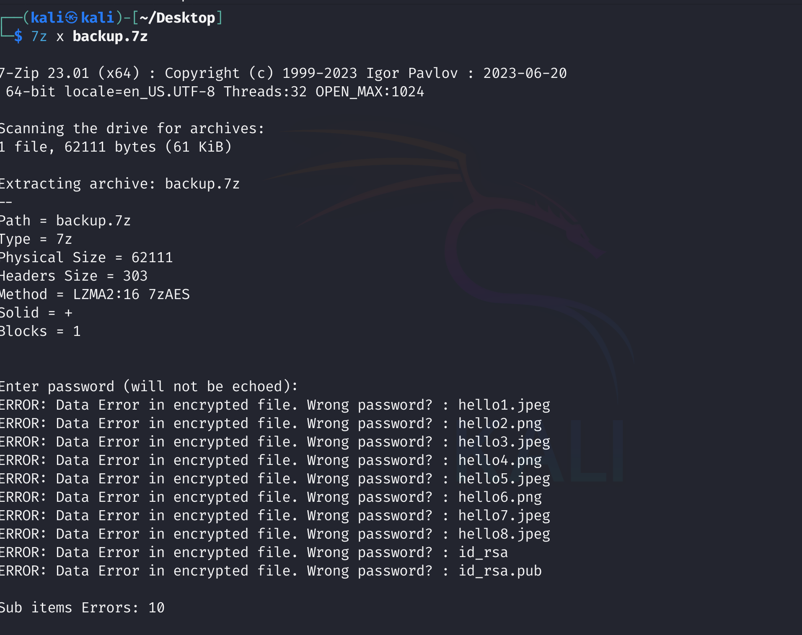

说明内容有8张图片和两个文件，两个文件看名称像是ssh登录的私钥和公钥

理论上我们是需要解压这个7z压缩包的，但密码咱有不知道在哪里找。干脆就用john爆破吧。由于john爆破只能针对hash文件，因此我们先用7z2john生成7z压缩包的哈希，名称为backup7z_hash(随便起名)：

```bash
7z2john backup.7z > backup7z_hash
```

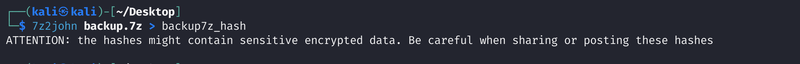

生成7z的hash后，使用字典rockyou.txt进行压缩包的密码暴力破解，指定形式为7z格式：

```bash
john --format=7z --wordlist=/usr/share/wordlists/rockyou.txt backup7z_hash
```

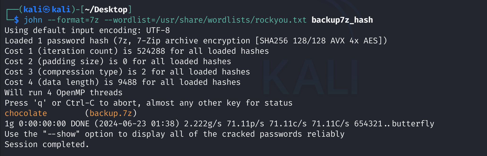

得到压缩包的密码是chocolate

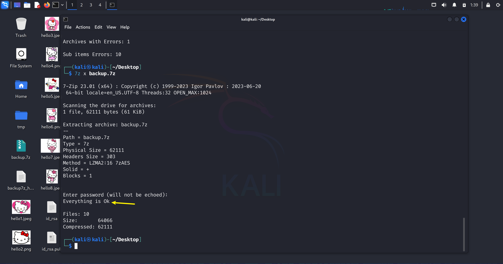

先用file查看是否是真的单纯的图片文件：

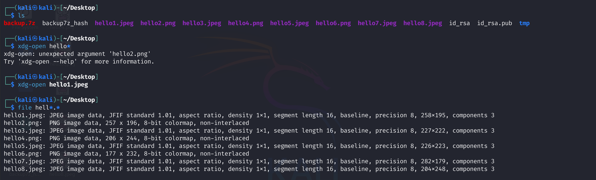

再试试用binwalk看看有没有捆绑，发现也没有

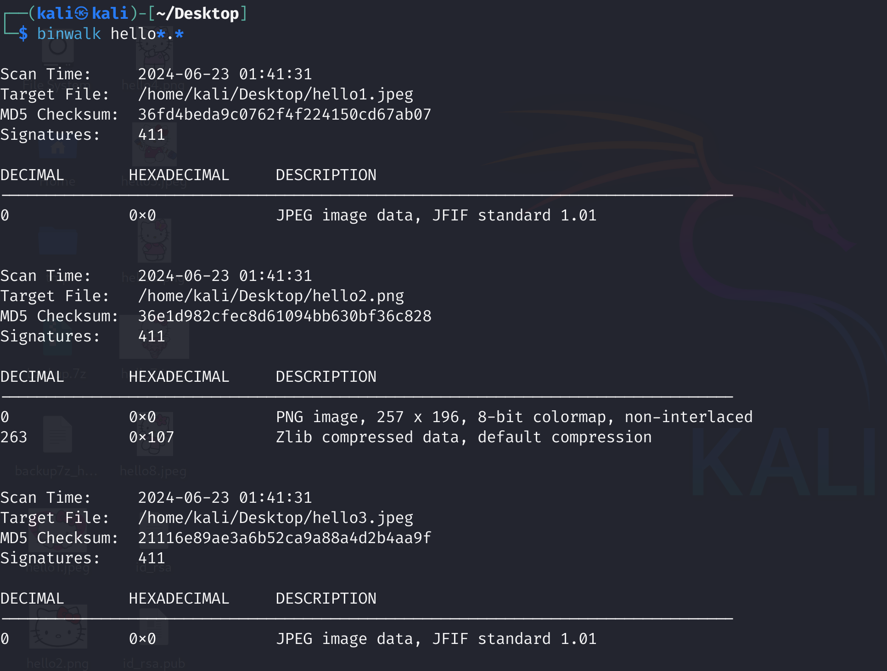

用exiftool查看图片是否有注释内容

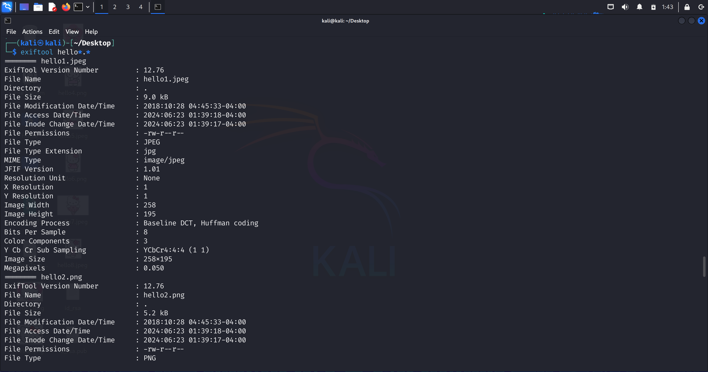

查看了8张图片，也没发现有啥备注信息。那么就查看id_rsa的公钥和私钥吧。

## ssh私钥登陆

直接尝试用私钥登录user用户

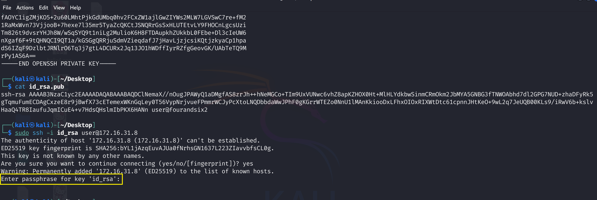

 -i表示用私钥登录，结果显示私钥id_rsa本身还有passphrase，也就是说私钥被加密了，还要用密码对私钥进行解密

与破解压缩包的思路类似，先将私钥生成john对应的hash文件，这里命名为id_rsa_hash：

```bash
ssh2john id_rsa > id_rsa_hash 
```

然后用john破解，密码字典指定为rockyou.txt，这里不太了解ssh私钥hash的格式是啥，就干脆不用--format指定，让john自己识别：

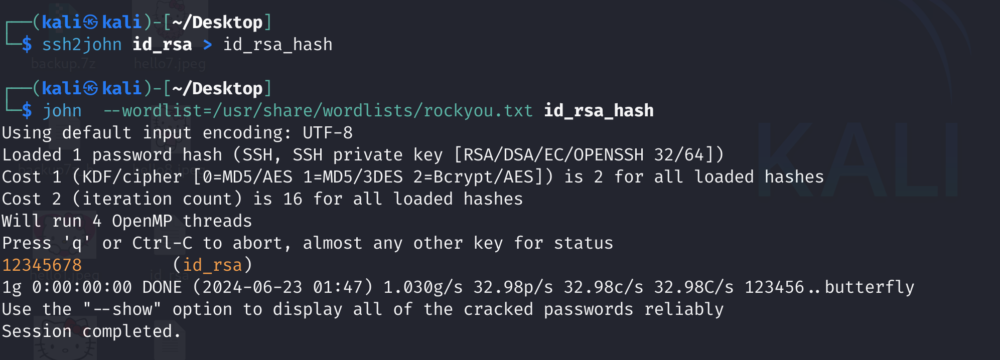

拿到了私钥的passphrase是12345678，然后我们重新用私钥登录，输入passphrase即可成功登录user的shell：

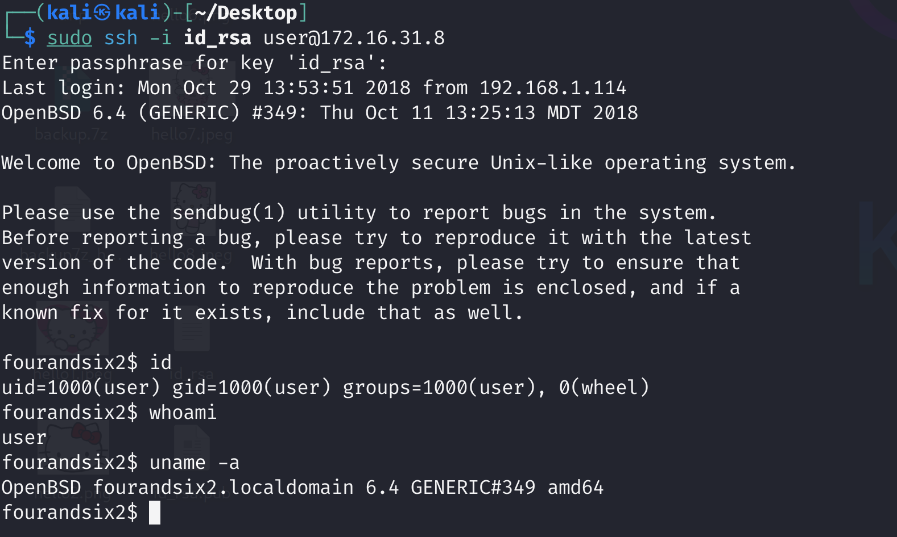

可以看到操作系统是OpenBSD6.4，同时当前用户属于两个组：user和wheel。

## less+vi提权

 在常规的linux系统中，我们拿到初始shell后往往会运行sudo -l查看有什么特殊的信息，但OpenBSD的语法与之不同，无法直接sudo -l。我们先尝试寻找有什么s位的文件，尝试能否采用suid的方法提权，具有s位的文件表明该文件在运行时能够以其属主权限运行，我们可以借此进行提取，首先在根目录/按照权限-perm搜索具有s权限的文件f：

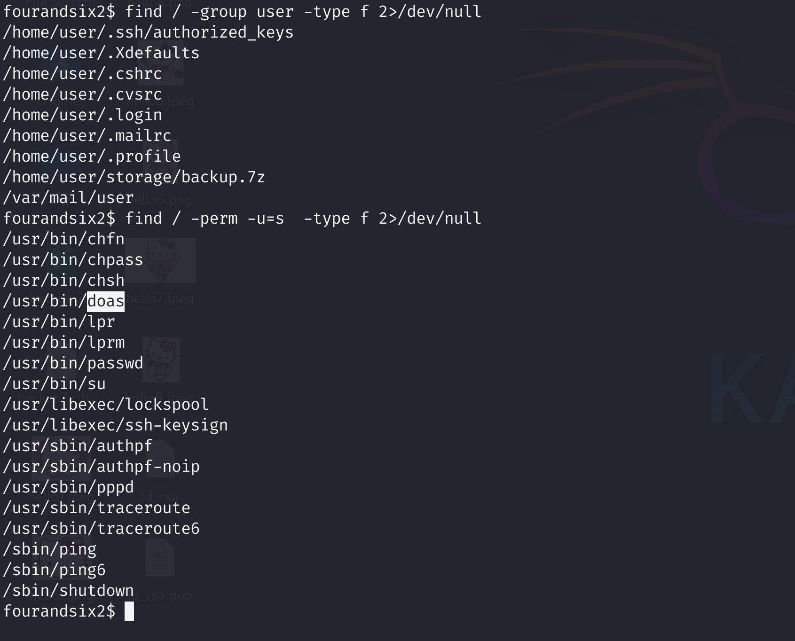

这里要重点关注doas这个指令，该指令类似于sudo，即以高权限运行指令需要添加的命令。由于doas指令是具有s位的，因此使用doas可以以高权限运行指令。我们要查找的就是有哪些指令可以免密doas运行（即类似于ubuntu/debian的Linux运行sudo -l 后有哪些免密sudo的指令），这就需要查找doas的配置信息了。我们直接用find搜索doas的相关文件：

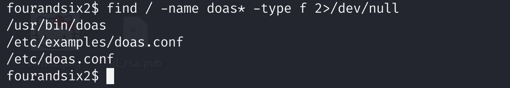

doas.conf就是doas的配置文件，

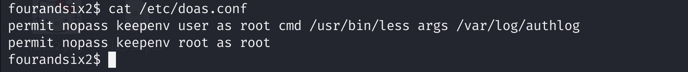

这个文件告诉我们，less和authlog指令是可以用doas免密以root权限运行的！

```bash
doas /usr/bin/less /var/log/authlog
```

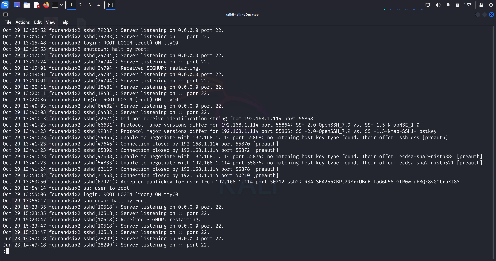

那么要如何提权呢？此处我们是使用less命令对authlog进行查看，且此时less命令是具有root权限的。但less只能读文件，不能执行系统命令。我们知道在less中按字母v是可以启动vi编辑器的，而vi编辑器中输入冒号:后即可输入交互的指令，又由于less具有root权限，在less中启动的vi编辑器应该也具有root权限，那么我们按v进入vi编辑器后，输入:!sh应该就能够以root身份启动shell了。

> https://gtfobins.github.io/gtfobins/less/

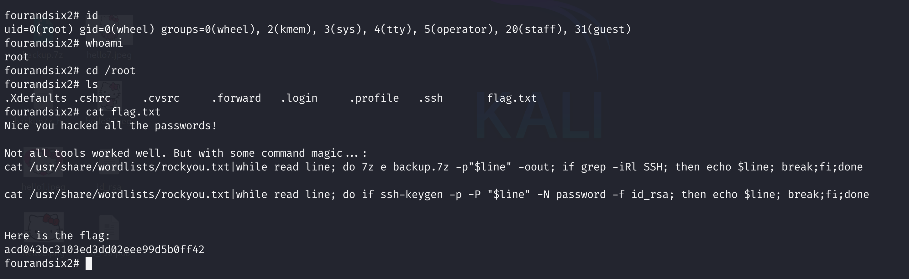


## 小结

1.主机发现和端口扫描：常规思路，发现ssh，rpc，nfs，考虑从nfs入手。

2.NFS渗透，发现文件backup.7z，看起来像备份文件，解压发现需要密码。

3.压缩包的密码破解：先用7z2john生成哈希，再用字典rockyou.txt爆破，成功得到密码。解压后发现八张hello kitty的图片和疑似ssh登录的公钥和私钥。

4.ssh私钥登录：尝试使用私钥登录，发现私钥被加密，需要passphrase，用ssh2john生成hash，再用字典rockyou.txt爆破，成功得到passphrase，ssh登录了user账户。

5.less+vi提权：进入user账户后一番搜索无果，尝试寻找s位的文件，发现doas，相当于sudo指令，查找doas指令的配置，发现可以用less免密操作authlog文件，在less中启动vi输入系统命令即可提权。