> [InfoSecWarrior CTF 2020: 01官网地址](https://www.vulnhub.com/entry/infosecwarrior-ctf-2020-01,446/)

### 信息收集

**主机发现**

```bash
arp-scan -l
```

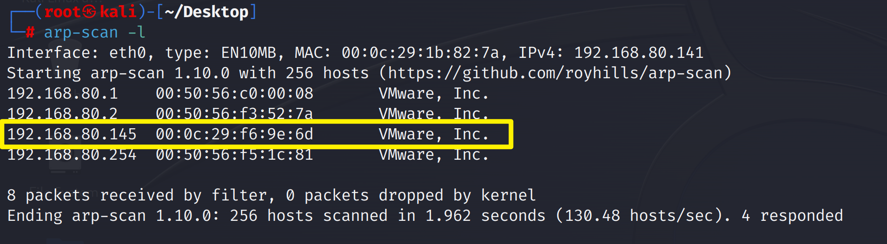

**端口扫描**

```bash
nmap -A -p- 192.168.80.145
```

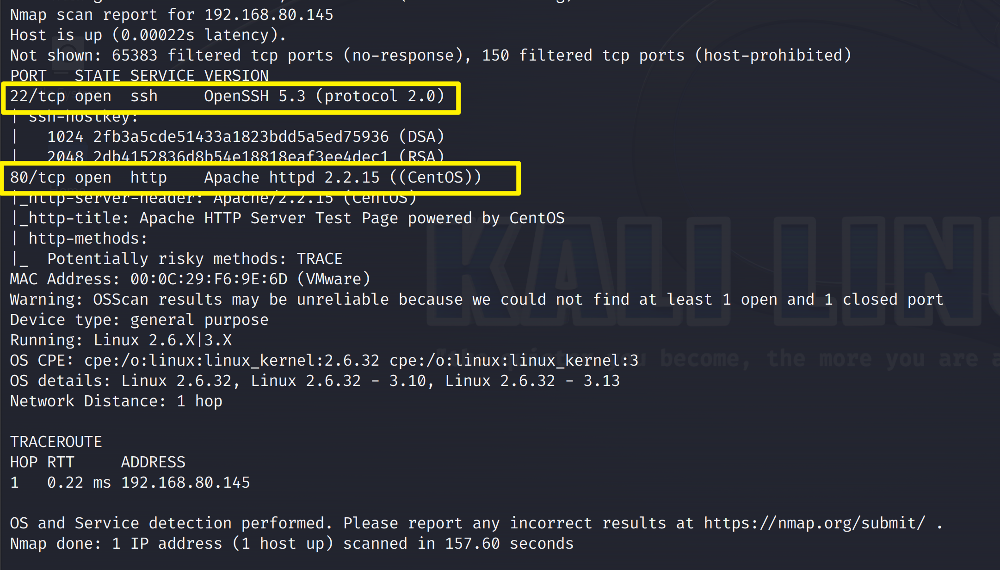

**目录爆破**

```bash
dirsearch -u 192.168.80.145 -i 200
```

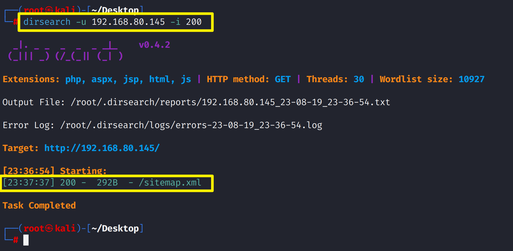

访问80端口，只能看出是Apache站点，没有别的

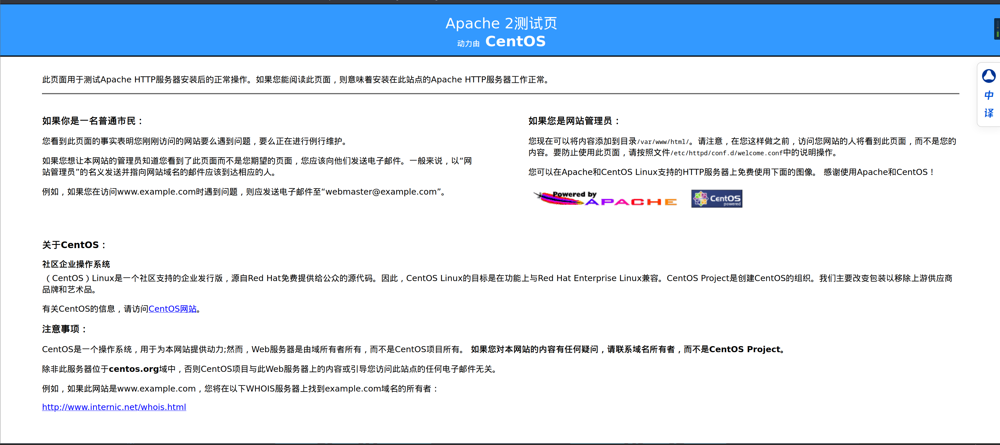

访问一下`sitemap.xml`

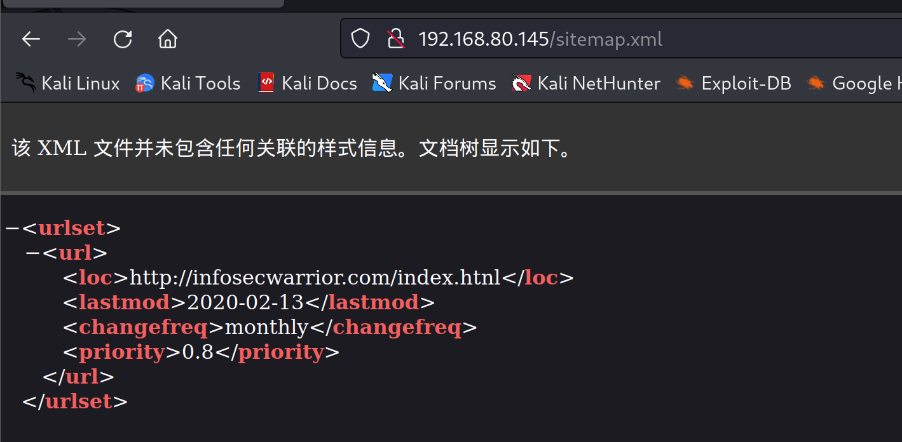

访问`192.168.80.145/index.htnl`，也没啥有用的，只有一张gif格式的动态图

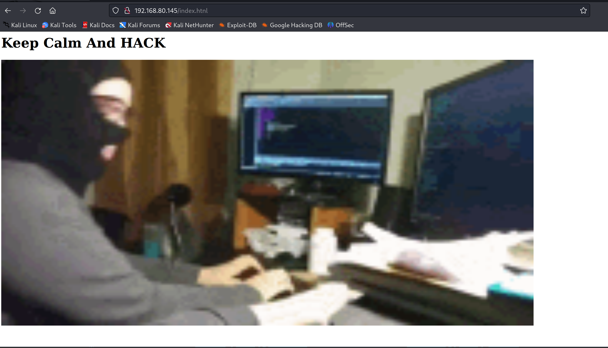

查看页面源代码，发现隐藏的一个`form`表单,可以删除`hidden='True'`，回车！

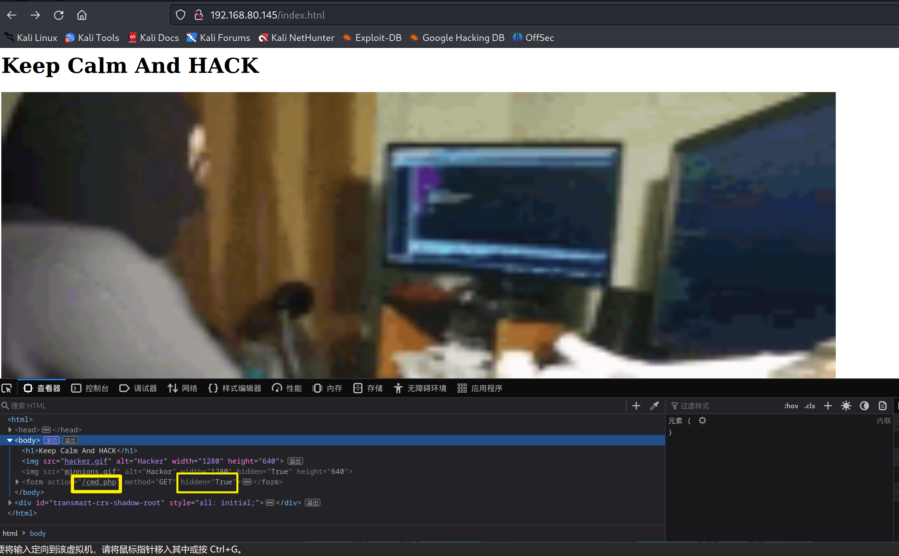

页面上就多了一个用于提交的输入框

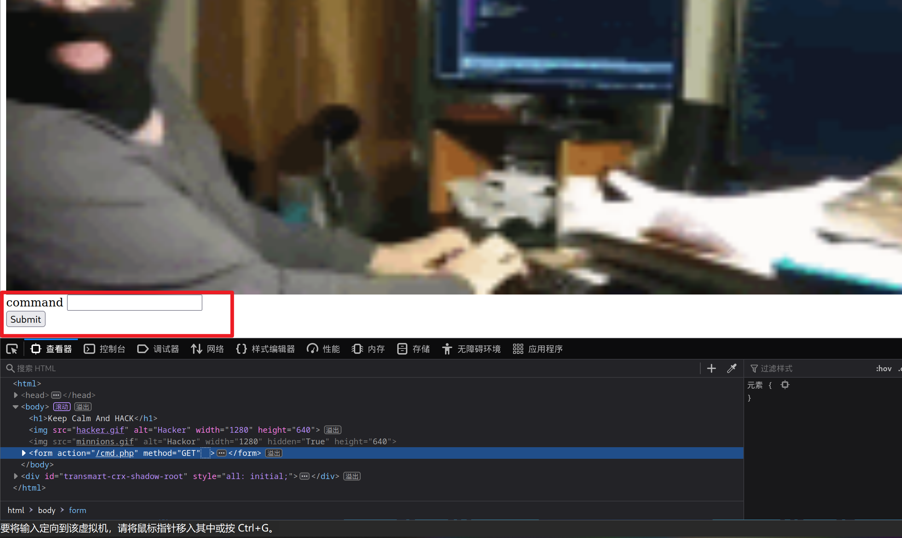

在输入框中输入`ls`，没有得到正常的回显

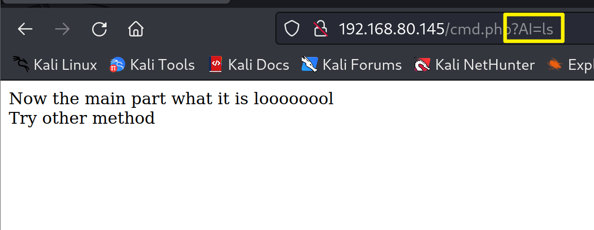

把`from`表单换成`post`请求

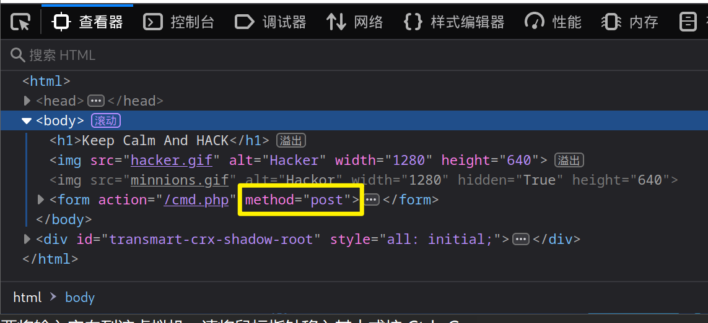

再次在 输入框中输入`ls`，成功有了 回显

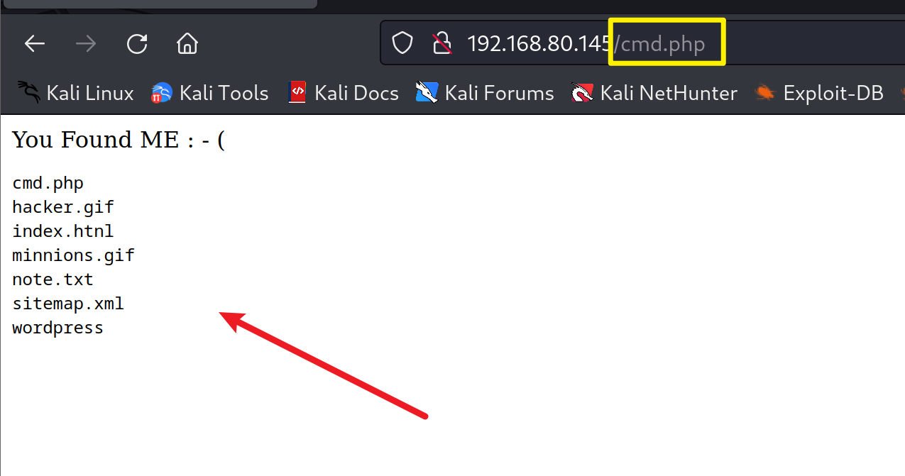

查看`cmd.php`，在表单中输入`cat cmd.php`

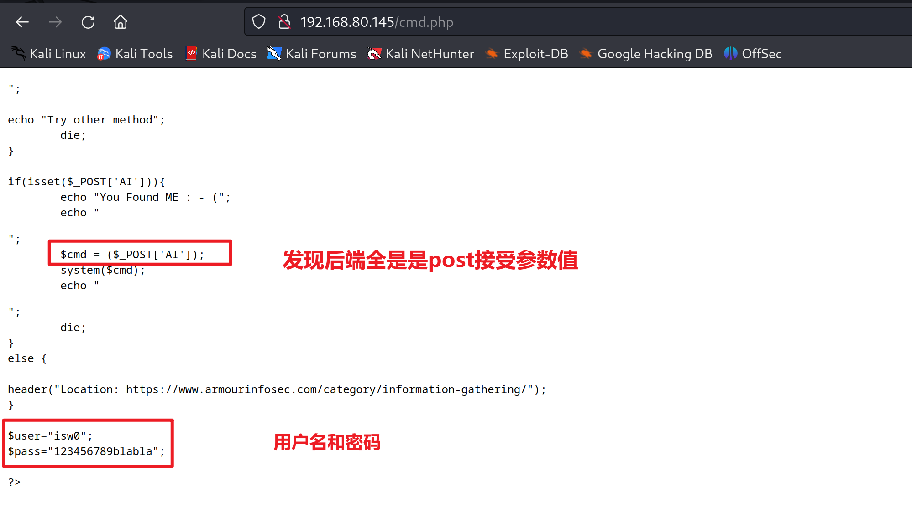

使用`ssh`远程连接  `ssh isw0@192.168.80.145`    密码：`123456789blabla`

### 提权


连接成功后，`sudo -l`查看有哪些能以`root`身份执行的命令

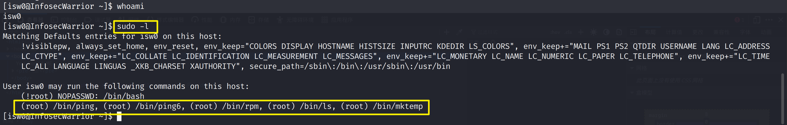

去这个网站上找提权命令：`https://gtfobins.github.io/`

只能找到`rpm`命令字的提权方式

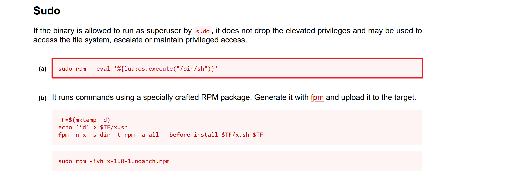

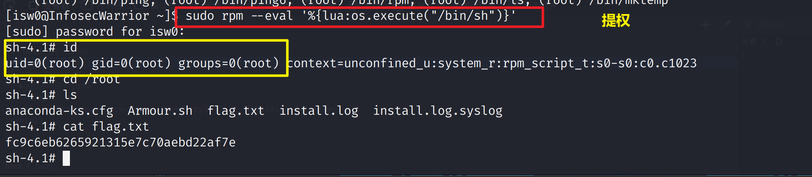