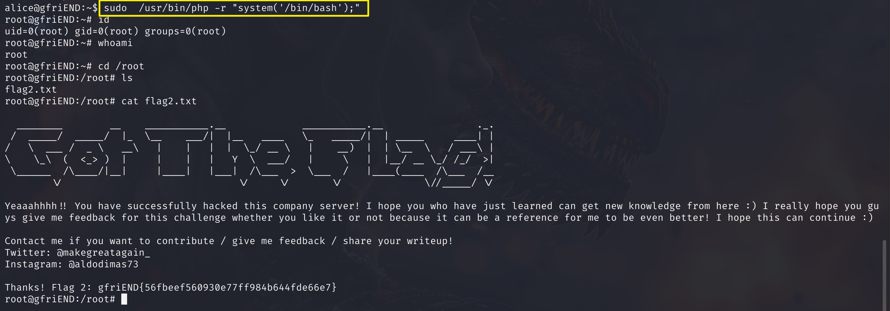

涉及到的知识点包括x-forwarded-for主机头转发、 手工爆库、sudo php提权，完整的打靶思路详见：


靶机下载地址：[Me and My Girlfriend: 1 ~ VulnHub](https://www.vulnhub.com/entry/me-and-my-girlfriend-1,409/)

## 信息收集


## WEB渗透(修改XFF代理)

访问80端口，页面提示智能本地地址访问


> 如何使用x-forwarded-for？
>
> ​	X-Forwarded-For（XFF）是用来识别通过HTTP代理或负载均衡方式连接到Web服务器的客户端最原始的IP地址的HTTP请求头字段，换句话就是无论你用了多少层代理，XFF头都能给你显示出每层代理和原始ip，如果没有XFF或者另外一种相似的技术，所有通过代理服务器的连接只会显示代理服务器的IP地址，而非连接发起的原始IP地址，这样的代理服务器实际上充当了匿名服务提供者的角色，如果连接的原始IP地址不可得，恶意访问的检测与预防的难度将大大增加
> 

用burpsuit拦截请求，然后改包添加`x-forwarded-for:localhost`即可访问：


添加XFF头后，就可正常访问站点


但如果每次请求页面都要手动添加`x-forwarded-for:localhost`还是挺麻烦的一件事。因此可以在BurpSuite代理`proxy settings`选项的`HTTP match and replace rules`添加一条规则：


点击Add，将请求头中增加`x-forwarded-for:localhost`即可，这样每次请求时都会添加这一行，就无需每次请求都手动添加了


点击OK，保证在Enabled列是勾选状态


## 数据库手工枚举

现在观察web页面，Ceban Corp正是靶机描述中Alice的公司名称。这个界面其实没太多信息，Login是登录界面，需要有账号和密码。

Register是注册界面，如下，干脆就随便注册一个账号试试：


注册完，登录，点击Profile，可以看到当前账号的信息。


注意url中有一个user_id=12，这估计是一个查询，我们尝试能不能直接修改这个user_id，实现对其他用户账号密码的查看：


将 user_id改为1后，成功看到了其他账号，那我们手工更换user_id为1到11，看看有哪些凭据，重点看有没有账号为alice（靶机描述的提示），果然找到了，当user_id=5时，是Alice的凭据：


这密码都是前端明文显示的，alice账号的密码是`4lic3` ，我们尝试用ssh登录，如果数据库密码和ssh密码一致的话，我们就能够成功ssh，如下图，撞库成功了！


## sudo php提权

，首先先sudo -l查看当前alice用户有哪些sudo权限：


好家伙，有php的sudo权限，凡是sudo权限有语言的，都可以用这个语言构造反弹shell或启动shell的操作，这里咱也不用反弹shell，直接用php执行系统命令启动shell好了，命令如下：

```BASH
sudo /usr/bin/php -r "system('/bin/bash');"
```




## 总结

第一步：主机发现和端口扫描，确定入手点基本上是80。

第二步：Web渗透，直接浏览器访问靶机无法显示内容，提示我们修改XFF头部本地访问，于是用BurpSuite改包在请求头添加x-forwarded-for:localhost即可访问。

第三步：数据库手工枚举，注册账号登录后，发现url中存在user_id，怀疑这里是否是数据库直接查询的传参，直接秀嘎user_id发现可以找到alice的账号和密码，尝试撞库登录ssh，成功。

第四步：sudo -l枚举sudo权限的二进制可执行文件，发现有php，直接用php执行系统命令启动shell即可提权。

